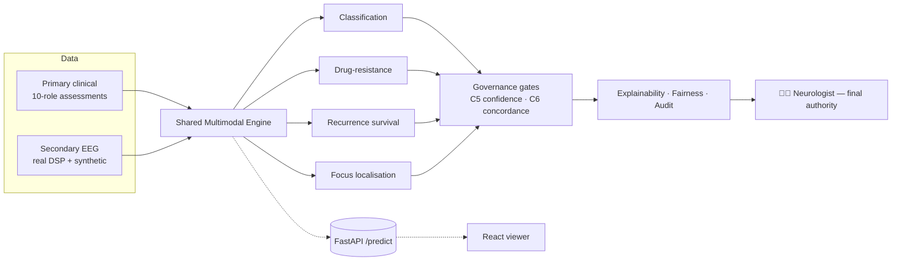

<div align="center">

# 🧠 Epilepsy Intelligence Platform

### Responsible, Explainable AI for EEG‑Based Epilepsy Analytics — Under Human Clinical Oversight

*A full DBA research deliverable: a docs‑first clinical blueprint, an interactive role‑portal viewer, a reproducible analytics + MLOps stack, a Responsible‑AI framework, a database, and a REST API — end to end.*


</div>

> [!IMPORTANT]
> **Data honesty.** The clinical cohort is **synthetic** (a reproducible methodology demonstration).
> The pipeline is *also* validated on **real EEG** (EEG‑Eye‑State, external‑validation AUC **0.979**).
> Epilepsy‑labelled real corpora (Siena / TUH) plug in via `analysis/fetch_siena.py` — the method is
> identical. This is **decision support**, never autonomous diagnosis; a clinician confirms every output.

---

## Table of contents
[What it is](#what-it-is) · [Architecture](#architecture) · [Repo layout](#repo-layout) ·
[Quick start](#quick-start) · [The 10 clinical roles](#the-10-clinical-roles) ·
[Analytics & models](#analytics--models) · [13‑phase lifecycle](#model-lifecycle--13-phases-100100) ·
[Results](#results) · [Testing & CI](#testing--ci) · [Docs](#documentation) · [Standards](#standards)

---

## What it is

An **AI‑enabled epilepsy care platform** built around six governance‑centred contributions
(human oversight · governance · explainability · multimodal decision support · confidence/uncertainty ·
concordance) and validated on clinical **scenarios** — seizure classification, drug‑resistance,
recurrence, presurgical support, and remote monitoring. Everything is **runnable and tested**, not slideware.

- 🩺 **10 clinical roles** as enterprise questionnaires (ID · Question · Response Type · Validation · AI Feature) with a 4‑level severity model, **interactively scorable**.
- 📊 **End‑to‑end analytics** — primary (clinical) + secondary (EEG) + fusion, with statistics, survival analysis, and an integrated decision engine.
- 🛡️ **Responsible AI** — SHAP/LIME, fairness audit **+ mitigation**, guardrails, confidence/abstention, concordance — as **real code**, not just docs.
- ⚙️ **Production surface** — data contracts, feature store, experiment tracking, model registry **+ rollback**, `/predict` serving, Docker, CI, and full monitoring (system/API/LLM/drift).

## Architecture



## Repo layout

```
docs/            Clinical blueprint: 10-role assessments, Responsible-AI (16 pillars +
                 implementation), scenarios, research problems, per-phase reports
analysis/        Runnable pipelines: cohort · primary · secondary(EEG DSP) · fusion ·
                 governance(C5/C6) · recurrence · decision_support · evaluation · EDA ·
                 timeseries · real_eeg_analysis · RAI runtime  (+ pytest)
mlops/           Data contract · feature store · experiment tracking · model registry +
                 rollback · train_pipeline(HPO) · retrain(champion-challenger) ·
                 observability · system_monitor · data_quality · phase_gates  (+ pytest)
api/             FastAPI: /predict · /score · /scenarios · /metrics · auth · Docker
db/              PostgreSQL schema + runnable SQLite build
viewer/          React role-portal + Fill&Score + Data tab (Vitest)
.github/         CI: regenerate artefacts + run all tests + weekly cron
```

## Quick start

```bash
# 1) Analytics (reproduces every table, figure and report)
cd analysis && pip install -r requirements.txt
pip install shap lime fairlearn lifelines imbalanced-learn psutil
python run_all.py                 # full 12-stage pipeline
python fetch_real_eeg.py && python real_eeg_analysis.py   # REAL EEG + external validation
python -m pytest -q               # 26 tests

# 2) MLOps + phase gates
cd ../mlops && python train_pipeline.py && python retrain.py && python phase_gates.py
python -m pytest -q               # 11 tests

# 3) API (Swagger at /docs)
python ../db/build_sqlite.py
cd ../api && pip install -r requirements.txt && uvicorn main:app --reload
python -m pytest -q               # 10 tests

# 4) Viewer
cd ../viewer && npm install && npm run dev   # http://localhost:5173  (Roles · Fill&Score · Data)
npm test                          # 19 tests

# One-command deploy
EPI_API_KEY=secret docker compose up --build   # API :8000 + viewer :8080
```

## The 10 clinical roles

Neurologist · EEG Technician · Nurse · Neuropsychologist · Pharmacist · Caregiver · Patient ·
Administrator · Occupational Therapist · Radiologist — each a self‑contained questionnaire
(**~780 validated items across 77 sections**) with a 4‑level severity model, scorable in the viewer
and via `POST /score`. See [`docs/primary-assessment/`](docs/primary-assessment/index.md).

## Analytics & models

| Pipeline | What it does | Report |
|---|---|---|
| **Primary** | 10‑role matrix → validate → clean → engineer → encode/scale → stats → select → balance → **bias audit** → model | [primary‑analysis](docs/analysis/primary-analysis.md) |
| **Secondary (EEG)** | real DSP (filtering/PSD/coherence/spikes) → biomarkers → focus lateralisation | [secondary‑analysis](docs/analysis/secondary-analysis.md) · [real‑eeg](docs/analysis/real-eeg-analysis.md) |
| **Fusion** | merge modalities → incremental value → EP001 case | [fusion](docs/analysis/fusion-analysis.md) |
| **Governance** | C5 confidence/abstention · C6 concordance | [governance](docs/analysis/governance-confidence-concordance.md) |
| **Recurrence** | Kaplan–Meier + Cox survival | [recurrence](docs/analysis/recurrence-risk.md) |
| **Decision support** | integrated, gated recommendation | [integrated‑DS](docs/analysis/integrated-decision-support.md) |
| **Evaluation** | DCA · bootstrap CIs · DeLong · nested CV | [evaluation‑rigor](docs/analysis/evaluation-rigor.md) |

Models trained & evaluated: Logistic, Random Forest, Gradient Boosting, **ordinal logistic**,
**Cox PH**, SARIMAX; with **HPO**, calibration, SHAP/LIME, and fairness mitigation.

## Model lifecycle — 13 phases (100/100)

Every phase has a **pipeline · monitoring · quality check · score · visualization**; scored by
`mlops/phase_gates.py` → [`docs/phase-gates-scorecard.md`](docs/phase-gates-scorecard.md) (also in the viewer **Data** tab).
Detailed primary‑ and secondary‑data walkthrough: **[pipeline‑by‑phase](docs/analysis/pipeline-by-phase.md)**.

## Results

| Metric | Value |
|---|---|
| Primary drug‑resistance AUC (95% CI) | 0.969 · CI [0.885, 0.962] |
| EEG focus‑lateralisation AUC | 0.93 |
| Fusion AUC | 0.976 |
| Recurrence C‑index (Cox) | 0.663 |
| **Real EEG external‑validation AUC** | **0.979** |
| Fairness demographic‑parity gap (before → after) | 0.175 → 0.087 |
| Decision support | 47% auto‑recommendable, 53% routed to clinician |

## Testing & CI

**66 automated tests** — analysis 26 · mlops 11 · API 10 · viewer 19 (positive **and** negative
cases). GitHub Actions regenerates all artefacts, runs every suite, builds the viewer, re‑scores the
phase gates, and runs weekly (`cron`).

## Documentation

[Architecture & internals](docs/ARCHITECTURE-INTERNALS.md) · [Research problems](docs/research-problems.md) ·
[DBA strategy](docs/dba-strategy-and-prioritization.md) · [Responsible AI](docs/responsible-ai/index.md) ·
[Data engineering / MLOps](docs/data-engineering-mlops.md) · [Monitoring](docs/monitoring-observability.md) ·
[Checklist coverage](docs/checklist-coverage.md) · [Global policy](docs/GLOBAL-POLICY.md) ·
[Prompt log](docs/prompt-log/index.md)

## Standards

- **Docs‑first**, one file per unit of data; every doc carries tables, four Mermaid diagram types
  (+ C4 for architecture), Why/How rationale, defense Q&A, and APA‑7 references.
- **Reproducible** — deterministic (seed 42); `run_all.py` rebuilds everything from a clean checkout.
- **Responsible** — fairness audited *and* mitigated; SHAP+LIME explanations; input guardrails;
  human‑in‑the‑loop before any recommendation.

---

<div align="center">
<sub>Research/education artifact · epilepsy‑only · synthetic clinical data + real EEG · not a medical device.</sub>
</div>
