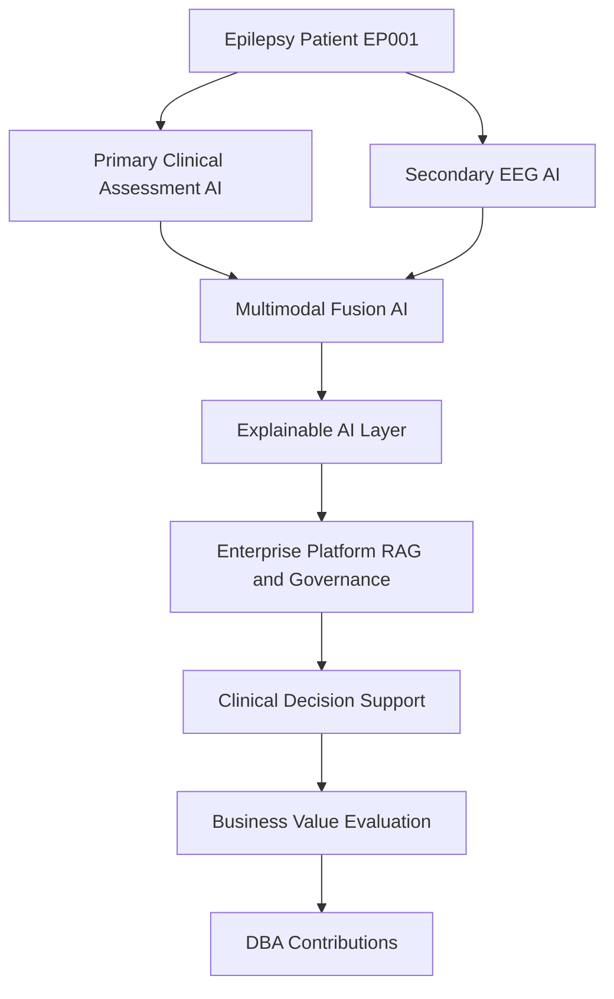
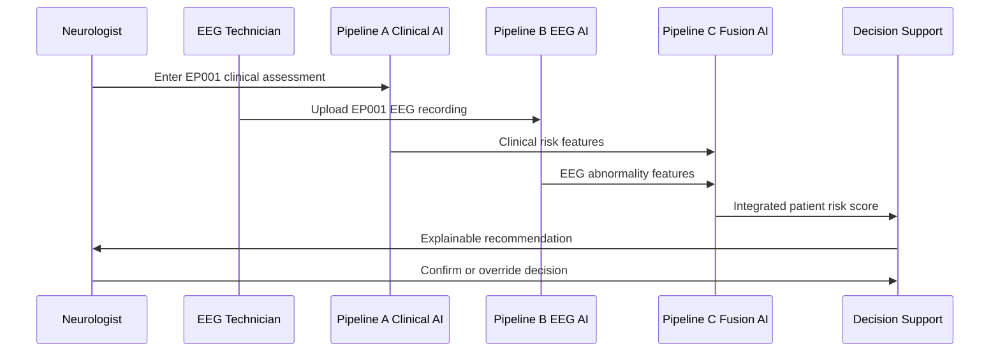
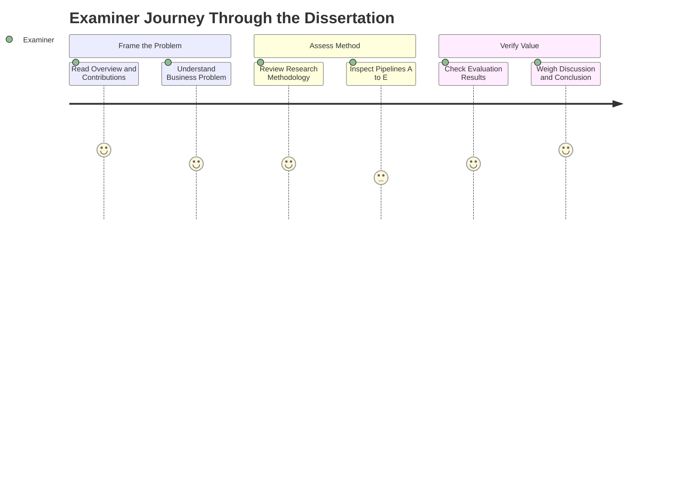

# DBA Dissertation Blueprint
## Enterprise AI Platform for Explainable Multimodal Epilepsy Intelligence

> **Why (this doc):** It is the single entry point that frames the entire dissertation — establishing the three central contributions, the five pillars, and how enterprise AI for **epilepsy** intelligence ties technical innovation to measurable business value.
> **How:** By presenting a research-spine (problem → objective → contributions), a pillar-to-pipeline map, an end-to-end enterprise research stack, and diagrammatic overviews (flowchart, sequence, network, journey) so an examiner can grasp scope in minutes.

This repository holds the full dissertation blueprint and (subsequently) the reference
implementation for a **Doctor of Business Administration (DBA)** focused on enterprise
AI transformation in healthcare.

**Problem.** Epilepsy care is fragmented across clinical assessment and EEG interpretation, with limited explainable, governed AI support to help neurologists and EEG technicians reach consistent, defensible decisions at enterprise scale.

**Research Objective.** Design, build, and evaluate an explainable, multimodal (clinical + EEG) enterprise AI platform for epilepsy intelligence, and quantify its clinical, operational, and organizational impact — demonstrating DBA-level enterprise transformation rather than a purely technical artifact.

### The Three Central Contributions

> **Why:** Focusing on three defendable contributions keeps the dissertation coherent and examinable rather than a scatter of disconnected features. **How:** Each contribution maps to a distinct layer — model framework, enterprise platform, and value evaluation.

Rather than presenting many independent innovations, the dissertation is organized around
three central, defendable contributions:

1. **Multimodal AI Framework** — integrates primary clinical assessment with EEG analytics
   for epilepsy decision support.
2. **Enterprise Clinical Intelligence Platform** — combines explainable AI, evidence
   retrieval (RAG), human oversight, and governance.
3. **Business Value Evaluation Framework** — demonstrates how enterprise AI affects clinical
   workflows, operational efficiency, governance, and organizational outcomes.

These combine technical innovation with organizational transformation and measurable
business impact — the defining posture of a DBA rather than a purely technical PhD.

*Caption - The flowchart below shows how the three contributions stack into one enterprise pipeline, from multimodal input to measured business value.*



### The Five Pillars / Five Pipelines

> **Why:** The five pillars decompose the platform into buildable, testable pipelines that each yield a concrete output. **How:** A pillar-to-pipeline table pairs purpose with final output so scope and deliverables are unambiguous.

*Caption - This table anchors the whole blueprint: it enumerates each pillar, its pipeline, purpose, and final output, making the architecture and deliverables auditable at a glance.*

| Pillar | Pipeline | Purpose | Final Output |
|---|---|---|---|
| 1 | **A – Primary Assessment AI** (16 phases) | Clinical assessment, questionnaires, medication, neurologist workflow | Clinical risk prediction |
| 2 | **B – Secondary EEG AI** (16 phases) | EEG signal processing, biomarkers, deep learning | EEG abnormality prediction |
| 3 | **C – Multimodal Fusion AI** | Combine clinical + EEG + longitudinal monitoring | Integrated patient risk score |
| 4 | **D – Enterprise AI Platform** | RAG, multi-agent orchestration, deployment, monitoring, governance | Production hospital AI ecosystem |
| 5 | **E – Enterprise Evaluation** | Clinical + AI + business + operations + governance validation | Measurable organizational impact |

> For the DBA, **Pipeline C (Multimodal Fusion)** is the primary research contribution —
> it enables the core experimental comparison: *primary-only vs. EEG-only vs. multimodal*.

*Caption - The sequence diagram traces a single epilepsy case (EP001) through the roles and pipelines, clarifying how a Neurologist and EEG Technician interact with the platform in order.*



### End-to-End Enterprise Research Stack

> **Why:** The stack shows the linear research logic from a business problem to defendable DBA contributions, proving the work is driven by inquiry, not tooling. **How:** An ordered pipeline of stages, mirrored as a left-to-right network diagram for the enterprise view.

*Caption - The network graph below renders the same enterprise stack as interconnected components, highlighting how data and evidence flow laterally across the platform rather than as an isolated chain.*


```
Business Problem
      → Research Questions
      → Literature Review
      → Primary Clinical AI
      → Secondary EEG AI
      → Multimodal Fusion AI
      → Explainable AI
      → Clinical Evidence RAG
      → Multi-Agent Enterprise AI
      → Clinical Decision Support
      → Enterprise Deployment
      → AI Governance
      → Business Evaluation
      → DBA Contributions
```

### Document Map

> **Why:** The map orients readers to where each part of the argument lives across the eight-part dissertation. **How:** A part-by-part index links chapters to pipelines and appendices.

*Caption - The user journey below models how an examiner or clinician moves through the document parts, capturing where confidence is built or where friction may occur during a defense read-through.*



- **Part I** — Business Problem (Chapters 1–3)
- **Part II** — Research Methodology (Chapter 4)
- **Part III** — Technical Framework (Chapters 5–9 / Pipelines A–E)
- **Part IV** — Implementation (Chapters 10–12)
- **Part V** — Evaluation (Chapters 13–17)
- **Part VI** — Results
- **Part VII** — Discussion
- **Part VIII** — Conclusion
- **Appendix** — Instruments, diagrams, model cards, checklists
- **Publication Strategy** — Six-paper Q1 output plan

## Professor Readiness (Defense Q&A)

> **Why:** Anticipating examiner questions demonstrates command of the work's scope, novelty, and limits. **How:** Each likely question is posed as a heading with a concise, defensible answer.

### Why is this a DBA and not a technical PhD?

The central deliverable is not a single algorithm but an enterprise transformation: the platform couples multimodal epilepsy models with governance, explainability, human oversight, and a business value evaluation framework. Contributions 2 and 3 explicitly measure organizational, operational, and clinical-workflow impact, which is the defining posture of a DBA.

### What is the core experimental comparison?

The primary contribution, Pipeline C (Multimodal Fusion), enables a controlled comparison of **primary-only vs. EEG-only vs. multimodal** epilepsy risk prediction. This isolates the incremental value of fusing clinical assessment with EEG analytics, using test patient EP001 and the wider cohort.

### How do the two clinical roles interact with the platform?

The **Neurologist** owns clinical assessment entry and the final confirm-or-override decision, while the **EEG Technician** captures and uploads EEG recordings for Pipeline B. The platform fuses both streams and returns an explainable recommendation, keeping a human in the loop for every decision.

### How is trust and governance addressed?

Through the Enterprise AI Platform (Pillar D): explainable AI surfaces the drivers of each prediction, RAG grounds recommendations in retrieved clinical evidence, and the governance layer enforces oversight, monitoring, and auditability — aligning with responsible-AI expectations for high-stakes clinical settings.

## References

> **Why:** Grounding the blueprint in authoritative sources establishes its clinical and AI-governance credibility. **How:** APA 7th edition entries spanning epilepsy classification, medical AI, and responsible-AI standards.

- American Psychological Association. (2020). *Publication manual of the American Psychological Association* (7th ed.). American Psychological Association.
- Fisher, R. S., Cross, J. H., French, J. A., Higurashi, N., Hirsch, E., Jansen, F. E., Lagae, L., Moshé, S. L., Peltola, J., Roulet Perez, E., Scheffer, I. E., & Zuberi, S. M. (2017). Operational classification of seizure types by the International League Against Epilepsy: Position paper of the ILAE Commission for Classification and Terminology. *Epilepsia, 58*(4), 522–530. https://doi.org/10.1111/epi.13670
- Topol, E. J. (2019). High-performance medicine: The convergence of human and artificial intelligence. *Nature Medicine, 25*(1), 44–56. https://doi.org/10.1038/s41591-018-0300-7
- Roy, S., Kiral-Kornek, I., & Harrer, S. (2019). ChronoNet: A deep recurrent neural network for abnormal EEG identification. In *Artificial intelligence in medicine* (pp. 47–56). Springer. https://doi.org/10.1007/978-3-030-21642-9_8
- Holzinger, A., Langs, G., Denk, H., Zatloukal, K., & Müller, H. (2019). Causantly explainable artificial intelligence in medicine. *WIREs Data Mining and Knowledge Discovery, 9*(4), e1312. https://doi.org/10.1002/widm.1312
- Sendak, M. P., Gao, M., Brajer, N., & Balu, S. (2020). Presenting machine learning model information to clinical end users with model facts labels. *npj Digital Medicine, 3*, 41. https://doi.org/10.1038/s41746-020-0253-3
