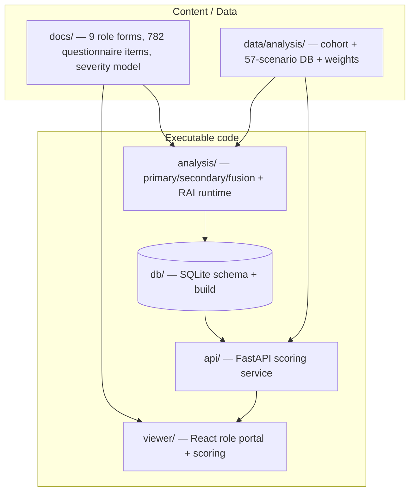

# Architecture & Internals — How Every Part Works

> **Why (this doc):** A single reference explaining, for each component of the platform,
> its **internal functionality**, **working approach**, and **implementation approach** —
> so a reviewer or engineer can understand and defend the whole system. **How:** one
> section per component, each with a short table (what it does · how it works · how it is
> built) plus the key files.

## System map

---

## 1. Documentation system (`docs/`)

| Aspect | Detail |
|---|---|
| **Internal functionality** | 9 clinical roles × numbered assessment sections; each section = question/variable table + **Questionnaire (Enterprise Form)** + **4-level Severity Scenario Model** + 4 Mermaid diagrams + Professor Q&A + APA refs. Plus vision, analytics, Responsible-AI, and scenario docs. |
| **Working approach** | Docs-first: every capability is specified as markdown before/with code. Governed by `docs/GLOBAL-POLICY.md` (tables, diagrams, captions, Why/How, C4, citations). |
| **Implementation approach** | One file per unit of data. Section files carry the severity level-tables the viewer parses for scoring, so docs *are* the data model. Generated docs (questionnaires, scenarios, analysis reports) are written by scripts and never hand-edited. |

## 2. Viewer (`viewer/src/App.jsx`)

| Aspect | Detail |
|---|---|
| **Internal functionality** | Role-portal SPA: top tab bar (Home + 9 role tabs + All Docs), a **per-role left menu** of that role's sections, markdown rendering with Mermaid, and a **Fill & Score** mode with a per-role Severity Dashboard + EP001 composite. |
| **Working approach** | `import.meta.glob('../../docs/**/*.md')` eagerly loads every doc at build time; `classify()` routes each path to a nav group; `ROLES[]` defines the 9 portals. Scoring parses each section's `### Level 1..4` tables into a question form; the answer's level (1–4) is averaged and banded (`bandOf`). Answers persist in `localStorage`. |
| **Implementation approach** | Pure functions (`parseSeverity`, `scoreOf`, `bandOf`) drive the scoring; React state holds `answers` keyed by doc id. No backend needed — the docs are the source of truth. Aggregation cascades section → role → patient composite. |

## 3. Analytics package (`analysis/`)

| Script | Internal functionality | Working / implementation approach |
|---|---|---|
| `common.py` | Config, master seed, paths, markdown/figure/diagram helpers | Single `SEED=42`; `df_to_md`, `save_fig`, `write_report`, `band_from_mean` shared by all pipelines |
| `make_cohort.py` | Generates a causally-linked cohort (N=500) | A latent `severity_level` + `focus_side` drive BOTH primary role features and EEG biomarkers, so downstream stats are real; EP001 pinned; defects injected for cleaning |
| `primary_analysis.py` | 11 commented stages | validate → clean(+audit) → feature-engineering → one-hot/normalize/standardize → EDA → statistics (Shapiro, Spearman, Kruskal/ANOVA+η², χ², ordinal logistic) → MI/LASSO/RFE selection → balance → **bias_check** (parity/equal-opportunity) → CV model; self-writes a report |
| `secondary_analysis.py` | EEG pipeline | QC → preprocess → biomarkers + channel→region → statistics → focus lateralisation (subject-level split), CV ROC-AUC |
| `fusion_analysis.py` | Multimodal fusion + EP001 case | merge by `patient_id` → incremental value (primary vs EEG vs fusion) → EP001 end-to-end (severity + focus + fused risk + recommendation) |
| `responsible_ai_runtime.py` | Executable RAI | **SHAP** (global + EP001 local), **LIME** (EP001), **Fairlearn** metrics + demographic-parity mitigation (before/after), **GuardrailChecker** (PII + prompt-injection regex) |
| `build_questionnaires.py` | Validate + consolidate | Extracts each section's questionnaire table, checks columns/rows/ID-prefix/uniqueness, writes per-role consolidated forms + a validation report |
| `build_scenarios.py` | Scenario DB + scoring model | Curated 57-scenario catalogue → CSV + doc; domain-weightage table for the weighted composite score |
| `run_all.py` | Orchestrator | Runs cohort → primary → secondary → fusion in dependency order |

**Reproducibility:** every script is deterministic (seeded), writes artefacts under
`data/analysis/`, `analysis/outputs/`, and `docs/analysis/`, and is re-runnable from a clean checkout.

## 4. Database (`db/`)

| Aspect | Detail |
|---|---|
| **Internal functionality** | Normalised schema: `severity_level`, `role`, `section`, `question`, `patient`, `scenario`, `assessment`, `answer`, `section_score`, `patient_score`, `audit_log` |
| **Working approach** | `schema.sql` is the canonical PostgreSQL DDL (role → section → question → answer → score lineage; FKs + indexes). `build_sqlite.py` materialises a runnable SQLite DB loaded from the scenario/weight CSVs + EP001 |
| **Implementation approach** | File artefacts (CSV/markdown) are the current source of truth; the schema is the deployment target. `*.db` is gitignored and rebuilt from the builder |

## 5. API (`api/main.py`)

| Aspect | Detail |
|---|---|
| **Internal functionality** | FastAPI service: `/health`, `/roles`, `/severity`, `/scenarios[/{id}]`, `POST /score`, `/patient/{id}` |
| **Working approach** | Loads scenarios/weights from CSV and patient/composite from SQLite; `/score` implements the exact weighted model (`Σ(level·weight)/Σ(weight)` → mean → band) used by the viewer and docs |
| **Implementation approach** | Pydantic models enforce input validity (severity level constrained 1–4 → `422`); stateless; auto-generated OpenAPI docs at `/docs` |

## 6. Testing

| Suite | Coverage |
|---|---|
| `analysis/tests/test_pipelines.py` (pytest) | Scoring thresholds, cohort invariants, cleaning of impossible values, feature engineering, scenario integrity, questionnaire extraction, guardrails — **positive + negative** cases (19 tests) |
| `api/test_api.py` (pytest + TestClient) | health, roles-weight-sum, scenario lookup + 404, weighted score, **422 on bad level**, EP001 vs missing patient (7 tests) |
| Viewer | Scoring pure-functions are unit-testable; UI/button tests via Vitest (see `viewer/`) |

## 7. Responsible AI (design ↔ runtime)

| Layer | Where |
|---|---|
| Design / architecture | `docs/responsible-ai/` — 16 pillars + `implementation/` (accountable-AI flow, fairness pipeline, SHAP/LIME, guardrails/red-team, governance registry) |
| **Runtime (real code)** | `analysis/responsible_ai_runtime.py` (SHAP/LIME/fairness/guardrails) + `analysis/primary_analysis.py` `bias_check()` |

## References

Brown, S. (2018). *The C4 model for visualising software architecture*. https://c4model.com
Kuhn, M., & Johnson, K. (2019). *Feature engineering and selection*. CRC Press.
NIST. (2023). *AI Risk Management Framework (AI RMF 1.0)*.
