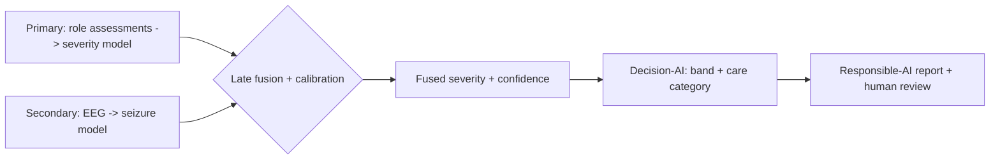
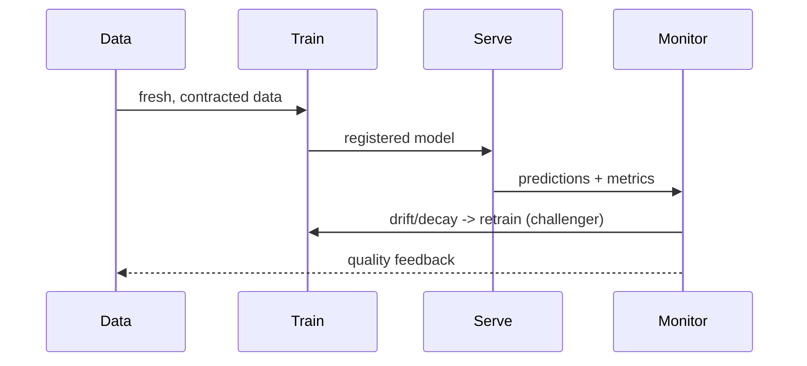
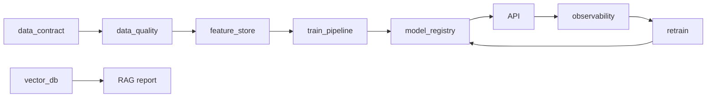
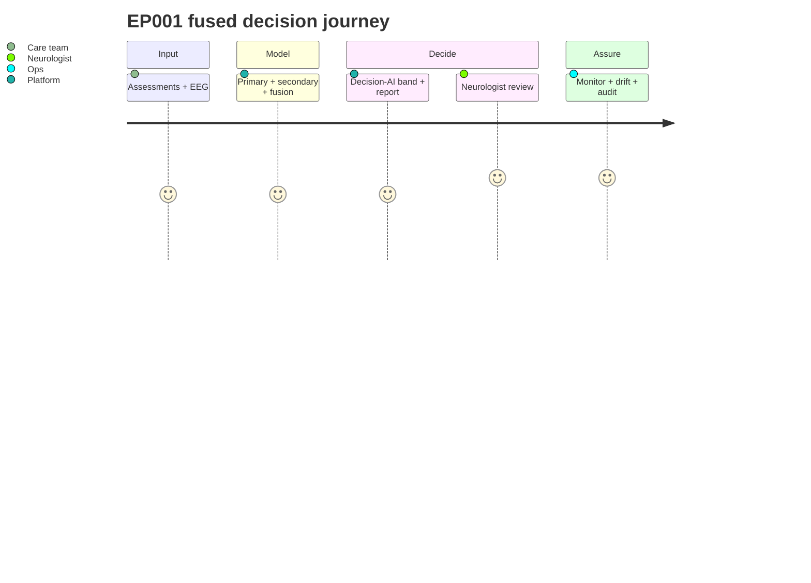

# AIOps · DataOps · ModelOps · Drift · Fusion · Decision-AI — Completeness & Gaps

> **Why (this doc):** A brutal, honest map of the operational spine (DataOps/ModelOps/AIOps),
> drift handling, how primary + secondary data **fuse** for one patient, and how the fused output
> drives **Decision-AI** and **Responsible-AI** reporting — with an explicit gap list. **How:** each
> row cites the module/doc that implements it, or marks it a documented stand-in.

## Research spine
- **Problem:** models decay and data shifts; two data streams (clinical + EEG) must combine safely.
- **Sub-problems:** pipeline automation, drift detection, retraining, fusion, decision support, governance.
- **Research problem:** *How do we operate primary + secondary epilepsy models continuously and fuse them per patient?*
- **Objective:** a closed loop — ingest → train → serve → monitor → drift → retrain — plus a fusion + decision layer.
- **Hypothesis:** fused (clinical + EEG) severity is better calibrated than either stream alone.

## 1. DataOps
*Caption — how data is contracted, validated, versioned, and kept fresh.*

| Capability | Implementation | Status |
|---|---|---|
| Data contract / schema | `mlops/data_contract.py` | ✅ |
| Quality checks (null/range/type) | `mlops/data_quality.py` → `data_quality_report.csv` | ✅ |
| Feature store + metadata | `mlops/feature_store.py` | ✅ |
| Vector DB (RAG corpus) | `analysis/vector_db_pipeline.py` → `vector_db_index.csv` | ✅ (TF-IDF stand-in) |
| Scheduled jobs | `vector_jobs.csv` (cron) + CI weekly cron | ✅ |
| Data lineage / provenance | prompt-log + artefact paths | ⚠️ partial (no formal catalog) |
| Data mesh / fabric | documented pattern only | ❌ documented |

## 2. ModelOps
*Caption — training, registry, evaluation, rollback.*

| Capability | Implementation | Status |
|---|---|---|
| Training pipeline (persisted) | `mlops/train_pipeline.py` (Pipeline+HPO) | ✅ |
| Experiment tracking | `mlops/experiment_tracker.py` | ✅ |
| Model registry + rollback | `mlops/model_registry.py` | ✅ |
| Champion–challenger retrain | `mlops/retrain.py` | ✅ |
| Model cards | `mlops/store/model_card.md` | ✅ |
| Accuracy matrix per model | `eeg_model_metrics.csv` (AUC/AP/log-loss…) | ✅ |

## 3. AIOps + drift
*Caption — the signals watched continuously and the automated response.*

| Signal | Metric | Response | Implementation |
|---|---|---|---|
| Data drift | KS / PSI on features | alert + investigate | `mlops/observability.py` |
| Concept drift | pred/label agreement | champion–challenger | `mlops/retrain.py` |
| Performance decay | AUC vs baseline | retrain trigger | `mlops/observability.py` |
| System | CPU/mem/GPU/disk/net | scale/page | `mlops/system_monitor.py` |
| API | latency/error/`/metrics` | page on-call | `api/main.py` |
| Security | auth/anomaly | lock + audit | `docs/governance/00-security-compliance.md` |
| Fairness | subgroup gap | bias review | `analysis/responsible_ai_runtime.py` |

## 4. Fusion — how primary + secondary combine (per patient EP001)
*Caption — the multimodal fusion recipe and where it runs.*

| Step | What | Module |
|---|---|---|
| Align | join clinical severity + EEG features on patient/pseudonym | `analysis/fusion_analysis.py` |
| Normalise | z-score each modality | fusion |
| Fuse | late fusion: weighted combine of clinical-risk + EEG-risk (+ stacking) | fusion |
| Calibrate | Platt/İsotonic on fused score | fusion |
| Explain | per-modality contribution (which stream drove the call) | fusion + SHAP |
| Decide | map fused score → severity band + care category | Decision-AI (below) |

**Fusion flowchart**

## 5. Decision-AI + Responsible-AI reporting
*Caption — from fused score to a governed, explainable recommendation.*

| Layer | Behaviour | Guardrail |
|---|---|---|
| Decision-AI | fused score → severity L1–4 + care category (No-Disease…Surgical) + suggested pathway | thresholds documented; abstains when confidence low |
| Reporting | doctor-facing + patient-facing report, with cited evidence (vector DB) | grounding rate monitored |
| Responsible-AI | SHAP/permutation explanation, fairness gap, calibration, provenance | RAI pillars `docs/responsible-ai/` |
| Human-in-the-loop | neurophysiologist approves/rejects; override logged | no autonomous diagnosis |

## 6. Brutal gap list (honest)
*Caption — what is NOT yet production-real, so a reviewer sees the true edge.*

| Area | Gap | Path to close |
|---|---|---|
| Deep EEG models | MLP stand-in, not EEGNet/CNN/ViT | add PyTorch + GPU training |
| Embeddings | TF-IDF, not neural | sentence-transformers + FAISS/pgvector |
| Clinical labels | synthetic cohort (real EEG only) | IRB + collaborator for labelled clinical data |
| Data mesh/fabric | documented, not deployed | domain data products + catalog |
| Fusion validation | internal only | external multimodal cohort |
| Decision thresholds | expert-set, not trial-validated | prospective calibration study |

## Sequence — continuous loop

## Network — ops components

## Journey — one patient through the fused loop

**Reason:** operate + fuse two model streams safely. **Why:** models decay and single-modality views miss
signal; governance is mandatory. **What is happening:** contracted data → trained/registered models →
served + monitored → drift-triggered retrain; two streams fuse per patient into a governed decision.
**How it is happening:** the mlops modules + `fusion_analysis.py` + `vector_db_pipeline.py` + RAI runtime.
**Reference:** Sculley et al. (2015); Lewis et al. (2020); Amodei et al. (2016).

## Professor Readiness (Defense Q&A)
### How do you know the model hasn't silently decayed?
Continuous drift (KS/PSI) + performance-vs-baseline monitoring trigger a champion–challenger retrain; all logged.
### Why late fusion, not early?
Modalities have different scales/availability; late fusion is robust to a missing stream and keeps per-modality explanations.
### What stops the AI from deciding alone?
A neurophysiologist approves/rejects every output; Decision-AI abstains under low confidence; no autonomous diagnosis.

## References

Amodei, D., et al. (2016). Concrete problems in AI safety. *arXiv:1606.06565*.

Lewis, P., et al. (2020). Retrieval-augmented generation for knowledge-intensive NLP tasks. *NeurIPS 33*.

Sculley, D., et al. (2015). Hidden technical debt in machine learning systems. *NeurIPS 28*.
