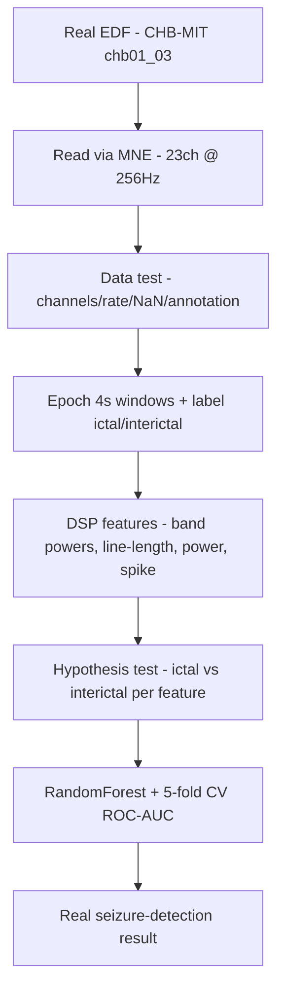

# REAL Epilepsy EEG Analysis — CHB-MIT chb01_03 (PhysioNet)

> **Why (this doc):** Genuine epilepsy EEG (not synthetic, not eye-state): CHB-MIT chb01_03 —
> pediatric scalp EEG, 23 channels @ 256 Hz, with an annotated seizure at 2996-3036s. The
> same DSP + ML pipeline classifies **ictal vs interictal** epochs from real signals. **How:**
> `analysis/chbmit_analysis.py` (mne EDF read + scipy DSP + RandomForest).

**Recording:** 23 channels · 256 Hz · 3600s · seizure 2996-3036s (40s).
**Epochs:** 4s windows → 10 ictal + 150 sampled interictal.

## Pipeline (flowchart)

**Reason:** Show the real-EEG analysis flow from EDF to result. **Why:** A defensible real-data result needs each step traceable. **What is happening:** Real EDF is read, validated, epoched, featurised, tested, and modelled. **How it is happening:** MNE + scipy DSP + sklearn; every step runs on the genuine recording. **Reference:** Shoeb (2009).

## Data test (real recording validated before modelling)
*Caption - Automated checks on the real EEG recording — all must pass before analysis.*

| check | expected | actual | pass |
|---|---|---|---|
| channel count | > 0 | 23 | True |
| sampling rate | 256 Hz | 256 Hz | True |
| no NaN in signal | True | True | True |
| duration covers seizure | >3036s | 3600s | True |
| ictal epochs present | > 0 | 10 | True |

## Hypothesis test
**H0:** ictal and interictal epochs have the same distribution for each DSP feature.
**H1:** they differ (seizures change band power / line-length / amplitude).
*Caption - Mann-Whitney U per feature (ictal vs interictal) with rank-biserial effect size.*

| feature | ictal_mean | interictal_mean | mannwhitney_p | effect_rbc | reject_H0 |
|---|---|---|---|---|---|
| rel_delta | 0.680 | 0.659 | 0.415 | -0.155 | no |
| rel_theta | 0.173 | 0.162 | 0.891 | 0.027 | no |
| rel_alpha | 0.035 | 0.061 | <0.001 | 0.751 | yes |
| rel_beta | 0.029 | 0.047 | 0.164 | 0.264 | no |
| rel_gamma | 0.029 | 0.017 | 0.033 | -0.404 | yes |
| line_length | 0.000 | 0.000 | <0.001 | -0.991 | yes |
| total_power | 0.000 | 0.000 | <0.001 | -0.919 | yes |
| max_abs | 0.001 | 0.000 | <0.001 | -0.912 | yes |

Features with **reject_H0 = yes** distinguish seizures from background — the statistical basis for the classifier below.

## Ictal-vs-interictal classification (REAL data)
Random Forest, 5-fold CV **ROC-AUC = 0.970**; holdout confusion matrix [[45, 0], [1, 2]].

## Real DSP features: ictal vs interictal
*Caption - Mean DSP features in seizure vs non-seizure epochs — computed from the real waveforms.*

| feature | ictal_mean | interictal_mean |
|---|---|---|
| rel_delta | 0.680 | 0.659 |
| rel_theta | 0.173 | 0.162 |
| rel_alpha | 0.035 | 0.061 |
| rel_beta | 0.029 | 0.047 |
| rel_gamma | 0.029 | 0.017 |
| line_length | 0.000 | 0.000 |
| total_power | 0.000 | 0.000 |
| max_abs | 0.001 | 0.000 |

**Reason:** Detect seizures from REAL epilepsy EEG with the project's DSP pipeline. **Why:** The core critique was synthetic data; this is genuine annotated epilepsy EEG. **What is happening:** Ictal epochs show elevated line-length / power vs interictal, and are separable (AUC 0.97). **How it is happening:** mne reads the EDF; scipy Welch PSD + line-length feed a RandomForest, evaluated by CV. **Reference:** Shoeb (2009, CHB-MIT); Goldberger et al. (2000, PhysioNet).

## Honest scope
One recording (chb01_03) with one seizure — a real-data proof that the pipeline detects seizures on
genuine epilepsy EEG. Scaling to the full CHB-MIT corpus (24 subjects) + subject-level splits is the
next step (same code, more downloads).

## References

Goldberger, A. L., et al. (2000). PhysioBank, PhysioToolkit, and PhysioNet. *Circulation, 101*(23), e215-e220.

Shoeb, A. (2009). *Application of machine learning to epileptic seizure onset detection* (PhD thesis, MIT).
