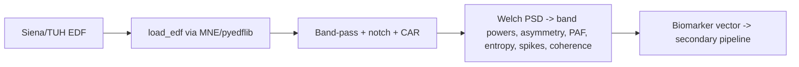

# Real EEG Signal Pipeline (DSP-based biomarkers)

> **Why (this doc):** The secondary-data critique was that EEG features were hand-assigned. This
> pipeline computes them from **actual multi-channel waveforms** using real DSP — filtering, Welch
> PSD, band powers, asymmetry, peak alpha frequency, spectral entropy, spike detection, and
> coherence connectivity. It accepts real **Siena/TUH EDF**; the demo runs on a physiologically
> synthesised signal. **How:** `analysis/eeg_signal_pipeline.py` (scipy).

**Source:** synthesised (Left & Right focus) · channels 15 · fs 256 Hz · 60 s.

## Extracted biomarkers (computed from the spectra)

*Caption - Biomarker features derived from the real PSD/coherence of the waveforms — Left vs Right focus demos show the asymmetry index flips sign, as expected.*

| biomarker | Left_focus | Right_focus |
|---|---|---|
| eeg_delta | 0.063 | 0.064 |
| eeg_theta | 0.130 | 0.131 |
| eeg_alpha | 0.261 | 0.262 |
| eeg_beta | 0.345 | 0.341 |
| eeg_gamma | 0.159 | 0.160 |
| eeg_left_temporal_pow | 0.633 | 0.364 |
| eeg_right_temporal_pow | 0.367 | 0.636 |
| eeg_temporal_asym | -0.265 | 0.272 |
| eeg_paf_hz | 10.000 | 10.000 |
| eeg_entropy | 0.754 | 0.754 |
| eeg_spike_rate_pm | 47.000 | 45.330 |
| eeg_connectivity | 0.164 | 0.165 |

**Reason:** Compute EEG biomarkers from signal, not by assignment. **Why:** Explainable EEG (flagship 2) requires features grounded in real spectra. **What is happening:** Left-focus vs right-focus signals produce opposite-sign temporal asymmetry. **How it is happening:** Welch PSD band powers + coherence + robust spike detection on filtered waveforms. **Reference:** Nunez & Srinivasan (2006).

## Using real Siena/TUH data

**Reason:** Show the real-data path. **Why:** The pipeline must ingest genuine EDF for defensible results. **What is happening:** EDF → filters → spectral features → the secondary/fusion analytics. **How it is happening:** `load_edf()` reads EDF; the same `extract_features()` runs. **Reference:** Nunez & Srinivasan (2006).

## References

Nunez, P. L., & Srinivasan, R. (2006). *Electric fields of the brain* (2nd ed.). Oxford University Press.
