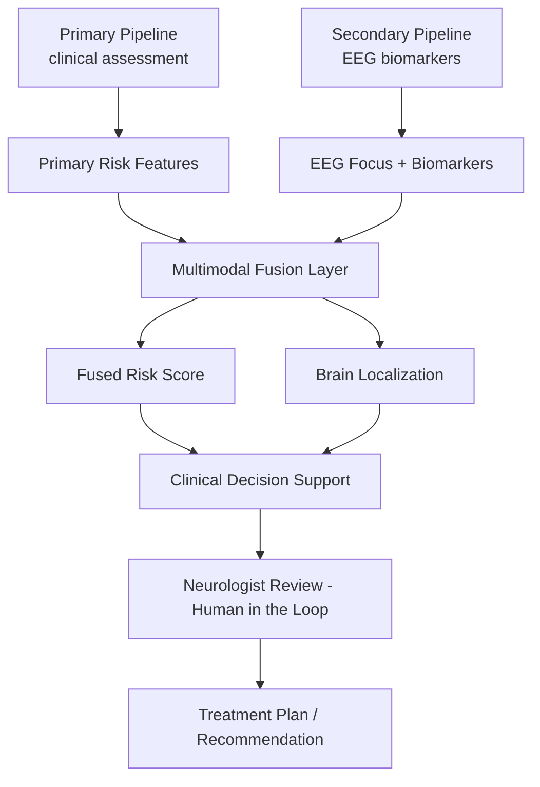
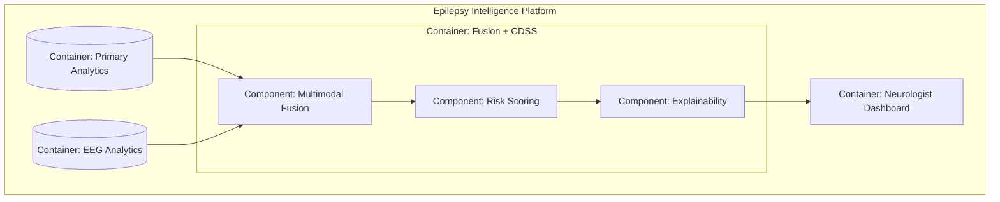
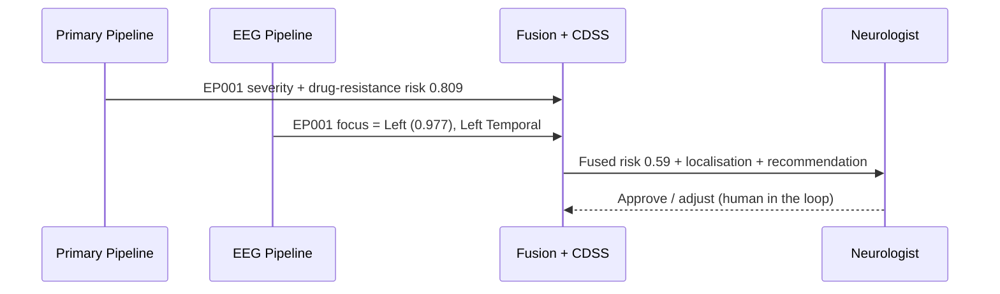
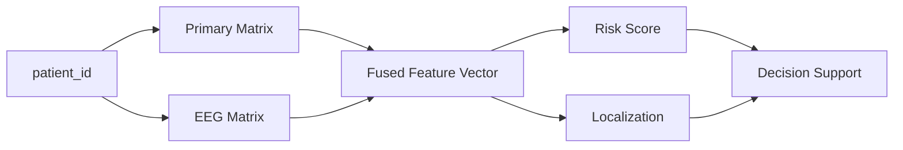
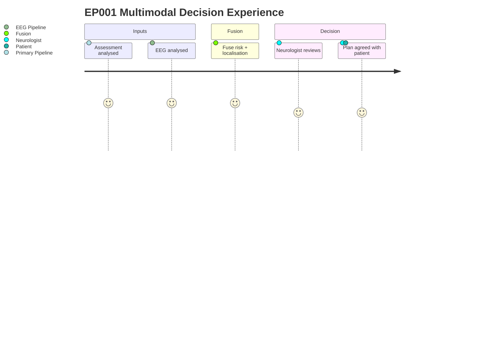

# Multimodal Fusion & EP001 End-to-End Case (Epilepsy)

> **Why (this doc):** The dissertation's payoff is fusion — combining the primary
> clinical-assessment analysis with the secondary EEG analysis for one coherent,
> explainable, human-supervised decision. **How:** The two modality matrices are
> linked by patient id, the incremental value of fusion is quantified by
> cross-validated AUC, and the whole platform is run for the index patient **EP001**
> end-to-end — all reproducible from `analysis/fusion_analysis.py`.

**Problem:** Primary and EEG modalities each capture only part of the epilepsy picture.
**Sub-problems:** modality linkage; incremental value; single-patient interpretability.
**Research Problem:** Does fusing primary and EEG data improve risk prediction and enable
an explainable, localised, patient-level decision beyond either modality alone?
**Research Objective:** Quantify fusion's incremental value and demonstrate an end-to-end
EP001 decision (severity + focus + fused risk + recommendation) under human oversight.
**Hypotheses:** H1 fusion AUC >= best single modality; H2 EEG adds lateralised localisation
that primary data cannot provide; H3 the EP001 fused output is clinically coherent.
**Statistical Analysis:** 5-fold cross-validated ROC-AUC/accuracy across three feature sets.

## Fusion Architecture

*Caption - Two modality pipelines converge into a fusion layer feeding explainable, human-supervised decision support.*

**Reason:** Show how the two modalities fuse into one decision. **Why:** Fusion is only justified if it adds value over single modalities and stays explainable. **What is happening:** Primary risk features and EEG focus features combine into fused risk + localisation, gated by a clinician. **How it is happening:** Each pipeline writes features that the fusion model consumes; the clinician confirms. **Reference:** Topol (2019); Rajkomar, Dean & Kohane (2019).

## C4 Model — Fusion & CDSS Container

*Caption - C4 container view of the fusion + clinical-decision-support container within the platform.*

**Reason:** Locate the fusion container between the two analytics containers and the dashboard (C4). **Why:** Explicit boundaries clarify where fusion, scoring, and explanation responsibilities live. **What is happening:** Both analytics containers feed fusion, which scores, explains, and surfaces to the dashboard. **How it is happening:** Each component is a section of fusion_analysis.py. **Reference:** Brown (2018).

## Stage 2 — Incremental Value of Fusion

*Caption - Cross-validated drug-resistance prediction from each modality alone versus fused; the AUC delta is the incremental value.*

| model | n_features | auc_mean | auc_sd | accuracy |
|---|---|---|---|---|
| Primary-only | 12 | 0.969 | 0.013 | 0.910 |
| EEG-only | 13 | 0.929 | 0.026 | 0.856 |
| Fusion (Primary+EEG) | 25 | 0.976 | 0.008 | 0.924 |

**Fusion vs primary-only ΔAUC = 0.007.** Even where the primary clinical
vector is already strong, EEG contributes the *lateralised localisation* that the primary
data cannot supply — the qualitative value of fusion is not captured by AUC alone.

## Stage 3 — EP001 End-to-End (Clinical Decision Support Card)

*Caption - The full platform run for the index patient EP001: primary severity, EEG focus, fused risk, and a rule-based recommendation the clinician confirms.*

| Field | Value |
|---|---|
| Patient | EP001 (EP-2026-001) |
| Primary severity (assessment) | Severe (Level 3) |
| Primary drug-resistance risk | 0.81 |
| EEG focus laterality | Left (confidence 0.98) |
| EEG focus region / channel | Left Temporal / T7 |
| Fused drug-resistance risk | 0.59 |
| Recommendation (clinician confirms) | Expedite comprehensive epilepsy-centre evaluation: video-EEG telemetry to confirm the left-temporal focus, MRI review for mesial temporal sclerosis, and pre-surgical work-up; review ASM regimen (breakthrough on CBZ+LEV). |

**Reading:** EP001 presents as **Severe** on the primary assessment, with a
fused drug-resistance risk of **0.59** and an EEG focus lateralised to the
**Left** (confidence 0.977), region **Left Temporal** —
consistent with the documented left-temporal focus. The recommendation is generated by a
transparent rule and **requires neurologist confirmation** (no autonomous diagnosis).

## Role Capturing the Data (Sequence)

**Reason:** Show the multimodal handoff for one patient. **Why:** Human oversight is mandatory before any recommendation is acted on. **What is happening:** Both pipelines feed the fusion layer, which presents to the neurologist for approval. **How it is happening:** Each arrow is a real model output for EP001. **Reference:** Rajkomar et al. (2019).

## Data Linkage (Network)

**Reason:** Map how the two matrices link into one fused vector. **Why:** Patient-level linkage is the precondition for any multimodal claim. **What is happening:** Both matrices join on patient_id to form the fused vector feeding risk and localisation. **How it is happening:** An inner join on patient_id guarantees per-patient alignment. **Reference:** Kuhn & Johnson (2019).

## Patient & Clinician Experience (Journey)

**Reason:** Surface the end-to-end multimodal experience for EP001. **Why:** The value is a single coherent, explainable decision, not two disconnected outputs. **What is happening:** Primary and EEG results fuse into a reviewed plan agreed with the patient. **How it is happening:** Each step corresponds to a pipeline or human checkpoint. **Reference:** Tukey (1977).

## Professor Readiness (Defense Q&A)

**Q1: If the primary AUC is already high, why fuse?** Because EEG supplies lateralised
localisation (Left 0.977 confidence, Left Temporal) that primary
data cannot, and it modestly improves risk AUC (Δ = 0.007); fusion's value
is both quantitative and qualitative.

**Q2: Is EP001 leaked into its own prediction?** No — the EP001 case trains on the rest of
the cohort and predicts the held-out index patient.

**Q3: Where is the human in the loop?** The recommendation is a transparent rule surfaced to
the neurologist for approval; the platform never issues an autonomous diagnosis.

## References

Brown, S. (2018). *The C4 model for visualising software architecture*. https://c4model.com

Kuhn, M., & Johnson, K. (2019). *Feature engineering and selection*. CRC Press.

Rajkomar, A., Dean, J., & Kohane, I. (2019). Machine learning in medicine. *New England Journal of Medicine, 380*(14), 1347-1358.

Topol, E. J. (2019). *Deep medicine*. Basic Books.

Tukey, J. W. (1977). *Exploratory data analysis*. Addison-Wesley.
