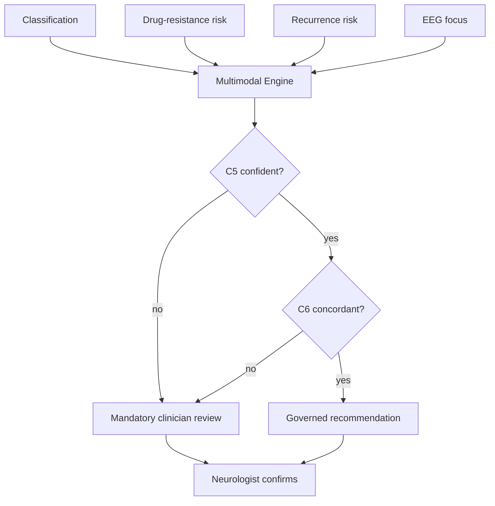

# Integrated Multimodal Clinical Decision Support (Flagship #6)

> **Why (this doc):** The capstone engine that fuses every flagship output — severity
> classification, drug-resistance risk, recurrence risk, and EEG focus — behind the two
> governance gates (C5 confidence, C6 concordance), producing ONE governed decision per patient
> under human oversight. **How:** `analysis/decision_support.py` reads the other pipelines'
> artefacts and assembles the decision; the neurologist retains final authority.

## Cohort: auto-recommendable vs mandatory review

*Caption - How many patients pass BOTH governance gates (auto-recommendable) versus routed to the clinician.*

| auto_recommendable | patients |
|---|---|
| False | 267 |
| True | 233 |

**46.6%** of patients are auto-recommendable (confident + concordant); the rest are
routed to mandatory clinician review — the operational meaning of human oversight.

## EP001 — integrated decision card

*Caption - Every flagship output for EP001, the governance gates, and the resulting governed recommendation.*

| Field | Value |
|---|---|
| Severity (classification) | Level 3 |
| Drug-resistance risk (fusion) | 0.744 |
| Recurrence risk (survival) | High |
| EEG focus (DSP) | Left |
| Confidence gate (C5) | PASS |
| Concordance gate (C6) | Concordant |
| Auto-recommendable | True |
| **Recommendation** | Refer to epilepsy centre / expedite: high drug-resistance risk + high recurrence; consider presurgical evaluation (Left focus, T7). |

## Governed decision flow

**Reason:** Show how all flagships fuse behind the governance gates. **Why:** A recommendation is issued only when the AI is BOTH confident AND the evidence agrees. **What is happening:** Four flagship signals feed one engine; two gates decide recommend-vs-defer; the clinician confirms. **How it is happening:** Calibrated probability margin (C5) + source agreement (C6) gate the output. **Reference:** NIST (2023); Topol (2019).

## Professor Readiness (Defense Q&A)

**Q1: What is the contribution here?** A single governed engine that fuses multiple EEG-based
flagships and only recommends when confident and concordant — the Responsible-AI thesis in action.

**Q2: Why defer some patients?** Low confidence or conflicting evidence means the safe action is
human review, not an autonomous recommendation.

**Q3: How does EP001 flow through it?** Severe + high drug-resistance + high recurrence + concordant
left-temporal focus → passes both gates → expedite/presurgical recommendation, clinician-confirmed.

## References

NIST. (2023). *AI Risk Management Framework (AI RMF 1.0)*.

Topol, E. J. (2019). *Deep medicine*. Basic Books.
