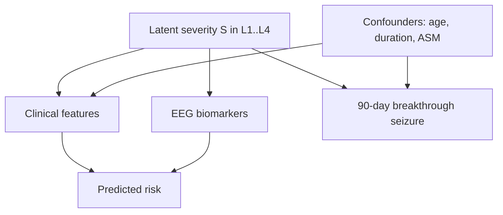

# Mathematical Formulations (LaTeX)

*Caption — the exact equations behind every method, rendered with KaTeX in the viewer.*

## Signal features (EEG)

| Feature | Formula | Meaning |
|---|---|---|
| Band power | $P_b=\displaystyle\int_{f_1}^{f_2} S(f)\,df$ | energy in band $[f_1,f_2]$ from PSD $S(f)$ |
| Line-length | $L=\displaystyle\sum_{t=1}^{N-1}\lvert x_{t+1}-x_t\rvert$ | waveform complexity / ictal marker |
| Hjorth activity | $A=\operatorname{Var}(x)$ | signal power |
| Hjorth mobility | $M=\sqrt{\dfrac{\operatorname{Var}(x')}{\operatorname{Var}(x)}}$ | mean frequency |
| Hjorth complexity | $C=\dfrac{M(x')}{M(x)}$ | bandwidth |
| Spectral entropy | $H=-\displaystyle\sum_i p_i\log p_i,\quad p_i=\dfrac{S(f_i)}{\sum_j S(f_j)}$ | spectral disorder |
| Phase-locking value | $\text{PLV}=\left\lvert\dfrac{1}{N}\displaystyle\sum_{t=1}^{N}e^{\,i\,\Delta\phi_t}\right\rvert$ | inter-channel synchrony |

Higuchi fractal dimension is the slope $D$ of

$$\ln\!\big(L(k)\big)\;=\;-\,D\,\ln(k)\;+\;\text{const},$$

where $L(k)$ is the mean curve length at scale $k$.

## Time–frequency transforms

| Transform | Formula |
|---|---|
| STFT | $X(\tau,f)=\displaystyle\int x(t)\,w(t-\tau)\,e^{-i 2\pi f t}\,dt$ |
| CWT | $W(a,b)=\dfrac{1}{\sqrt{a}}\displaystyle\int x(t)\,\psi^{*}\!\Big(\dfrac{t-b}{a}\Big)\,dt$ |

## Preprocessing & balancing

| Step | Formula |
|---|---|
| z-score | $z=\dfrac{x-\mu}{\sigma}$ |
| SMOTE synthesis | $x_{\text{new}}=x_i+\lambda\,(x_{nn}-x_i),\quad \lambda\sim U(0,1)$ |
| Mutual information | $I(X;Y)=\displaystyle\sum_{x,y}p(x,y)\log\dfrac{p(x,y)}{p(x)\,p(y)}$ |

## Models

| Model | Formula |
|---|---|
| Logistic | $\prob(y=1\mid x)=\sigma(\beta^\top x)=\dfrac{1}{1+e^{-\beta^\top x}}$ |
| Ordinal (cumulative) | $\prob(y\le k\mid x)=\sigma(\theta_k-\beta^\top x)$ |
| Cox PH hazard | $h(t\mid x)=h_0(t)\,e^{\beta^\top x}$ |
| Objective | $\hat\beta=\argmin_{\beta}\ \mathcal{L}(\beta)+\lambda\lVert\beta\rVert^2$ |

## Evaluation metrics

| Metric | Formula |
|---|---|
| Precision | $\text{P}=\dfrac{TP}{TP+FP}$ |
| Recall / Sensitivity | $\text{R}=\dfrac{TP}{TP+FN}$ |
| Specificity | $\text{Sp}=\dfrac{TN}{TN+FP}$ |
| $F_1$ | $F_1=\dfrac{2\,\text{P}\,\text{R}}{\text{P}+\text{R}}$ |
| ROC-AUC | $\AUC=\prob\!\big(s(x^+)>s(x^-)\big)$ |
| Log-loss | $\ell=-\dfrac{1}{N}\displaystyle\sum_{i=1}^{N}\big[y_i\log \hat p_i+(1-y_i)\log(1-\hat p_i)\big]$ |

## Drift monitoring

| Signal | Formula |
|---|---|
| PSI | $\text{PSI}=\displaystyle\sum_i (a_i-e_i)\,\ln\dfrac{a_i}{e_i}$ |
| KS statistic | $D=\sup_x\lvert F_{\text{ref}}(x)-F_{\text{cur}}(x)\rvert$ |

## Explainability (SHAP)

$$\phi_j=\!\!\sum_{S\subseteq F\setminus\{j\}}\!\!\frac{\lvert S\rvert!\,(\lvert F\rvert-\lvert S\rvert-1)!}{\lvert F\rvert!}\big[f(S\cup\{j\})-f(S)\big]$$

with the additive guarantee $\ f(x)=\phi_0+\sum_{j}\phi_j.$

## Graphical model (probabilistic DAG)

*Caption — the platform's assumed generative structure: latent severity drives observations and outcome.*

Factorisation of the joint distribution:

$$p(S,C,E,O)=p(S)\,p(C\mid S)\,p(E\mid S)\,p(O\mid S,\text{conf}).$$

## Chemistry (mhchem — advanced KaTeX)

ASM metabolism example: $\ce{C15H15N3O2 ->[CYP3A4] metabolites}$ (rendered via the mhchem extension).
