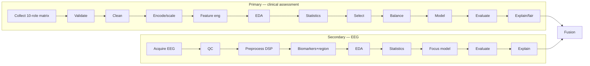

# Primary vs Secondary Data Analysis — Phase by Phase

> **Why (this doc):** Explains, for **each phase**, exactly what the **primary** (clinical assessment)
> pipeline and the **secondary** (EEG) pipeline do — so the two arms of the dissertation are legible
> side by side. **How:** one row per phase mapping primary → secondary, pointing to the runnable code
> and its report. Primary = `analysis/primary_analysis.py`; Secondary = `analysis/secondary_analysis.py`
> + `analysis/eeg_signal_pipeline.py` (+ real EEG in `real_eeg_analysis.py`).

## Phase-by-phase mapping

*Caption - Each analytical phase and what the primary (clinical) and secondary (EEG) pipelines do in it.*

| # | Phase | **Primary data analysis** (clinical assessment) | **Secondary data analysis** (EEG) |
|---|---|---|---|
| 1 | **Collection** | 10‑role questionnaire matrix → one row per patient (features from every role) | EEG acquisition; real signal (EDF) or DSP‑extracted biomarkers per patient |
| 2 | **Validation / QC** | contract + completeness, range, type, duplicate, logical‑consistency checks; quality score | signal quality‑control: impedance/artifact grade, usable‑fraction, non‑diagnostic flag |
| 3 | **Cleaning / preprocess** | impossible‑value → NaN → median/mode imputation; dedup; **audit trail** | band‑pass 0.5–45 Hz + notch + common‑average reference; artifact handling |
| 4 | **Standardize / encode** | one‑hot categoricals; min‑max + z‑score scaling | Welch PSD → **relative band powers** (delta…gamma); feature standardisation |
| 5 | **Feature engineering** | derived indices: seizure burden, mood load, QoL deficit, adherence gap, polytherapy | **temporal asymmetry**, peak‑alpha freq, spectral entropy, spike rate, coherence; **channel→cortical‑region** map |
| 6 | **EDA** | descriptives, missingness, class balance, Spearman correlation heatmap | biomarker distributions; asymmetry split by focus side; correlation with severity |
| 7 | **Statistics** | Shapiro‑Wilk, Spearman, Kruskal/ANOVA + η², χ² + Cramér’s V, **ordinal logistic regression** | Welch t‑test + Cohen’s d (asymmetry by side), band‑power ANOVA by severity, Spearman |
| 8 | **Feature selection** | mutual information + **LASSO** + **RFE** consensus ranking | biomarker set for lateralisation (asymmetry, spikes, slowing dominate) |
| 9 | **Balancing** | class‑balance report + SMOTE/ADASYN/oversample (drug‑resistance target) | balanced by focus side; subject‑level integrity |
| 10 | **Modelling** | Logistic / RF / **ordinal** (severity) / drug‑resistance; CV AUC | **focus lateralisation** (Left/Right) classifier, subject‑level split, CV ROC‑AUC |
| 11 | **Evaluation** | AUC + bootstrap CI, calibration/Brier, DeLong, nested CV, confusion matrix | focus AUC (0.93); on **real EEG**: external‑validation AUC 0.979 |
| 12 | **Explainability / fairness** | SHAP + LIME on the clinical model; demographic‑parity + equal‑opportunity + mitigation | signal‑level attribution; region attribution for the focus |
| — | **Fusion** (both arms) | primary risk features → | ← EEG focus/biomarkers → **multimodal decision support** (C5 confidence + C6 concordance gates) |

## Targets (dependent variables)
- **Primary:** `severity_level` (ordinal 1–4) and `drug_resistant` (binary) — see [variable‑dictionary](variable-dictionary.md).
- **Secondary:** `focus_side` (Left/Right lateralisation) + correlation of EEG biomarkers with severity.

## Where each phase lives (code → report)
- **Primary:** `analysis/primary_analysis.py` → [primary‑analysis](primary-analysis.md) (11 commented stages).
- **Secondary:** `analysis/secondary_analysis.py` + `analysis/eeg_signal_pipeline.py` →
  [secondary‑analysis](secondary-analysis.md); real signals in [real‑eeg‑analysis](real-eeg-analysis.md).
- **Fusion:** `analysis/fusion_analysis.py` → [fusion](fusion-analysis.md);
  integrated engine → [integrated‑decision‑support](integrated-decision-support.md).

## Professor Readiness (Defense Q&A)

**Q1: Why two separate pipelines?** Primary (clinical, cross‑sectional, tabular) and secondary (EEG,
signal) need different validation, preprocessing, and statistics; they converge only at fusion.

**Q2: What prevents leakage between them?** Both key on `patient_id`; the EEG pipeline uses a
**subject‑level** split so no patient appears in both train and test.

**Q3: Which phase is the scientific core?** Statistics + explainability on the primary side and focus
lateralisation on the secondary side — fused, gated by confidence and concordance, under clinician oversight.

## References

Kuhn, M., & Johnson, K. (2019). *Feature engineering and selection*. CRC Press.

Nunez, P. L., & Srinivasan, R. (2006). *Electric fields of the brain* (2nd ed.). Oxford University Press.
