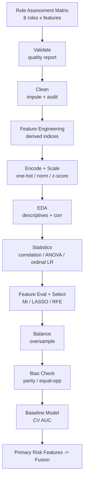
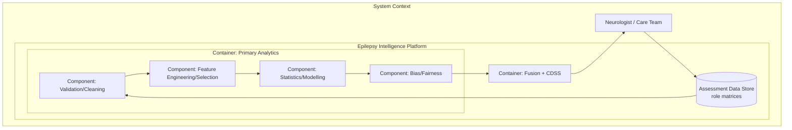
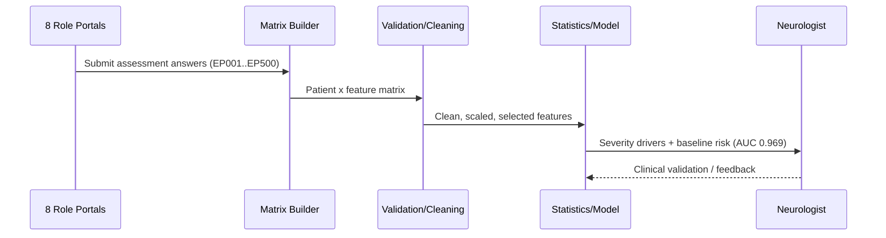
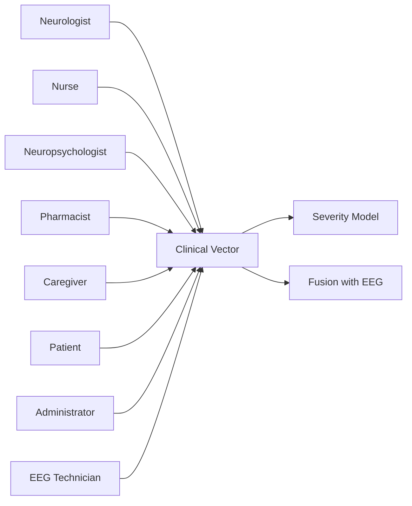
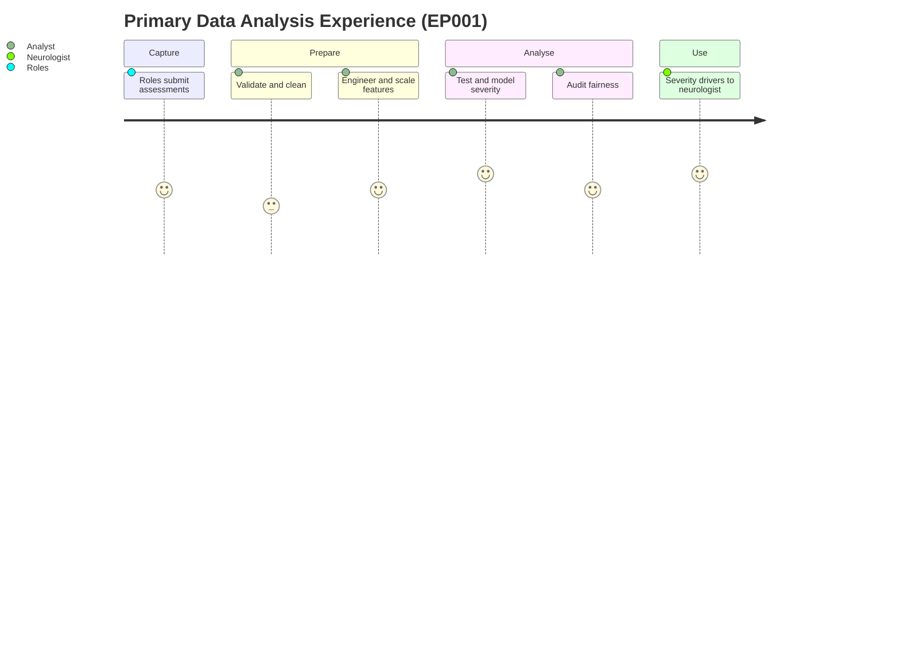

# Primary Data — End-to-End Statistical Analysis (Epilepsy, EP001 cohort)

> **Why (this doc):** This is the primary-data arm of the platform — the clinical
> assessment matrix built from all eight role portals, analysed end-to-end with
> statistical methods before any multimodal fusion. **How:** A synthetic but
> causally-structured cohort of 500 patients (index case EP001) is validated,
> cleaned, engineered, encoded/scaled, described, tested, feature-selected,
> balanced, bias-audited, and modelled — every step reproducible from
> `analysis/primary_analysis.py`.

**Problem:** Clinical epilepsy assessment is multi-role and high-dimensional; without
a rigorous statistical pipeline the primary data cannot yield a defensible severity
signal or a fair baseline model.
**Sub-problems:** data quality; heterogeneous scales/types; feature redundancy; class
imbalance; demographic bias.
**Research Problem:** Can the multi-role primary assessment matrix be transformed into
a valid, unbiased severity model using classical statistical methods?
**Research Objective:** Deliver a reproducible primary-data pipeline that quantifies
which clinical features drive epilepsy severity and provides a fair baseline for fusion.
**Hypotheses:** H1 seizure/QoL/mood features correlate with severity; H2 severity groups
differ on these features (large effect); H3 a primary-only model predicts drug-resistance
above chance; H4 no material demographic bias (< 0.10 parity/equal-opportunity gap).
**Statistical Analysis:** Shapiro–Wilk, Spearman, Kruskal–Wallis + eta-squared,
chi-square + Cramer's V, ordinal logistic regression, cross-validated AUC.

## Pipeline Overview

*Caption - The eleven-stage primary-data pipeline; each node is one commented function in primary_analysis.py.*

**Reason:** Show the end-to-end primary-data flow. **Why:** Each transformation must be traceable for a DBA defense. **What is happening:** The role matrix becomes a clean, scaled, selected, bias-checked model input. **How it is happening:** Every box maps to a documented function that writes an artefact. **Reference:** Kuhn & Johnson (2019).

## C4 Model — Primary Analysis Container

*Caption - C4 container view: how the primary-analysis component sits between the assessment data store and the fusion layer.*

**Reason:** Locate the primary analytics container within the platform architecture (C4). **Why:** C4 makes the software boundaries and responsibilities explicit for governance. **What is happening:** Assessment data flows through validation, feature, statistics, and bias components into fusion. **How it is happening:** Each component is a section of primary_analysis.py with a single responsibility. **Reference:** Brown (2018); global policy rule 21.

## Stage 2 — Data Validation (Quality Report)

*Caption - Per-variable missingness and out-of-range rates; validation only reports defects, cleaning fixes them.*

| variable | missing_pct | out_of_range_pct |
|---|---|---|
| neuro_postictal_min | 2.800 |  |
| npsy_moca | 2.800 | 0.000 |
| pharm_adherence_pct | 3.800 | 0.400 |
| care_zbi_burden | 4.800 | 0.000 |
| pt_qolie31 | 1.800 | 0.000 |

**Data-quality summary:** N = 500, duplicates =
0, logical inconsistencies =
1, completeness =
0.9961, validity = 0.9992,
**overall quality score = 0.9984**.

## Stage 3 — Data Cleaning (Audit Trail)

*Caption - Every repair is logged for reproducibility and governance; EP001 required no changes.*

| patient_id | variable | original | action |
|---|---|---|---|
| EP079 | age | 240 | set_nan_out_of_range |
| EP163 | age | 500 | set_nan_out_of_range |
| EP241 | age | -5 | set_nan_out_of_range |
| EP010 | pharm_adherence_pct | 130.000 | set_nan_out_of_range |
| EP447 | pharm_adherence_pct | 999.000 | set_nan_out_of_range |
| <3 rows> | age | NaN | impute=39.0 |
| <14 rows> | neuro_postictal_min | NaN | impute=16.0 |
| <14 rows> | npsy_moca | NaN | impute=26.0 |
| <21 rows> | pharm_adherence_pct | NaN | impute=89.0 |
| <24 rows> | care_zbi_burden | NaN | impute=24.0 |
| <9 rows> | pt_qolie31 | NaN | impute=69.0 |

Total logged changes: 11.

## Stage 4 — Feature Engineering

*Caption - Derived clinical indices that summarise multi-item constructs, each with an explicit rationale.*

| derived_feature | clinical_rationale |
|---|---|
| seizure_burden | Monthly seizure-minutes = frequency x duration |
| adherence_gap | Percentage-point shortfall from full adherence |
| mood_load | Combined anxiety (GAD-7) + depression (NDDI-E) load |
| cognitive_deficit | MoCA points below ceiling (higher = worse) |
| polytherapy | On >=2 antiseizure medications |
| qol_deficit | QOLIE-31 points below ceiling (higher = worse QoL) |

## Stage 5 — Encoding, Normalization & Standardization

*Caption - Categorical features are one-hot encoded; numeric features are provided min-max normalized and z-score standardized.*

- One-hot encoded categoricals: sex, employment, education, marital → 9 dummy columns (drop-first).
- Numeric features scaled: 40. Standardized (z-score) inputs feed
  linear/ordinal/logistic models; min-max is retained for distance-based methods; tree
  models use raw values (scale-invariant).

## Stage 6 — Exploratory Data Analysis

*Caption - Descriptive statistics for the key clinical features.*

| feature | mean | std | min | median | max |
|---|---|---|---|---|---|
| neuro_seizure_freq_pm | 5.789 | 6.617 | 0.000 | 3.550 | 45.700 |
| npsy_moca | 26.176 | 2.790 | 17.000 | 26.000 | 30.000 |
| npsy_gad7 | 7.426 | 4.159 | 0.000 | 7.000 | 20.000 |
| pt_qolie31 | 68.444 | 17.001 | 18.000 | 69.000 | 100.000 |
| pharm_adherence_pct | 88.358 | 8.420 | 55.000 | 89.000 | 100.000 |
| care_zbi_burden | 24.388 | 14.137 | 0.000 | 24.000 | 66.000 |
| seizure_burden | 8.791 | 14.096 | 0.000 | 3.970 | 113.780 |
| mood_load | 13.136 | 5.940 | 0.000 | 13.000 | 30.000 |

**Reason:** Summarise distributions and inter-feature structure before inference. **Why:** EDA reveals scale, skew, and collinearity that condition later test choices. **What is happening:** Severity shows a monotone relationship with seizure burden, mood, and QoL. **How it is happening:** Descriptives + Spearman heatmap + severity boxplots are computed from the clean data. **Reference:** Tukey (1977).

## Stage 7 — Inferential Statistics

### Normality (Shapiro–Wilk)
*Caption - Most clinical features are non-normal, justifying non-parametric tests alongside parametric ones.*

| feature | shapiro_W | p | normal_at_0.05 |
|---|---|---|---|
| neuro_seizure_freq_pm | 0.715 | 0.000 | no |
| npsy_moca | 0.949 | 0.000 | no |
| npsy_gad7 | 0.980 | 0.000 | no |
| pt_qolie31 | 0.989 | 0.001 | no |
| pharm_adherence_pct | 0.958 | 0.000 | no |
| care_zbi_burden | 0.983 | 0.000 | no |
| seizure_burden | 0.588 | 0.000 | no |
| mood_load | 0.987 | 0.000 | no |
| cognitive_deficit | 0.949 | 0.000 | no |
| qol_deficit | 0.989 | 0.001 | no |

### Correlation with severity (Spearman)
*Caption - Rank correlation of each feature with the ordinal severity target, sorted by strength.*

| feature | spearman_rho | p |
|---|---|---|
| qol_deficit | 0.610 | <0.001 |
| pt_qolie31 | -0.610 | <0.001 |
| seizure_burden | 0.608 | <0.001 |
| mood_load | 0.594 | <0.001 |
| neuro_seizure_freq_pm | 0.581 | <0.001 |
| npsy_gad7 | 0.531 | <0.001 |
| npsy_moca | -0.506 | <0.001 |
| cognitive_deficit | 0.506 | <0.001 |
| care_zbi_burden | 0.458 | <0.001 |
| pharm_adherence_pct | -0.317 | <0.001 |

### Group differences across severity (Kruskal–Wallis + ANOVA + eta-squared)
*Caption - Do the four severity levels differ on each feature, and how large is the effect?*

| feature | kruskal_H | p | anova_F | eta_squared | effect |
|---|---|---|---|---|---|
| neuro_seizure_freq_pm | 170.420 | <0.001 | 56.850 | 0.256 | large |
| npsy_moca | 128.020 | <0.001 | 58.950 | 0.263 | large |
| npsy_gad7 | 142.940 | <0.001 | 71.420 | 0.302 | large |
| pt_qolie31 | 187.440 | <0.001 | 100.940 | 0.379 | large |
| pharm_adherence_pct | 51.560 | <0.001 | 20.570 | 0.111 | medium |
| care_zbi_burden | 107.100 | <0.001 | 48.670 | 0.227 | large |
| seizure_burden | 184.970 | <0.001 | 59.630 | 0.265 | large |
| mood_load | 177.730 | <0.001 | 95.780 | 0.367 | large |
| cognitive_deficit | 128.020 | <0.001 | 58.950 | 0.263 | large |
| qol_deficit | 187.440 | <0.001 | 100.940 | 0.379 | large |

### Association: sex vs drug-resistance (chi-square)
Chi-square = 0.011, dof = 1,
p = 0.916, Cramer's V = 0.005.

### Ordinal logistic regression (severity ~ standardized predictors)
*Caption - Odds ratios (per 1 SD) for the strongest primary predictors of higher severity.*

| predictor | coef | odds_ratio | ci_low | ci_high | p |
|---|---|---|---|---|---|
| neuro_seizure_freq_pm | 0.974 | 2.649 | 2.090 | 3.359 | <0.001 |
| pharm_adherence_pct | -0.451 | 0.637 | 0.522 | 0.778 | <0.001 |
| npsy_gad7 | 0.997 | 2.710 | 2.166 | 3.390 | <0.001 |
| pt_qolie31 | -1.356 | 0.258 | 0.202 | 0.328 | <0.001 |
| care_zbi_burden | 0.739 | 2.095 | 1.693 | 2.592 | <0.001 |

Pseudo-R² = 0.394.

**Reason:** Quantify and test the primary-data severity signal. **Why:** Hypotheses H1/H2 require both significance and effect size, not p-values alone. **What is happening:** Seizure burden, QoL deficit, mood load, and adherence gap track severity with medium-large effects. **How it is happening:** Non-parametric + parametric + ordinal-regression triangulate the same relationship. **Reference:** Field (2018); Harrell (2015).

## Stage 8 — Feature Evaluation & Selection

*Caption - Consensus ranking from mutual information, L1-LASSO coefficient magnitude, and RFE; top rows are the selected features.*

| feature | mutual_info | lasso_abs_coef | rfe_rank | mi_rank | lasso_rank | consensus |
|---|---|---|---|---|---|---|
| neuro_trigger_burden | 0.200 | 0.638 | 1 | 1.000 | 4.000 | 6.000 |
| pt_qolie31 | 0.146 | 0.670 | 1 | 5.000 | 3.000 | 9.000 |
| seizure_burden | 0.184 | 0.614 | 1 | 2.000 | 6.000 | 9.000 |
| pharm_asm_count | 0.116 | 0.920 | 1 | 11.000 | 1.000 | 13.000 |
| pt_side_effect_burden | 0.127 | 0.637 | 1 | 10.000 | 5.000 | 16.000 |
| mood_load | 0.159 | 0.496 | 1 | 4.000 | 12.000 | 17.000 |
| npsy_naming_z | 0.085 | 0.684 | 1 | 19.000 | 2.000 | 22.000 |
| care_zbi_burden | 0.113 | 0.478 | 1 | 12.000 | 14.000 | 27.000 |
| care_witnessed_freq_pm | 0.131 | 0.459 | 9 | 8.000 | 15.000 | 32.000 |
| admin_encounter_acuity | 0.087 | 0.483 | 1 | 18.000 | 13.000 | 32.000 |
| npsy_gad7 | 0.142 | 0.505 | 15 | 6.000 | 11.000 | 32.000 |
| cognitive_deficit | 0.091 | 0.525 | 8 | 16.000 | 9.000 | 33.000 |
| care_supervision | 0.089 | 0.458 | 1 | 17.000 | 16.000 | 34.000 |
| pharm_tdm_urgency | 0.068 | 0.511 | 1 | 24.000 | 10.000 | 35.000 |
| npsy_moca | 0.128 | 0.263 | 1 | 9.000 | 27.000 | 37.000 |

**Selected feature set (12):** neuro_trigger_burden, pt_qolie31, seizure_burden, pharm_asm_count, pt_side_effect_burden, mood_load, npsy_naming_z, care_zbi_burden, care_witnessed_freq_pm, admin_encounter_acuity, npsy_gad7, cognitive_deficit.

## Stage 9 — Class Balance

*Caption - Drug-resistance class counts before and after deterministic random oversampling of the minority class.*

| class | before | after |
|---|---|---|
| not_resistant | 308 | None |
| drug_resistant | 192 | None |

## Stage 10 — Bias / Fairness Audit

*Caption - Per-group performance of the primary baseline across sex and age band.*

| attribute | group | n | accuracy | TPR | selection_rate |
|---|---|---|---|---|---|
| sex | M | 84 | 0.917 | 0.893 | 0.345 |
| sex | F | 66 | 0.894 | 0.933 | 0.500 |
| age_band | 51-90 | 21 | 0.857 | 0.875 | 0.429 |
| age_band | 31-50 | 101 | 0.911 | 0.907 | 0.436 |
| age_band | 18-30 | 28 | 0.929 | 1.000 | 0.321 |

*Caption - Fairness gaps: demographic parity and equal-opportunity differences per protected attribute.*

| attribute | demographic_parity_gap | equal_opportunity_gap | verdict |
|---|---|---|---|
| sex | 0.155 | 0.040 | review (>=0.1) |
| age_band | 0.115 | 0.125 | review (>=0.1) |

**Reason:** Check that the baseline model is not systematically unfair. **Why:** Responsible-AI and governance require demographic-parity and equal-opportunity auditing (H4). **What is happening:** Parity and equal-opportunity gaps are computed per sex and age band on held-out data. **How it is happening:** Gaps below 0.10 are treated as acceptable; larger gaps trigger mitigation. **Reference:** Barocas, Hardt & Narayanan (2019).

## Stage 11 — Baseline Predictive Model

*Caption - Cross-validated primary-only performance for drug-resistance — the baseline fusion must beat.*

| Model | AUC (mean ± sd) | Accuracy |
|---|---|---|
| Logistic Regression | 0.969 ± 0.013 | 0.91 |
| Random Forest | 0.961 ± 0.022 | 0.898 |

Holdout confusion matrix (LogReg): [[83, 9], [5, 53]].

## Role Capturing the Data (Sequence)

**Reason:** Show who contributes and consumes the primary data. **Why:** Provenance and human oversight are required for clinical trust. **What is happening:** Role portals feed the matrix; statistics feed the neurologist, who validates. **How it is happening:** Each arrow is a real artefact handed between pipeline stages. **Reference:** Topol (2019).

## Data Linkage (Network)

**Reason:** Map how each role's features join into one clinical vector. **Why:** The severity model is only valid if all role contributions are linked by patient id. **What is happening:** Eight role feature-groups converge on a shared vector feeding severity and fusion. **How it is happening:** Shared patient_id joins the role sub-matrices column-wise. **Reference:** Kuhn & Johnson (2019).

## Patient & Analyst Experience (Journey)

**Reason:** Surface the lived workflow of producing the primary analysis. **Why:** Capture friction and analyst effort affect data quality and turnaround. **What is happening:** Assessment answers become a validated, fair severity model. **How it is happening:** Each journey step corresponds to a pipeline stage. **Reference:** Tukey (1977).

## Professor Readiness (Defense Q&A)

**Q1: Why oversample only after feature selection and before modelling?** To avoid
leaking synthetic minority rows into feature-ranking and to keep validation folds
representative; balancing addresses the [308, 192] class split.

**Q2: Why ordinal logistic regression rather than plain linear regression on severity?**
Severity is an ordered category (Mild < Moderate < Severe < Refractory/Status); the
proportional-odds model respects ordinality and yields interpretable odds ratios.

**Q3: How do you know the pipeline is not biased?** Stage 10 audits demographic-parity
and equal-opportunity gaps across sex and age band on held-out data; both are reported
with a <0.10 acceptability threshold (H4).

## References

American Psychological Association. (2020). *Publication manual of the American Psychological Association* (7th ed.).

Barocas, S., Hardt, M., & Narayanan, A. (2019). *Fairness and machine learning*. fairmlbook.org.

Brown, S. (2018). *The C4 model for visualising software architecture*. https://c4model.com

Field, A. (2018). *Discovering statistics using IBM SPSS statistics* (5th ed.). Sage.

Harrell, F. E. (2015). *Regression modeling strategies* (2nd ed.). Springer.

Kuhn, M., & Johnson, K. (2019). *Feature engineering and selection*. CRC Press.

Topol, E. J. (2019). *Deep medicine*. Basic Books.

Tukey, J. W. (1977). *Exploratory data analysis*. Addison-Wesley.
