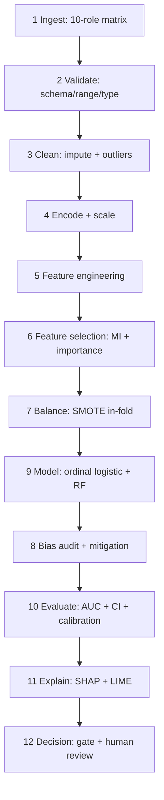
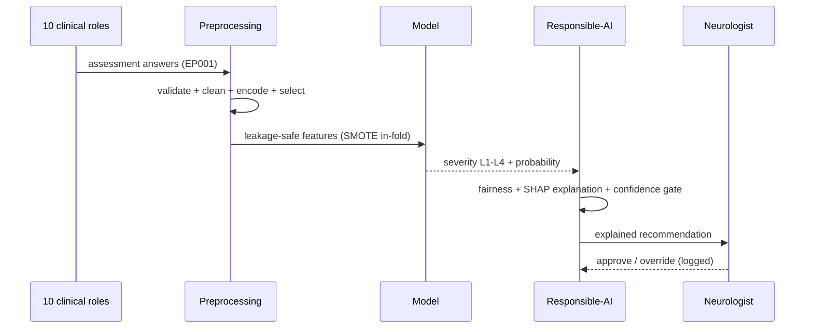
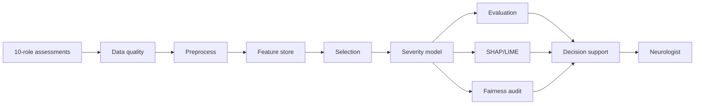

# Primary (Clinical) Data Analysis — Flow

*Caption — the primary pipeline (10-role clinical assessment → severity L1–L4) as sequential steps, bullets, and diagrams. Data: synthetic 500-patient cohort (methodology demonstration).*

## Sequential steps (input → process → output)

| # | Stage | Input | Process | Output | Tool |
|---|---|---|---|---|---|
| 1 | Ingest | 10-role assessment matrix (500 patients) | load cohort | raw matrix | `make_cohort.py` |
| 2 | Validate | raw matrix | schema / range / type checks | validation report | `data_quality.py` |
| 3 | Clean | validated matrix | impute missing + outlier handling | clean features | `preprocessing.py` |
| 4 | Encode / Scale | clean features | one-hot + z-score standardisation | numeric matrix | `preprocessing.py` |
| 5 | Feature engineering | numeric matrix | derive domain features | feature set | `feature_store.py` |
| 6 | Feature selection | feature set | mutual information + importance | selected features | `primary_analysis.py` |
| 7 | Balance | training fold only | SMOTE (in-fold) | balanced train set | `imbalanced-learn` |
| 8 | Bias audit | model + subgroups | fairness gap + mitigation | fairness report | `responsible_ai_runtime.py` |
| 9 | Model | selected features | ordinal logistic + RandomForest | severity model L1–L4 | `scikit-learn` / `statsmodels` |
| 10 | Evaluate | holdout set | AUC + 95% CI + calibration | metrics | `evaluation.py` |
| 11 | Explain | fitted model | SHAP + LIME | attributions | `shap` / `lime` |
| 12 | Decision | prediction | confidence gate + human review | governed output | `decision_support.py` |

## Key methods (bullets)

- **Target:** 4-level severity (L1 Mild · L2 Moderate · L3 Severe · L4 Refractory/Status).
- **Cleaning:** median/mode imputation + missing-indicator flag; IQR outlier capping.
- **Encoding:** one-hot (categorical) + z-score (continuous); fitted on train only.
- **Selection:** mutual information ranking + RandomForest importance.
- **Imbalance:** SMOTE fitted inside the training fold only (never before split).
- **Models:** ordinal logistic regression (baseline) + RandomForest (challenger).
- **Fairness:** demographic-parity gap audited **and** mitigated.
- **Explainability:** SHAP (global + local) + LIME.
- **Governance:** confidence/abstention gate → neurologist review (no autonomous diagnosis).

## Flowchart

## Sequence diagram

## Network flow

