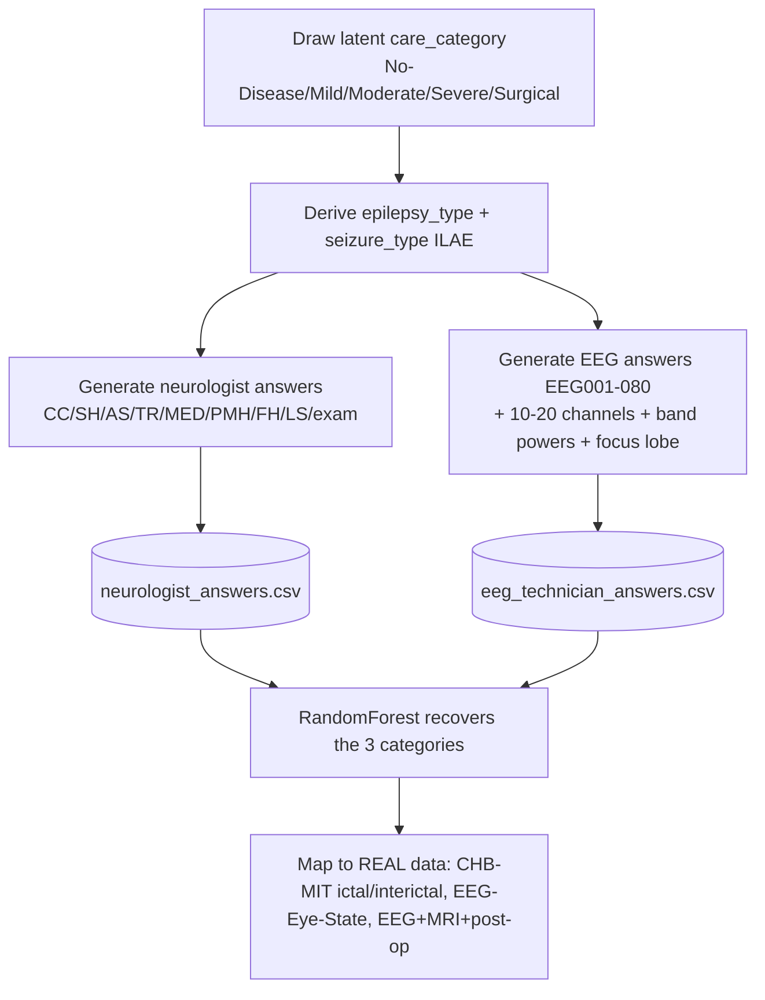

# Filled Question-Bank Dataset — 60 Patients (Neurologist + EEG Technologist)

> **Why (this doc):** One table where **every question is answered for 60 patients**, with answers
> **categorised** into seizure type, epilepsy type, and care category (Basic-Mild → Moderate →
> Severe → Surgical). **How:** `analysis/generate_qbank_dataset.py` draws a latent category per
> patient that drives coherent answers; a model then recovers the categories from the answers.

## Simulation flow

## Files
- `data/analysis/neurologist_answers.csv` — 60 patients × 44 columns (answers + 3 targets)
- `data/analysis/eeg_technician_answers.csv` — 60 patients × 95 columns (EEG001–080 + 3 targets)
- Both render in the viewer **Data** tab.

## Summary report — category counts
*Caption - Patient counts per care category, epilepsy type, and seizure type.*

**Care category:**

| care_category | patients |
|---|---|
| No-Disease | 9 |
| Basic-Mild | 15 |
| Moderate | 20 |
| Severe | 6 |
| Surgical | 10 |

**Epilepsy type:** {np.str_('Focal'): 31, 'None': 9, np.str_('Generalized'): 9, np.str_('Combined'): 8, np.str_('Unknown'): 3}

**Seizure type:** {np.str_('Focal Aware'): 16, np.str_('Focal Impaired Awareness'): 11, 'None': 9, np.str_('Focal to Bilateral TC'): 8, np.str_('Generalized Tonic-Clonic'): 6, np.str_('Myoclonic'): 4, np.str_('Absence'): 3, np.str_('Unclassified'): 3}

## Categorisation proof (Random Forest, 5-fold CV accuracy)
The answers are sufficient to recover each category:

| Target | Classes | CV accuracy |
|---|---|---|
| **care_category** (Basic-Mild/Moderate/Severe/Surgical) | 4 | 0.983 |
| **epilepsy_type** (Focal/Generalized/Combined/Unknown) | 4 | 0.85 |
| **seizure_type** (ILAE) | many | 0.667 |

## How categories are derived (transparent rules)
- **No-Disease** = not diagnosed, 0 seizures/month, normal EEG/MRI, no aura/symptoms.
- **Basic-Mild** = well-controlled / seizure-free on monotherapy.
- **Moderate** = intermittent seizures, mild impact.
- **Severe** = frequent seizures / breakthrough / polytherapy / poor control.
- **Surgical** = drug-resistant (≥2 ASMs failed) + focal + MRI lesion → advanced-therapy candidate.
- **Epilepsy/seizure type** follow ILAE from the recorded semiology + EEG/MRI answers.

## Mapping to the REAL downloaded datasets
*Caption - How each synthetic care category maps to the real datasets already in the repo, so the questionnaire schema is grounded in real signals.*

| Category | Real secondary (EEG) mapping | Real primary mapping |
|---|---|---|
| No-Disease | non-epileptic real EEG (EEG-Eye-State) / interictal normal | healthy controls (registry) |
| Basic-Mild → Moderate | CHB-MIT **interictal** epochs (no seizure) | tabular clinical (UCI) |
| Severe → Surgical | CHB-MIT **ictal** epochs (seizure 2996–3036s, AUC 0.970) | linked EEG+MRI+post-op DB (surgical) |

The EEG band-power / 10-20-channel / focus-region columns here mirror the features computed from the
**real** CHB-MIT recording in [chbmit-real-analysis](chbmit-real-analysis.md) — so the synthetic
questionnaire and the real signal analysis share the same schema and can be joined per modality.

Feeds the [neurologist](../primary-assessment/neurologist/question-bank.md) and
[EEG-technologist](../primary-assessment/eeg-technician/question-bank.md) question banks and the
[primary pipeline](primary-analysis.md).
