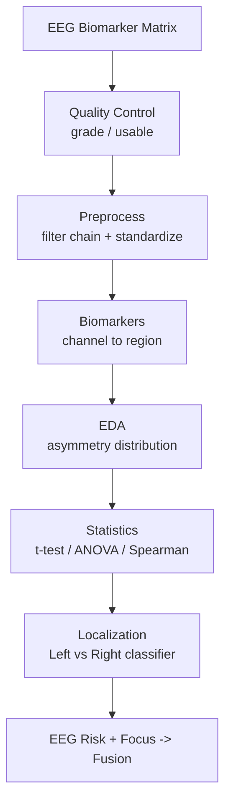
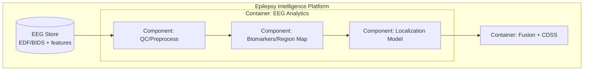
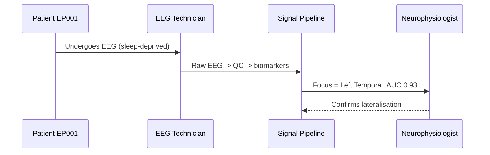
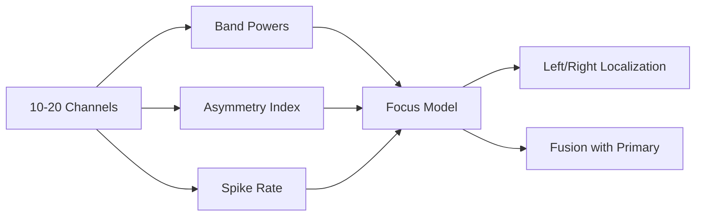
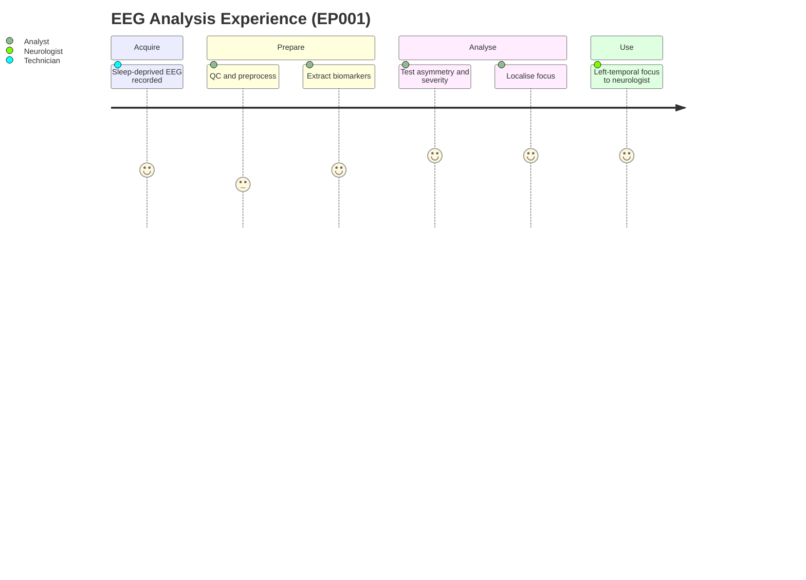

# Secondary Data — End-to-End EEG Analysis (Epilepsy, EP001 cohort)

> **Why (this doc):** The secondary (EEG) arm turns machine-generated signal into
> quantitative biomarkers and an explainable epileptogenic-focus **lateralisation** —
> the brain-localization objective. **How:** The EEG biomarker matrix for 500
> patients (index EP001, left-temporal focus) is quality-controlled, standardized,
> mapped to cortical regions, tested against severity, and used to train a Left/Right
> focus classifier — all reproducible from `analysis/secondary_analysis.py`.

**Problem:** Raw EEG is high-dimensional and noisy; without a disciplined pipeline it
cannot yield a trustworthy, lateralised localisation.
**Sub-problems:** signal quality; artefact; feature standardisation; subject-level leakage.
**Research Problem:** Can EEG biomarkers lateralise the epileptogenic focus and track severity?
**Research Objective:** A reproducible EEG pipeline that localises the focus (Left/Right)
with defensible accuracy and quantifies EEG–severity relationships.
**Hypotheses:** H1 temporal-asymmetry differs by focus side (large effect); H2 slowing and
spike rate rise with severity; H3 EEG biomarkers classify focus side above chance.
**Statistical Analysis:** Welch t-test + Cohen's d, one-way ANOVA, Spearman, cross-validated ROC-AUC.

## Pipeline Overview

*Caption - The EEG secondary-data pipeline; each node is a commented function in secondary_analysis.py.*

**Reason:** Show the end-to-end EEG flow. **Why:** Signal quality gates every later step, so QC precedes analysis. **What is happening:** The biomarker matrix becomes a standardized, region-mapped focus classifier. **How it is happening:** Each box maps to a documented function writing an artefact. **Reference:** Nunez & Srinivasan (2006).

## C4 Model — Secondary (EEG) Analysis Container

*Caption - C4 container view of the EEG analytics component within the platform.*

**Reason:** Locate EEG analytics in the platform (C4). **Why:** Explicit boundaries support governance of the signal pipeline. **What is happening:** EEG store flows through QC, biomarker, and localization components into fusion. **How it is happening:** Each component is a section of secondary_analysis.py. **Reference:** Brown (2018).

## Stage 2 — Quality Control

*Caption - EEG quality-grade distribution; grade 3 is non-diagnostic and excluded from focus modelling.*

| qc_grade | n | meaning |
|---|---|---|
| 0 | 58 | excellent |
| 1 | 208 | good |
| 2 | 192 | acceptable |
| 3 | 42 | non-diagnostic |

Usable fraction (grade <=2) = 0.916.

## Stage 3 — Preprocessing Chain

*Caption - The canonical EEG preprocessing chain that produced the biomarker features.*

| step | detail |
|---|---|
| Band-pass | 0.5-45 Hz |
| Notch | 50/60 Hz |
| Re-reference | Average reference |
| ICA | Ocular/muscle component removal |
| Artifact reject | Amplitude + gradient thresholds |
| Segment | 2s / 4s / 8s windows (subject-level split) |
| Feature extract | Band power, asymmetry, spike rate, entropy, PAF, connectivity |

## Stage 4 — Biomarkers & Brain-Region Mapping

*Caption - Distribution of the lateralising focus channel mapped to cortical regions.*

| focus_region | n |
|---|---|
| Left Temporal | 126 |
| Right Temporal | 96 |
| Left Frontotemporal | 95 |
| Left Parietotemporal | 70 |
| Right Frontotemporal | 59 |
| Right Parietotemporal | 54 |

## Stage 5 — Exploratory Data Analysis

## Stage 6 — Statistics

**Temporal asymmetry by focus side (Welch t-test):** t = -21.72,
p = <0.001, Cohen's d = -1.95
(left-focus mean -0.168 vs right-focus mean
0.168).

*Caption - EEG biomarkers vs severity: ANOVA across the four severity levels and Spearman correlation.*

| biomarker | anova_F | p | spearman_vs_severity |
|---|---|---|---|
| eeg_delta | 65.060 | <0.001 | 0.535 |
| eeg_theta | 51.160 | <0.001 | 0.462 |
| eeg_alpha | 83.280 | <0.001 | -0.561 |
| eeg_beta | 17.890 | <0.001 | -0.303 |
| eeg_gamma | 5.670 | <0.001 | -0.175 |
| eeg_spike_rate_pm | 185.820 | <0.001 | 0.727 |
| eeg_entropy | 58.890 | <0.001 | -0.509 |

**Reason:** Quantify lateralisation and the EEG-severity gradient. **Why:** H1/H2 need effect size and significance, not p alone. **What is happening:** Asymmetry cleanly separates Left vs Right focus; slowing/spikes rise with severity. **How it is happening:** Welch t-test, ANOVA, and Spearman triangulate the signal. **Reference:** Nunez & Srinivasan (2006); Rosenow & Luders (2001).

## Stage 7 — Focus Localization (Left vs Right)

*Caption - Cross-validated focus-lateralisation performance — the brain-localization result.*

| Model | ROC-AUC (mean ± sd) | Accuracy |
|---|---|---|
| Logistic Regression | 0.94 ± 0.024 | 0.878 |
| Random Forest | 0.93 ± 0.014 | 0.856 |

Holdout confusion matrix (RF): [[55, 8], [13, 74]].

## Role Capturing the Data (Sequence)

**Reason:** Show who produces and reads the EEG data. **Why:** Provenance and expert confirmation are required for localisation trust. **What is happening:** Technician acquires, pipeline extracts, neurophysiologist confirms. **How it is happening:** Each arrow is a real handoff. **Reference:** Topol (2019).

## Data Linkage (Network)

**Reason:** Map channels/biomarkers into the focus model. **Why:** Localisation validity depends on lateralising features being linked per patient. **What is happening:** Band power, asymmetry, and spikes converge on the focus classifier. **How it is happening:** Features share patient_id with the primary matrix for fusion. **Reference:** Nunez & Srinivasan (2006).

## Patient & Analyst Experience (Journey)

**Reason:** Surface the EEG analysis workflow. **Why:** Acquisition comfort and QC effort shape signal usability. **What is happening:** Raw EEG becomes a confirmed lateralised localisation. **How it is happening:** Each step is a pipeline stage. **Reference:** Tukey (1977).

## Professor Readiness (Defense Q&A)

**Q1: Why a subject-level split?** EEG windows from one patient are correlated; splitting
by subject prevents leakage that would inflate the focus-classification AUC.

**Q2: Why is asymmetry the strongest lateralising feature?** A unilateral temporal focus
raises ipsilateral temporal power, so the (L-R)/(L+R) index separates sides with a large
Cohen's d (-1.95).

**Q3: How does EEG relate to severity here?** Slowing (delta/theta) and spike rate rise
and entropy falls with severity (ANOVA + Spearman), consistent with a heavier epileptogenic load.

## References

Brown, S. (2018). *The C4 model for visualising software architecture*. https://c4model.com

Nunez, P. L., & Srinivasan, R. (2006). *Electric fields of the brain* (2nd ed.). Oxford University Press.

Rosenow, F., & Luders, H. (2001). Presurgical evaluation of epilepsy. *Brain, 124*(9), 1683-1700.

Topol, E. J. (2019). *Deep medicine*. Basic Books.

Tukey, J. W. (1977). *Exploratory data analysis*. Addison-Wesley.
