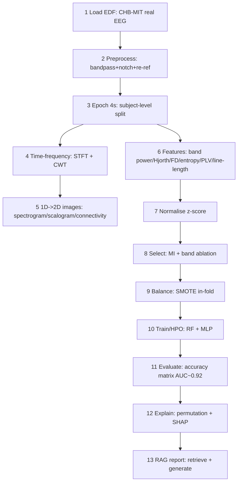
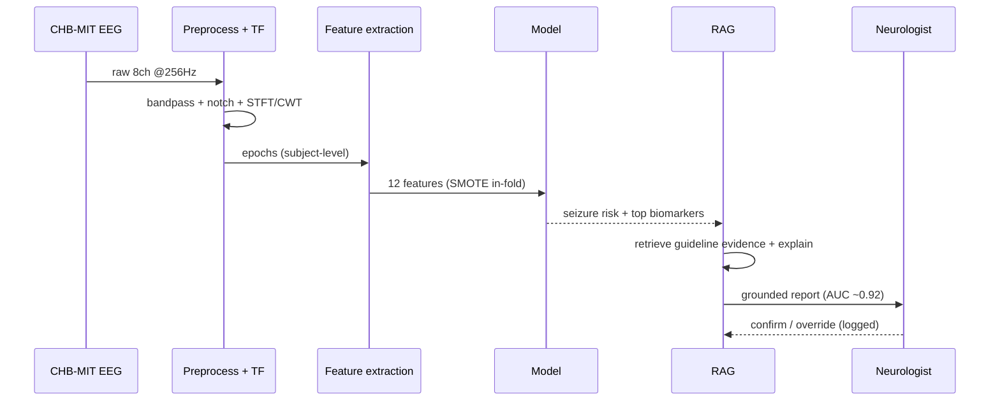
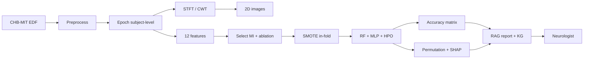

# Secondary (EEG) Data Analysis — Flow

*Caption — the secondary pipeline (real CHB-MIT scalp EEG → seizure detection) as sequential steps, bullets, and diagrams. Real result: cross-validated ROC-AUC ≈ 0.92; external validation ≈ 0.979.*

## Sequential steps (input → process → output)

| # | Stage | Input | Process | Output | Tool |
|---|---|---|---|---|---|
| 1 | Load | CHB-MIT `chb01_03.edf` | read EDF (real EEG) | 8 ch @ 256 Hz | `MNE` |
| 2 | Preprocess | raw µV | band-pass 0.5–45 Hz + 50 Hz notch + re-reference | clean signal | `scipy.signal` |
| 3 | Epoch | clean signal | 4 s windows, **subject-level split** | labelled epochs | `numpy` |
| 4 | Time-frequency | epoch | STFT spectrogram + CWT scalogram | TF maps | `scipy` |
| 5 | 1D→2D images | TF maps | spectrogram / scalogram / connectivity / power-band heatmap | images | `matplotlib` |
| 6 | Features | epoch | band power, Hjorth, Higuchi FD, entropy, PLV, line-length | 12 features | custom |
| 7 | Normalise | features | z-score standardisation | scaled features | `scikit-learn` |
| 8 | Select | scaled features | mutual information + leave-one-band-out ablation | ranked features | `scikit-learn` |
| 9 | Balance | training fold | SMOTE (in-fold) | balanced train | `imbalanced-learn` |
| 10 | Train / HPO | balanced train | RandomForest + MLP, GridSearchCV | tuned models | `scikit-learn` |
| 11 | Evaluate | holdout | accuracy matrix (AUC/AP/log-loss) | metrics (**AUC ≈ 0.92**) | `scikit-learn` |
| 12 | Explain | best model | permutation + SHAP | top: line-length / gamma / PLV | `shap` |
| 13 | RAG report | prediction + KG | retrieve evidence + generate | clinician report | `vector_db_pipeline.py` |

## Key methods (bullets)

- **Data:** real pediatric scalp EEG (PhysioNet CHB-MIT); external validation on EEG-Eye-State.
- **Preprocess:** Butterworth band-pass + IIR notch + common-average reference.
- **Leakage control:** subject-level splits (no epoch from a subject in both train and test).
- **Time-frequency:** STFT (Fourier) + CWT (ricker/Mexican-hat wavelet).
- **1D→2D:** spectrogram, scalogram, channel-connectivity matrix, power-band heatmap.
- **Features:** spectral band power (δ/θ/α/β/γ), Hjorth (activity/mobility/complexity), Higuchi fractal dimension, spectral entropy, phase-locking value, line-length.
- **Significance:** Mann-Whitney U + rank-biserial effect (line-length, power, max-amplitude p < 0.001).
- **Imbalance:** SMOTE in-fold only.
- **Models:** RandomForest + MLP (lightweight stand-in for EEGNet/CNN), GridSearchCV-tuned.
- **Explainability:** permutation importance + SHAP → line-length, gamma power, PLV.

## Flowchart

## Sequence diagram

## Network flow

