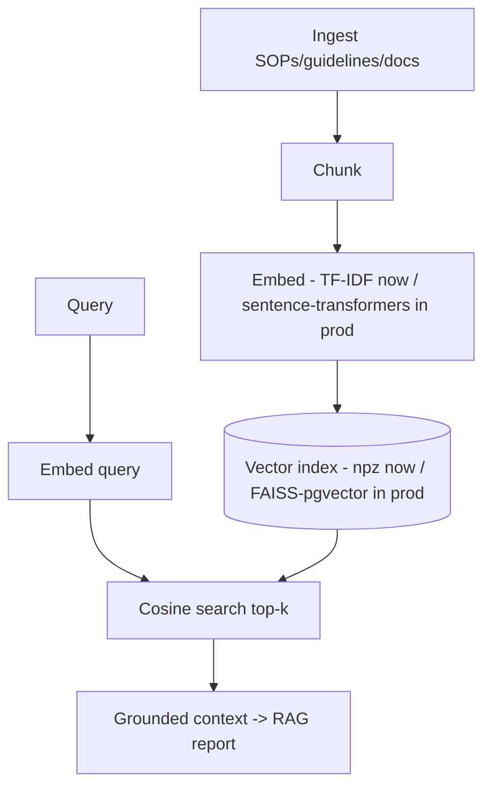
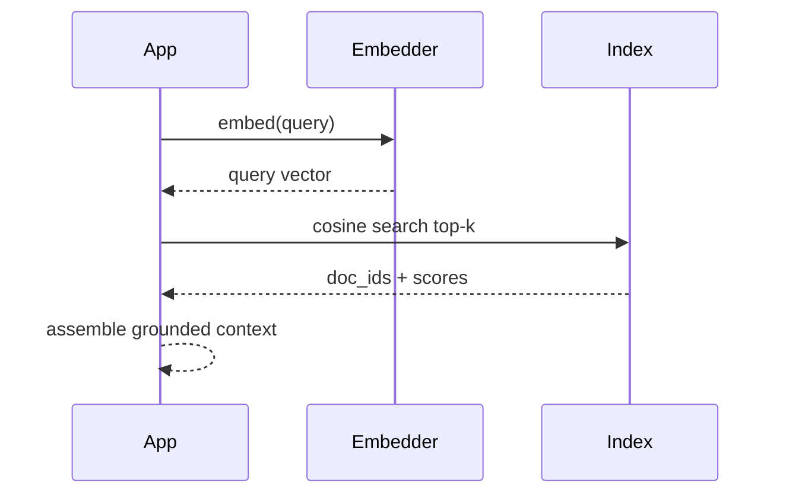

# Vector DB Pipeline for RAG (epilepsy knowledge → vectors)

> **Why (this doc):** The RAG layer needs a **vector database**: knowledge (SOPs, guidelines, project
> docs) is chunked, embedded, indexed, and retrieved by semantic similarity. This is a runnable,
> dependency-light implementation (**TF-IDF + cosine**, a local stand-in for sentence-transformers +
> FAISS/pgvector) plus the **scheduled jobs** that keep the index fresh. **How:** `analysis/vector_db_pipeline.py`.

## Pipeline
`ingest → chunk → embed → index → retrieve` — 14 chunks, 547-dim TF-IDF vectors, cosine search.

## Flowchart

## Sequence — retrieval

## Indexed corpus
*Caption - Every chunk in the vector DB, its source type, and a preview.*

| doc_id | source | chunk_preview | n_chars |
|---|---|---|---|
| sop-preprocess | SOP | Scalp EEG preprocessing: band-pass 0.5-45 Hz, 50/60 Hz notch, re-reference to common avera… | 151 |
| guide-ictal | Guideline | Seizures appear on EEG as rhythmic, evolving discharges with increasing amplitude and line… | 145 |
| guide-linelength | Evidence | Line-length is an efficient, robust feature for seizure onset detection and rises sharply … | 136 |
| sop-split | SOP | Use subject-level train/test splits for EEG classification; epoch-level splits leak inform… | 146 |
| guide-status | Guideline | Status epilepticus is a continuous or recurrent seizure lasting >5 minutes; it is an emerg… | 144 |
| gov-hitl | Governance | Clinical AI for epilepsy must keep a neurophysiologist in the loop; the model provides dec… | 138 |
| guide-classification | Guideline | ILAE 2017 classifies seizures by onset: focal, generalized, or unknown, then by awareness … | 140 |
| sop-security | Governance | PHI is encrypted at rest (AES-256) and in transit (TLS); EEG is de-identified before analy… | 146 |
| chbmit-real-analysis | Doc |     Why (this doc):   Genuine epilepsy EEG (not synthetic, not eye-state): CHB-MIT chb01_0… | 353 |
| data-quality-report | Doc |     Why (this doc):   The per-column and per-dataset data-quality metadata the checklist r… | 385 |
| eda-report | Doc |     Why (this doc):   EDA of every generated dataset — shape, missingness, distributions, … | 259 |
| eeg-signal-pipeline | Doc |     Why (this doc):   The secondary-data critique was that EEG features were hand-assigned… | 400 |
| evaluation-rigor | Doc |     Why (this doc):   Point estimates are not enough for a defensible model; this adds cli… | 239 |
| fusion-analysis | Doc |     Why (this doc):   The dissertation's payoff is fusion — combining the primary
  clinic… | 400 |

## Retrieval grounding checks (real cosine scores)
*Caption - Sample queries and the top documents the vector DB returns — evidence retrieval works.*

| query | top_doc | score | 2nd_doc | 2nd_score |
|---|---|---|---|---|
| how to preprocess EEG before seizure detection | guide-linelength | 0.199 | guide-status | 0.137 |
| why use subject-level splits | sop-split | 0.586 | sop-preprocess | 0.000 |
| is line length useful for seizures | guide-ictal | 0.336 | guide-linelength | 0.243 |
| how is patient data secured | fusion-analysis | 0.184 | data-quality-report | 0.143 |

## Scheduled jobs (list of jobs)
*Caption - The cron-scheduled jobs that keep the vector DB fresh, evaluated, and consent-compliant.*

| job_id | name | schedule_cron | trigger | last_status | records |
|---|---|---|---|---|---|
| vdb-ingest | Ingest new SOPs/guidelines/docs | 0 2 * * * | daily 02:00 | success | 14 |
| vdb-embed | Re-embed changed chunks | 15 2 * * * | after ingest | success | 14 |
| vdb-index | Rebuild vector index | 30 2 * * * | after embed | success | 547 |
| vdb-eval | Retrieval grounding eval | 45 2 * * * | after index | success | 4 |
| vdb-drift | Embedding/topic drift check | 0 3 * * 1 | weekly Mon 03:00 | watch | 14 |
| vdb-purge | Purge revoked-consent chunks | 0 4 * * * | daily 04:00 | success | 0 |

**Reason:** Turn knowledge into a searchable vector DB for RAG. **Why:** Grounded generation needs semantic retrieval over an indexed corpus. **What is happening:** Chunks are embedded and indexed; queries retrieve the nearest evidence by cosine. **How it is happening:** TF-IDF + cosine now (portable); swap to sentence-transformers + FAISS/pgvector in production. **Reference:** Lewis et al. (2020, RAG); Johnson et al. (2019, FAISS).

## Honest scope
Embeddings are **TF-IDF** (lexical) — a portable stand-in. Semantic quality improves with a neural
embedder + approximate-nearest-neighbour index; the pipeline interface (`build`, `search`) is unchanged.

## References

Johnson, J., Douze, M., & Jégou, H. (2019). Billion-scale similarity search with GPUs. *IEEE Transactions on Big Data*.

Lewis, P., et al. (2020). Retrieval-augmented generation for knowledge-intensive NLP tasks. *NeurIPS 33*.
