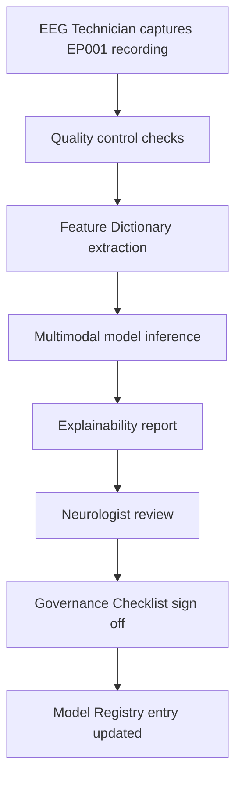
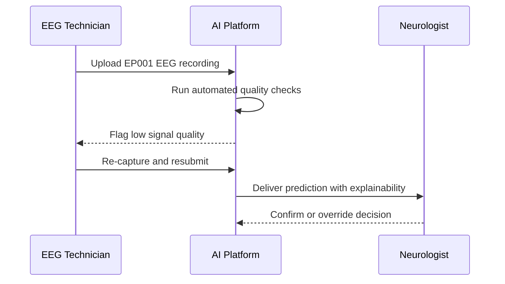
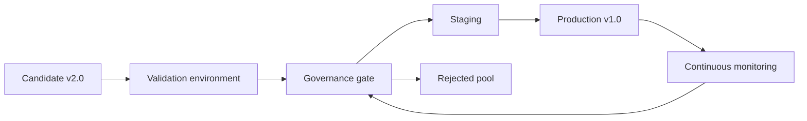
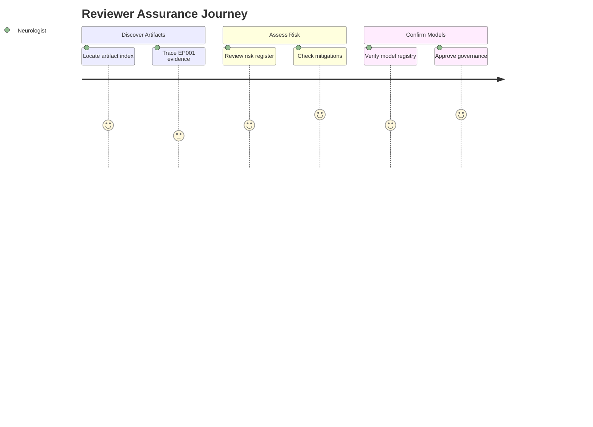

# Appendix

> **Why (this doc):** This appendix consolidates the supporting evidence base for the Enterprise AI Platform for Explainable Multimodal Epilepsy Intelligence, so that examiners, clinical governance reviewers, and future maintainers can trace every claim in the main dissertation back to a concrete artifact (instruments, risk controls, and versioned models).
> **How:** It catalogs the required supporting artifacts, then presents two governance-grade registers, the Enterprise Risk Register and the Model Registry, alongside process diagrams, defense-ready Q&A, and cited references. Roles referenced throughout are the Neurologist and the EEG Technician, and the canonical test patient is EP001.

**Problem:** A clinical epilepsy AI platform is only defensible if its supporting artifacts, risks, and model provenance are documented in one auditable place; scattered evidence undermines both regulatory review and academic defense.

**Research Objective:** Provide a single, self-contained appendix that (a) enumerates supporting instruments and specifications, (b) records enterprise risks with mitigations, and (c) tracks model versions and validation status, enabling reproducibility and explainability audits.

## Supporting Artifacts Index

> **Why:** Reviewers need a manifest of every backing artifact so the dissertation's methodology can be independently verified. **How:** Each item below points to a deliverable produced during the project and stored in the evidence repository.

Include the following supporting artifacts:

- Questionnaire
- Survey instruments
- AI Prompts
- API specifications
- Database schema
- Architecture diagrams
- ER Diagram
- Workflow diagrams
- Code
- Feature Dictionary
- Model Cards
- RAG Evaluation results
- Security Checklist
- Governance Checklist

### Artifact Traceability Flow

> **Why:** Shows how a single instrument (an EEG capture for EP001) propagates through the artifact chain to a governed prediction. **How:** A top-down flowchart links data capture, feature extraction, model inference, and governance sign-off.

## Enterprise Risk Register (excerpt)

> **Why:** A defensible clinical platform must enumerate its failure modes and the controls that contain them. **How:** Each row pairs a concrete risk with its clinical or operational impact and the mitigation embedded in the platform.

*Caption - The Enterprise Risk Register documents the principal clinical, model, and security risks for the epilepsy platform. It is present to demonstrate that hazards affecting patients such as EP001 are anticipated and actively mitigated.*

| Risk | Impact | Mitigation |
|---|---|---|
| Poor EEG quality | Incorrect prediction | Technician QC + automated quality checks |
| Model drift | Reduced performance | Continuous monitoring + retraining |
| Data drift | Generalization failure | Drift detection pipeline |
| False positives | Unnecessary investigations | Human review |
| False negatives | Missed abnormalities | High-sensitivity threshold + oversight |
| Cybersecurity incident | Data exposure | Encryption, RBAC, monitoring |

### Risk Escalation Sequence

> **Why:** Clarifies who acts when a risk materializes during a live EP001 assessment. **How:** A sequence diagram traces a low-quality EEG event from detection to resolution across roles.

## Model Registry (excerpt)

> **Why:** Regulators and examiners require provenance for every deployed model, including what data validated it and its lifecycle status. **How:** Each row records a semantic version, its validation dataset, headline accuracy, and deployment state.

*Caption - The Model Registry excerpt tracks versioned epilepsy models, their validation datasets, and lifecycle status. It is present to evidence controlled promotion of models from candidate to production.*

| Version | Validation Dataset | Accuracy | Status |
|---|---|---|---|
| v1.0 | Temple EEG | 96% | Production |
| v1.1 | Temple + Siena | 97% | Validation |
| v2.0 | Multimodal | 98% | Candidate |

### Model Promotion Network

> **Why:** Illustrates the environments a model version traverses before reaching production for patients like EP001. **How:** A left-to-right graph maps the promotion path across registry stages and gating controls.

### Reviewer Assurance Journey

> **Why:** Captures how an examiner experiences confidence while auditing the appendix artifacts. **How:** A journey diagram scores each audit step from artifact lookup to final sign-off.

## Professor Readiness (Defense Q&A)

> **Why:** Anticipates examiner scrutiny so the candidate can defend the appendix's governance choices. **How:** Each question below is paired with a concise, evidence-anchored answer.

### How do you prevent an underperforming model from reaching patients like EP001?

Promotion is gated. A version stays in Validation status until it clears the governance gate against an independent dataset; only then can it move to Production. The Model Registry records this lifecycle, and continuous monitoring can demote a production model if drift is detected.

### The registry shows 98% accuracy for v2.0, so why is it not in production?

Accuracy alone is insufficient for clinical release. v2.0 is a multimodal candidate that has not yet completed prospective validation and governance sign-off. Headline accuracy must be corroborated by calibration, subgroup performance, and explainability review before promotion.

### How does the risk register handle the clinical asymmetry between false positives and false negatives?

The register treats them distinctly. False negatives (missed abnormalities) are mitigated with a high-sensitivity threshold plus mandatory neurologist oversight, reflecting their greater clinical harm, while false positives are contained through human review to limit unnecessary investigations.

### What guarantees the appendix artifacts are trustworthy and reproducible?

Every claim traces to a stored artifact via the Supporting Artifacts Index, versioned models carry provenance in the registry, and the Governance and Security Checklists document controls. This chain makes the pipeline auditable end to end for any recording, including EP001.

## References

American Psychological Association. (2020). *Publication manual of the American Psychological Association* (7th ed.). American Psychological Association. https://doi.org/10.1037/0000165-000

Fisher, R. S., Cross, J. H., French, J. A., Higurashi, N., Hirsch, E., Jansen, F. E., Lagae, L., Moshe, S. L., Peltola, J., Roulet Perez, E., Scheffer, I. E., & Zuberi, S. M. (2017). Operational classification of seizure types by the International League Against Epilepsy: Position paper of the ILAE Commission for Classification and Terminology. *Epilepsia, 58*(4), 522-530. https://doi.org/10.1111/epi.13670

Mitchell, M., Wu, S., Zaldivar, A., Barnes, P., Vasserman, L., Hutchinson, B., Spitzer, E., Raji, I. D., & Gebru, T. (2019). Model cards for model reporting. *Proceedings of the Conference on Fairness, Accountability, and Transparency*, 220-229. https://doi.org/10.1145/3287560.3287596

Obeid, I., & Picone, J. (2016). The Temple University Hospital EEG data corpus. *Frontiers in Neuroscience, 10*, 196. https://doi.org/10.3389/fnins.2016.00196

Topol, E. J. (2019). High-performance medicine: The convergence of human and artificial intelligence. *Nature Medicine, 25*(1), 44-56. https://doi.org/10.1038/s41591-018-0300-7
