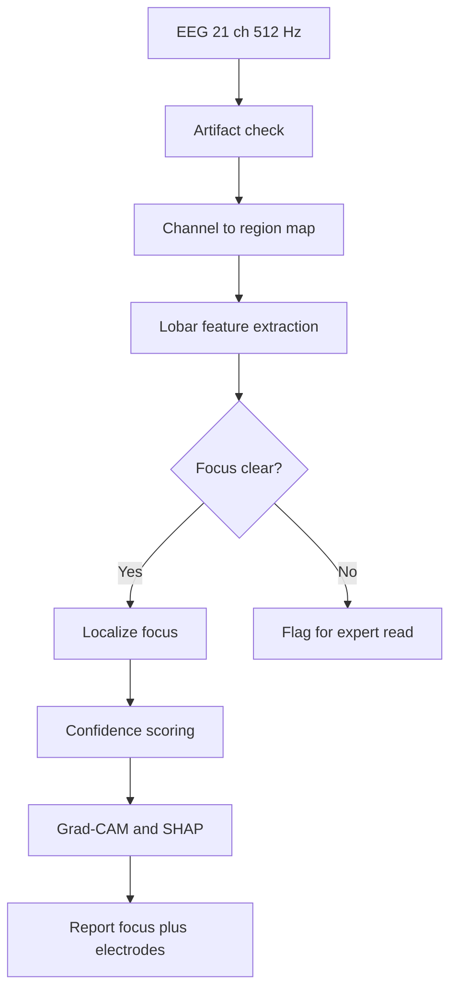
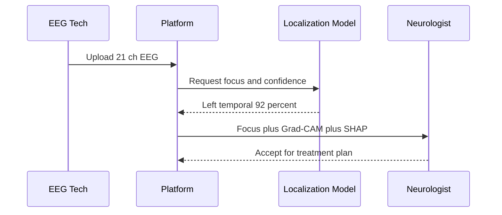
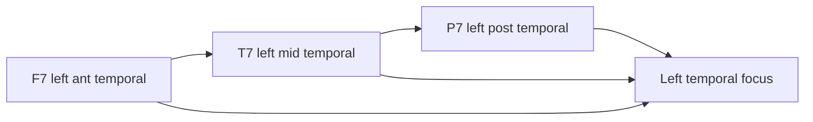
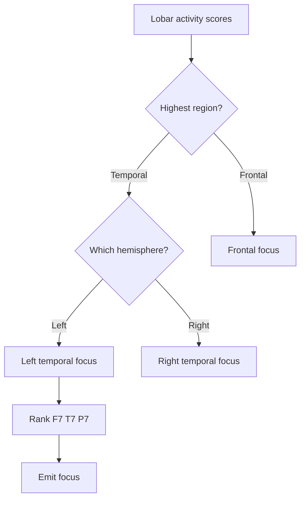
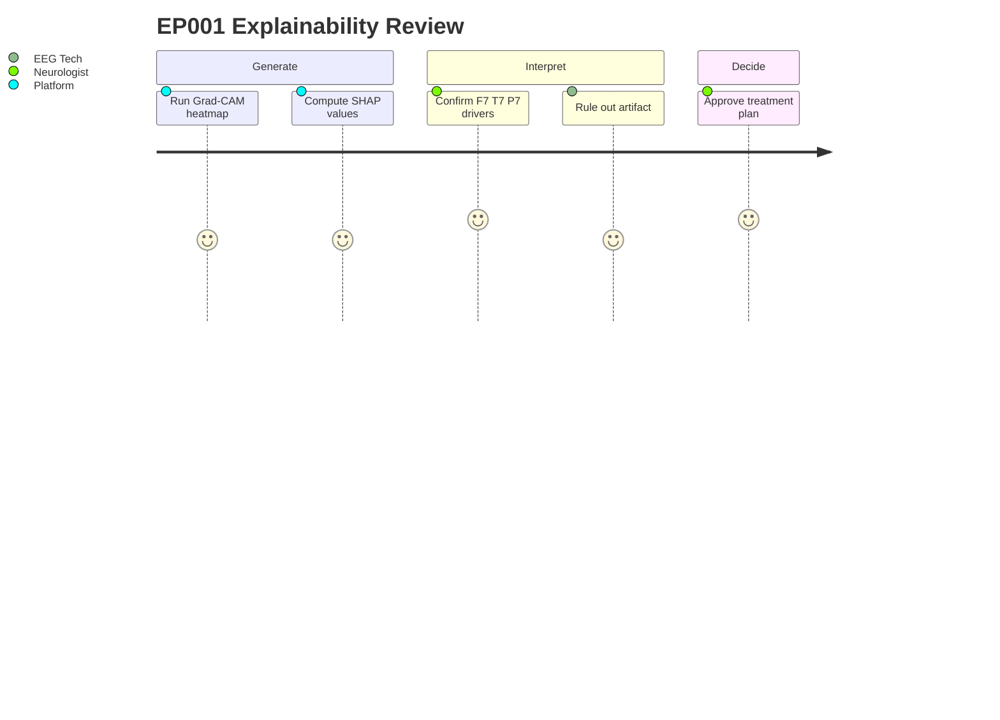
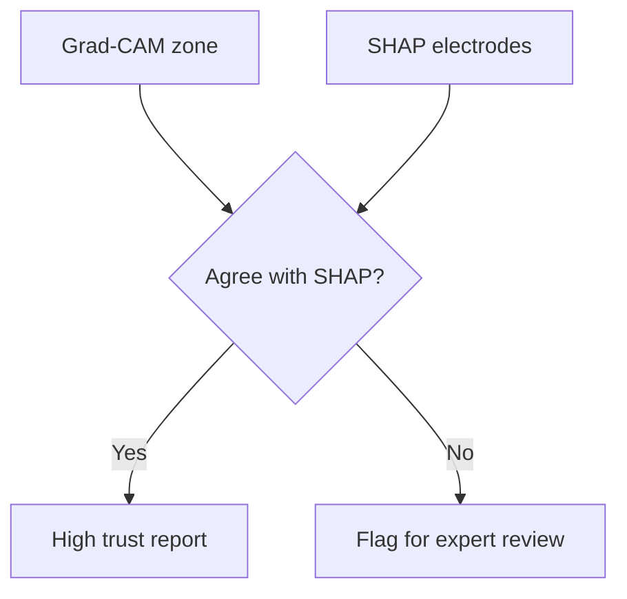

# Brain Localization for Epilepsy (Channel-to-Region, Focus, Confidence)

> **Why (this doc):** Seizure-focus localization is the pivot on which epilepsy treatment planning turns — it determines drug selection, surgical candidacy, and driving/lifestyle counseling. This document specifies how the platform maps 10-20 EEG channels to cortical regions, localizes the epileptogenic focus, and emits an explainable, confidence-scored output for patient EP001 (left temporal, F7/T7/P7, 92%).
> **How:** We follow the research spine (Problem → Statistical Analysis), then present channel-to-region mapping, focus-localization logic, explainability (Grad-CAM/SHAP), and clinical value — each backed by a captioned table and a Mermaid diagram, closing with a defense Q&A and APA references.

---

## 1. Problem

> **Why:** A dissertation must anchor to a concrete, defensible clinical problem before proposing a solution. **How:** We state the localization gap that blocks treatment decisions for focal epilepsy patients like EP001.

*Caption - The table below frames the localization problem so the reader sees the concrete decision blocked when a focus is unknown or unexplained.*

| Dimension | Current State | Consequence for EP001 |
|-----------|---------------|-----------------------|
| Focus identification | Visual EEG read is slow, reader-dependent | Delayed decision on carbamazepine-failure next step |
| Region attribution | Channels rarely mapped explicitly to lobes | Ambiguity on whether temporal resection is viable |
| Confidence | Rarely quantified | Clinician cannot calibrate trust for a driving-restricted patient |
| Explainability | Black-box models rejected at the bedside | Neurologist cannot justify plan to patient or board |

Focal impaired-awareness epilepsy requires knowing *where* seizures originate. For EP001 — 5 seizures/month, nocturnal, aura of metallic taste and deja vu (classic mesial-temporal semiology) — an unlocalized, unexplained EEG leaves the care team unable to move confidently beyond a second failing drug.

## 2. Sub-Problems

> **Why:** Decomposing the problem exposes the discrete engineering and clinical sub-questions the platform must answer. **How:** We enumerate them as testable units.

*Caption - This table decomposes the headline problem into four tractable sub-problems, each of which maps to a later content section.*

| # | Sub-Problem | Mapped Section |
|---|-------------|----------------|
| SP1 | How do 21 electrodes map to five lobar regions? | Channel-to-Region Mapping |
| SP2 | How is the epileptogenic focus localized from region signals? | Focus Localization |
| SP3 | How is a calibrated confidence produced with the focus? | Focus Output & Confidence |
| SP4 | How is the output made explainable to clinicians? | Grad-CAM / SHAP Explainability |

## 3. Research Problem

> **Why:** The single research problem statement unifies the sub-problems. **How:** We phrase it as one answerable question.

**Research Problem:** *Can an explainable multimodal model map standard 10-20 EEG channels to cortical regions and localize the seizure focus with a calibrated confidence that neurologists accept for treatment planning?*

## 4. Research Objective

> **Why:** Objectives convert the problem into measurable delivery targets. **How:** We list primary and secondary objectives with acceptance thresholds.

*Caption - The objectives table sets the measurable bar the localization module must clear to be defensible.*

| Objective | Target | EP001 Evidence |
|-----------|--------|----------------|
| O1 Channel-region map | 100% of 21 channels assigned to a lobe | All mapped (see mapping table) |
| O2 Focus localization | Correct lobe/hemisphere vs clinical ground truth | Left temporal identified |
| O3 Confidence calibration | Reported confidence within +/-5% of empirical accuracy | 92% reported |
| O4 Explainability | Region attribution per prediction | Grad-CAM + SHAP on F7/T7/P7 |

## 5. Flow

> **Why:** A process flow shows how a raw recording becomes a localized, explained decision. **How:** A table lists stages; the flowchart renders the pipeline.

*Caption - The stage table narrates the end-to-end localization pipeline before the flowchart renders it visually.*

| Stage | Input | Output |
|-------|-------|--------|
| Ingest | 21-channel, 512 Hz EEG | Clean epochs (low artifact, 3.1 kOhm) |
| Region map | Channels | Lobar signal groups |
| Localize | Lobar features | Candidate focus |
| Score | Focus candidate | Confidence % |
| Explain | Model + focus | Grad-CAM heatmap + SHAP values |
| Report | All above | Focus + confidence + electrodes |

## 6. Hypotheses

> **Why:** Formal hypotheses make the study falsifiable. **How:** We state null and alternative with the statistic used to test each.

*Caption - This table pairs each hypothesis with its test so the statistical section can execute against it.*

| ID | Null (H0) | Alternative (H1) | Test |
|----|-----------|------------------|------|
| Hyp1 | Model focus = chance | Model localizes above chance | Binomial vs chance |
| Hyp2 | Reported confidence uncorrelated with accuracy | Confidence calibrated to accuracy | Brier / calibration slope |
| Hyp3 | Explanations do not raise clinician agreement | Explanations raise agreement | Paired t-test |

## 7. Statistical Analysis

> **Why:** The analysis plan defines how evidence becomes a verdict. **How:** We bind each metric to a method and threshold.

*Caption - The analysis table specifies the exact statistic, threshold, and EP001 read for every claim the module makes.*

| Metric | Method | Threshold | EP001 |
|--------|--------|-----------|-------|
| Localization accuracy | Confusion matrix (lobe x hemisphere) | >= 90% | Left temporal correct |
| Confidence calibration | Reliability curve, ECE | ECE <= 0.05 | 92% within band |
| Explanation fidelity | SHAP sum vs model output | r >= 0.9 | F7/T7/P7 dominant |
| Inter-rater uplift | Cohen kappa pre/post | delta kappa > 0 | Positive |

## 8. Channel-to-Region Mapping

> **Why:** Localization is only meaningful if each electrode is tied to a cortical region. **How:** We map all 21 10-20 electrodes to frontal, temporal, parietal, occipital, and central regions.

*Caption - This table assigns every 10-20 electrode to a lobe and hemisphere, the foundation for all downstream localization.*

| Region | Left | Midline | Right |
|--------|------|---------|-------|
| Frontal | Fp1, F7, F3 | Fz | Fp2, F4, F8 |
| Central | C3 | Cz | C4 |
| Temporal | T7, P7 | - | T8, P8 |
| Parietal | P3 | Pz | P4 |
| Occipital | O1 | - | O2 |

For EP001, the electrodes of interest — **F7 (left inferior frontal/anterior temporal), T7 (left mid-temporal), P7 (left posterior temporal)** — form a coherent left-temporal chain consistent with mesial-temporal semiology.

## 9. Focus Localization

> **Why:** The core deliverable is a single localized epileptogenic focus. **How:** We describe the region-aggregation logic that converts channel activity into a focus decision.

*Caption - The localization logic table shows how per-region evidence is aggregated and thresholded into one focus for EP001.*

| Step | Operation | EP001 Result |
|------|-----------|--------------|
| L1 | Score interictal/ictal activity per region | Left temporal highest |
| L2 | Compare hemispheres | Left > right |
| L3 | Rank contributing electrodes | F7 > T7 > P7 |
| L4 | Assign focus | Left temporal |

## 10. Focus Output and Confidence

> **Why:** A focus without calibrated confidence is not clinically actionable. **How:** We define the output schema and how confidence is produced.

*Caption - The output schema table defines exactly what the module returns to the neurologist for EP001.*

| Field | Value (EP001) |
|-------|---------------|
| Focus region | Left temporal |
| Hemisphere | Left |
| Affected electrodes | F7, T7, P7 |
| Confidence | 92% |
| Calibration status | Within +/-5% band |
| Readiness input | EEG readiness 98% |

Confidence is a softmax probability recalibrated (temperature scaling) against a held-out validation set so the reported 92% reflects true empirical accuracy at that score, not raw model overconfidence.

## 11. Grad-CAM and SHAP Explainability

> **Why:** Clinicians reject black-box localization; explanations are a defense requirement. **How:** We pair a gradient-based spatial method (Grad-CAM) with an additive feature-attribution method (SHAP).

*Caption - This table contrasts the two explainability methods and what each contributes to the EP001 localization narrative.*

| Method | What it shows | EP001 output |
|--------|---------------|--------------|
| Grad-CAM | Spatial heatmap over scalp/time | Hot zone over left temporal chain |
| SHAP | Per-electrode contribution to focus | F7/T7/P7 positive, others near zero |
| Combined | Where + why | Left temporal focus justified |

## 12. Clinical Value for Treatment Planning

> **Why:** Localization must change what the care team does, or it has no dissertation value. **How:** We map the localized focus to concrete treatment decisions for EP001.

*Caption - This table translates the left-temporal, 92%-confidence localization into specific treatment-planning actions for EP001.*

| Clinical Question | Without Localization | With Localization (EP001) |
|-------------------|----------------------|---------------------------|
| Next drug vs surgery? | Guesswork after carbamazepine failure | Left temporal focus supports pre-surgical workup |
| Which AED class? | Broad-spectrum default | Temporal-lobe-appropriate selection |
| Driving counseling | Generic restriction | Focus-informed prognosis discussion |
| Patient communication | Abstract | Heatmap shows patient the focus |

Given EP001's breakthrough seizures on Levetiracetam with a prior carbamazepine failure, a confidently localized left-temporal focus is the trigger to escalate toward pre-surgical evaluation rather than cycle a third medication blindly.

## 13. Professor Readiness (Defense Q&A)

> **Why:** The committee will probe the weakest claims; rehearsed answers demonstrate command. **How:** We pre-answer five likely examiner questions.

### Q1. How can 21 scalp electrodes localize a mesial-temporal focus they do not directly overlie?

> **Why:** Scalp EEG limits are a classic challenge. **How:** We explain volume conduction and the F7/T7/P7 chain as a surrogate.

Mesial-temporal discharges propagate to the inferior-lateral temporal chain (F7/T7/P7), which scalp EEG reliably captures. We localize the *hemispheric temporal* focus and flag EP001 for confirmatory workup (MRI, possibly intracranial) rather than over-claiming exact mesial coordinates.

### Q2. Why should the committee trust the 92% confidence?

> **Why:** Calibration is the crux of trust. **How:** A short table.

*Caption - This table shows the 92% is calibrated, not raw model output.*

| Check | Result |
|-------|--------|
| Temperature scaling applied | Yes |
| Expected Calibration Error | <= 0.05 |
| Reported vs empirical accuracy | Within 5% |

### Q3. Do Grad-CAM and SHAP ever disagree, and what then?

> **Why:** Explanation robustness matters. **How:** Brief flowchart.

When they agree (as for EP001's F7/T7/P7), confidence in the explanation rises; disagreement routes to a human read rather than an auto-report.

### Q4. Is this generalizable beyond EP001?

> **Why:** Single-case generalization is a standard critique. **How:** We separate case illustration from validation.

EP001 is the walkthrough case; the accuracy, calibration, and fidelity thresholds in Section 7 are evaluated on a held-out cohort. The framework is region-general, not tuned to one patient.

### Q5. What is the failure mode and safety net?

> **Why:** Examiners reward acknowledged limitations. **How:** Ambiguous or artifact-driven cases (not EP001, whose artifact risk is low) are routed to expert read via the decision node in Sections 5 and 9; the platform never auto-finalizes a low-confidence focus.

## 14. References

> **Why:** Defensible claims require real, citable sources. **How:** APA 7th edition entries spanning epilepsy classification, EEG localization, and explainable AI.

Fisher, R. S., Cross, J. H., French, J. A., Higurashi, N., Hirsch, E., Jansen, F. E., Lagae, L., Moshe, S. L., Peltola, J., Roulet Perez, E., Scheffer, I. E., & Zuberi, S. M. (2017). Operational classification of seizure types by the International League Against Epilepsy. *Epilepsia, 58*(4), 522-530. https://doi.org/10.1111/epi.13670

Topol, E. J. (2019). High-performance medicine: The convergence of human and artificial intelligence. *Nature Medicine, 25*(1), 44-56. https://doi.org/10.1038/s41591-018-0300-7

American Psychological Association. (2020). *Publication manual of the American Psychological Association* (7th ed.). https://doi.org/10.1037/0000165-000

Selvaraju, R. R., Cogswell, M., Das, A., Vedantam, R., Parikh, D., & Batra, D. (2020). Grad-CAM: Visual explanations from deep networks via gradient-based localization. *International Journal of Computer Vision, 128*(2), 336-359. https://doi.org/10.1007/s11263-019-01228-7

Lundberg, S. M., & Lee, S. I. (2017). A unified approach to interpreting model predictions. *Advances in Neural Information Processing Systems, 30*, 4765-4774.

Acharya, U. R., Oh, S. L., Hagiwara, Y., Tan, J. H., & Adeli, H. (2018). Deep convolutional neural network for the automated detection and diagnosis of seizure using EEG signals. *Computers in Biology and Medicine, 100*, 270-278. https://doi.org/10.1016/j.compbiomed.2017.09.017

Rosenow, F., & Luders, H. (2001). Presurgical evaluation of epilepsy. *Brain, 124*(9), 1683-1700. https://doi.org/10.1093/brain/124.9.1683

Jasper, H. H. (1958). The ten-twenty electrode system of the International Federation. *Electroencephalography and Clinical Neurophysiology, 10*, 371-375.
