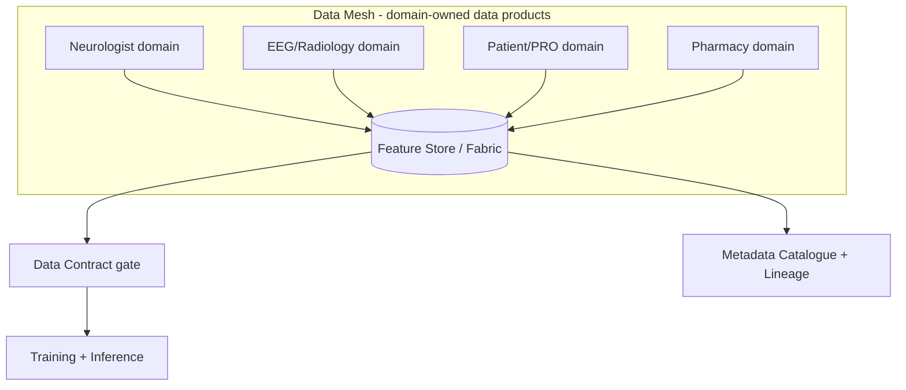
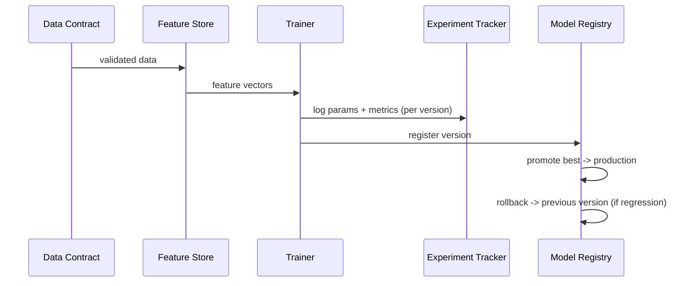

# Data Engineering & MLOps Layer (the foundation under the 23-step flow)

> **Why (this doc):** The classic 23-step primary-data flow is a *data-science* pipeline; it omits
> the *data-engineering / MLOps* foundation that makes it production-grade and governable — data
> contracts, mesh/fabric, ETL, partitioning, retention, metadata/lineage, a feature store,
> experiment tracking, and a model registry with rollback. This doc specifies that layer and maps
> each capability to **runnable code** in `mlops/`. **How:** definitions + diagrams + a
> where-implemented table. (The pasted flow referenced schizophrenia/PANSS; per policy it is
> translated to **epilepsy** — severity/ILAE, QOLIE-31, GAD-7, MoCA.)

## What was missing (and is now addressed)

*Caption - Each data-engineering/MLOps capability, what it guarantees, and where it is implemented.*

| Capability | What it guarantees | Implemented in |
|---|---|---|
| **Data contract** | Producers/consumers agree on schema, types, ranges; bad data is rejected at the gate | `mlops/data_contract.py` (catches the injected defects) |
| **ETL implementation** | Deterministic extract → transform → load | `analysis/make_cohort.py` → `primary_analysis.clean/feature_engineering` → feature store |
| **Feature engineering pipeline** | Reusable, tested derived features (not ad-hoc) | `primary_analysis.feature_engineering` + feature groups |
| **Feature store** | Governed offline feature table + point-in-time serving + metadata | `mlops/feature_store.py` |
| **Experiment tracking** | Every run's params/metrics/lineage logged + comparable | `mlops/experiment_tracker.py` |
| **Model registry + rollback** | Immutable versions, production pointer, promote & **rollback** | `mlops/model_registry.py` |
| **Metadata management / lineage** | Feature catalogue (group, dtype, entity) + audit trail | `feature_metadata.json` + `primary_analysis` audit log |
| **Data partitioning** | Split by entity/time for scale + subject-level ML splits | subject-level split in pipelines; partition strategy below |
| **Data retention** | Defined lifetime + de-identification | policy below + Study-ID de-identification |
| **Data mesh / fabric** | Domain-owned data products + unified access | feature groups = domains; see below |
| **Drift monitoring** | Detect data/model drift over time | `governance.py` (confidence) + planned drift job |

## Data mesh / data fabric

*Caption - Each clinical role owns its data product (mesh); a unified feature store + contracts + catalogue form the fabric.*



**Reason:** Show domain ownership + unified access. **Why:** Data mesh scales ownership; the fabric (feature store + contracts + catalogue) unifies consumption. **What is happening:** Role domains publish feature groups into the store, gated by contracts, catalogued for lineage. **How it is happening:** `feature_store.GROUPS` defines domains; `data_contract` gates; `feature_metadata.json` catalogues. **Reference:** Dehghani (2022).

## MLOps loop (train → track → register → rollback)



**Reason:** Show the governed model lifecycle. **Why:** Reproducibility + safe rollback are production requirements. **What is happening:** Contract-checked features train tracked, registered, promotable, rollback-able models. **How it is happening:** `run_mlops_demo.py` runs the full loop end-to-end. **Reference:** Sculley et al. (2015).

## Partitioning, retention & metadata (policy)

*Caption - Data-lifecycle policies the platform commits to.*

| Concern | Policy |
|---|---|
| Partitioning | By `patient_id` (entity) for serving; **subject-level** for ML splits (no leakage); by visit date for time-series |
| Retention | Raw signals: per site policy; derived features: versioned; de-identified to Study ID `DBA-EP-001` for research; right-to-erasure honoured |
| Metadata / lineage | Feature catalogue (group, dtype, entity) + per-change audit log + dataset version stamped on every experiment |
| Drift | Monitor feature distributions + model calibration over time; alert on shift; retrain gate |

## Where to run it

```bash
python mlops/data_contract.py      # validate the cohort against the contract
python mlops/feature_store.py      # materialise + serve features
python mlops/run_mlops_demo.py     # full loop: contract -> store -> track -> registry -> rollback
cd mlops && python -m pytest -q    # 5 MLOps tests
```

## Professor Readiness (Defense Q&A)

**Q1: Why a data contract if you already clean the data?** The contract is a *gate* — it rejects
non-conforming data before it reaches models, separating "is this data valid?" from "how do we fix it?".

**Q2: Why a feature store?** To reuse governed, catalogued features consistently across training and
inference and to avoid train/serve skew.

**Q3: What does rollback buy you?** If a promoted model regresses in production, you revert to the
previous version instantly (`model_registry.rollback`) — a core MLOps safety control.

## References

Dehghani, Z. (2022). *Data mesh: Delivering data-driven value at scale*. O'Reilly.

Sculley, D., et al. (2015). Hidden technical debt in machine learning systems. *NeurIPS*.

NIST. (2023). *AI Risk Management Framework (AI RMF 1.0)*.
