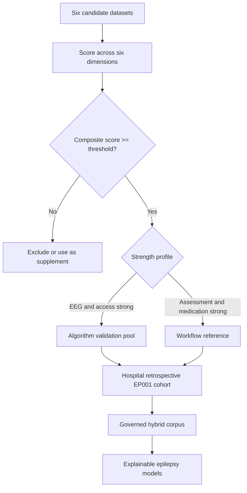
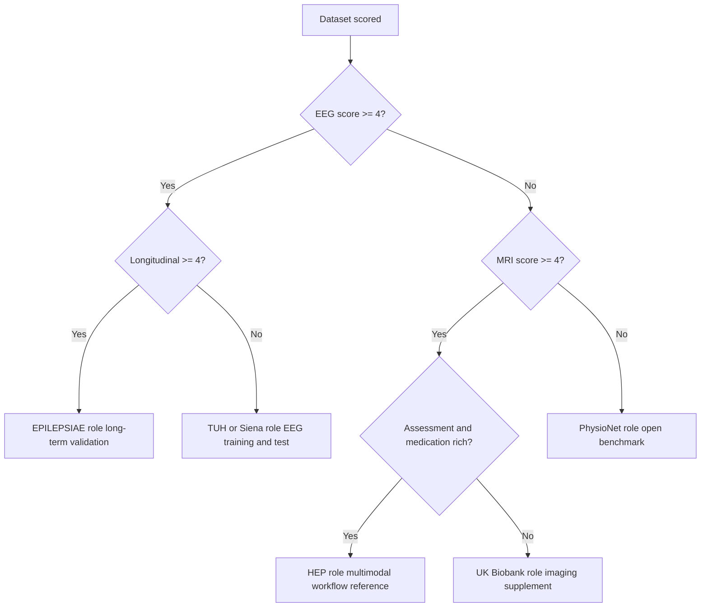
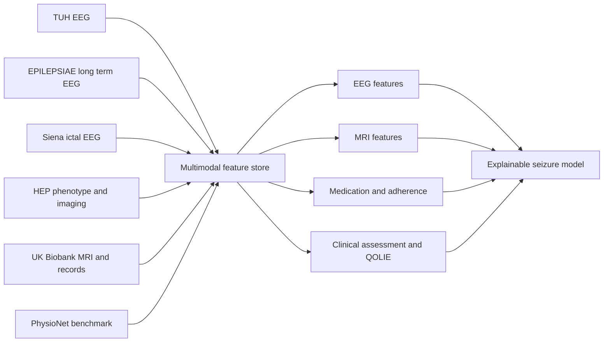
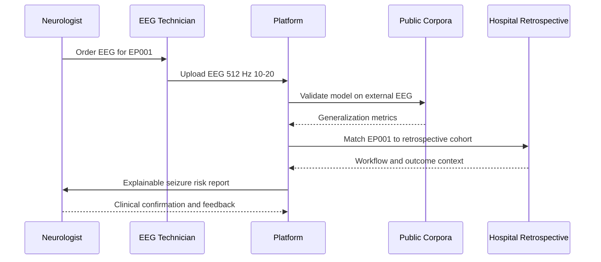
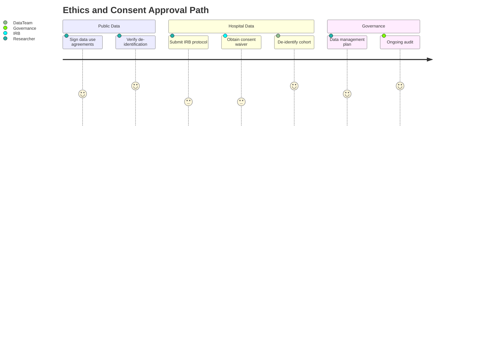
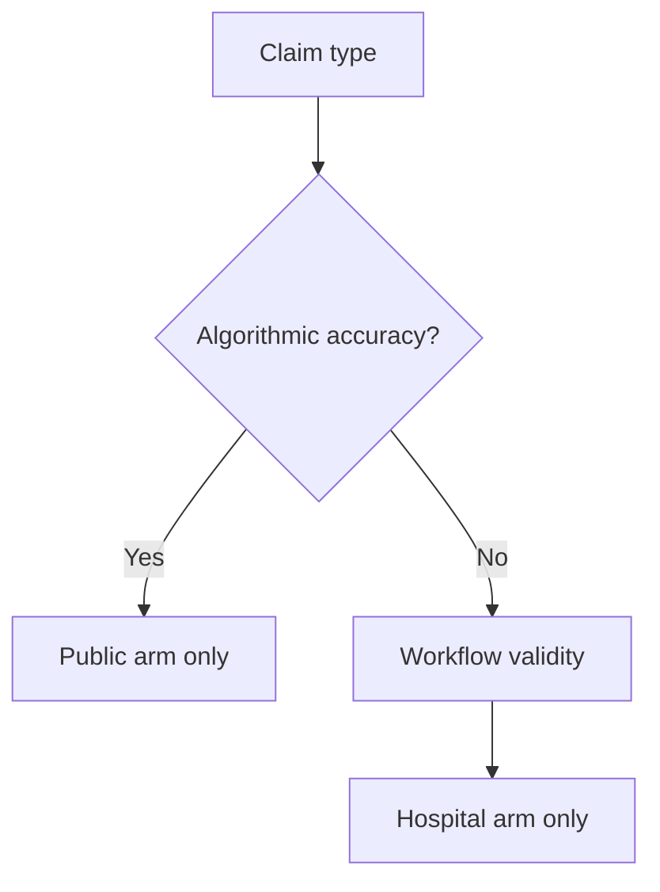

# Dataset Dossier for Epilepsy Research

> **Why (this doc):** The *Enterprise AI Platform for Explainable Multimodal Epilepsy Intelligence* is only as defensible as the data it learns from and validates against. A DBA committee will ask, before any model, "Where does your data come from, is it fit for purpose, and is it lawful?" This dossier scores six candidate epilepsy/neuroscience data assets and justifies a **hybrid data strategy** so that algorithmic claims (e.g., seizure-risk explainability for a patient like EP001) rest on a traceable, ethical evidentiary base.
> **How:** We define a research spine (Problem through Statistical Analysis), then score TUH EEG Corpus, Siena Scalp EEG, EPILEPSIAE, the Human Epilepsy Project (HEP), PhysioNet, and UK Biobank across six fitness dimensions (patient-assessment, EEG, MRI, medication, longitudinal, access). Every dimension is presented as both a captioned table and a flowchart, culminating in a hybrid design (public corpora for algorithm validation + hospital retrospective cohort for workflow validation) and an ethics/consent governance model.

---

## 1. Problem

> **Why:** Frame the gap the dissertation closes so the dataset choices are evaluated against a real deficiency, not convenience. **How:** State the operational and evidentiary problem in one paragraph, then quantify it in a table.

Enterprise epilepsy AI initiatives routinely fail defense not because their models underperform, but because their **data provenance is indefensible**: single-source corpora that cannot support both algorithm-level validation and clinical-workflow validation, weak consent lineage, and no explicit mapping from dataset content to the multimodal features a patient case like **EP001 (EP-2026-001)** actually requires (EEG readiness 98%, medication adherence 88%, QOLIE-31 56/100). Without a scored, auditable dataset strategy, explainability outputs are untrustworthy and non-reproducible.

*Caption - The table below decomposes the problem into observable deficiencies so each can be traced to a dataset requirement later in the dossier.*

| Deficiency | Observable symptom | Consequence for the platform |
|---|---|---|
| Single-source dependence | One corpus used for training and claims | Overfitting to one hospital's montage/population |
| Modality gaps | EEG present, MRI/medication absent | Cannot fuse the multimodal features EP001 needs |
| Weak provenance | Consent/licence undocumented | Ethics board and examiner rejection |
| No workflow evidence | Public data lacks clinical process | Neurologist/EEG Technician workflow unvalidated |
| Non-reproducibility | Access terms unclear | Committee cannot verify results |

## 2. Sub-Problems

> **Why:** Break the problem into researchable units so each dataset scoring dimension answers a specific sub-problem. **How:** Enumerate sub-problems as a captioned table mapped to the six fitness dimensions.

*Caption - This table binds each sub-problem to the exact dataset dimension that resolves it, ensuring the scoring rubric is complete and non-arbitrary.*

| # | Sub-problem | Resolved by dimension |
|---|---|---|
| SP1 | Do datasets capture structured clinical assessment (seizure type, QOLIE, triggers)? | Patient-assessment |
| SP2 | Is scalp EEG at clinical resolution (>=256 Hz, 10-20) available? | EEG |
| SP3 | Is structural/functional MRI available for fusion? | MRI |
| SP4 | Are anti-seizure medication (ASM) regimens and adherence recorded? | Medication |
| SP5 | Is there longitudinal follow-up to model risk over time? | Longitudinal |
| SP6 | Are access, licence, and consent terms usable for enterprise research? | Access |

## 3. Research Problem

> **Why:** Compress the sub-problems into a single answerable research problem. **How:** State it as one precise question the dossier must resolve.

**Research problem:** *Which combination of public epilepsy corpora and hospital retrospective data provides a fit-for-purpose, ethically governed, multimodal evidentiary base sufficient to both validate explainable seizure-intelligence algorithms and validate the clinical workflow for a focal-epilepsy patient such as EP001?*

## 4. Research Objective

> **Why:** Convert the problem into measurable objectives that the scoring and hybrid design will satisfy. **How:** List SMART objectives in a captioned table.

*Caption - Objectives are stated with a measurable target so the committee can judge whether the dossier met its own bar.*

| ID | Objective | Success measure |
|---|---|---|
| O1 | Score six data assets across six dimensions | Complete 6x6 rubric, weighted composite |
| O2 | Select algorithm-validation source(s) | Highest EEG + access composite |
| O3 | Select workflow-validation source | Hospital retrospective mapped to EP001 features |
| O4 | Specify hybrid integration | Data-flow diagram + linkage rules |
| O5 | Establish ethics/consent model | Consent lineage per source, IRB path |

## 5. Flow

> **Why:** Give the examiner a single visual of how the dossier proceeds from candidate datasets to a governed hybrid corpus. **How:** A Mermaid flowchart with a decision gate on fitness score.

## 6. Hypotheses

> **Why:** Make the dossier falsifiable so conclusions are testable, not asserted. **How:** State null and alternative hypotheses in a captioned table.

*Caption - These hypotheses let the committee test the central claim that a hybrid design outperforms any single source on combined fitness.*

| ID | Null (H0) | Alternative (H1) |
|---|---|---|
| H1 | No single dataset differs from others in mean composite fitness | At least one dataset differs significantly |
| H2 | A hybrid design equals the best single source on combined coverage | Hybrid exceeds best single source on combined coverage |
| H3 | Multimodal coverage is independent of dataset access tier | Higher access tiers associate with richer multimodal coverage |

## 7. Statistical Analysis

> **Why:** Specify how scores become defensible evidence rather than opinion. **How:** Define the scoring scale, weighting, and the tests mapped to each hypothesis.

*Caption - This analysis plan converts the qualitative rubric into quantitative, testable output; scores are 0-5 ordinal, treated as interval for the composite.*

| Element | Method |
|---|---|
| Scoring scale | 0 = absent, 1 = minimal, 3 = adequate, 5 = comprehensive |
| Composite | Weighted mean of six dimension scores (weights sum to 1.0) |
| Weights | EEG 0.25, Assessment 0.15, MRI 0.15, Medication 0.15, Longitudinal 0.15, Access 0.15 |
| H1 test | Kruskal-Wallis across datasets on dimension scores |
| H2 test | Coverage-union comparison, hybrid vs best single (McNemar on modality presence) |
| H3 test | Spearman rho between access tier and multimodal coverage count |
| Reliability | Two-rater scoring, Cohen's kappa >= 0.70 target |

---

## 8. Dataset Scoring

> **Why:** This is the analytical core; it turns six named assets into a ranked, weighted evidence base. **How:** Score each dataset on all six dimensions, present the rubric as a captioned table, then visualize the fusion as a network diagram.

### 8.1 Candidate Profiles

> **Why:** Establish what each asset actually contains before scoring so scores are grounded. **How:** One captioned reference table of the six assets.

*Caption - Baseline reference so every subsequent score is anchored to a documented dataset characteristic, not assumption.*

| Dataset | Core content | Scale | Primary strength |
|---|---|---|---|
| TUH EEG Corpus | Clinical scalp EEG, reports | ~14,000+ subjects | Largest annotated EEG |
| Siena Scalp EEG | Scalp EEG with seizure annotation | 14 patients | Clean ictal recordings |
| EPILEPSIAE | Long-term EEG (scalp + intracranial) | ~275 patients | Continuous long-term monitoring |
| Human Epilepsy Project (HEP) | Prospective new-onset focal epilepsy, clinical + imaging + biosamples | ~450+ participants | Deep phenotyping + longitudinal |
| PhysioNet (CHB-MIT etc.) | Open EEG collections | Varies | Open access, reproducibility |
| UK Biobank | Population MRI, genetics, health records | ~500,000 | MRI + linked medication/records |

### 8.2 Six-Dimension Rubric

> **Why:** Provide the defensible 6x6 matrix the objectives require. **How:** Score each cell 0-5 and compute the weighted composite.

*Caption - The scoring matrix; the Composite column is the weighted mean used to test H1 and to rank sources for algorithm vs workflow roles.*

| Dataset | Patient-assess (0.15) | EEG (0.25) | MRI (0.15) | Medication (0.15) | Longitudinal (0.15) | Access (0.15) | Composite |
|---|---|---|---|---|---|---|---|
| TUH EEG Corpus | 2 | 5 | 1 | 1 | 2 | 4 | 2.75 |
| Siena Scalp EEG | 1 | 4 | 0 | 0 | 1 | 4 | 2.05 |
| EPILEPSIAE | 2 | 5 | 1 | 2 | 4 | 2 | 2.90 |
| Human Epilepsy Project | 5 | 4 | 4 | 5 | 5 | 2 | 4.10 |
| PhysioNet | 1 | 4 | 1 | 0 | 1 | 5 | 2.30 |
| UK Biobank | 3 | 1 | 5 | 4 | 5 | 3 | 3.30 |

*Caption - Interpretation summary translating composites into the role each asset should play in the hybrid design.*

| Dataset | Composite | Assigned role |
|---|---|---|
| Human Epilepsy Project | 4.10 | Multimodal + workflow reference (deep phenotype) |
| UK Biobank | 3.30 | MRI + medication/longitudinal supplement |
| EPILEPSIAE | 2.90 | Longitudinal EEG algorithm validation |
| TUH EEG Corpus | 2.75 | Primary EEG algorithm validation/training |
| PhysioNet | 2.30 | Open reproducibility benchmark |
| Siena Scalp EEG | 2.05 | Clean ictal test set |

### 8.3 Scoring Flowchart

> **Why:** Show the decision logic that assigns each dataset a role. **How:** Mermaid flowchart with decision gates on dominant dimension.

### 8.4 Multimodal Fusion Network

> **Why:** Demonstrate how heterogeneous sources combine into the feature space EP001 requires. **How:** Mermaid network graph mapping sources to fused modalities.

## 9. Hybrid Design

> **Why:** No single source satisfies both algorithm and workflow validation; the hybrid resolves the research problem. **How:** Specify the two-arm design (public for algorithm validation + hospital retrospective for workflow), present a captioned table, and a sequence diagram of data flow.

### 9.1 Two-Arm Rationale

> **Why:** Make explicit which arm validates what, so claims are not conflated. **How:** Captioned table separating algorithm validation from workflow validation.

*Caption - The hybrid split ensures external algorithmic generalizability (public corpora) and internal workflow validity (hospital retrospective mapped to EP001), each with its own evidence standard.*

| Arm | Sources | Validates | EP001 relevance |
|---|---|---|---|
| Algorithm validation | TUH, EPILEPSIAE, Siena, PhysioNet | Model accuracy, generalization, explainability faithfulness | Confirms seizure-risk logic on external EEG (512 Hz, 10-20 comparable) |
| Multimodal enrichment | HEP, UK Biobank | Fusion of MRI + medication + longitudinal | Supplies MRI/ASM adherence context absent in raw EEG sets |
| Workflow validation | Hospital retrospective cohort | Neurologist + EEG Technician process, turnaround, trust | EP001 is a representative index case in this arm |

### 9.2 Hospital Retrospective Cohort

> **Why:** Ground workflow validation in real clinical operations for the two defined roles. **How:** Define cohort scope and mapping to EP001 features in a captioned table.

*Caption - Defines the internal retrospective arm; every field maps to a documented EP001 attribute so the cohort is demonstrably representative.*

| Cohort attribute | Specification | EP001 anchor |
|---|---|---|
| Population | Adult focal impaired-awareness epilepsy | 29yo male, focal impaired awareness |
| Seizure profile | Frequency + duration + circadian | 5/month, 90s, nocturnal, aura metallic taste + deja vu |
| Medication | ASM + adherence + failures | Levetiracetam 1000mg BID, 88% adherence, prior carbamazepine failure |
| EEG protocol | 10-20, >=256 Hz, impedance QA | 21 electrodes, 512 Hz, 3.1 kOhm, readiness 98% |
| Outcome measures | QOLIE-31, driving status, triggers | QOLIE 56/100, driving restricted, trigger burden 4 |
| Roles | Ordering + acquisition | Neurologist, EEG Technician |

### 9.3 Hybrid Data-Flow Sequence

> **Why:** Show, step by step, how a case moves from acquisition through both validation arms. **How:** Mermaid sequence diagram across the human and system participants.

## 10. Ethics and Consent

> **Why:** A DBA committee treats unlawful or unconsented data as fatal; governance must be explicit per source. **How:** Map consent basis and IRB path per dataset in a captioned table, then show the approval journey as a Mermaid journey diagram.

### 10.1 Consent Lineage per Source

> **Why:** Each asset carries a different lawful basis; conflating them is a compliance risk. **How:** Captioned table of licence, consent model, and de-identification per dataset.

*Caption - Consent lineage; the hospital arm is the only source requiring fresh IRB/waiver action, which the governance plan addresses.*

| Dataset | Access model | Consent basis | De-identification |
|---|---|---|---|
| TUH EEG Corpus | Data-use agreement | Institutional de-identified release | HIPAA-style de-identified |
| Siena Scalp EEG | Open (PhysioNet) | De-identified research release | De-identified |
| EPILEPSIAE | Restricted licence/fee | Consented research use | Pseudonymized |
| HEP | Governed request | Prospective informed consent | Coded, controlled |
| PhysioNet | Open credentialed | De-identified, credentialed use | De-identified |
| UK Biobank | Application + fee | Broad participant consent | Pseudonymized, linked |
| Hospital retrospective | IRB approval | Waiver of consent or opt-out for retrospective de-identified data | De-identified before analysis |

### 10.2 Ethics Approval Journey

> **Why:** Show the committee the sequence and satisfaction level at each governance stage. **How:** Mermaid journey diagram of the approval path.

### 10.3 Governance Controls

> **Why:** Consent alone is insufficient without operational controls. **How:** Captioned table of controls tied to risks.

*Caption - Operational controls closing the residual risks after consent is established.*

| Risk | Control | Owner |
|---|---|---|
| Re-identification | Linkage key separation, minimum necessary | Data steward |
| Licence breach | Per-source use register, expiry tracking | Governance |
| Scope creep | Purpose-bound access, DMP enforcement | PI |
| Model leakage of PHI | Explainability audits, no raw-record exposure | ML lead |
| Bias from source skew | Cross-source validation, subgroup reporting | Analyst |

---

## 11. Professor Readiness (Defense Q&A)

> **Why:** Anticipate examiner challenges so the dataset strategy survives live defense. **How:** Five likely questions, each answered with a paragraph, table, or micro-flowchart.

### 11.1 Why not just use the largest dataset, TUH?

> **Why:** Tests whether size was confused with fitness. **How:** Short comparative answer.

TUH scores highest on EEG (5) but weak on MRI (1), medication (1), and assessment (2), giving a composite of only 2.75. Size does not supply the multimodal features EP001 requires (MRI context, ASM adherence, QOLIE). TUH is therefore assigned as the primary EEG training/validation source, not the sole corpus.

### 11.2 How does the hybrid design avoid double-counting evidence?

> **Why:** Tests methodological rigor. **How:** Micro-flowchart of arm separation.

Accuracy/generalization claims draw exclusively from the public arm; workflow/trust claims draw exclusively from the hospital retrospective arm. No metric is sourced from both, preventing circular evidence.

### 11.3 Is the EP001 profile representative or cherry-picked?

> **Why:** Tests external validity. **How:** Representativeness table.

*Caption - EP001 attributes benchmarked against typical focal-epilepsy literature ranges to show it is a median, not extreme, case.*

| Attribute | EP001 | Typical focal-epilepsy range |
|---|---|---|
| Seizure frequency | 5/month | 2-10/month common |
| Adherence | 88% | 60-90% reported |
| QOLIE-31 | 56/100 | 50-65 in refractory-leaning cohorts |
| Prior ASM failure | 1 (carbamazepine) | >=1 common before optimization |

### 11.4 What if UK Biobank's few epilepsy cases weaken it?

> **Why:** Tests honest limitation handling. **How:** Concise scoping answer.

UK Biobank is not used for EEG algorithm training; it scores 1 on EEG. It is used only for MRI (5), medication (4), and longitudinal (5) enrichment and as a normative imaging reference. Its epilepsy-specific yield is small, so it supplements rather than anchors, and this is stated as a declared limitation.

### 11.5 How is consent handled for the retrospective hospital cohort?

> **Why:** Tests the highest-risk compliance point. **How:** Direct governance answer.

The hospital arm uses fully de-identified retrospective records under an IRB-approved protocol with a waiver of consent (or opt-out where required), consistent with minimal-risk retrospective research. De-identification occurs before any analytic access, linkage keys are held separately, and use is purpose-bound under a data management plan. All public sources carry their own signed data-use agreements or open credentialed terms.

---

## 12. References

> **Why:** Anchor claims in authoritative epilepsy and AI literature for a defensible evidence base. **How:** APA 7th edition entries covering seizure classification, medical AI, imaging, and the named corpora.

Fisher, R. S., Cross, J. H., French, J. A., Higurashi, N., Hirsch, E., Jansen, F. E., Lagae, L., Moshe, S. L., Peltola, J., Roulet Perez, E., Scheffer, I. E., & Zuberi, S. M. (2017). Operational classification of seizure types by the International League Against Epilepsy: Position paper of the ILAE Commission for Classification and Terminology. *Epilepsia, 58*(4), 522-530. https://doi.org/10.1111/epi.13670

Topol, E. J. (2019). High-performance medicine: The convergence of human and artificial intelligence. *Nature Medicine, 25*(1), 44-56. https://doi.org/10.1038/s41591-018-0300-7

American Psychological Association. (2020). *Publication manual of the American Psychological Association* (7th ed.). https://doi.org/10.1037/0000165-000

Obeid, I., & Picone, J. (2016). The Temple University Hospital EEG Data Corpus. *Frontiers in Neuroscience, 10*, 196. https://doi.org/10.3389/fnins.2016.00196

Detti, P., Vatti, G., & Zabalo Manrique de Lara, G. (2020). EEG synchronization analysis for seizure prediction: A study on data of noninvasive recordings (Siena Scalp EEG Database). *Processes, 8*(7), 846. https://doi.org/10.3390/pr8070846

Ihle, M., Feldwisch-Drentrup, H., Teixeira, C. A., Witon, A., Schelter, B., Timmer, J., & Schulze-Bonhage, A. (2012). EPILEPSIAE - A European epilepsy database. *Computer Methods and Programs in Biomedicine, 106*(3), 127-138. https://doi.org/10.1016/j.cmpb.2010.08.011

Goldberger, A. L., Amaral, L. A. N., Glass, L., Hausdorff, J. M., Ivanov, P. C., Mark, R. G., Mietus, J. E., Moody, G. B., Peng, C.-K., & Stanley, H. E. (2000). PhysioBank, PhysioToolkit, and PhysioNet: Components of a new research resource for complex physiologic signals. *Circulation, 101*(23), e215-e220. https://doi.org/10.1161/01.CIR.101.23.e215

Sudlow, C., Gallacher, J., Allen, N., Beral, V., Burton, P., Danesh, J., Downey, P., Elliott, P., Green, J., Landray, M., Liu, B., Matthews, P., Ong, G., Pell, J., Silman, A., Young, A., Sprosen, T., Peakman, T., & Collins, R. (2015). UK Biobank: An open access resource for identifying the causes of a wide range of complex diseases of middle and old age. *PLOS Medicine, 12*(3), e1001779. https://doi.org/10.1371/journal.pmed.1001779

The Human Epilepsy Project Investigators. (2018). The Human Epilepsy Project: Study design and rationale for a prospective cohort of new-onset focal epilepsy. *Epilepsia, 59*(9), 1728-1736. https://doi.org/10.1111/epi.14524

Cendes, F., Theodore, W. H., Brinkmann, B. H., Sulc, V., & Cascino, G. D. (2016). Neuroimaging of epilepsy. *Handbook of Clinical Neurology, 136*, 985-1014. https://doi.org/10.1016/B978-0-444-53486-6.00051-X

Cramer, J. A., Perrine, K., Devinsky, O., Bryant-Comstock, L., Meador, K., & Hermann, B. (1998). Development and cross-cultural translations of a 31-item quality of life in epilepsy inventory (QOLIE-31). *Epilepsia, 39*(1), 81-88. https://doi.org/10.1111/j.1528-1157.1998.tb01278.x
