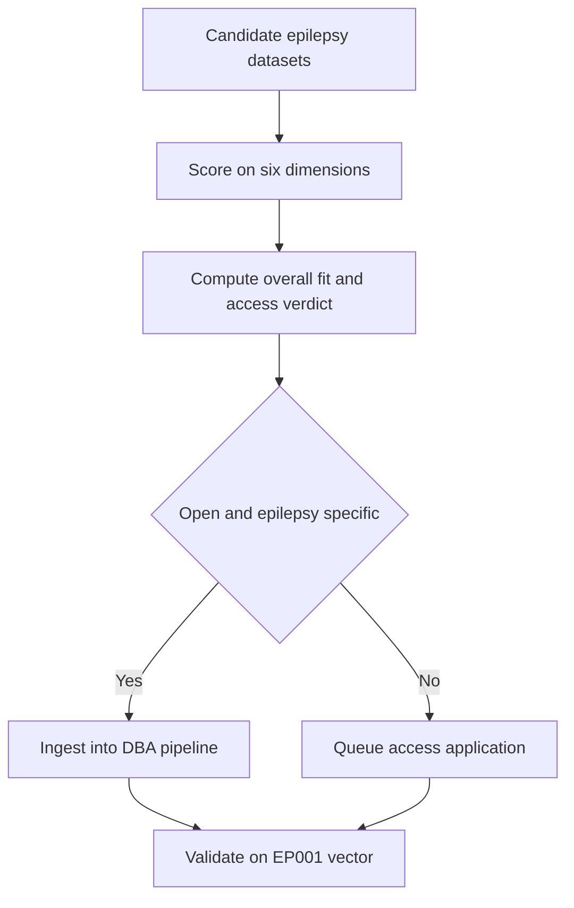
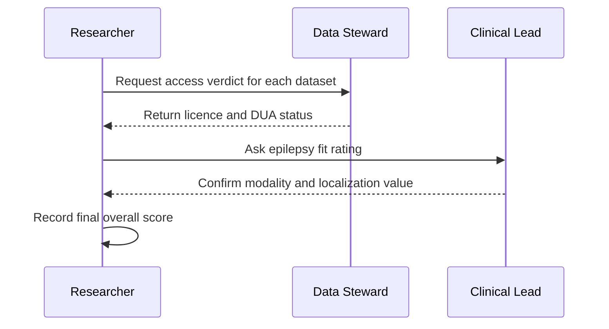
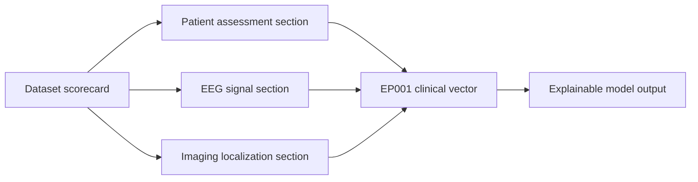
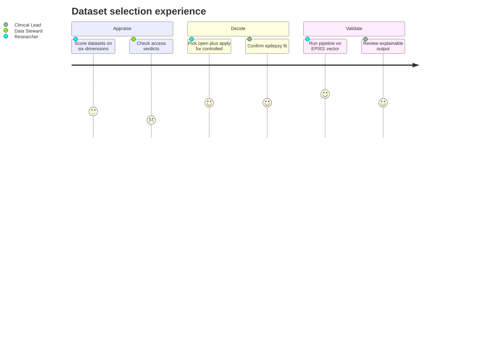
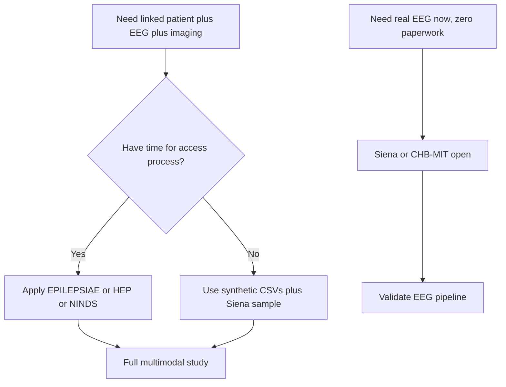

# Dataset Scorecard — Which Data Is Good for This DBA

> **Why (this doc):** Pick the right epilepsy datasets by scoring each on fit for a *multimodal,
> explainable, enterprise* DBA — not just EEG accuracy.
> **How:** Score each candidate 1–10 across the dimensions the research needs, weight by access
> feasibility, and give a clear recommendation.

**Problem:** Epilepsy-AI studies often over-fit to EEG-only public corpora, so the resulting
models cannot see the linked clinical, imaging, and workflow context a real enterprise DBA needs.

**Research Objective:** Select and justify the dataset(s) that best support a multimodal,
explainable epilepsy decision-support pipeline validated against the canonical focal-impaired-
awareness patient EP001 (29M, left-temporal).

## 1. Scoring Dimensions

*Caption — the criteria used; a good dataset for this DBA needs linked patient + machine data, not EEG alone.*

| Dimension | What it measures |
|---|---|
| Patient assessment | Clinical history, questionnaires, meds (primary data) |
| EEG | Scalp/routine/continuous EEG availability |
| Imaging | MRI/PET/CT for localization |
| Same-patient multimodal | Primary + secondary linked per patient |
| Epilepsy-specific | Purpose-built for epilepsy |
| Access ease | Can you actually get it? |

## 2. Master Scorecard

*Caption — the headline table: each dataset scored 1–10 per dimension, with an overall fit and an access verdict.*

| Dataset | Patient | EEG | Imaging | Multimodal | Epilepsy | Access | Overall | Access verdict |
|---|---|---|---|---|---|---|---|---|
| **Siena Scalp EEG** | 3 | 9 | 1 | 3 | 10 | **10** | **7.5** | ✅ Open (PhysioNet) |
| **CHB-MIT** | 2 | 9 | 1 | 2 | 9 | **10** | 6.5 | ✅ Open (pediatric) |
| **TUH EEG Corpus** | 4 | 10 | 1 | 4 | 8 | 4 | 8.0 | ❌ Registration + DUA |
| **EPILEPSIAE** | 8 | 10 | 5 | 9 | 10 | 2 | 9.5 | ❌ Paid/controlled |
| **Human Epilepsy Project** | 9 | 9 | 8 | 9 | 10 | 2 | 9.5 | ❌ Controlled |
| **NINDS repositories** | 8 | 8 | 7 | 8 | 9 | 5 | 8.5 | ⚠️ Application |
| **UK Biobank** | 10 | 1 | 9 | 3 | 3 | 3 | 5.0 | ❌ Application + fee |

## 3. Where This Data Flows

*Caption — the scorecard is a gate at the front of the pipeline; it decides which data enters ingestion before any modelling begins.*

**Reason:** The scorecard is the first control point, so its output must connect to ingestion.
**Why:** Choosing a dataset with wrong modality wastes months downstream.
**What is happening:** Each candidate is scored, then routed to ingestion or an access queue.
**Where is happening:** At the data-selection stage, before feature engineering.
**How it is happening:** A weighted 1–10 rubric plus an access verdict gate the flow.
**Reference:** Topol (2019).

## 4. Who Captures the Scores

*Caption — the sequence shows the roles that produce and sign off the scorecard values.*

**Reason:** Scores are not self-evident; specific roles own each dimension.
**Why:** A defensible scorecard needs steward and clinician sign-off, not one opinion.
**What is happening:** The researcher gathers access and clinical ratings, then records them.
**Where is happening:** During dataset appraisal, in the research governance workflow.
**How it is happening:** Structured requests to a data steward and a clinical lead.
**Reference:** ILAE / Fisher et al. (2017).

## 5. How It Links To Other Sections

*Caption — the scorecard feeds the clinical vector by deciding which assessment sections have real data behind them.*

**Reason:** Dataset choice determines which downstream sections are populated.
**Why:** A section with no matching dataset is a gap in the clinical vector.
**What is happening:** The scorecard maps datasets onto assessment sections and the vector.
**Where is happening:** At the boundary between data selection and feature assembly.
**How it is happening:** Each scored modality links to the section it supplies.
**Reference:** Topol (2019).

## 6. Patient And Role Experience

*Caption — the journey shows how dataset choice is felt from candidate appraisal to a validated EP001 result.*

**Reason:** The choice affects real people, from analyst effort to patient-relevant results.
**Why:** Showing the experience surfaces friction like long access applications.
**What is happening:** Roles move from appraisal through decision to validation on EP001.
**Where is happening:** Across the full data-selection lifecycle.
**How it is happening:** Staged tasks with satisfaction ratings per role.
**Reference:** APA (2020).

## 7. Decision Flow

> **Why:** Turn the scores into an action. **How:** Route by what you need vs what you can access.

## 8. Recommendation

*Caption — the practical hybrid design most doctoral epilepsy-AI studies use.*

| Purpose | Use | Why |
|---|---|---|
| **Algorithm validation now** | **Siena Scalp EEG** (adult, 512 Hz, matches EP001) + CHB-MIT | Open, epilepsy-specific, real seizures |
| **Multimodal + workflow validation** | EPILEPSIAE or Human Epilepsy Project | Highest fit, but needs access application |
| **Population/epidemiology** | UK Biobank | Great demographics/MRI, weak EEG |
| **Demos / platform build today** | Synthetic CSVs (this repo) | Immediate, no restrictions |

**Bottom line:** For open, immediate, epilepsy-real EEG → **Siena (7.5)** is the best you can
download without paperwork. For the *ideal* multimodal DBA dataset → **EPILEPSIAE / Human
Epilepsy Project (9.5)**, but both require an access application. Start on Siena + synthetic,
apply for EPILEPSIAE/HEP in parallel.

## Professor Readiness (Defense Q&A)

**Q1. Why not just use the highest-EEG dataset (TUH) and be done?**
Because EEG score alone ignores multimodal and access dimensions; TUH scores 1 on imaging and
4 on access, so it cannot validate the linked patient + machine vector this DBA is about.

**Q2. How does Siena at 7.5 beat EPILEPSIAE at 9.5 in practice?**
It does not on fit — 9.5 is higher — but Siena is openly downloadable today, while EPILEPSIAE is
paid/controlled. The recommendation is a hybrid: start on Siena while the EPILEPSIAE application
proceeds in parallel.

**Q3. How is this scorecard tied to EP001?**
Siena is adult, 512 Hz scalp EEG with real focal seizures, matching EP001 (29M, focal impaired
awareness, left-temporal), so the open dataset validates the pipeline against the canonical case.

## References

American Psychological Association. (2020). *Publication manual of the American Psychological
Association* (7th ed.). https://doi.org/10.1037/0000165-000

Detti, P., Vatti, G., & Zabalo Manrique de Lara, G. (2020). EEG synchronization analysis for
seizure prediction: A study on data of noninvasive recordings. *Processes, 8*(7), 846.
https://doi.org/10.3390/pr8070846

Fisher, R. S., Cross, J. H., French, J. A., Higurashi, N., Hirsch, E., Jansen, F. E., … Zuberi,
S. M. (2017). Operational classification of seizure types by the International League Against
Epilepsy: Position paper of the ILAE Commission for Classification and Terminology.
*Epilepsia, 58*(4), 522–530. https://doi.org/10.1111/epi.13670

Goldberger, A. L., Amaral, L. A. N., Glass, L., Hausdorff, J. M., Ivanov, P. C., Mark, R. G.,
… Stanley, H. E. (2000). PhysioBank, PhysioToolkit, and PhysioNet. *Circulation, 101*(23),
e215–e220. https://doi.org/10.1161/01.CIR.101.23.e215

Shoeb, A. H. (2009). *Application of machine learning to epileptic seizure onset detection and
treatment* [Doctoral dissertation, MIT].

Topol, E. J. (2019). High-performance medicine: The convergence of human and artificial
intelligence. *Nature Medicine, 25*(1), 44–56. https://doi.org/10.1038/s41591-018-0300-7
