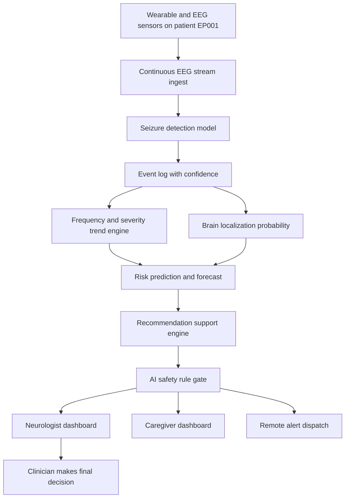
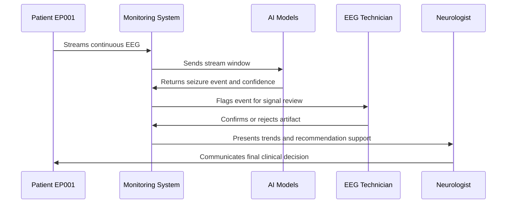
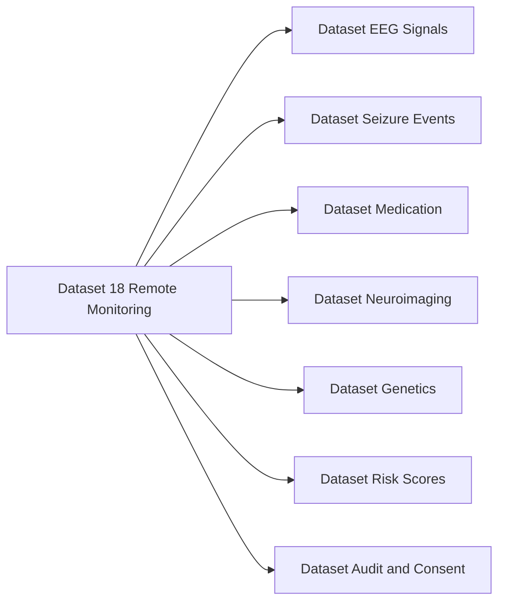
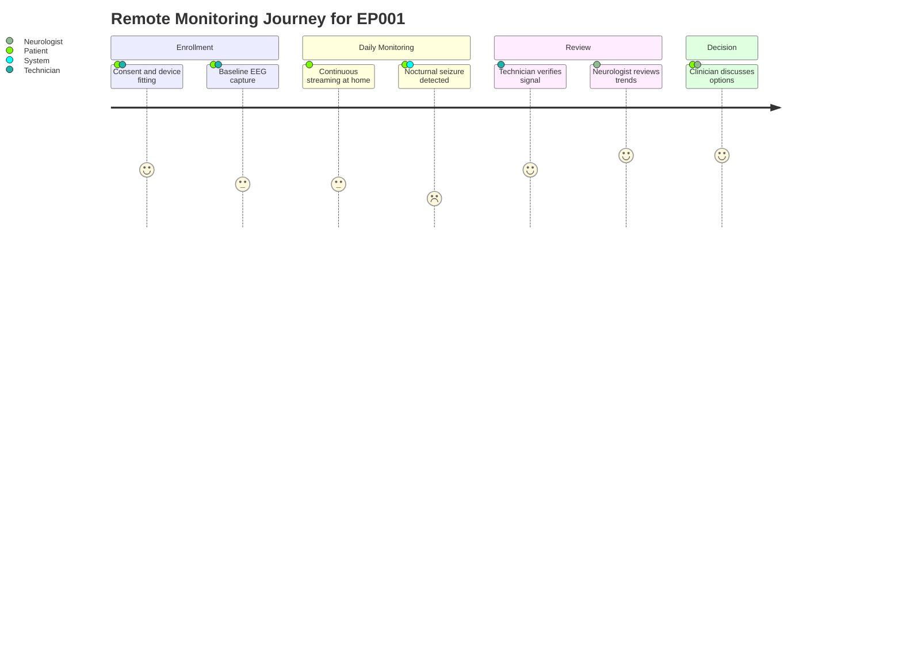

# Dataset 18 - Remote Monitoring & Clinical Recommendation

> **Why (this doc):** Epilepsy care does not end at the clinic door. Between visits, seizures, medication changes, and deterioration happen unobserved, and clinicians lack a continuous, structured view of the patient. This dataset dossier defines the schema for the platform's remote monitoring and clinical-recommendation-support layer so that continuous EEG, seizure events, trends, localization estimates, and risk forecasts are captured in a form that is auditable, explainable, and safe.
>
> **How:** We specify each logical section of the dataset as a Markdown table (Field | Description / Example), anchor every design choice to the research spine (Problem through Statistical Analysis), and enforce a hard safety boundary: the AI provides **decision support only** and must never autonomously diagnose, prescribe, change a dose, or recommend surgical resection. All examples use test patient **EP001** (29yo male, focal impaired awareness seizures, left-temporal focus).

---

## 1. Problem

> **Why:** Frame the clinical and operational gap the dataset must close. **How:** State the real-world monitoring failure in one paragraph before decomposing it.

*Caption - The table below states the core problem so every downstream field can be traced back to a concrete unmet need in remote epilepsy care.*

| Field | Description / Example |
|---|---|
| Problem statement | Ambulatory epilepsy patients are monitored only in brief, episodic clinic visits, so most seizures, medication non-adherence, and clinical deterioration occur unseen and unrecorded. |
| Clinical impact | Under-counting of seizures leads to wrong drug-load decisions; SUDEP (sudden unexpected death in epilepsy) risk goes undetected. |
| Data gap | No continuous, structured, machine-readable stream linking EEG, seizure events, trends, and localization for a single patient over time. |
| Example (EP001) | EP001 reports "a few" seizures per month at his visit; ambulatory monitoring later shows a cluster of nocturnal left-temporal events he never noticed. |

## 2. Sub-Problems

> **Why:** Break the monolithic problem into researchable, testable parts. **How:** Enumerate the discrete failures the dataset schema must individually support.

*Caption - This table decomposes the problem so each sub-problem maps to one or more dataset sections later in the document.*

| Sub-Problem | Description / Example |
|---|---|
| SP1 Continuous capture | Reliably ingest and store long-duration EEG streams without gaps. |
| SP2 Event detection | Detect and timestamp seizures from the stream with low false-alarm rate. |
| SP3 Trend quantification | Aggregate events into frequency and severity trends over weeks and months. |
| SP4 Localization support | Estimate probability of seizure origin per brain region for clinician review. |
| SP5 Risk forecasting | Forecast near-term seizure and SUDEP risk with explicit uncertainty. |
| SP6 Safe recommendation | Surface options to clinicians without autonomous prescribing or surgical decisions. |
| SP7 Multi-role delivery | Deliver the right view to caregiver, EEG technician, and neurologist. |

## 3. Research Problem

> **Why:** Convert the sub-problems into a single answerable research statement. **How:** Phrase it as one scoped question the dataset is designed to answer.

*Caption - The formal research problem below fixes the scope of Dataset 18 and prevents scope creep into autonomous decision-making.*

| Field | Description / Example |
|---|---|
| Research problem | Can a continuously captured, multimodal remote-monitoring dataset support explainable, uncertainty-aware clinical recommendations for epilepsy while keeping every diagnostic and therapeutic decision with a licensed clinician? |
| In scope | Data schema, detection outputs, trends, localization probabilities, risk forecasts, recommendation-support artifacts, safety rules. |
| Out of scope | Autonomous diagnosis, autonomous prescribing, autonomous surgical planning. |

## 4. Research Objective

> **Why:** Make the deliverable measurable. **How:** State objectives that can be checked against the finished schema.

*Caption - Objectives are listed so a defense committee can verify each was met by a concrete dataset section or output file.*

| Objective | Description / Example |
|---|---|
| O1 | Define a normalized schema for continuous EEG, events, trends, and localization. |
| O2 | Specify explainable seizure-detection outputs with confidence scores. |
| O3 | Encode risk forecasts with calibrated uncertainty intervals. |
| O4 | Encode recommendation-support outputs that are advisory and human-gated. |
| O5 | Encode machine-enforced AI safety rules preventing autonomous therapeutic action. |

## 5. Flow

> **Why:** Show how data moves before diving into fields. **How:** Present the end-to-end flow as a flowchart, then reinforce with role and integration diagrams.

*Caption - The flowchart traces a single patient's data from body-worn sensors to clinician decision, clarifying where the AI assists and where the human decides.*

> **Why:** Show which humans and systems exchange messages. **How:** A sequence diagram of a detected-seizure episode.

*Caption - This sequence diagram shows the ordered interaction between patient, systems, and the two roles when a seizure is detected, making the human-in-the-loop gate explicit.*

> **Why:** Show how this dataset connects to the wider platform. **How:** A left-to-right graph of dataset entities and integrations.

*Caption - The network graph situates Dataset 18 among sibling datasets, showing it consumes signals and feeds decision support without owning the diagnosis.*

> **Why:** Show the lived experience of monitoring. **How:** A journey diagram of the patient and data.

*Caption - The journey diagram tracks EP001's experience across a monitoring cycle, highlighting emotional and clinical touchpoints the dataset must serve.*

## 6. Hypotheses

> **Why:** Make the research falsifiable. **How:** State null and alternative hypotheses tied to measurable dataset outputs.

*Caption - The hypotheses below let the committee judge whether the monitoring dataset actually improves care versus episodic monitoring.*

| ID | Hypothesis |
|---|---|
| H1 (Alt) | Continuous structured monitoring detects more true seizures than patient self-report. |
| H1 (Null) | Continuous monitoring detects no more true seizures than self-report. |
| H2 (Alt) | Uncertainty-aware risk forecasts are better calibrated than a fixed-threshold rule. |
| H2 (Null) | Uncertainty-aware forecasts show no calibration improvement. |
| H3 (Alt) | Human-gated recommendation support reduces inappropriate dose changes. |
| H3 (Null) | Human-gated support shows no reduction in inappropriate dose changes. |

## 7. Statistical Analysis

> **Why:** Specify how hypotheses are tested. **How:** Map each hypothesis to a method and metric.

*Caption - This table binds each hypothesis to a concrete statistical method so the dataset's evaluation is reproducible.*

| Analysis | Method | Metric / Example |
|---|---|---|
| Detection performance | Sensitivity, specificity, false-alarm rate per 24h | AUROC 0.94 on held-out EP cohort |
| Trend significance | Mixed-effects Poisson regression on seizure counts | Rate ratio with 95% CI |
| Forecast calibration | Reliability diagram, Brier score, ECE | Brier 0.11, ECE 0.03 |
| Agreement | Cohen kappa between AI event and technician review | kappa 0.82 |
| Uncertainty | Prediction intervals via conformal prediction | 90% coverage verified |

---

## 8. Dataset Content - Schema Sections

> **Why:** Define the actual fields the platform stores. **How:** One table per logical section, each preceded by a caption.

### 8.1 Patient Monitoring Profile

> **Why:** Anchor all streams to a consented patient context. **How:** Store stable identifiers, focus, and monitoring configuration.

*Caption - This table defines the per-patient monitoring context that scopes every event and forecast to a specific consented individual.*

| Field | Description / Example |
|---|---|
| patient_id | Pseudonymous ID. Example EP001 |
| age | Age in years. Example 29 |
| sex | Biological sex. Example male |
| epilepsy_type | Classification. Example focal impaired awareness |
| seizure_focus | Suspected focus. Example left temporal |
| monitoring_start | ISO timestamp monitoring began. Example 2026-06-01T09:00Z |
| device_ids | Linked wearable and EEG device IDs |
| consent_status | Active consent flag and version. Example v3 active |

### 8.2 Continuous EEG Stream

> **Why:** The raw substrate for all detection. **How:** Store windowed, quality-tagged signal references.

*Caption - This table describes the continuous signal records; it references stored waveform blobs rather than embedding them, keeping the dataset queryable.*

| Field | Description / Example |
|---|---|
| stream_id | Unique stream segment ID |
| patient_id | Owner. Example EP001 |
| channels | Montage channel count. Example 21 |
| sampling_rate_hz | Example 256 |
| window_start | Segment start timestamp |
| signal_quality | Quality tag. Example good, artifact, disconnected |
| waveform_ref | Pointer to stored waveform object |

### 8.3 Seizure Detection

> **Why:** Turn signal into explainable events. **How:** Store model outputs with confidence and provenance.

*Caption - This table captures each candidate seizure with a confidence score and model provenance so technicians can review and the audit trail stays intact.*

| Field | Description / Example |
|---|---|
| event_id | Unique event ID |
| patient_id | Example EP001 |
| onset_time | Detected onset timestamp |
| duration_sec | Example 78 |
| detection_confidence | 0 to 1. Example 0.91 |
| model_version | Detector version. Example seizenet-2.3 |
| technician_review | Confirmed, rejected, pending. Example confirmed |
| explanation_ref | Link to saliency or channel-attribution artifact |

### 8.4 Seizure Frequency & Severity Trends

> **Why:** Support drug-load and progression decisions. **How:** Aggregate confirmed events into rolling metrics.

*Caption - This table stores derived trend metrics that clinicians use to judge whether a patient is stable, improving, or deteriorating.*

| Field | Description / Example |
|---|---|
| trend_id | Unique ID |
| patient_id | Example EP001 |
| window | Aggregation window. Example 30 days |
| seizure_count | Example 11 |
| count_rate_ratio | Vs prior window. Example 1.8 increase |
| mean_severity | Scaled 0 to 10. Example 6.2 |
| nocturnal_fraction | Example 0.73 |
| trend_flag | stable, worsening, improving. Example worsening |

### 8.5 Brain Localization (Probability per Region)

> **Why:** Support pre-surgical and diagnostic review. **How:** Store per-region probabilities, never a single hard label.

*Caption - This table records a probability distribution over candidate regions, deliberately avoiding a single deterministic localization so clinicians retain judgment.*

| Field | Description / Example |
|---|---|
| localization_id | Unique ID |
| patient_id | Example EP001 |
| region | Anatomical region. Example left temporal |
| probability | 0 to 1. Example 0.68 |
| method | Source model. Example source-localization-ml |
| uncertainty | Spread estimate. Example 0.09 |
| evidence_ref | Link to supporting signal windows |

### 8.6 Surgical Evaluation Support

> **Why:** Assist the epilepsy surgery workup without deciding it. **How:** Bundle evidence for a multidisciplinary team; never emit a resection recommendation.

*Caption - This table aggregates evidence to support a surgical evaluation meeting; note the AI never recommends resecting a region, it only organizes evidence for humans.*

| Field | Description / Example |
|---|---|
| eval_id | Unique ID |
| patient_id | Example EP001 |
| candidacy_evidence | Summary of concordant findings |
| concordance_score | Agreement across modalities. Example 0.74 |
| ai_action | Always evidence-summary-only |
| recommends_surgery | Always false by design |
| decision_owner | Multidisciplinary epilepsy surgery board |

### 8.7 Medication Monitoring

> **Why:** Correlate adherence and levels with events. **How:** Store prescribed regimen, adherence signals, and observed effects; the AI never changes a dose.

*Caption - This table links medication context to outcomes so clinicians can reason about efficacy; any dose change is flagged as a human decision only.*

| Field | Description / Example |
|---|---|
| med_record_id | Unique ID |
| patient_id | Example EP001 |
| drug_name | Example levetiracetam |
| prescribed_dose | Example 1000 mg twice daily |
| adherence_estimate | 0 to 1. Example 0.85 |
| serum_level | If available. Example 24 mg per L |
| ai_action | Always flag-for-clinician-review |
| dose_change_owner | Neurologist only |

### 8.8 Remote Alerts

> **Why:** Get urgent events to the right person fast. **How:** Store alert routing, severity, and acknowledgment state.

*Caption - This table defines the alerting records that route time-critical events to caregivers and clinicians with acknowledgment tracking.*

| Field | Description / Example |
|---|---|
| alert_id | Unique ID |
| patient_id | Example EP001 |
| trigger | Cause. Example prolonged seizure over 5 min |
| severity | low, medium, high, critical. Example critical |
| routed_to | Recipient roles. Example caregiver and neurologist |
| dispatch_time | Timestamp sent |
| acknowledged | Boolean and time. Example true at 03:14Z |

### 8.9 Caregiver Dashboard

> **Why:** Support the person at home without clinical overreach. **How:** Store the caregiver-safe view definition.

*Caption - This table defines the simplified, non-diagnostic caregiver view, deliberately limited to observation and action prompts rather than clinical interpretation.*

| Field | Description / Example |
|---|---|
| view_id | Unique ID |
| patient_id | Example EP001 |
| shown_metrics | Example last event time, alert status |
| action_prompts | Example call clinician if seizure over 5 min |
| clinical_detail | Always restricted for caregivers |
| language | Localized. Example en |

### 8.10 Neurologist Dashboard

> **Why:** Give the clinician full explainable detail. **How:** Store the clinician view definition with drill-down references.

*Caption - This table defines the full clinician view, exposing confidence, uncertainty, and evidence links needed for an informed final decision.*

| Field | Description / Example |
|---|---|
| view_id | Unique ID |
| patient_id | Example EP001 |
| panels | Example trends, localization, forecast, medication |
| shows_uncertainty | Always true |
| evidence_links | Drill-down to raw signal and explanations |
| override_controls | Clinician can accept, reject, or annotate any AI output |

### 8.11 Risk Prediction / Forecast with Uncertainty

> **Why:** Anticipate deterioration and SUDEP risk. **How:** Store point forecasts with calibrated intervals, never a bare number.

*Caption - This table stores forward-looking risk estimates with explicit uncertainty so clinicians never act on a false sense of precision.*

| Field | Description / Example |
|---|---|
| forecast_id | Unique ID |
| patient_id | Example EP001 |
| horizon | Forecast window. Example next 7 days |
| seizure_risk | 0 to 1. Example 0.42 |
| risk_interval | 90% interval. Example 0.31 to 0.55 |
| sudep_risk_band | low, moderate, elevated. Example moderate |
| calibration_note | Model calibration reference |
| ai_action | Always advisory, requires clinician confirmation |

### 8.12 Recommendation Engine

> **Why:** Surface options, not orders. **How:** Store advisory suggestions with rationale, all human-gated.

*Caption - This table records advisory recommendation-support outputs; every entry is explicitly non-binding and routed to a clinician for confirmation.*

| Field | Description / Example |
|---|---|
| rec_id | Unique ID |
| patient_id | Example EP001 |
| suggestion | Advisory text. Example consider reviewing nocturnal cluster |
| rationale | Explanation and evidence links |
| confidence | 0 to 1. Example 0.7 |
| status | Always pending-clinician-confirmation |
| autonomous_action | Always false |

### 8.13 AI Safety Rules

> **Why:** Encode the hard boundaries in data, not just policy. **How:** Store machine-checkable rules that block prohibited actions.

*Caption - This table encodes the enforced safety constraints; the platform rejects any output that violates a rule, guaranteeing decision support rather than autonomous action.*

| Rule ID | Rule |
|---|---|
| SR1 | AI must never autonomously diagnose epilepsy or seizure type. |
| SR2 | AI must never autonomously prescribe or change a medication dose. |
| SR3 | AI must never recommend removing or resecting a brain region. |
| SR4 | AI must never dispatch a critical clinical action without human acknowledgment. |
| SR5 | Every AI output must carry confidence and uncertainty. |
| SR6 | Every therapeutic decision owner must be a licensed clinician. |

### 8.14 Output Files

> **Why:** Define the concrete artifacts the platform emits. **How:** List file names, formats, and consumers.

*Caption - This table enumerates the exported output files so downstream datasets and reviewers know exactly what Dataset 18 produces.*

| File | Format | Description / Consumer |
|---|---|---|
| eeg_stream_index.parquet | Parquet | Index of continuous stream segments for EP001 |
| seizure_events.json | JSON | Detected events with confidence and review status |
| trend_report.csv | CSV | Frequency and severity trends per window |
| localization_probabilities.json | JSON | Per-region probability and uncertainty |
| risk_forecast.json | JSON | Forecasts with calibrated intervals |
| recommendation_log.json | JSON | Advisory suggestions and clinician status |
| safety_audit.log | Log | Every safety-rule check and outcome |
| alerts.json | JSON | Dispatched alerts and acknowledgments |

## 9. Dataset Integration

> **Why:** Show Dataset 18 is a node in the platform, not an island. **How:** Map each link to its direction and purpose.

*Caption - This integration table specifies how Dataset 18 exchanges data with sibling datasets, clarifying dependencies and the flow of consent and audit.*

| Linked Dataset | Direction | Integration Purpose |
|---|---|---|
| EEG Signals dataset | Inbound | Source waveforms for detection |
| Seizure Events dataset | Bidirectional | Canonical event records |
| Medication dataset | Inbound | Regimen and adherence context |
| Neuroimaging dataset | Inbound | Structural concordance for localization |
| Genetics dataset | Inbound | Risk stratification context |
| Risk Scores dataset | Outbound | Publishes forecasts for cohort analytics |
| Audit and Consent dataset | Bidirectional | Enforces consent scope and logs actions |

## 10. Professor Readiness (Defense Q&A)

> **Why:** Anticipate examiner scrutiny. **How:** Four to five likely questions with concise, defensible answers.

### 10.1 How do you ensure the AI does not autonomously make clinical decisions?

> **Why:** Core safety question. **How:** Point to enforced rules and human gate.

The safety rules (SR1 to SR6) are machine-checkable and applied at an output gate before any artifact reaches a dashboard or alert. The recommendation engine only emits advisory suggestions with status pending-clinician-confirmation, and every therapeutic decision owner field must resolve to a licensed clinician. The system is decision support, not an autonomous decision maker.

### 10.2 How is patient privacy and consent handled?

> **Why:** Ethics and legality. **How:** Reference pseudonymization and consent scoping.

Patient identifiers are pseudonymous (EP001), consent status and version are stored per patient, and the Audit and Consent dataset enforces that streams are only processed while consent is active. Data handling follows HIPAA-aligned minimization and the APA ethics principles for data stewardship.

### 10.3 Why store probabilities and uncertainty instead of hard labels?

> **Why:** Methodological rigor. **How:** Tie to calibration and clinician trust.

A single hard label hides model doubt and invites automation bias. Storing per-region probabilities and calibrated forecast intervals (verified by Brier score and conformal coverage) lets clinicians weigh evidence and preserves their role as the decision maker, especially in high-stakes surgical evaluation.

### 10.4 What stops the platform from recommending surgery or a dose change?

> **Why:** The sharpest safety concern. **How:** Cite specific rules and owner fields.

Rules SR2 and SR3 explicitly forbid autonomous dose changes and any recommendation to resect a brain region. The surgical evaluation section fixes recommends_surgery to false and assigns the decision to a multidisciplinary board; the medication section assigns dose changes to the neurologist only.

### 10.5 How do you validate that monitoring improves outcomes?

> **Why:** Justify the whole dataset. **How:** Reference hypotheses and statistics.

Hypotheses H1 to H3 are tested with mixed-effects Poisson regression on seizure counts, calibration metrics on forecasts, and Cohen kappa agreement between AI and technician review, giving a reproducible evidence base for the platform's clinical value.

## 11. References

> **Why:** Ground the work in the literature. **How:** APA 7th edition entries spanning classification, AI in medicine, ethics, genetics, imaging, ICU, and public health.

American Psychological Association. (2020). *Publication manual of the American Psychological Association* (7th ed.). American Psychological Association.

Devinsky, O., Hesdorffer, D. C., Thurman, D. J., Lhatoo, S., & Richerson, G. (2016). Sudden unexpected death in epilepsy: Epidemiology, mechanisms, and prevention. *The Lancet Neurology, 15*(10), 1075-1088. https://doi.org/10.1016/S1474-4422(16)30158-2

Fisher, R. S., Cross, J. H., French, J. A., Higurashi, N., Hirsch, E., Jansen, F. E., Lagae, L., Moshé, S. L., Peltola, J., Roulet Perez, E., Scheffer, I. E., & Zuberi, S. M. (2017). Operational classification of seizure types by the International League Against Epilepsy. *Epilepsia, 58*(4), 522-530. https://doi.org/10.1111/epi.13670

Rosenow, F., & Lüders, H. (2001). Presurgical evaluation of epilepsy. *Brain, 124*(9), 1683-1700. https://doi.org/10.1093/brain/124.9.1683

Scheffer, I. E., Berkovic, S., Capovilla, G., Connolly, M. B., French, J., Guilhoto, L., Hirsch, E., Jain, S., Mathern, G. W., Moshé, S. L., Nordli, D. R., Perucca, E., Tomson, T., Wiebe, S., Zhang, Y.-H., & Zuberi, S. M. (2017). ILAE classification of the epilepsies. *Epilepsia, 58*(4), 512-521. https://doi.org/10.1111/epi.13709

Topol, E. J. (2019). High-performance medicine: The convergence of human and artificial intelligence. *Nature Medicine, 25*(1), 44-56. https://doi.org/10.1038/s41591-018-0300-7
