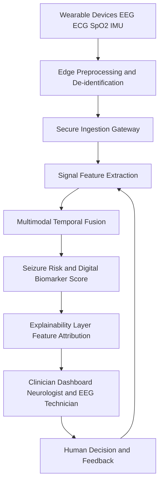
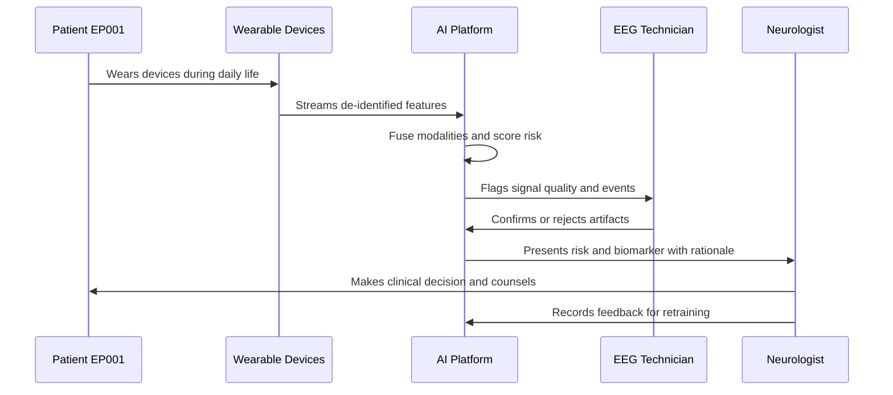
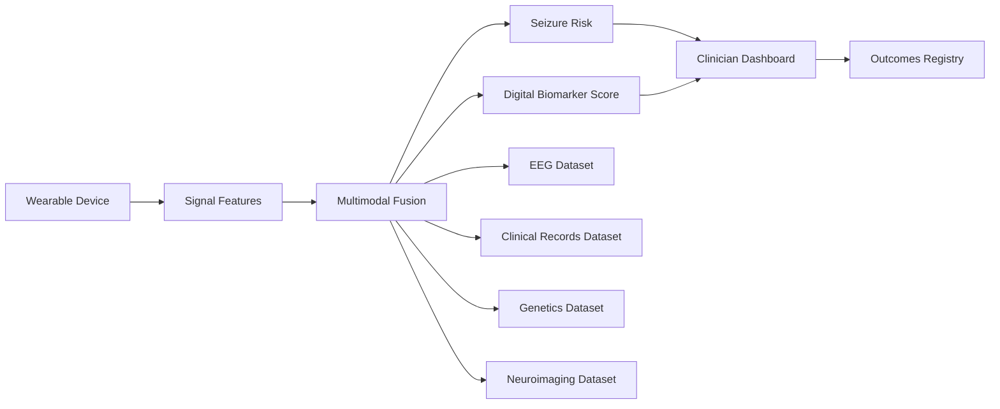
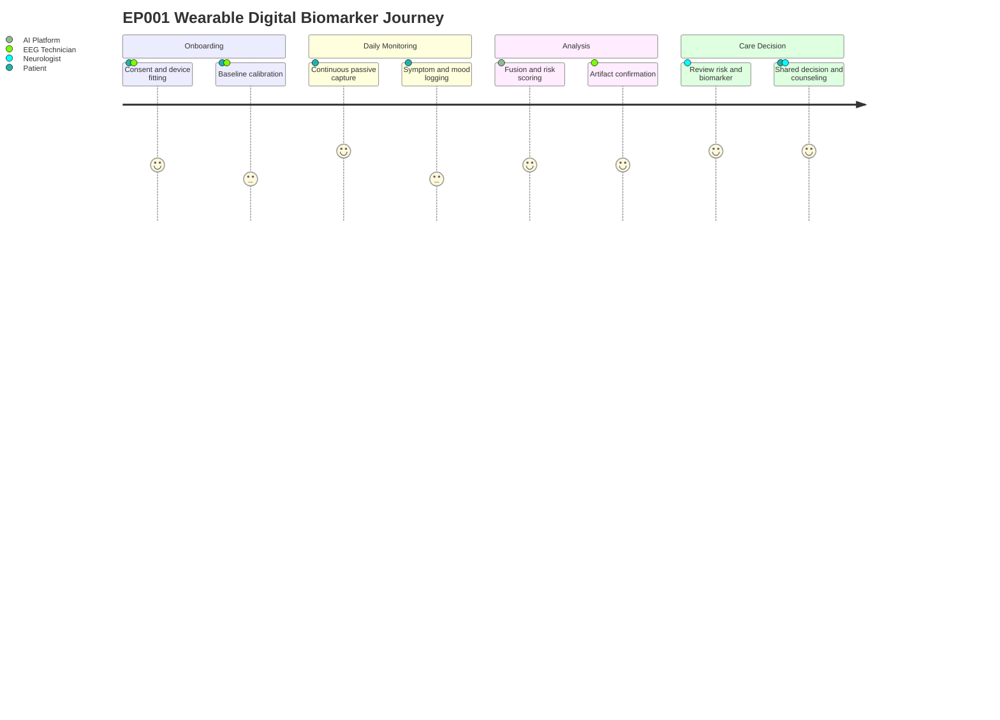

# Dataset 19 - Multimodal Wearable & Digital Biomarker

> **Why (this doc):** Continuous, real-world physiological and behavioral signals from wearables convert episodic clinic snapshots into a longitudinal digital phenotype of epilepsy, enabling seizure-risk forecasting, treatment monitoring, and objective outcome tracking for the Enterprise AI Platform for Explainable Multimodal Epilepsy Intelligence.
> **How:** This dossier specifies the dataset schema as field-level tables, defines the data-flow and integration architecture through four Mermaid diagrams, states the research spine (Problem through Statistical Analysis), and documents output artifacts and the applicable AI model family. All AI outputs are decision support for a Neurologist and EEG Technician; the platform never autonomously diagnoses, prescribes, or recommends surgery.

---

## 1. Problem

> **Why:** Frames the clinical gap this dataset addresses. **How:** States the limitation of intermittent monitoring and the burden of unpredictable seizures.

Epilepsy affects roughly 50 million people worldwide, yet routine care relies on brief clinic encounters and self-reported seizure diaries that are known to under-count events by 40 to 55 percent. Seizure unpredictability is consistently ranked by patients as the single most disabling feature of the condition, driving injury risk, loss of independence, and Sudden Unexpected Death in Epilepsy (SUDEP). Wearable and ambient sensors can observe the patient continuously in daily life, but the resulting multimodal streams are noisy, high-dimensional, and clinically uninterpretable without a structured schema and a fusion model. The problem is the absence of a governed, explainable dataset that turns raw wearable telemetry into trustworthy digital biomarkers for epilepsy management.

## 2. Sub-Problems

> **Why:** Decomposes the headline problem into tractable engineering and clinical questions. **How:** Enumerates the concrete obstacles each schema section must resolve.

*Caption - This table decomposes the overall problem into named sub-problems so that each dataset section and AI model can be traced to a specific gap it closes.*

| Sub-Problem | Description / Example |
| --- | --- |
| Signal heterogeneity | Fuse EEG, ECG, SpO2, respiration, accelerometry sampled at different rates; e.g. EP001 wears a scalp-lite EEG patch at 256 Hz and a wrist device at 32 Hz |
| Under-reporting | Detect unwitnessed nocturnal focal-to-bilateral seizures missed in diaries |
| Noise and motion artifact | Separate true tremor from device-handling artifact on the accelerometer |
| Personalization | Baseline drifts per patient; EP001 resting HRV differs from cohort mean |
| Latency and privacy | Provide near-real-time risk without exporting raw identifiable EEG off-device |
| Explainability | Justify a risk score so a Neurologist can accept or override it |

## 3. Research Problem

> **Why:** States the single answerable research question. **How:** Narrows sub-problems into one measurable formulation.

Can a governed multimodal wearable dataset, fused by an explainable temporal model, produce a personalized digital biomarker and short-horizon seizure-risk estimate that is clinically reliable enough to support (not replace) a Neurologist's decisions in epilepsy care?

## 4. Research Objective

> **Why:** Converts the question into concrete deliverables. **How:** Lists the measurable objectives the dataset enables.

*Caption - This table lists the research objectives so examiners can map each objective to a schema section, an AI model, and an output file.*

| Objective | Description / Example |
| --- | --- |
| O1 Digital phenotype | Build a per-patient multimodal record spanning cardiac, respiratory, motor, sleep, and behavioral domains |
| O2 Risk forecasting | Estimate seizure risk over a 24 to 72 hour horizon with calibrated probabilities |
| O3 Biomarker score | Emit a single interpretable Digital Biomarker Score (0-100) with feature attributions |
| O4 Longitudinal trend | Track medication adherence and circadian stability over months |
| O5 Decision support | Deliver alerts and recommendations to clinicians without autonomous action |

## 5. Flow

> **Why:** Shows how data moves from sensor to clinician. **How:** A flowchart of ingestion, feature extraction, fusion, and decision support.

*Caption - This flowchart traces a single record from wearable capture through governed storage, feature extraction, multimodal fusion, and clinician-facing decision support.*

## 6. Hypotheses

> **Why:** Makes predictions falsifiable. **How:** States null and alternative hypotheses for the core claim.

*Caption - This table records the study hypotheses in null and alternative form so the statistical plan can test them explicitly.*

| ID | Hypothesis |
| --- | --- |
| H1-null | Multimodal fusion does not improve seizure-risk AUROC over a single-modality EEG baseline |
| H1-alt | Multimodal fusion improves 24-hour seizure-risk AUROC by a clinically meaningful margin |
| H2-null | The Digital Biomarker Score is not associated with clinician-confirmed seizure frequency |
| H2-alt | Higher Digital Biomarker Score is associated with higher confirmed seizure frequency |
| H3-null | Circadian and adherence features add no predictive value beyond physiological signals |
| H3-alt | Circadian regularity and adherence features add independent predictive value |

## 7. Statistical Analysis

> **Why:** Specifies how hypotheses are tested and how the model is validated. **How:** Names estimators, validation scheme, and calibration metrics.

*Caption - This table specifies the statistical and validation methods, ensuring predictive claims are supported by appropriate metrics and uncertainty quantification.*

| Method | Description / Example |
| --- | --- |
| Discrimination | AUROC and AUPRC for seizure-risk classification, reported with 95 percent CI via bootstrap |
| Calibration | Brier score and reliability curves; Expected Calibration Error |
| Survival modeling | Cox proportional hazards and time-to-event AUC for time-to-next-seizure |
| Association | Mixed-effects regression linking Digital Biomarker Score to confirmed counts |
| Validation | Patient-wise nested cross-validation and prospective hold-out to prevent leakage |
| Multiple testing | Benjamini-Hochberg FDR control across feature-level tests |
| Uncertainty | Bayesian posterior credible intervals on per-patient risk |

---

## 8. Dataset Schema

> **Why:** Defines the fields the platform stores and serves. **How:** Presents each domain as a Field and Description/Example table.

### 8.1 Wearable Device Info

> **Why:** Establishes provenance and calibration context for every downstream signal. **How:** Captures device identity, firmware, and sampling metadata.

*Caption - This table records device provenance so signal quality and comparability can be audited across patients and firmware versions.*

| Field | Description / Example |
| --- | --- |
| device_id | Unique device serial; e.g. WRB-EP001-2 |
| device_type | Form factor; e.g. wrist band, EEG scalp patch, chest strap |
| manufacturer_model | Vendor and model; e.g. Empatica-like E-series |
| firmware_version | Firmware build; e.g. 4.2.1 |
| sampling_rate_hz | Per-channel rate; e.g. EEG 256, IMU 32 |
| battery_pct | Battery at capture; e.g. 78 |
| signal_quality_index | 0-1 quality score; e.g. 0.94 |
| worn_flag | On-body detection; e.g. true |

### 8.2 EEG Features

> **Why:** EEG is the most specific seizure signal and anchors the fusion model. **How:** Stores band-power and connectivity features rather than raw traces to protect privacy.

*Caption - This table lists extracted EEG features that carry seizure-relevant information while keeping raw identifiable EEG on-device.*

| Field | Description / Example |
| --- | --- |
| eeg_channel | Montage channel; e.g. left temporal T7 for EP001 |
| delta_theta_alpha_beta_power | Band powers uV squared; e.g. elevated left-temporal theta |
| spike_rate_per_min | Interictal epileptiform discharge rate; e.g. 3.1 |
| line_length | Signal complexity feature; e.g. 210 |
| spectral_entropy | Disorder of spectrum; e.g. 0.62 |
| connectivity_index | Inter-channel coherence; e.g. 0.48 |
| artifact_flag | Motion or EMG contamination; e.g. false |

### 8.3 Cardiac HR HRV ECG

> **Why:** Autonomic changes often precede and accompany seizures and mark SUDEP risk. **How:** Stores heart-rate dynamics and HRV in time and frequency domains.

*Caption - This table captures cardiac and autonomic features that provide early, non-cerebral warning signals and SUDEP-relevant context.*

| Field | Description / Example |
| --- | --- |
| heart_rate_bpm | Instantaneous HR; e.g. 72 resting for EP001 |
| hrv_rmssd | Time-domain HRV; e.g. 34 ms |
| hrv_lf_hf_ratio | Sympatho-vagal balance; e.g. 2.1 |
| ecg_qt_interval_ms | Repolarization interval; e.g. 410 |
| tachycardia_flag | Peri-ictal HR surge; e.g. true |
| bradycardia_flag | Ictal bradycardia marker; e.g. false |

### 8.4 Oxygen SpO2

> **Why:** Peri-ictal hypoxemia is a recognized SUDEP mechanism. **How:** Records oxygen saturation and desaturation events.

*Caption - This table records oxygenation metrics that flag respiratory compromise during and after seizures.*

| Field | Description / Example |
| --- | --- |
| spo2_pct | Oxygen saturation; e.g. 97 |
| desaturation_event_flag | Drop below 90 percent; e.g. true post-ictal |
| desaturation_nadir_pct | Lowest value in event; e.g. 84 |
| desaturation_duration_s | Event length; e.g. 45 |

### 8.5 Respiration

> **Why:** Central and obstructive apnea contribute to peri-ictal risk. **How:** Stores respiratory rate and apnea markers.

*Caption - This table captures respiration features linking breathing disturbance to seizure and post-ictal states.*

| Field | Description / Example |
| --- | --- |
| respiration_rate_bpm | Breaths per minute; e.g. 15 |
| apnea_flag | Apnea or hypopnea event; e.g. false |
| apnea_index | Events per hour; e.g. 3.2 |
| breathing_regularity | Variability index; e.g. 0.88 |

### 8.6 Movement Accelerometer Gyroscope Fall Tremor

> **Why:** Convulsive motor activity, falls, and tremor are directly observable and injury-relevant. **How:** Stores inertial features and derived motor events.

*Caption - This table captures motion-derived features that detect convulsive activity, falls, and rhythmic tremor for injury and event detection.*

| Field | Description / Example |
| --- | --- |
| accel_magnitude_g | Acceleration magnitude; e.g. 1.02 baseline |
| gyro_magnitude_dps | Angular velocity; e.g. 12 |
| rhythmic_movement_flag | Clonic-pattern detection; e.g. true |
| tremor_frequency_hz | Dominant tremor band; e.g. 5.5 |
| fall_event_flag | Sudden impact plus inactivity; e.g. false |
| activity_level | Sedentary to vigorous; e.g. light |

### 8.7 Sleep Stages

> **Why:** Sleep architecture modulates seizure timing, especially in focal epilepsy. **How:** Stores staged sleep and continuity metrics.

*Caption - This table records sleep-staging features because sleep-wake state strongly modulates seizure probability.*

| Field | Description / Example |
| --- | --- |
| sleep_stage | Wake N1 N2 N3 REM; e.g. N2 |
| total_sleep_time_min | Nightly sleep; e.g. 402 |
| sleep_efficiency_pct | Time asleep over time in bed; e.g. 88 |
| awakenings_count | Arousals; e.g. 4 |
| rem_latency_min | Time to first REM; e.g. 95 |

### 8.8 Circadian and Seizure Timing

> **Why:** Many patients have chronotype-linked seizure clustering. **How:** Stores circadian phase and event-timing features.

*Caption - This table encodes circadian and timing features that reveal patient-specific seizure periodicity and clustering.*

| Field | Description / Example |
| --- | --- |
| circadian_phase | Estimated internal phase; e.g. late-night trough |
| seizure_time_of_day | Timestamp of confirmed event; e.g. 03:14 for EP001 |
| interseizure_interval_h | Hours since last event; e.g. 62 |
| circadian_regularity_index | Rhythm stability 0-1; e.g. 0.71 |
| cluster_flag | Part of a seizure cluster; e.g. false |

### 8.9 Medication Adherence

> **Why:** Missed anti-seizure medication is a leading modifiable trigger. **How:** Stores adherence signals from smart caps, logs, and reminders.

*Caption - This table captures adherence data because non-adherence is one of the most common and correctable causes of breakthrough seizures.*

| Field | Description / Example |
| --- | --- |
| medication_name | ASM drug; e.g. levetiracetam |
| scheduled_time | Prescribed dose time; e.g. 08:00 and 20:00 |
| taken_flag | Confirmed intake; e.g. true |
| adherence_rate_7d | Rolling adherence; e.g. 0.93 |
| missed_dose_count | Missed in window; e.g. 1 |

### 8.10 Lifestyle

> **Why:** Alcohol, stress, and activity are recognized modifiable triggers. **How:** Stores self- and sensor-derived lifestyle context.

*Caption - This table records lifestyle factors that act as modifiable seizure triggers and personalize risk.*

| Field | Description / Example |
| --- | --- |
| alcohol_units_24h | Reported intake; e.g. 0 |
| stress_index | Derived from HRV and reports; e.g. 0.4 |
| physical_activity_min | Daily active minutes; e.g. 35 |
| hydration_flag | Adequate intake; e.g. true |
| caffeine_mg | Estimated intake; e.g. 120 |

### 8.11 Environment

> **Why:** Photic and thermal exposures can provoke or aggravate seizures. **How:** Stores ambient sensor and geo-context features.

*Caption - This table captures environmental exposures that can act as provocative factors for susceptible patients.*

| Field | Description / Example |
| --- | --- |
| ambient_light_lux | Light exposure; e.g. 320 |
| photic_flicker_flag | Flicker in provocative band; e.g. false |
| ambient_temp_c | Temperature; e.g. 23 |
| location_context | Home work outdoor; e.g. home |

### 8.12 Patient-Reported Outcomes

> **Why:** Subjective symptoms and quality of life are the ultimate endpoints. **How:** Stores validated PRO instrument responses.

*Caption - This table records patient-reported outcomes so the model is anchored to lived experience, not only physiology.*

| Field | Description / Example |
| --- | --- |
| aura_reported_flag | Pre-ictal aura noted; e.g. true |
| seizure_self_report | Patient-logged event; e.g. focal impaired awareness |
| mood_score | Validated mood scale; e.g. 6 of 10 |
| qol_score | QOLIE-derived score; e.g. 62 |
| side_effect_report | ASM side effects; e.g. mild drowsiness |

### 8.13 Caregiver Report

> **Why:** Witnessed semiology captures events the patient cannot self-observe. **How:** Stores structured caregiver observations.

*Caption - This table captures caregiver observations that add witnessed detail, especially for impaired-awareness and nocturnal events.*

| Field | Description / Example |
| --- | --- |
| caregiver_id | Reporter reference; e.g. spouse of EP001 |
| witnessed_event_flag | Observed seizure; e.g. true |
| semiology_note | Described features; e.g. left-hand automatisms |
| postictal_duration_min | Recovery time; e.g. 12 |
| rescue_med_given_flag | Rescue medication used; e.g. false |

### 8.14 AI Multimodal Fusion

> **Why:** The fusion layer integrates all modalities into a shared representation. **How:** Stores fused embeddings and modality-contribution metadata.

*Caption - This table documents the fusion outputs and per-modality contributions that make the combined representation auditable.*

| Field | Description / Example |
| --- | --- |
| fusion_embedding_ref | Vector reference id; e.g. emb-EP001-20260703 |
| modality_weights | Contribution per modality; e.g. EEG 0.41 cardiac 0.22 |
| fusion_model_version | Model build; e.g. mmtf-1.3 |
| temporal_window_h | Context window; e.g. 24 |
| missing_modality_flag | Imputed inputs present; e.g. respiration imputed |

### 8.15 Seizure Risk Prediction

> **Why:** The short-horizon risk estimate drives alerts and clinician review. **How:** Stores calibrated probability with uncertainty and horizon.

*Caption - This table stores the seizure-risk prediction with calibration and uncertainty so clinicians can weigh it appropriately.*

| Field | Description / Example |
| --- | --- |
| risk_probability | Calibrated probability; e.g. 0.18 |
| risk_horizon_h | Forecast window; e.g. 24 |
| risk_band | Low medium high; e.g. low |
| credible_interval | Bayesian bounds; e.g. 0.11 to 0.27 |
| top_contributing_features | Drivers; e.g. sleep loss and missed dose |

### 8.16 Personalized Digital Biomarker Score

> **Why:** A single interpretable score summarizes overall epilepsy status. **How:** Stores the composite score and its component breakdown.

*Caption - This table defines the composite Digital Biomarker Score and its components, giving clinicians a single trackable index.*

| Field | Description / Example |
| --- | --- |
| digital_biomarker_score | Composite 0-100; e.g. 34 for EP001 |
| autonomic_subscore | Cardiac and respiratory component; e.g. 30 |
| motor_subscore | Movement component; e.g. 20 |
| sleep_circadian_subscore | Rhythm component; e.g. 45 |
| adherence_subscore | Medication component; e.g. 15 |
| score_trend | Direction versus baseline; e.g. improving |

### 8.17 Longitudinal Trend

> **Why:** Long-term trajectories reveal treatment response and deterioration. **How:** Stores aggregated time-series and change metrics.

*Caption - This table captures longitudinal aggregates so treatment effects and slow drifts become visible over months.*

| Field | Description / Example |
| --- | --- |
| window_start_end | Aggregation period; e.g. last 90 days |
| seizure_frequency_trend | Events per month slope; e.g. down 20 percent |
| biomarker_score_slope | Score change rate; e.g. minus 0.3 per week |
| adherence_trend | Adherence trajectory; e.g. stable at 0.9 |
| change_point_flag | Detected regime change; e.g. after dose change |

### 8.18 AI Recommendations

> **Why:** Recommendations translate analysis into clinician-actionable prompts. **How:** Stores non-autonomous suggestions with rationale and required human sign-off.

*Caption - This table records AI recommendations framed as decision support, each requiring explicit clinician review before any action.*

| Field | Description / Example |
| --- | --- |
| recommendation_text | Suggested consideration; e.g. review sleep hygiene |
| recommendation_type | Category; e.g. lifestyle, monitoring, follow-up |
| rationale | Feature-based justification; e.g. rising circadian instability |
| confidence | Model confidence; e.g. medium |
| requires_clinician_review | Always true; e.g. true |
| clinician_decision | Accepted modified rejected; e.g. pending |

### 8.19 Dashboard

> **Why:** The dashboard is where the Neurologist and EEG Technician consume outputs. **How:** Stores view configuration and alert routing metadata.

*Caption - This table documents dashboard and alerting metadata that govern how insights reach the care team.*

| Field | Description / Example |
| --- | --- |
| view_role | Target role; e.g. Neurologist or EEG Technician |
| alert_threshold | Risk band that triggers alert; e.g. high |
| alert_channel | Delivery route; e.g. in-app and secure email |
| last_reviewed_ts | Clinician review time; e.g. 2026-07-03 09:20 |
| annotation_note | Clinician note on the record; e.g. artifact confirmed |

---

## 9. Roles and Systems Interaction

> **Why:** Clarifies who acts on the data and in what order. **How:** A sequence diagram of the patient, devices, platform, and clinicians.

*Caption - This sequence diagram shows the ordered interaction among patient, wearables, the AI platform, and the two clinical roles, ending in human decision.*

## 10. Dataset Entity Network and Integration

> **Why:** Shows how this dataset connects to the wider platform. **How:** A graph of entities and cross-dataset links.

*Caption - This graph maps the dataset's internal entities and its links to other platform datasets, showing it as a hub for real-world signals.*

### 10.1 Dataset Integration

> **Why:** Specifies concrete keys and directions of data exchange. **How:** A table linking this dataset to named platform datasets.

*Caption - This table details how Dataset 19 joins to other platform datasets, including the shared key and the direction of enrichment.*

| Linked Dataset | Shared Key | Integration Purpose |
| --- | --- | --- |
| EEG Monitoring Dataset | patient_id, timestamp | Aligns wearable EEG features with clinical scalp EEG for cross-validation |
| Clinical Records Dataset | patient_id | Supplies diagnosis, seizure type, and ASM regimen context |
| Genetics Dataset | patient_id | Adds genetic risk to personalize the biomarker baseline |
| Neuroimaging Dataset | patient_id | Localizes focus e.g. left-temporal for EP001 to weight EEG channels |
| Medication Dataset | patient_id, drug | Reconciles adherence signals with prescribed regimen |
| Outcomes Registry | patient_id | Feeds confirmed seizures and QOL back as labels |

## 11. Patient Data Journey

> **Why:** Communicates the lived experience of data capture and use. **How:** A journey diagram from onboarding to shared decision.

*Caption - This journey diagram frames the end-to-end experience so examiners see the human and consent context around the technical pipeline.*

## 12. Output Files

> **Why:** Defines the concrete artifacts the dataset produces. **How:** A table of file names, formats, and consumers.

*Caption - This table enumerates the output files so downstream engineers and reviewers know exactly what the pipeline emits and who consumes each artifact.*

| Output File | Format | Description / Consumer |
| --- | --- | --- |
| wearable_features.parquet | Parquet | Extracted per-window multimodal features; consumed by fusion model |
| fusion_embeddings.npz | NumPy archive | Fused temporal embeddings; consumed by risk and score heads |
| seizure_risk_forecast.csv | CSV | Per-patient calibrated risk with horizon and CI; consumed by dashboard |
| digital_biomarker_score.json | JSON | Composite score and subscores with attributions; consumed by Neurologist view |
| longitudinal_trend.parquet | Parquet | Aggregated trajectories and change points; consumed by trend view |
| ai_recommendations.json | JSON | Decision-support suggestions with rationale and review flag |
| explainability_report.html | HTML | Per-record feature attributions for clinician audit |
| data_quality_log.csv | CSV | Signal quality and missingness log; consumed by EEG Technician |

## 13. Applicable AI Models

> **Why:** Names the model family and each model's role. **How:** A table mapping models to tasks and outputs.

*Caption - This table lists the AI models applied to this dataset, each mapped to its task, so model selection is transparent and defensible.*

| Model | Role / Task |
| --- | --- |
| Multimodal Temporal Fusion Transformer | Integrates heterogeneous time-series into a shared representation with attention-based interpretability |
| Graph Neural Network | Models inter-channel EEG connectivity and cross-modality relationships |
| LSTM | Captures sequential temporal dependencies for short-horizon forecasting |
| Survival Model Cox and Deep Survival | Estimates time-to-next-seizure and hazard over the horizon |
| Bayesian Model | Provides per-patient posterior risk with calibrated credible intervals |

All models emit calibrated, attributable outputs for clinician review. None takes autonomous clinical action; every recommendation is gated by a required clinician-review flag.

---

## 14. Professor Readiness (Defense Q&A)

> **Why:** Prepares the candidate for examiner scrutiny. **How:** Poses likely questions with concise, defensible answers.

### 14.1 How do you protect privacy when streaming continuous EEG and cardiac data?

> **Why:** Continuous physiological data is highly sensitive and re-identifiable. **How:** Describes on-device processing and governance.

Raw identifiable EEG is processed on-device; only de-identified features and embeddings leave the wearable through an encrypted gateway. Storage follows least-privilege access, patient-level pseudonymous keys, and audit logging. Data governance aligns with HIPAA-style minimization and informed, revocable consent captured at onboarding, consistent with APA (2020) ethical guidance on data handling.

### 14.2 Is the platform diagnosing or treating the patient?

> **Why:** The central ethical line for the project. **How:** States the decision-support boundary.

No. The platform is decision support only. It surfaces calibrated risk, a digital biomarker, and rationale for a Neurologist to interpret. It never autonomously diagnoses epilepsy, prescribes or adjusts anti-seizure medication, or recommends surgery. Every AI recommendation carries a mandatory clinician-review flag and records the human decision.

### 14.3 How do you know the multimodal fusion actually helps rather than adding noise?

> **Why:** Justifies model complexity. **How:** Points to the hypothesis test and validation design.

Hypothesis H1 is tested by comparing multimodal fusion against a single-modality EEG baseline using patient-wise nested cross-validation and a prospective hold-out, reporting AUROC and AUPRC with bootstrap confidence intervals and calibration via Brier score. Complexity is retained only if the improvement is statistically and clinically meaningful.

### 14.4 How do you obtain and maintain consent, and can a patient withdraw?

> **Why:** Consent is foundational for wearable research. **How:** Describes dynamic consent.

Consent is informed and dynamic: patients agree to specific data types at onboarding, can view what is collected on the dashboard, and can revoke consent, which halts collection and triggers deletion or de-linking per policy. Caregiver reporting requires the patient's separate authorization. This respects autonomy and the therapeutic relationship.

### 14.5 What happens if a sensor fails or the model is uncertain?

> **Why:** Safety under degraded conditions. **How:** Describes missing-modality handling and uncertainty gating.

Missing modalities are flagged and imputed conservatively, and the Bayesian layer widens credible intervals when inputs are sparse, lowering alert confidence rather than fabricating certainty. The EEG Technician reviews the data-quality log, and low-confidence outputs are labeled so the Neurologist weights them accordingly. The system fails safe toward human judgment.

---

## 15. References

> **Why:** Grounds the dossier in authoritative sources. **How:** APA 7th edition entries spanning epilepsy classification, AI in medicine, ethics, genetics, imaging, ICU, and public health.

American Psychological Association. (2020). *Publication manual of the American Psychological Association* (7th ed.). American Psychological Association.

Beghi, E., Giussani, G., & Sander, J. W. (2015). The natural history and prognosis of epilepsy. *Epileptic Disorders, 17*(3), 243-253. https://doi.org/10.1684/epd.2015.0751

Bernabei, J. M., Li, A., Revell, A. Y., Smith, R. J., Gunnarsdottir, K. M., Ong, I. Z., Davis, K. A., Sinha, N., Sarma, S., & Litt, B. (2023). Quantitative approaches to guide epilepsy surgery from intracranial EEG. *Brain, 146*(6), 2248-2258. https://doi.org/10.1093/brain/awad007

Devinsky, O., Hesdorffer, D. C., Thurman, D. J., Lhatoo, S., & Richerson, G. (2016). Sudden unexpected death in epilepsy: Epidemiology, mechanisms, and prevention. *The Lancet Neurology, 15*(10), 1075-1088. https://doi.org/10.1016/S1474-4422(16)30158-2

Fisher, R. S., Cross, J. H., French, J. A., Higurashi, N., Hirsch, E., Jansen, F. E., Lagae, L., Moshé, S. L., Peltola, J., Roulet Perez, E., Scheffer, I. E., & Zuberi, S. M. (2017). Operational classification of seizure types by the International League Against Epilepsy. *Epilepsia, 58*(4), 522-530. https://doi.org/10.1111/epi.13670

International League Against Epilepsy. (2017). *ILAE classification of the epilepsies*. Epilepsia, 58(4), 512-521. https://doi.org/10.1111/epi.13709

Karoly, P. J., Rao, V. R., Gregg, N. M., Worrell, G. A., Bernard, C., Cook, M. J., & Baud, M. O. (2021). Cycles in epilepsy. *Nature Reviews Neurology, 17*(5), 267-284. https://doi.org/10.1038/s41582-021-00464-1

Nasseri, M., Pal Attia, T., Joseph, B., Gregg, N. M., Nurse, E. S., Viana, P. F., Schulze-Bonhage, A., Dümpelmann, M., Worrell, G., Freestone, D. R., Richardson, M. P., Brinkmann, B. H., & Cook, M. J. (2021). Non-invasive wearable seizure detection using long-short-term memory networks with transfer learning. *Journal of Neural Engineering, 18*(5), 056017. https://doi.org/10.1088/1741-2552/abef8a

Scheffer, I. E., Berkovic, S., Capovilla, G., Connolly, M. B., French, J., Guilhoto, L., Hirsch, E., Jain, S., Mathern, G. W., Moshé, S. L., Nordli, D. R., Perucca, E., Tomson, T., Wiebe, S., Zhang, Y. H., & Zuberi, S. M. (2017). ILAE classification of the epilepsies: Position paper of the ILAE Commission for Classification and Terminology. *Epilepsia, 58*(4), 512-521. https://doi.org/10.1111/epi.13709

Topol, E. J. (2019). High-performance medicine: The convergence of human and artificial intelligence. *Nature Medicine, 25*(1), 44-56. https://doi.org/10.1038/s41591-018-0300-7

World Health Organization. (2019). *Epilepsy: A public health imperative*. World Health Organization.
