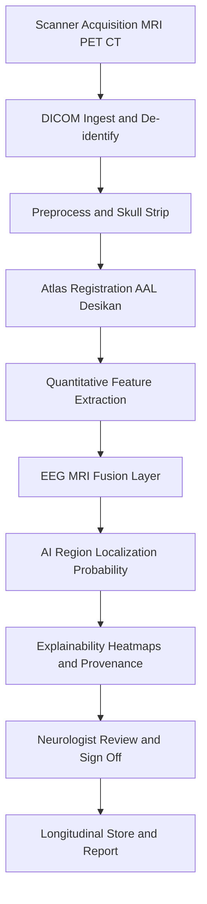
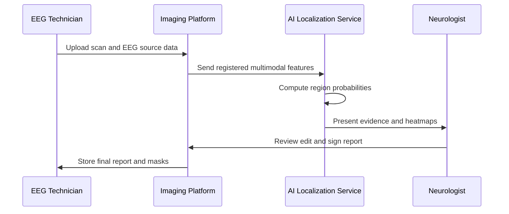
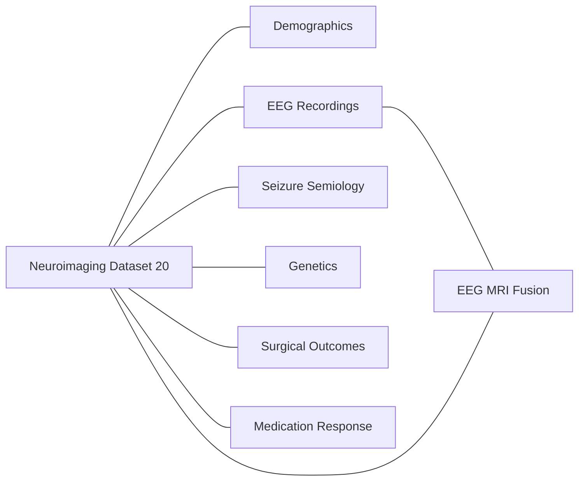
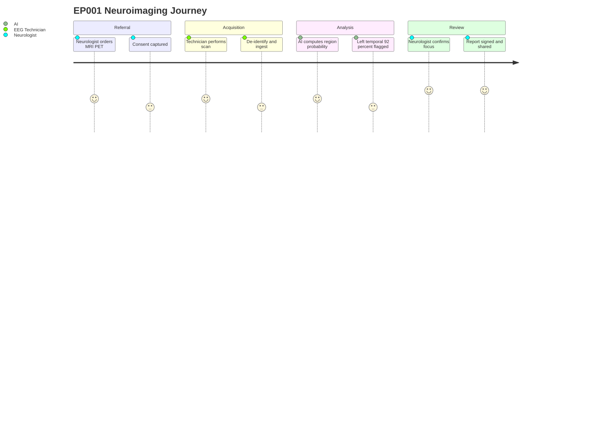

# Dataset 20 - Neuroimaging & Brain Mapping (MRI/fMRI/PET/CT/DTI)

> **Why (this doc):** Structural and functional neuroimaging is the anatomical backbone of epilepsy localization. This dossier defines the schema that lets the Enterprise AI Platform for Explainable Multimodal Epilepsy Intelligence fuse MRI, fMRI, PET, CT, and DTI into region-level evidence that *supports* — never replaces — clinician judgement about the epileptogenic zone.
> **How:** Each imaging modality, brain region, and derived metric is expressed as a governed field with an example anchored to reference test patient EP001 (29-year-old male, focal impaired awareness seizures, left-temporal focus). Tables carry captions, Mermaid diagrams show data and patient journeys, and every AI output is framed as decision support with human sign-off.

---

## 1. Problem

> **Why:** Frames the clinical gap neuroimaging must close in an epilepsy platform. **How:** States the localization and reproducibility problem in one paragraph before decomposing it.

Epilepsy affects roughly 50 million people worldwide, and up to a third are drug-resistant. For these patients, cure often depends on precisely locating the epileptogenic zone, yet subtle lesions such as focal cortical dysplasia or early hippocampal sclerosis are frequently missed on visual MRI review. Neuroimaging data is high-dimensional, multi-modal, and read inconsistently across sites, so the same scan can yield different localization conclusions. The platform needs a structured, quantitative neuroimaging dataset that makes region-level abnormality measurable, reproducible, and explainable.

## 2. Sub-Problems

> **Why:** Breaks the localization problem into tractable engineering and clinical pieces. **How:** Lists the discrete gaps each schema component addresses.

- Heterogeneous acquisition: T1, T2, FLAIR, SWI, DTI, fMRI, PET, and CT arrive in different formats, resolutions, and coordinate spaces.
- Quantification gap: visual reads rarely produce numeric hippocampal volumes, cortical thickness, FA/MD, or FDG asymmetry indices.
- Region attribution: findings must map to a standard atlas so they can be compared across patients and time.
- Multimodal fusion: EEG source localization and imaging abnormality must be reconciled in one coordinate frame.
- Explainability and safety: AI region probabilities must be interpretable and constrained to decision support.

## 3. Research Problem

> **Why:** Converts the sub-problems into one answerable research statement. **How:** Names inputs, output, and the explainability constraint.

How can a governed, atlas-referenced neuroimaging dataset — spanning structural, diffusion, functional, and metabolic modalities — be structured so that an explainable multimodal AI system produces reliable per-region epileptogenic-likelihood estimates that augment neurologist decision-making without ever autonomously diagnosing or recommending surgery?

## 4. Research Objective

> **Why:** Defines what success looks like. **How:** States measurable objectives tied to the schema.

Design and document a neuroimaging data dictionary that (1) normalizes all modalities into a common atlas space, (2) captures quantitative region-level biomarkers, (3) supports EEG-MRI fusion, and (4) exposes AI localization probabilities per region with confidence and provenance, all under a human-in-the-loop, decision-support-only governance model.

## 5. Flow

> **Why:** Shows how raw scans become governed, AI-ready region features. **How:** A left-to-right pipeline from acquisition to clinician-reviewed output.

*Caption - The flow below traces one imaging study from scanner acquisition through preprocessing, atlas registration, quantitative feature extraction, multimodal fusion, and AI localization to the neurologist review gate.*

## 6. Hypotheses

> **Why:** States testable claims the dataset enables. **How:** Null and alternative framed around region-level AI performance.

- H1: Quantitative multimodal features (hippocampal volume asymmetry, FLAIR signal, FDG hypometabolism, FA reduction) improve epileptogenic-zone localization over visual read alone.
- H0: Adding quantitative multimodal features produces no significant improvement in localization concordance with the surgical reference standard.
- H2: AI region-probability outputs agree with expert consensus at a clinically useful level while remaining interpretable via region-level attribution.

## 7. Statistical Analysis

> **Why:** Specifies how hypotheses are tested. **How:** Names estimands, metrics, and validation strategy.

*Caption - This table lists the primary statistical methods that operate on the dataset's quantitative fields, ensuring localization claims are evidenced rather than asserted.*

| Analysis | Description / Example |
| --- | --- |
| Asymmetry index | Left-right ratio for hippocampal volume and FDG uptake; EP001 left hippocampus 2.9 mL vs right 3.6 mL, AI of -19.5 percent |
| Concordance | Cohen kappa between AI region rank and surgical reference standard |
| Discrimination | AUROC / AUPRC for per-region epileptogenic likelihood |
| Group comparison | Mixed-effects models on cortical thickness and FA across regions |
| Longitudinal | Linear mixed models on volume change per visit over time |
| Calibration | Reliability curves and Brier score on AI probabilities |
| Multiple comparison | FDR correction across atlas regions |

---

## 8. Dataset Schema

> **Why:** This is the core data dictionary consumed by the platform. **How:** Presented as governed field tables per domain, each with an EP001 example.

### 8.1 Patient and Study Information

> **Why:** Anchors every image to a patient, study, and consent record. **How:** Identifiers plus acquisition context in one table.

*Caption - Study-level metadata links imaging to the patient and to consent and ordering provenance, so no region feature is ever orphaned from its clinical context.*

| Field | Description / Example |
| --- | --- |
| patient_id | Pseudonymized subject key; EP001 |
| study_uid | DICOM StudyInstanceUID; 1.2.840.113619.2.55.3.EP001 |
| age_at_scan | Age in years at acquisition; 29 |
| sex | Biological sex; Male |
| clinical_indication | Reason for scan; Focal impaired awareness seizures, suspected left temporal |
| ordering_role | Requesting clinician role; Neurologist |
| consent_id | Linked imaging-research consent record; CNS-EP001-2026 |
| scan_date | Acquisition date; 2026-05-14 |
| scanner_field | Magnet strength; 3T |

### 8.2 MRI Sequence Metadata

> **Why:** Different sequences reveal different pathology. **How:** One row per structural sequence with its role and finding.

*Caption - Structural MRI sequence metadata records what was acquired and its primary diagnostic role, letting the platform reason about whether a lesion was adequately sampled.*

| Field | Description / Example |
| --- | --- |
| t1_mprage | 3D T1 for anatomy and volumetry; 1 mm isotropic acquired |
| t2_tse | T2 for edema and gliosis; hyperintensity noted left mesial temporal |
| flair | Fluid-attenuated inversion recovery for cortical/mesial lesions; increased signal left hippocampus |
| swi | Susceptibility-weighted for microbleeds and calcification; no hemorrhage |
| slice_thickness_mm | In-plane resolution context; 1.0 |
| ct_series | CT for calcification/acute blood/bone; no acute finding |

### 8.3 Brain Regions

> **Why:** Region tagging enables cross-patient comparison. **How:** Lobar and deep structures with EP001 status.

*Caption - The region table enumerates the anatomical parcels scored by the platform; each becomes a row in downstream quantitative and AI-probability tables.*

| Field | Description / Example |
| --- | --- |
| frontal | Frontal lobe status; normal |
| temporal | Temporal lobe status; left mesial temporal abnormal |
| parietal | Parietal lobe status; normal |
| occipital | Occipital lobe status; normal |
| limbic | Limbic system including hippocampus/amygdala; left hippocampal atrophy |
| deep_gray | Thalamus, basal ganglia; symmetric |

### 8.4 Lesion Dataset and Measurements

> **Why:** Lesions are the surgical target when present. **How:** Geometry and character of each detected lesion.

*Caption - Lesion-level measurements quantify size, location, and type so subtle epileptogenic lesions can be tracked and compared rather than described only in prose.*

| Field | Description / Example |
| --- | --- |
| lesion_id | Unique lesion key; LES-EP001-01 |
| location_region | Atlas region; Left hippocampus |
| lesion_type | Suspected pathology; Mesial temporal sclerosis |
| volume_mm3 | Lesion volume; 640 |
| max_diameter_mm | Longest axis; 14 |
| flair_signal | Signal character; Hyperintense |
| detection_source | Visual, AI, or both; Both |

### 8.5 Hippocampal Volumes and Sclerosis

> **Why:** Hippocampal asymmetry is a key mesial temporal marker. **How:** Bilateral volumes and sclerosis grading.

*Caption - Hippocampal volumetry and sclerosis grading table the single most important quantitative biomarker for temporal-lobe epilepsy localization in EP001.*

| Field | Description / Example |
| --- | --- |
| left_hippocampus_ml | Left volume; 2.9 |
| right_hippocampus_ml | Right volume; 3.6 |
| asymmetry_pct | Left-right asymmetry; -19.5 |
| sclerosis_grade | ILAE HS classification; Type 1 |
| t2_relaxometry_ms | Quantitative T2 if available; elevated left |

### 8.6 Cortical Thickness

> **Why:** Thinning/thickening flags dysplasia and atrophy. **How:** Per-region thickness with normative comparison.

*Caption - Cortical thickness fields capture surface-based morphometry that can reveal focal cortical dysplasia invisible on routine visual inspection.*

| Field | Description / Example |
| --- | --- |
| region | Atlas parcel; Left entorhinal cortex |
| thickness_mm | Measured thickness; 2.1 |
| normative_z | Z-score vs age norm; -2.3 |
| flag | Abnormality flag; Thinned |

### 8.7 DTI Diffusion Metrics

> **Why:** White-matter integrity localizes network disruption. **How:** FA and MD per tract/region.

*Caption - Diffusion tensor metrics quantify white-matter microstructure so the platform can detect tract-level abnormality supporting a temporal focus.*

| Field | Description / Example |
| --- | --- |
| tract_region | Tract or region; Left cingulum |
| fractional_anisotropy | FA value 0 to 1; 0.38 reduced |
| mean_diffusivity | MD value; elevated left |
| fa_asymmetry_pct | Left-right FA asymmetry; -11 |

### 8.8 fMRI Functional Connectivity

> **Why:** Functional networks show epileptogenic disruption and eloquent cortex. **How:** Connectivity and language/memory mapping.

*Caption - Functional MRI connectivity fields characterize resting-state networks and eloquent-cortex proximity, informing safety of any downstream surgical planning support.*

| Field | Description / Example |
| --- | --- |
| network | Resting-state network; Default mode |
| connectivity_index | Region-to-network strength; reduced left temporal |
| language_lateralization | Language dominance; Left dominant |
| memory_activation | Mesial temporal memory activation; asymmetric, reduced left |

### 8.9 PET FDG Uptake and Hypometabolism

> **Why:** Interictal hypometabolism co-localizes the epileptogenic zone. **How:** SUV and asymmetry per region.

*Caption - FDG-PET metabolic fields quantify regional glucose uptake and interictal hypometabolism, a hallmark metabolic signature of the seizure focus.*

| Field | Description / Example |
| --- | --- |
| region | Atlas region; Left temporal lobe |
| suv_mean | Standardized uptake value; 5.1 |
| metabolic_asymmetry_pct | Left-right asymmetry; -16 |
| hypometabolism_flag | Below threshold; Yes left temporal |

### 8.10 Brain Connectivity Metrics

> **Why:** Graph metrics summarize network abnormality. **How:** Node and global connectome descriptors.

*Caption - Connectome graph metrics reduce whole-brain networks to interpretable node and global measures that AI models and clinicians can jointly inspect.*

| Field | Description / Example |
| --- | --- |
| node_degree | Region connections; left hippocampus reduced |
| betweenness | Hub centrality; altered left temporal |
| global_efficiency | Whole-network efficiency; 0.61 |
| modularity | Community structure; increased segregation |

### 8.11 Brain Atlas Reference

> **Why:** A shared parcellation makes everything comparable. **How:** Names the atlas and coordinate space per record.

*Caption - The atlas reference table pins every measurement to a named parcellation and coordinate space, the prerequisite for reproducible cross-patient and longitudinal analysis.*

| Field | Description / Example |
| --- | --- |
| atlas_name | Parcellation used; AAL3 and Desikan-Killiany |
| n_regions | Region count; 166 |
| coordinate_space | Registration space; MNI152 |
| registration_qc | Alignment quality; Passed |

### 8.12 EEG-MRI Fusion

> **Why:** Combining electrical source and anatomy sharpens localization. **How:** Source coordinates mapped to atlas regions.

*Caption - The fusion table reconciles EEG source localization with imaging abnormality in one coordinate frame, the multimodal core of the platform's localization evidence.*

| Field | Description / Example |
| --- | --- |
| eeg_source_region | ESI-localized region; Left temporal |
| concordance | Agreement with imaging focus; Concordant |
| source_confidence | ESI confidence; High |
| fused_focus_region | Combined estimate; Left mesial temporal |

### 8.13 Surgical Planning Support

> **Why:** Presurgical mapping must flag risk, not decide. **How:** Distances to eloquent cortex and candidacy notes for human review.

*Caption - Surgical planning support fields present eloquent-cortex proximity and resection-context information for the surgical team; the platform never recommends or plans surgery autonomously.*

| Field | Description / Example |
| --- | --- |
| target_region | Candidate zone under review; Left mesial temporal |
| eloquent_distance_mm | Distance to language/motor cortex; 18 |
| memory_risk_flag | Verbal memory risk note; Elevated, requires Wada/fMRI review |
| decision_status | Human decision state; Pending MDT review |

### 8.14 AI Localization Probability per Region

> **Why:** The headline AI output, scoped to decision support. **How:** Probability, confidence, and provenance per region.

*Caption - This table holds the model's per-region epileptogenic-likelihood estimates with calibrated confidence and provenance; for EP001 the left temporal region carries the highest support at 92 percent, presented to the neurologist as evidence, not a verdict.*

| Field | Description / Example |
| --- | --- |
| region | Atlas region; Left temporal |
| epileptogenic_probability | Model likelihood; 0.92 |
| confidence | Calibrated confidence band; High |
| contributing_features | Top drivers; HS volume, FLAIR, FDG hypometabolism |
| model_version | Model provenance; multimodal-transformer v2.1 |
| clinician_reviewed | Human sign-off; Pending |

### 8.15 Longitudinal Imaging

> **Why:** Progression tracking guides monitoring. **How:** Per-visit deltas on key biomarkers.

*Caption - Longitudinal fields record change over successive studies so atrophy or lesion evolution is quantified rather than re-estimated by eye at each visit.*

| Field | Description / Example |
| --- | --- |
| visit_number | Sequential study index; 2 |
| interval_months | Months since baseline; 12 |
| hippocampus_change_pct | Volume change; -1.8 |
| lesion_change | Lesion status change; Stable |

### 8.16 AI Models Applied

> **Why:** Documents which models operate on which data. **How:** Model, task, and input modality per row.

*Caption - This table maps each AI model to its imaging task and inputs, making the analytic pipeline auditable and clarifying that all outputs feed clinician review.*

| Field | Description / Example |
| --- | --- |
| cnn_3d | 3D CNN for lesion/HS classification on T1/FLAIR volumes |
| unet_nnunet | U-Net / nnU-Net for lesion and hippocampus segmentation |
| vit | Vision Transformer for multi-slice abnormality attention |
| gnn | Graph Neural Network on connectome metrics |
| multimodal_transformer | Fuses MRI, PET, DTI, EEG for region probability |

### 8.17 Output Files

> **Why:** Defines deliverables consumed downstream. **How:** File, format, and content per artifact.

*Caption - The output file table enumerates the machine- and human-readable artifacts the pipeline emits, each carrying provenance for reproducibility and audit.*

| Field | Description / Example |
| --- | --- |
| segmentation_nifti | Lesion/hippocampus masks; EP001_seg.nii.gz |
| region_features_csv | Quantitative per-region features; EP001_features.csv |
| localization_json | AI region probabilities and drivers; EP001_localization.json |
| explainability_png | Saliency/heatmap overlays; EP001_heatmap.png |
| clinical_report_pdf | Neurologist-reviewed summary; EP001_report.pdf |

---

## 9. Roles and Systems Interaction

> **Why:** Clarifies who touches the data and when. **How:** A sequence from acquisition to signed report.

*Caption - This sequence diagram shows the EEG Technician, Neurologist, imaging platform, and AI service exchanging data, ending at the human sign-off gate that governs every AI output.*

## 10. Dataset Integration

> **Why:** Neuroimaging is one node in a larger platform. **How:** Named links to sibling datasets.

*Caption - The integration table shows how Dataset 20 exchanges keys and features with other platform datasets, enabling multimodal reasoning across the full patient record.*

| Linked Dataset | Link Key | Integration Purpose |
| --- | --- | --- |
| Dataset 01 Patient Demographics | patient_id | Anchor age, sex, and clinical context |
| Dataset 05 EEG Recordings | patient_id + timestamp | EEG-MRI source fusion |
| Dataset 08 Seizure Semiology | patient_id | Correlate semiology with region findings |
| Dataset 12 Genetics | patient_id | Contextualize malformation/lesion etiology |
| Dataset 18 Surgical Outcomes | patient_id + lesion_id | Reference standard for localization validation |
| Dataset 22 Medication Response | patient_id | Relate imaging burden to drug resistance |

*Caption - The network graph below renders the same integration as an entity map so the neuroimaging dataset's central, multimodal role is visible at a glance.*

## 11. Patient Data Journey

> **Why:** Shows the experience behind the data. **How:** A journey from referral to reviewed result.

*Caption - This journey diagram follows EP001 from referral through scanning and AI-assisted review, emphasizing that satisfaction rises only after a neurologist confirms the findings.*

---

## 12. Professor Readiness (Defense Q&A)

> **Why:** Prepares for examiner scrutiny on rigor and ethics. **How:** Anticipated questions with concise, defensible answers.

### 12.1 How do you ensure the AI never autonomously diagnoses or recommends surgery?

> **Why:** Core safety boundary. **How:** Explains the governance control.

Every AI output — region probability, segmentation, or planning flag — is written to the record with a `clinician_reviewed` state and surfaced only as evidence with explainability overlays. No report is finalized and no surgical pathway advances without a neurologist's explicit sign-off and, for resection, a multidisciplinary team decision. The system is decision support, not an autonomous decision-maker.

### 12.2 How do you handle privacy, consent, and de-identification of imaging?

> **Why:** Imaging carries facial and identifying data. **How:** Describes the privacy pipeline.

Scans are de-identified at ingest, including DICOM tag scrubbing and defacing of 3D T1 volumes, and pseudonymized to `patient_id`. Each study links to a specific imaging-research consent record (EP001 CNS-EP001-2026); analyses are permitted only within the consented scope, and access is role-based and audited.

### 12.3 Why fuse EEG with MRI rather than rely on either alone?

> **Why:** Justifies the multimodal core. **How:** Explains complementary strengths.

EEG source localization provides electrophysiological timing and network onset but has limited spatial precision; MRI/PET/DTI provide anatomy, metabolism, and microstructure but not electrical dynamics. Fusing them in one MNI coordinate frame improves concordance and reduces false localization, which the concordance and AUROC analyses in Section 7 quantify against the surgical reference standard.

### 12.4 How is the 92 percent left-temporal probability for EP001 validated and calibrated?

> **Why:** Guards against overconfident numbers. **How:** Describes calibration and reference.

The probability is calibrated using reliability curves and Brier score, and validated against surgically confirmed outcomes (Dataset 18) using AUROC/AUPRC and Cohen kappa. It is reported with a confidence band and contributing features so the neurologist can weigh it, not defer to it.

### 12.5 What are the main biases and how do you mitigate them?

> **Why:** Examiners probe generalizability. **How:** Names sources and controls.

Scanner and field-strength variation, site-specific protocols, and demographic imbalance can bias features. Mitigations include atlas-space normalization, harmonization across scanners, normative z-scoring for cortical thickness, FDR correction across regions, and external validation before any clinical claim.

---

## 13. References

Fisher, R. S., Cross, J. H., French, J. A., Higurashi, N., Hirsch, E., Jansen, F. E., Lagae, L., Moshé, S. L., Peltola, J., Roulet Perez, E., Scheffer, I. E., & Zuberi, S. M. (2017). Operational classification of seizure types by the International League Against Epilepsy. *Epilepsia, 58*(4), 522–530. https://doi.org/10.1111/epi.13670

Topol, E. J. (2019). High-performance medicine: The convergence of human and artificial intelligence. *Nature Medicine, 25*(1), 44–56. https://doi.org/10.1038/s41591-018-0300-7

American Psychological Association. (2020). *Publication manual of the American Psychological Association* (7th ed.). American Psychological Association.

Blümcke, I., Thom, M., Aronica, E., Armstrong, D. D., Bartolomei, F., Bernasconi, A., Bernasconi, N., Bien, C. G., Cendes, F., Coras, R., Cross, J. H., Jacques, T. S., Kahane, P., Mathern, G. W., Miyata, H., Moshé, S. L., Oz, B., Özkara, Ç., Perucca, E., … Spreafico, R. (2013). International consensus classification of hippocampal sclerosis in temporal lobe epilepsy: A Task Force report from the ILAE Commission on Diagnostic Methods. *Epilepsia, 54*(7), 1315–1329. https://doi.org/10.1111/epi.12220

Bernasconi, A., Cendes, F., Theodore, W. H., Gill, R. S., Koepp, M. J., Hogan, R. E., Jackson, G. D., Federico, P., Labate, A., Vaudano, A. E., Blümcke, I., Ryvlin, P., & Bernasconi, N. (2019). Recommendations for the use of structural magnetic resonance imaging in the care of patients with epilepsy: A consensus report from the ILAE Neuroimaging Task Force. *Epilepsia, 60*(6), 1054–1068. https://doi.org/10.1111/epi.15612

Isensee, F., Jaeger, P. F., Kohl, S. A. A., Petersen, J., & Maier-Hein, K. H. (2021). nnU-Net: A self-configuring method for deep learning-based biomedical image segmentation. *Nature Methods, 18*(2), 203–211. https://doi.org/10.1038/s41592-020-01008-z

Scheffer, I. E., Berkovic, S., Capovilla, G., Connolly, M. B., French, J., Guilhoto, L., Hirsch, E., Jain, S., Mathern, G. W., Moshé, S. L., Nordli, D. R., Perucca, E., Tomson, T., Wiebe, S., Zhang, Y.-H., & Zuberi, S. M. (2017). ILAE classification of the epilepsies: Position paper of the ILAE Commission for Classification and Terminology. *Epilepsia, 58*(4), 512–521. https://doi.org/10.1111/epi.13709

World Health Organization. (2019). *Epilepsy: A public health imperative.* World Health Organization. https://www.who.int/publications/i/item/epilepsy-a-public-health-imperative
