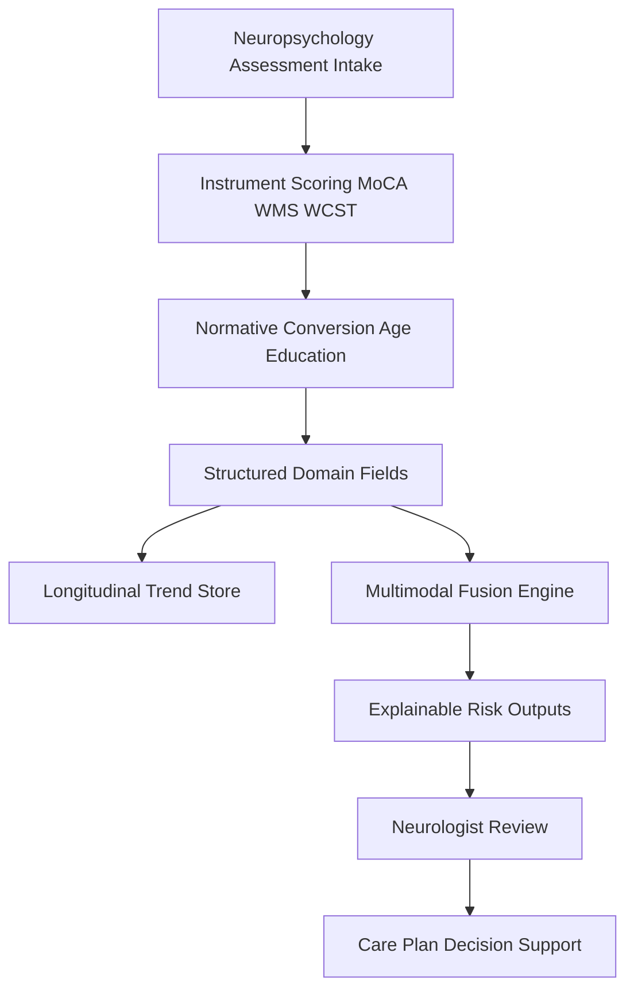
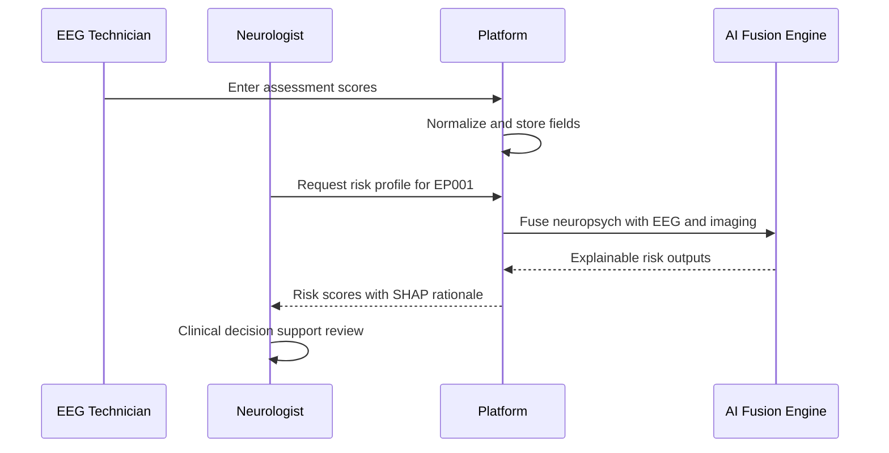
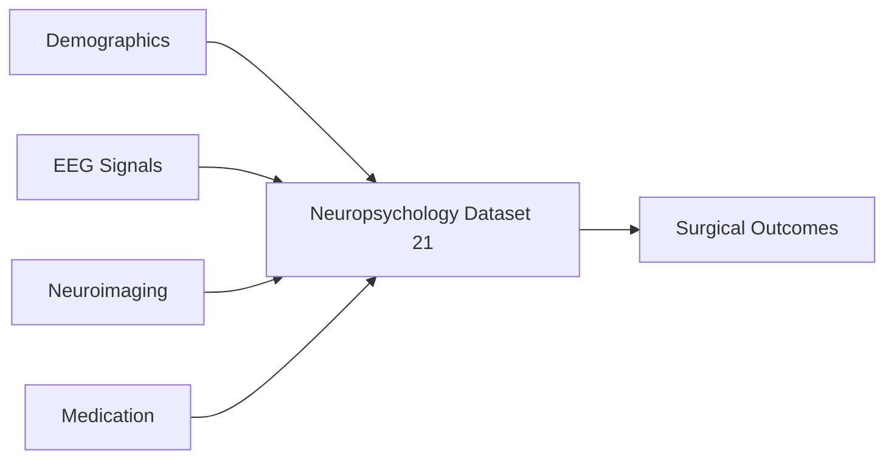
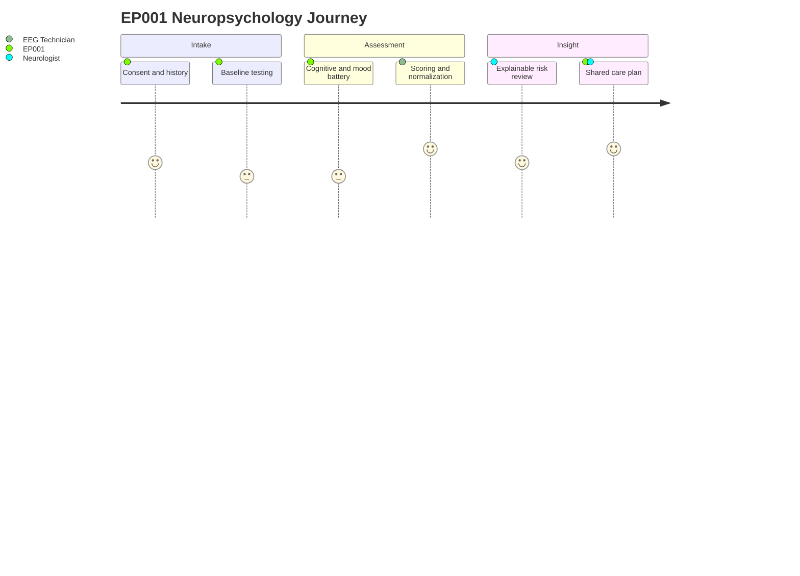

# Dataset 21 - Neuropsychology, Cognitive & Mental Health

> **Why (this doc):** Epilepsy is not only a disorder of seizures but of the whole brain, and cognitive impairment, depression, anxiety, and reduced quality of life are among the most disabling comorbidities for people living with epilepsy. This dossier defines the neuropsychology and mental-health dataset that lets the **Enterprise AI Platform for Explainable Multimodal Epilepsy Intelligence** quantify cognition, mood, sleep, and functional status so clinicians can act on the *person*, not just the EEG trace.
> **How:** It specifies every field, standardized instrument, output file, and applicable AI model as Markdown tables, wraps them in the mandatory research spine (Problem through Statistical Analysis), and visualizes data and role flows with four Mermaid diagrams. All AI components here are **decision support only** — the platform never autonomously diagnoses, prescribes, or recommends surgery.

---

## 1. Problem

> **Why:** Anchors the dataset in the real clinical gap it addresses. **How:** States the burden of cognitive and psychiatric comorbidity in epilepsy and why current workflows under-detect it.

People with epilepsy carry a cognitive and psychiatric burden that routine seizure-focused care systematically misses. Depression affects roughly a third of patients, cognitive complaints are near-universal, and yet neuropsychological data are collected in narrative reports that are unstructured, non-comparable across visits, and invisible to the rest of the care platform. Our reference patient **EP001** (29-year-old male, focal impaired-awareness seizures, left-temporal focus) is a canonical example: a left-temporal focus places verbal memory and naming at measurable risk, but that risk is buried in prose rather than surfaced as structured, longitudinal, model-ready signal.

## 2. Sub-Problems

> **Why:** Decomposes the headline problem into tractable data engineering and clinical sub-questions. **How:** Enumerates the specific gaps this dataset must close.

*Caption -* This table breaks the overarching problem into discrete sub-problems, each mapped to the dataset capability that resolves it, so scope is explicit and testable.

| Sub-Problem | Why it matters |
| --- | --- |
| Cognitive test scores live in free-text reports | Cannot be trended, compared, or fed to models |
| Mood/anxiety screening is inconsistent | Depression in epilepsy is under-detected and drives suicide risk |
| No standardized quality-of-life capture | QOLIE-31 rarely digitized or linked to outcomes |
| Surgical neuropsychology risk not quantified | Language dominance and memory-decline risk need structured encoding |
| Medication cognitive side-effects untracked | AED load impacts processing speed and attention |
| Longitudinal decline invisible | Single-timepoint scores hide trajectory |

## 3. Research Problem

> **Why:** Sharpens the sub-problems into one researchable statement. **How:** Frames the core question the dataset is built to answer.

*How can a standardized, longitudinal neuropsychology and mental-health dataset be structured so that explainable AI can estimate cognitive impairment, memory-decline risk, and depression risk in epilepsy patients — as decision support that augments, never replaces, the neurologist's judgment?*

## 4. Research Objective

> **Why:** Converts the research problem into concrete, verifiable goals. **How:** Lists measurable objectives the dataset and its models must satisfy.

*Caption -* This table states the objectives that govern dataset design and downstream model evaluation, giving the defense a clear yardstick for success.

| # | Objective |
| --- | --- |
| O1 | Digitize all major cognitive domains into structured, comparable fields |
| O2 | Embed validated mood, anxiety, sleep, and QOL instruments |
| O3 | Encode surgical neuropsychology risk (language dominance, memory risk) |
| O4 | Support longitudinal trend analysis across visits |
| O5 | Feed explainable risk models for cognition, memory, and depression |
| O6 | Preserve consent, privacy, and human-in-the-loop governance |

## 5. Flow

> **Why:** Shows how data moves from assessment to explainable output. **How:** A flowchart of the neuropsychology data lifecycle.

*Caption -* The flowchart traces raw assessment intake through scoring, normative conversion, fusion, and explainable output, clarifying where human review gates every AI inference.

## 6. Hypotheses

> **Why:** Makes the study falsifiable. **How:** States null and alternative hypotheses tied to the risk models.

*Caption -* This table lists the testable hypotheses linking structured neuropsychology features to clinical risk targets, framing the statistical work that follows.

| ID | Hypothesis |
| --- | --- |
| H1 | Structured verbal-memory decline predicts left-temporal surgical memory risk better than chance |
| H0-1 | Verbal-memory features carry no predictive signal for memory risk |
| H2 | Combined PHQ-9 and QOLIE-31 features improve depression-risk AUC over PHQ-9 alone |
| H0-2 | Adding QOLIE-31 does not improve depression-risk discrimination |
| H3 | AED cognitive-load features associate with processing-speed decline over time |

## 7. Statistical Analysis

> **Why:** Specifies how hypotheses are tested and models validated. **How:** Names methods, metrics, and validation strategy.

*Caption -* This table maps each analytic task to its statistical method and reporting metric, ensuring the neuropsychology models are evaluated rigorously and reproducibly.

| Analysis | Method | Metric |
| --- | --- | --- |
| Domain score normalization | Age/education-adjusted z-scores | z, percentile |
| Depression-risk model | Regularized logistic regression / gradient boosting | AUC, sensitivity, calibration |
| Memory-risk model | Survival / classification with SHAP explanations | C-index, AUC, SHAP |
| Longitudinal decline | Linear mixed-effects models | Slope, 95% CI |
| Reliability of change | Reliable Change Index (RCI) | RCI, p |
| Group comparisons | t-test / Mann-Whitney, ANOVA | p, effect size |

---

## Dataset Schema

> **Why:** Defines the concrete fields the platform stores and serves. **How:** Presents each neuropsychology domain as a Field/Description-Example table.

### Patient Profile

> **Why:** Establishes demographic and clinical context needed to interpret every cognitive score. **How:** Captures identifiers and epilepsy characteristics.

*Caption -* Neuropsychological norms depend on age, education, and handedness; this table anchors all scores to the correct normative frame and links them to the epilepsy focus.

| Field | Description / Example |
| --- | --- |
| patient_id | Platform identifier, e.g. EP001 |
| age_years | Age at assessment, e.g. 29 |
| sex | Biological sex, e.g. Male |
| education_years | Years of formal education, e.g. 16 |
| handedness | Edinburgh handedness, e.g. Right |
| seizure_type | e.g. Focal impaired awareness |
| focus_localization | e.g. Left temporal |
| assessment_date | ISO date, e.g. 2026-06-15 |

### Cognition (Global Screening)

> **Why:** Provides a fast global index of cognitive status. **How:** Stores MoCA and screening totals with cutoffs.

*Caption -* Global screening flags whether deeper domain testing is warranted; the MoCA total gives a single comparable number across visits.

| Field | Description / Example |
| --- | --- |
| moca_total | MoCA 0-30, e.g. 25 |
| moca_flag | Below cutoff, e.g. Borderline |
| global_cognition_z | Composite z-score, e.g. -0.4 |
| screening_notes | Free text, e.g. Mild attention lapses |

### Intelligence (IQ Indices)

> **Why:** Establishes baseline intellectual function to contextualize domain deficits. **How:** Records Wechsler index scores.

*Caption -* IQ indices differentiate a global low baseline from focal epilepsy-related deficits, preventing misattribution of low scores to seizures.

| Field | Description / Example |
| --- | --- |
| fsiq | Full-scale IQ, e.g. 104 |
| verbal_comprehension_index | VCI, e.g. 101 |
| perceptual_reasoning_index | PRI, e.g. 108 |
| working_memory_index | WMI, e.g. 96 |
| processing_speed_index | PSI, e.g. 92 |

### Memory (Immediate / Delayed / Verbal / Visual / Working)

> **Why:** Memory is the domain most at risk in temporal-lobe epilepsy. **How:** Captures WMS subdomains and retention.

*Caption -* For a left-temporal patient like EP001, verbal-memory scores are the single most clinically load-bearing fields; this table separates verbal from visual and immediate from delayed recall.

| Field | Description / Example |
| --- | --- |
| immediate_memory_index | WMS-IV, e.g. 94 |
| delayed_memory_index | WMS-IV, e.g. 88 |
| verbal_memory_z | Verbal recall z, e.g. -1.2 |
| visual_memory_z | Visual recall z, e.g. -0.3 |
| working_memory_z | e.g. -0.6 |
| retention_percent | Delayed/immediate, e.g. 78 |

### Attention

> **Why:** Attention deficits confound other domains and reflect AED load. **How:** Stores span and continuous-performance metrics.

*Caption -* Attention is a gatekeeper domain; low attention can artefactually depress memory and executive scores, so it is captured explicitly for interpretation.

| Field | Description / Example |
| --- | --- |
| digit_span_forward | e.g. 6 |
| digit_span_backward | e.g. 4 |
| sustained_attention_z | e.g. -0.5 |
| attention_flag | e.g. Mild impairment |

### Executive Function

> **Why:** Frontal/executive control predicts real-world functioning. **How:** Encodes WCST and set-shifting metrics.

*Caption -* Executive scores from the Wisconsin Card Sorting Test capture cognitive flexibility and perseveration, key to functional independence and medication management.

| Field | Description / Example |
| --- | --- |
| wcst_categories | Completed, e.g. 5 |
| wcst_perseverative_errors | e.g. 12 |
| set_shifting_z | e.g. -0.8 |
| executive_flag | e.g. Borderline |

### Language

> **Why:** Naming and language are at risk in dominant-hemisphere epilepsy. **How:** Stores confrontation naming and fluency.

*Caption -* Boston Naming performance is directly relevant to EP001's left-temporal focus and to pre-surgical language-dominance planning.

| Field | Description / Example |
| --- | --- |
| boston_naming_score | BNT 0-60, e.g. 52 |
| verbal_fluency_z | e.g. -0.7 |
| naming_flag | e.g. Mild anomia |
| language_notes | e.g. Word-finding pauses |

### Processing Speed

> **Why:** Slowed processing is a common AED and seizure effect. **How:** Records speed indices and timed tasks.

*Caption -* Processing-speed fields help disentangle drug-related slowing from primary cognitive impairment, informing medication-cognitive-impact modeling.

| Field | Description / Example |
| --- | --- |
| processing_speed_z | e.g. -1.0 |
| trail_making_a_seconds | e.g. 34 |
| trail_making_b_seconds | e.g. 82 |
| tmt_b_minus_a | e.g. 48 |

### Mood (Depression / Anxiety)

> **Why:** Depression and anxiety are the leading QOL determinants in epilepsy and carry suicide risk. **How:** Embeds PHQ-9 and GAD-7.

*Caption -* This table digitizes validated mood screening so the depression-risk model has structured input and clinicians receive an auditable flag, never an autonomous diagnosis.

| Field | Description / Example |
| --- | --- |
| phq9_total | PHQ-9 0-27, e.g. 11 |
| phq9_severity | e.g. Moderate |
| phq9_item9_suicidality | Flag, e.g. Denied |
| gad7_total | GAD-7 0-21, e.g. 8 |
| gad7_severity | e.g. Mild |
| mood_review_required | e.g. Yes |

### Sleep

> **Why:** Poor sleep worsens seizures and cognition bidirectionally. **How:** Captures sleep quality and daytime sleepiness.

*Caption -* Sleep is both a seizure trigger and a cognitive confounder, so it is stored as a first-class modifiable factor.

| Field | Description / Example |
| --- | --- |
| psqi_total | Pittsburgh index, e.g. 7 |
| epworth_score | Daytime sleepiness, e.g. 9 |
| sleep_flag | e.g. Poor sleep quality |

### Quality of Life (QOLIE-31)

> **Why:** The primary patient-reported outcome in epilepsy. **How:** Stores QOLIE-31 total and subscales.

*Caption -* QOLIE-31 is the epilepsy-specific QOL standard and a key predictor in the depression-risk hypothesis (H2); subscales are retained for explainability.

| Field | Description / Example |
| --- | --- |
| qolie31_total | 0-100, e.g. 62 |
| seizure_worry_subscale | e.g. 55 |
| emotional_wellbeing_subscale | e.g. 60 |
| cognitive_subscale | e.g. 58 |
| medication_effects_subscale | e.g. 65 |
| social_function_subscale | e.g. 70 |

### Functional Independence

> **Why:** Translates test scores into daily-living capacity. **How:** Records ADL/IADL status.

*Caption -* Functional fields ground abstract cognitive scores in real-world autonomy, which is what patients and families care about most.

| Field | Description / Example |
| --- | --- |
| iadl_score | Instrumental ADL, e.g. 7/8 |
| driving_status | e.g. Suspended per regulation |
| employment_status | e.g. Employed full-time |
| independence_flag | e.g. Independent |

### Behavior

> **Why:** Behavioral change can signal ictal, interictal, or medication effects. **How:** Captures behavioral inventory summaries.

*Caption -* Behavioral observations complement self-report and are often the earliest sign of AED or mood change noted by caregivers.

| Field | Description / Example |
| --- | --- |
| irritability_rating | e.g. Mild |
| impulsivity_flag | e.g. No |
| behavior_change_reported | e.g. Yes since dose change |
| behavior_source | e.g. Caregiver |

### Medication Cognitive Impact

> **Why:** AEDs are a major, modifiable driver of cognitive complaints. **How:** Links current regimen to cognitive load.

*Caption -* This table quantifies the anti-seizure-medication contribution to cognitive slowing so clinicians can weigh seizure control against cognitive cost.

| Field | Description / Example |
| --- | --- |
| aed_count | Number of ASMs, e.g. 2 |
| aed_cognitive_load_index | Derived 0-1, e.g. 0.4 |
| suspected_aed_effect | e.g. Topiramate word-finding |
| load_flag | e.g. Moderate |

### Caregiver Assessment

> **Why:** Collateral report improves validity of behavioral and functional data. **How:** Stores caregiver-rated burden and observations.

*Caption -* Caregiver input is essential where the patient underreports; it also captures caregiver burden, itself a care-plan target.

| Field | Description / Example |
| --- | --- |
| caregiver_relationship | e.g. Spouse |
| caregiver_burden_score | e.g. Moderate |
| caregiver_observed_decline | e.g. Yes memory |
| caregiver_notes | Free text |

### Surgical Neuropsychology (Language Dominance / Memory Risk)

> **Why:** Pre-surgical cognitive risk stratification is decision-critical. **How:** Encodes lateralization and predicted decline risk.

*Caption -* For a candidate like EP001, this table encodes language dominance and memory-decline risk that the platform surfaces as advisory input; the surgical decision always remains with the multidisciplinary team.

| Field | Description / Example |
| --- | --- |
| language_dominance | e.g. Left dominant |
| dominance_method | e.g. fMRI / Wada |
| verbal_memory_risk | e.g. Elevated |
| visual_memory_risk | e.g. Low |
| surgical_risk_summary | Advisory, e.g. Counsel on naming/memory risk |

### Longitudinal Cognitive Trend

> **Why:** Trajectory matters more than any single score. **How:** Stores baseline, follow-up, and change indices.

*Caption -* Longitudinal fields enable Reliable Change Index computation and mixed-effects trend modeling, the basis of hypothesis H3.

| Field | Description / Example |
| --- | --- |
| baseline_date | e.g. 2025-06-10 |
| followup_date | e.g. 2026-06-15 |
| memory_change_z | e.g. -0.5 |
| rci_memory | Reliable change flag, e.g. Significant decline |
| trend_direction | e.g. Declining |

### AI Fusion / Outputs

> **Why:** Defines the explainable risk products delivered to clinicians. **How:** Lists model outputs with confidence and rationale.

*Caption -* Each output carries a probability, a top-feature rationale, and a human-review flag, operationalizing the decision-support-not-autonomous-decision principle.

| Field | Description / Example |
| --- | --- |
| cognitive_impairment_risk | 0-1, e.g. 0.38 |
| memory_decline_risk | 0-1, e.g. 0.61 |
| depression_risk | 0-1, e.g. 0.54 |
| top_features | SHAP list, e.g. verbal_memory_z, phq9_total |
| model_confidence | e.g. 0.82 |
| requires_clinician_review | e.g. Yes |

### Standardized Instruments

> **Why:** Documents provenance and validity of every score. **How:** Maps each instrument to domain and scoring range.

*Caption -* This reference table ties raw fields to the validated instruments that produced them, supporting reproducibility and defense of measurement validity.

| Instrument | Domain | Range / Scoring |
| --- | --- | --- |
| MoCA | Global cognition | 0-30, higher better |
| WMS-IV | Memory | Index ~100 mean |
| WCST | Executive function | Categories, perseverative errors |
| Trail Making A/B | Attention / processing speed | Seconds, lower better |
| Boston Naming Test | Language | 0-60, higher better |
| PHQ-9 | Depression | 0-27, higher worse |
| GAD-7 | Anxiety | 0-21, higher worse |
| QOLIE-31 | Quality of life | 0-100, higher better |

## Output Files

> **Why:** Specifies the concrete artifacts the platform produces from this dataset. **How:** Lists each file, format, and consumer.

*Caption -* This table enumerates the machine- and human-readable outputs so downstream integration and audit are unambiguous.

| File | Format | Purpose / Consumer |
| --- | --- | --- |
| neuropsych_profile_EP001.json | JSON | Structured domain scores for fusion engine |
| cognitive_trend_EP001.csv | CSV | Longitudinal scores for trend models |
| mood_screening_EP001.json | JSON | PHQ-9 / GAD-7 results for depression model |
| qolie31_EP001.json | JSON | Quality-of-life subscales |
| surgical_neuropsych_report_EP001.pdf | PDF | Advisory pre-surgical summary for MDT |
| risk_outputs_EP001.json | JSON | Explainable risk scores with SHAP rationale |

## Applicable AI Models

> **Why:** Names the models that consume this dataset and their guardrails. **How:** Maps each model to task and explainability method.

*Caption -* This table binds each AI component to a specific decision-support task and its explainability mechanism, making the human-in-the-loop boundary explicit.

| Model | Task | Explainability / Guardrail |
| --- | --- | --- |
| Gradient-boosted depression-risk classifier | Flag elevated depression risk | SHAP; clinician review mandatory |
| Memory-decline risk model | Estimate surgical verbal-memory risk | SHAP; advisory to MDT only |
| Cognitive-impairment classifier | Global impairment probability | Feature attributions |
| Linear mixed-effects trend model | Longitudinal decline slope | Coefficients, CIs |
| Multimodal fusion transformer | Integrate with EEG/imaging datasets | Attention maps; no autonomous action |

## Dataset Integration

> **Why:** Shows how neuropsychology data links to the wider platform. **How:** Maps join keys and directional value to other datasets.

*Caption -* This integration table specifies how Dataset 21 connects to other platform datasets via patient_id, enabling true multimodal fusion while preserving modular governance.

| Linked Dataset | Link Key | Integration Value |
| --- | --- | --- |
| Dataset 01 Patient Demographics | patient_id | Normative context, consent status |
| Dataset 05 EEG Signals | patient_id | Correlate focus lateralization with cognition |
| Dataset 08 Neuroimaging MRI/fMRI | patient_id | Language dominance and structural correlates |
| Dataset 12 Medication / AED | patient_id | AED cognitive-load derivation |
| Dataset 17 Seizure Diary | patient_id | Seizure burden vs cognitive trend |
| Dataset 25 Surgical Outcomes | patient_id | Validate memory-risk predictions post-op |

### Roles and Systems Interaction

> **Why:** Clarifies who does what across the assessment-to-decision pipeline. **How:** A sequence diagram of Neurologist, EEG Technician, and platform systems.

*Caption -* The sequence diagram shows how the EEG Technician and Neurologist interact with the platform, emphasizing that AI outputs return to the Neurologist for the final decision.

### Dataset Entity Network

> **Why:** Visualizes how this dataset sits among platform datasets. **How:** A graph of entity relationships and integration edges.

*Caption -* The network graph situates Dataset 21 as a hub linking demographic, signal, imaging, medication, and outcome datasets, showing its role in multimodal fusion.

### Patient Data Journey

> **Why:** Communicates the patient experience across the assessment cycle. **How:** A Mermaid journey of EP001 through the pipeline.

*Caption -* The journey map follows EP001 from consent through assessment to a shared care-plan discussion, keeping the patient perspective central to the data lifecycle.

## Professor Readiness (Defense Q&A)

> **Why:** Prepares the candidate to defend design and ethics choices. **How:** Anticipated examiner questions as sub-headings with concise answers.

### How do you ensure the AI does not autonomously diagnose depression or decide surgery?

> **Why:** Tests the governance boundary. **How:** Explains the human-in-the-loop design.

Every model output is advisory and carries a `requires_clinician_review` flag plus SHAP rationale. The depression-risk score never becomes a diagnosis; it routes a case for clinician evaluation. Surgical memory-risk outputs are advisory input to the multidisciplinary team. The platform has no pathway to prescribe, diagnose, or order surgery — it is decision support only.

### How is consent and privacy handled for sensitive mental-health data?

> **Why:** Tests ethics and data-protection rigor. **How:** Describes consent and safeguards.

Mental-health and cognitive data are collected under explicit informed consent recorded in Dataset 01, with the right to withdraw. Data are de-identified for modeling, access-controlled by role (Neurologist, EEG Technician), and item-9 suicidality triggers an immediate human safety workflow rather than any automated action, consistent with APA (2020) ethical standards.

### Why standardized instruments rather than free-text notes?

> **Why:** Tests measurement validity. **How:** Justifies structured instrumentation.

Validated instruments (MoCA, WMS-IV, WCST, Boston Naming, PHQ-9, GAD-7, QOLIE-31) provide reliable, normed, comparable scores across visits and sites, enabling Reliable Change Index computation and defensible model inputs. Free text cannot support longitudinal trending or reproducible modeling.

### How do you handle the left-temporal memory-risk case like EP001?

> **Why:** Tests clinical reasoning. **How:** Explains focus-specific risk encoding.

For EP001's left-temporal focus, verbal-memory and naming fields are weighted and surfaced as an elevated `verbal_memory_risk` with transparent feature attribution. This informs pre-surgical counseling but is explicitly advisory; language dominance is confirmed by fMRI or Wada, and the MDT owns the decision.

### How will you validate the risk models?

> **Why:** Tests scientific rigor. **How:** Describes validation plan.

Models are validated with cross-validation and held-out cohorts, reporting AUC, calibration, sensitivity, and C-index, with prospective validation against Dataset 25 surgical outcomes. Longitudinal claims use mixed-effects models with reported slopes and confidence intervals.

## References

> **Why:** Grounds the dossier in authoritative sources. **How:** APA 7th edition reference list.

American Psychological Association. (2017). *Ethical principles of psychologists and code of conduct* (2002, amended 2017). https://www.apa.org/ethics/code

Fisher, R. S., Cross, J. H., French, J. A., Higurashi, N., Hirsch, E., Jansen, F. E., ... Zuberi, S. M. (2017). Operational classification of seizure types by the International League Against Epilepsy. *Epilepsia, 58*(4), 522-530. https://doi.org/10.1111/epi.13670

Kroenke, K., Spitzer, R. L., & Williams, J. B. W. (2001). The PHQ-9: Validity of a brief depression severity measure. *Journal of General Internal Medicine, 16*(9), 606-613. https://doi.org/10.1046/j.1525-1497.2001.016009606.x

Cramer, J. A., Perrine, K., Devinsky, O., Bryant-Comstock, L., Meador, K., & Hermann, B. (1998). Development and cross-cultural translations of a 31-item quality of life in epilepsy inventory (QOLIE-31). *Epilepsia, 39*(1), 81-88. https://doi.org/10.1111/j.1528-1157.1998.tb01278.x

Nasreddine, Z. S., Phillips, N. A., Bedirian, V., Charbonneau, S., Whitehead, V., Collin, I., ... Chertkow, H. (2005). The Montreal Cognitive Assessment, MoCA: A brief screening tool for mild cognitive impairment. *Journal of the American Geriatrics Society, 53*(4), 695-699. https://doi.org/10.1111/j.1532-5415.2005.53221.x

Kanner, A. M. (2016). Management of psychiatric and neurological comorbidities in epilepsy. *Nature Reviews Neurology, 12*(2), 106-116. https://doi.org/10.1038/nrneurol.2015.243

Topol, E. J. (2019). High-performance medicine: The convergence of human and artificial intelligence. *Nature Medicine, 25*(1), 44-56. https://doi.org/10.1038/s41591-018-0300-7

Rudin, C. (2019). Stop explaining black box machine learning models for high stakes decisions and use interpretable models instead. *Nature Machine Intelligence, 1*(5), 206-215. https://doi.org/10.1038/s42256-019-0048-x
