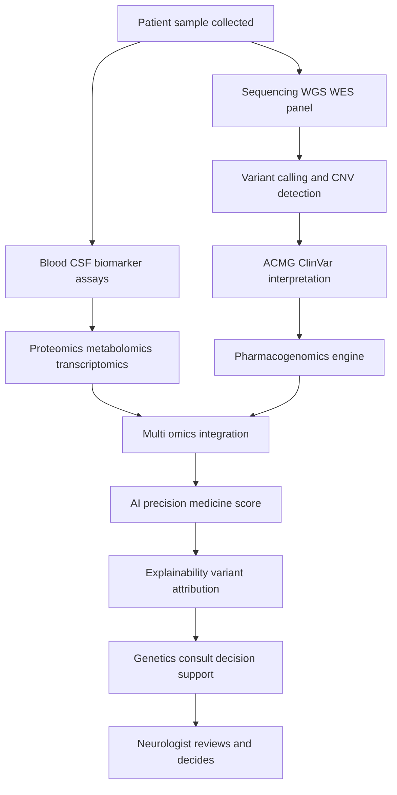
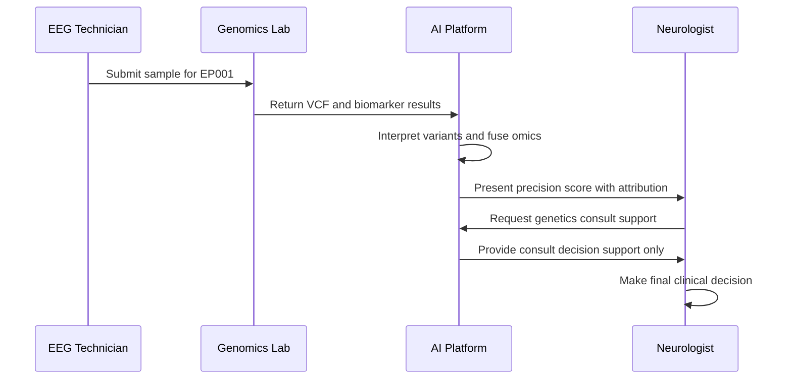
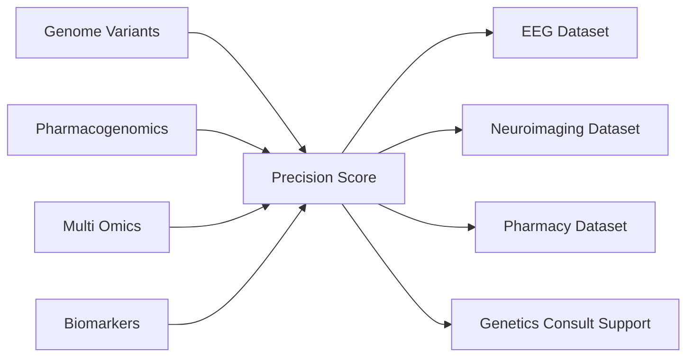
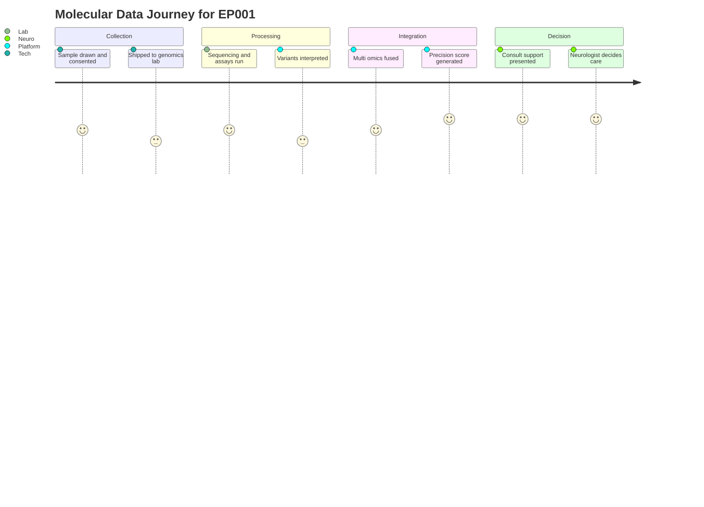

# Dataset 22 - Genomics, Precision Medicine & Biomarker

> **Why (this doc):** Epilepsy has a strong molecular substrate — monogenic channelopathies, copy number variants, pharmacogenomic risk alleles, and dysregulated inflammatory/metabolic pathways all shape seizure phenotype and drug response. This dossier defines the genomics, precision-medicine, and biomarker dataset that lets the Enterprise AI Platform for Explainable Multimodal Epilepsy Intelligence reason over molecular data alongside EEG, imaging, and clinical streams.
> **How:** It specifies the schema as Markdown tables (Field | Description/Example), maps the data flow and role interactions with Mermaid diagrams, shows integration with other platform datasets, and states the guardrail that all outputs are clinician decision support — the AI never autonomously diagnoses, prescribes, or recommends surgery.

---

## 1. Problem

> **Why:** Frame the clinical gap the molecular dataset addresses. **How:** State the burden of undiagnosed genetic epilepsy and mismatched drug therapy in plain terms.

Roughly a third of epilepsy has an identifiable genetic contribution, yet genetic and pharmacogenomic testing remains under-used at the point of care. Patients such as EP001 (29-year-old male, focal impaired awareness seizures, left-temporal focus) are often started on antiseizure medications without knowledge of variants that predict either efficacy or serious adverse reactions (for example HLA-linked carbamazepine hypersensitivity). The molecular signal that could personalise therapy is fragmented across labs, formats, and reports that never reach an integrated model.

## 2. Sub-Problems

> **Why:** Decompose the overall problem into tractable data challenges. **How:** Enumerate the distinct molecular data barriers.

*Caption - The sub-problems table isolates each obstacle so the schema can be designed to solve it explicitly rather than as a vague "genomics" catch-all.*

| Sub-Problem | Description / Example |
| --- | --- |
| Fragmented sequencing data | WGS, WES, and panel results live in separate lab systems with incompatible formats (VCF, BAM, PDF). |
| Variant interpretation drift | The same variant may be classified differently over time as ClinVar/ACMG evidence evolves. |
| Pharmacogenomic blind spots | HLA-B*15:02, CYP2C9, and POLG risk alleles are rarely surfaced before prescribing. |
| Multi-omics silos | Proteomics, metabolomics, and transcriptomics are stored apart from genomic variants. |
| Biomarker noise | Blood, CSF, inflammatory, and metabolic markers vary by assay and require harmonisation. |
| Explainability gap | Clinicians distrust a molecular risk score they cannot trace to specific variants or pathways. |

## 3. Research Problem

> **Why:** Sharpen the sub-problems into a single answerable statement. **How:** Express it as one scoped question.

Can a harmonised, standards-aligned genomics-and-biomarker dataset — spanning sequencing, variant interpretation, pharmacogenomics, and multi-omics — be structured so that explainable AI produces molecular decision-support that improves genetic diagnosis and drug-safety flagging in epilepsy, without ever issuing an autonomous clinical decision?

## 4. Research Objective

> **Why:** Convert the research problem into concrete, testable aims. **How:** List measurable objectives tied to the dataset.

*Caption - The objectives table defines what "success" means for the dataset and anchors later hypotheses and statistical tests.*

| Objective | Description / Example |
| --- | --- |
| O1 Harmonise molecular data | Unify WGS/WES/panel, variant, CNV, and omics data under common identifiers keyed to patient EP001. |
| O2 Standardise interpretation | Encode ACMG classes and ClinVar significance for every reported variant. |
| O3 Surface pharmacogenomic risk | Flag HLA-carbamazepine, CYP2C9-phenytoin, POLG-valproate risk before prescribing. |
| O4 Compute precision-medicine score | Produce an explainable multi-omics risk/response score with variant-level attribution. |
| O5 Route to human consult | Emit genetics-consult support recommendations, never autonomous prescriptions or surgery calls. |

## 5. Flow

> **Why:** Show how molecular data physically moves through the platform. **How:** A flowchart from raw sample to clinician-facing decision support.

*Caption - This diagram traces a specimen from collection through sequencing, interpretation, multi-omics fusion, and AI scoring to the neurologist, making the pipeline auditable.*

## 6. Hypotheses

> **Why:** State falsifiable expectations the dataset enables. **How:** Pair each hypothesis with its null.

*Caption - The hypotheses table gives the study its inferential backbone; each row is evaluated by the statistical methods in Section 7.*

| ID | Hypothesis | Null (H0) |
| --- | --- | --- |
| H1 | Multi-omics integration improves genetic-diagnosis yield over panel-only data. | No difference in diagnostic yield. |
| H2 | Pharmacogenomic flags reduce predicted serious adverse drug reactions. | PGx flags do not change predicted ADR rate. |
| H3 | The precision-medicine score predicts drug response better than clinical variables alone. | Score adds no predictive value. |
| H4 | Variant-level explanations increase clinician trust and consult uptake. | Explanations do not affect uptake. |

## 7. Statistical Analysis

> **Why:** Define how hypotheses are tested and how the dataset is validated. **How:** Map each method to a hypothesis and metric.

*Caption - This table binds analytic methods to hypotheses so reviewers can confirm the dataset supports rigorous, pre-specified inference rather than post-hoc storytelling.*

| Method | Applied To | Metric / Example |
| --- | --- | --- |
| Logistic regression / DeLong test | H1 diagnostic yield | AUC comparison, 95% CI |
| McNemar test | H2 PGx flag impact | Paired change in predicted ADR flags |
| Cox proportional hazards | H3 seizure-free survival | Hazard ratio for response |
| Multi-task calibration (Brier score) | H3 response prediction | Calibration slope, Brier |
| Cohen kappa | H2 ACMG concordance | Inter-rater agreement on variant class |
| Mixed-effects model | H4 consult uptake | Odds ratio with clinician random effect |

---

## 8. Dataset Schema

> **Why:** Specify every field a molecular record contains. **How:** Present each domain as a Field | Description/Example table.

### 8.1 Patient Genetics & Family History

> **Why:** Anchor molecular data to the individual and inheritance context. **How:** Capture identifiers, ancestry, and pedigree signals.

*Caption - Family history and ancestry frame variant interpretation (penetrance, founder effects) and are the entry point for all downstream genomic records.*

| Field | Description / Example |
| --- | --- |
| patient_id | Platform identifier, e.g. EP001 |
| sex_karyotype | Reported sex / karyotype, e.g. 46,XY male |
| age_at_test | Age at sample collection, e.g. 29 |
| genetic_ancestry | Inferred ancestry, e.g. Northern European |
| consanguinity_flag | Parental consanguinity, e.g. No |
| family_history_epilepsy | Affected relatives, e.g. maternal uncle focal epilepsy |
| pedigree_ref | Link to structured pedigree record, e.g. PED-EP001 |
| inheritance_pattern | Suspected mode, e.g. sporadic / autosomal dominant |

### 8.2 Whole Genome / Exome Sequencing

> **Why:** Record the sequencing substrate and its quality. **How:** Store assay metadata and coverage metrics.

*Caption - Sequencing QC fields let the model down-weight low-confidence calls and let auditors reproduce variant calling.*

| Field | Description / Example |
| --- | --- |
| assay_type | WGS, WES, or targeted panel, e.g. WES |
| platform | Sequencer, e.g. Illumina NovaSeq 6000 |
| reference_build | Genome build, e.g. GRCh38 |
| mean_coverage | Average read depth, e.g. 120x |
| pct_bases_20x | Percent bases at 20x, e.g. 98.4 |
| vcf_ref | Pointer to VCF artifact, e.g. EP001_WES.vcf.gz |
| bam_ref | Pointer to alignment file, e.g. EP001.bam |
| test_date | Date reported, e.g. 2026-05-14 |

### 8.3 Epilepsy Gene Panel

> **Why:** Curate the high-yield epilepsy genes for focused review. **How:** One row per curated gene with status.

*Caption - The curated panel encodes results for genes with established epilepsy associations, giving the model a prior on monogenic causes.*

| Field | Description / Example |
| --- | --- |
| gene_symbol | HGNC gene, e.g. SCN1A |
| gene_status | Reported result, e.g. no reportable variant |
| associated_phenotype | Known link, e.g. Dravet syndrome |
| panel_genes | Curated set: SCN1A, SCN2A, KCNQ2, DEPDC5, STXBP1, CDKL5, PCDH19, TSC1, TSC2 |
| transcript | Reference transcript, e.g. NM_001165963.4 |
| coverage_note | Region coverage caveat, e.g. exon 21 low depth |
| zygosity | Where variant present, e.g. heterozygous |

### 8.4 Variant Dataset (ACMG / ClinVar)

> **Why:** Record each variant with standards-based interpretation. **How:** Capture location, classification, and evidence links.

*Caption - This is the interpretive core: every reported variant carries ACMG class and ClinVar significance so the score is traceable to evidence.*

| Field | Description / Example |
| --- | --- |
| variant_id | Unique key, e.g. VAR-EP001-014 |
| gene | Affected gene, e.g. DEPDC5 |
| hgvs_c | Coding change, e.g. c.1264C>T |
| hgvs_p | Protein change, e.g. p.Arg422Ter |
| acmg_class | ACMG tier, e.g. Likely Pathogenic |
| acmg_criteria | Codes applied, e.g. PVS1, PM2, PP4 |
| clinvar_significance | ClinVar call, e.g. Pathogenic |
| clinvar_accession | Reference, e.g. VCV000123456 |
| allele_frequency | Population frequency, e.g. 0.00001 gnomAD |
| zygosity | State, e.g. heterozygous |

### 8.5 Copy Number Variants

> **Why:** Capture structural variation missed by SNV calling. **How:** Record CNV coordinates, dosage, and significance.

*Caption - CNVs (e.g. 15q13.3 deletions) are recurrent epilepsy causes; separate encoding prevents them being lost among point variants.*

| Field | Description / Example |
| --- | --- |
| cnv_id | Identifier, e.g. CNV-EP001-002 |
| cytoband | Location, e.g. 16p13.11 |
| cnv_type | Deletion or duplication, e.g. deletion |
| size_kb | Span in kb, e.g. 1520 |
| genes_affected | Overlapping genes, e.g. NDE1, MYH11 |
| dosage_sensitivity | Haploinsufficiency score, e.g. pHaplo 0.91 |
| classification | Clinical class, e.g. VUS |

### 8.6 Pharmacogenomics

> **Why:** Flag drug-gene interactions before prescribing. **How:** One row per actionable star-allele / HLA result.

*Caption - Pharmacogenomic rows drive the platform's drug-safety flags; these are the highest-actionability fields for prescribing support.*

| Field | Description / Example |
| --- | --- |
| pgx_gene | Gene tested, e.g. HLA-B |
| genotype | Diplotype / allele, e.g. HLA-B*15:02 negative |
| drug | Affected drug, e.g. Carbamazepine |
| risk_interpretation | Meaning, e.g. no increased SJS/TEN risk |
| cyp2c9_status | Phenytoin metaboliser, e.g. CYP2C9 *1/*3 intermediate |
| polg_status | Valproate risk, e.g. POLG no pathogenic variant |
| cpic_guideline | Guideline ref, e.g. CPIC HLA-B carbamazepine |
| action_flag | Support flag, e.g. standard dosing supported |

### 8.7 Drug Response

> **Why:** Link molecular profile to observed therapy outcome. **How:** Record medication, response, and tolerability.

*Caption - Drug-response records let the model learn genotype-to-response patterns and validate the precision-medicine score.*

| Field | Description / Example |
| --- | --- |
| medication | ASM name, e.g. Lamotrigine |
| dose | Current dose, e.g. 200 mg BID |
| response_status | Outcome, e.g. 50 percent seizure reduction |
| adverse_event | Reaction if any, e.g. none reported |
| serum_level | Therapeutic level, e.g. 8.2 mg/L |
| response_date | Assessment date, e.g. 2026-06-20 |

### 8.8 Blood, Inflammatory, Metabolic & CSF Biomarkers

> **Why:** Capture fluid biomarkers relevant to seizure biology. **How:** Store analyte, value, and reference range.

*Caption - Inflammatory and metabolic markers add a dynamic molecular layer that pure DNA data cannot provide, informing etiology and monitoring.*

| Field | Description / Example |
| --- | --- |
| analyte | Measured marker, e.g. IL-6 |
| specimen | Source, e.g. serum / CSF |
| value | Result, e.g. 4.1 pg/mL |
| reference_range | Normal band, e.g. 0-7 pg/mL |
| metabolic_marker | Metabolic analyte, e.g. lactate 1.8 mmol/L |
| csf_marker | CSF analyte, e.g. neuron-specific enolase 12 ng/mL |
| autoantibody | Autoimmune panel, e.g. anti-NMDAR negative |
| collection_date | Date drawn, e.g. 2026-05-14 |

### 8.9 Multi-Omics (Proteomics, Metabolomics, Transcriptomics)

> **Why:** Represent high-dimensional omics layers for integration. **How:** Store platform, feature space, and artifact pointers.

*Caption - Omics rows define the feature matrices the multi-omics integration model fuses; kept as references to keep the schema compact.*

| Field | Description / Example |
| --- | --- |
| omics_type | Layer, e.g. proteomics |
| platform | Assay, e.g. Olink Explore 3072 |
| feature_count | Number of features, e.g. 2925 proteins |
| normalization | Method, e.g. NPX quantile |
| matrix_ref | Pointer to feature matrix, e.g. EP001_proteomics.parquet |
| metabolomics_ref | Metabolome artifact, e.g. EP001_metabolome.parquet |
| transcriptomics_ref | Expression artifact, e.g. EP001_rnaseq.h5 |
| qc_status | QC pass flag, e.g. pass |

### 8.10 Precision Medicine Score & Recommendation Support

> **Why:** Record the AI output and its explanation. **How:** Store score, drivers, and the consult-support routing.

*Caption - This table captures the model's explainable output; note recommendations are consult support only, never autonomous prescriptions or surgery calls.*

| Field | Description / Example |
| --- | --- |
| precision_score | Integrated risk/response score, e.g. 0.72 |
| score_version | Model version, e.g. pm-score v2.3 |
| top_drivers | Variant/pathway attribution, e.g. DEPDC5 LP, mTOR pathway |
| drug_response_prediction | Predicted response, e.g. favourable to mTOR-directed care |
| pgx_alerts | Active safety flags, e.g. none |
| recommendation_support | Suggested next step, e.g. refer to clinical genetics consult |
| autonomy_flag | Governance, e.g. DECISION SUPPORT ONLY - human decides |
| generated_at | Timestamp, e.g. 2026-07-01T09:15Z |

---

## 9. Output Files

> **Why:** Enumerate the artifacts the pipeline emits. **How:** List file, format, and purpose.

*Caption - Output files are the machine-readable and human-readable deliverables that downstream datasets and clinicians consume.*

| Output File | Format / Purpose |
| --- | --- |
| annotated_variants.vcf | VCF with ACMG/ClinVar annotations |
| pgx_report.json | Structured pharmacogenomic flags for prescribing support |
| cnv_calls.bed | Copy number variant regions |
| multiomics_matrix.parquet | Fused proteomic/metabolomic/transcriptomic features |
| precision_score.json | Precision-medicine score with variant attribution |
| biomarker_panel.csv | Blood/CSF/inflammatory/metabolic results |
| genetics_consult_support.pdf | Human-readable consult decision-support summary |

## 10. Applicable AI Models

> **Why:** Name the models that consume this dataset. **How:** Map model type to its role.

*Caption - This table shows which architectures ingest the molecular data and what each contributes, supporting the explainability and multi-task goals.*

| Model | Role / Example |
| --- | --- |
| Graph Neural Network (GNN) | Model gene-variant-pathway networks for effect propagation |
| Multimodal Transformer | Fuse genomics, biomarkers, EEG, and imaging embeddings |
| Bayesian Model | Quantify uncertainty in variant pathogenicity and score |
| Survival Model | Cox/deep-survival for seizure-free time and response |
| Multi-Task Learner | Jointly predict diagnosis yield, drug response, and ADR risk |

## 11. Dataset Integration

> **Why:** Show how this dataset links to the wider platform. **How:** Map each linked dataset and the join key.

*Caption - Integration rows document how molecular records connect to clinical, EEG, imaging, and pharmacy datasets, enabling true multimodal reasoning.*

| Linked Dataset | Relationship / Join Key |
| --- | --- |
| Dataset - Patient Demographics | patient_id (EP001) links molecular record to identity |
| Dataset - EEG Signals | patient_id + timestamp aligns channelopathy variants with ictal patterns |
| Dataset - Neuroimaging | patient_id links TSC1/2 or DEPDC5 findings to MRI dysplasia |
| Dataset - Medication & Pharmacy | patient_id + drug links PGx flags to active prescriptions |
| Dataset - Seizure Diary | patient_id links drug-response outcomes to seizure counts |
| Dataset - Clinical Notes | patient_id links family history to structured narrative |

### 11.1 Role and System Interaction

> **Why:** Clarify who touches the data and when. **How:** A sequence diagram across roles and systems.

*Caption - This sequence shows the EEG Technician, lab, platform, and Neurologist collaborating so accountability stays with humans at every molecular decision point.*

### 11.2 Entity Integration Network

> **Why:** Visualise how molecular entities connect to platform datasets. **How:** A left-to-right graph of entities.

*Caption - The network graph maps the genomic entities to their neighbouring datasets, making cross-dataset joins explicit for engineers.*

### 11.3 Data Journey

> **Why:** Show the experience from sample to consult over time. **How:** A journey diagram of the molecular data lifecycle.

*Caption - The journey view communicates each stage's friction and value to non-technical reviewers, from collection to human decision.*

---

## 12. Professor Readiness (Defense Q&A)

> **Why:** Prepare defensible answers to likely examiner challenges. **How:** Pose each question as a heading with a concise, evidence-anchored answer.

### 12.1 How do you ensure a genomic variant classification is trustworthy and current?

Every variant carries ACMG criteria codes and a ClinVar accession, so the classification is traceable to published evidence. Because interpretation drifts, the dataset versions each variant record and re-runs interpretation against updated ClinVar releases; inter-rater agreement is monitored with Cohen kappa. The model surfaces the evidence, but a clinical geneticist confirms any reportable result.

### 12.2 How is patient privacy and consent handled for genomic and multi-omics data?

Genomic data is identifying and irrevocable, so records are pseudonymised behind the platform patient_id, access is role-restricted (Neurologist, EEG Technician), and every read is audit-logged. Consent is tiered and captured at collection, including explicit consent for secondary research use and for pharmacogenomic reporting; patients may withdraw, which propagates a suppression flag through all linked datasets. Handling follows APA and institutional data-governance standards.

### 12.3 Does the platform ever prescribe drugs or recommend surgery based on genetics?

No. The autonomy_flag on every score is set to DECISION SUPPORT ONLY. Pharmacogenomic outputs flag risk (for example HLA-B*15:02 and carbamazepine) and the score routes to a genetics consult, but the prescribing decision, dose change, and any surgical referral remain with the neurologist. The AI augments; it never autonomously diagnoses, prescribes, or recommends surgery.

### 12.4 How do you make a multi-omics score explainable to a skeptical clinician?

The GNN and multimodal transformer emit top_drivers — the specific variants, CNVs, and pathways (for example DEPDC5 and the mTOR pathway) that moved the score — alongside Bayesian uncertainty. Clinicians see not just a number but the molecular chain of evidence behind it, which is what H4 tests for consult uptake.

### 12.5 How do you validate that the dataset actually improves care?

Diagnostic yield is compared against panel-only baselines with DeLong AUC tests (H1), pharmacogenomic flag impact with McNemar (H2), and drug-response prediction with Cox models and Brier calibration (H3). Pre-specified analysis prevents post-hoc selection, and all claims are framed as decision support that a clinician acts upon.

---

## 13. References

> **Why:** Ground the dataset in authoritative literature and standards. **How:** APA 7th edition entries spanning classification, AI, ethics, genetics, and biomarkers.

American Psychological Association. (2020). *Publication manual of the American Psychological Association* (7th ed.). https://doi.org/10.1037/0000165-000

Fisher, R. S., Cross, J. H., French, J. A., Higurashi, N., Hirsch, E., Jansen, F. E., Lagae, L., Moshé, S. L., Peltola, J., Roulet Perez, E., Scheffer, I. E., & Zuberi, S. M. (2017). Operational classification of seizure types by the International League Against Epilepsy. *Epilepsia, 58*(4), 522-530. https://doi.org/10.1111/epi.13670

Richards, S., Aziz, N., Bale, S., Bick, D., Das, S., Gastier-Foster, J., Grody, W. W., Hegde, M., Lyon, E., Spector, E., Voelkerding, K., & Rehm, H. L. (2015). Standards and guidelines for the interpretation of sequence variants: A joint consensus recommendation of the American College of Medical Genetics and Genomics and the Association for Molecular Pathology. *Genetics in Medicine, 17*(5), 405-424. https://doi.org/10.1038/gim.2015.30

Landrum, M. J., Lee, J. M., Benson, M., Brown, G. R., Chao, C., Chitipiralla, S., Gu, B., Hart, J., Hoffman, D., Jang, W., Karapetyan, K., Katz, K., Liu, C., Maddipatla, Z., Malheiro, A., McDaniel, K., Ovetsky, M., Riley, G., Zhou, G., … Maglott, D. R. (2018). ClinVar: Improving access to variant interpretations and supporting evidence. *Nucleic Acids Research, 46*(D1), D1062-D1067. https://doi.org/10.1093/nar/gkx1153

Phillips, E. J., Sukasem, C., Whirl-Carrillo, M., Müller, D. J., Dunnenberger, H. M., Chantratita, W., Goldspiel, B., Chen, Y.-T., Carleton, B. C., George, A. L., Mushiroda, T., Klein, T., Gammal, R. S., & Pirmohamed, M. (2018). Clinical Pharmacogenetics Implementation Consortium guideline for HLA genotype and use of carbamazepine and oxcarbazepine: 2017 update. *Clinical Pharmacology & Therapeutics, 103*(4), 574-581. https://doi.org/10.1002/cpt.1004

Topol, E. J. (2019). High-performance medicine: The convergence of human and artificial intelligence. *Nature Medicine, 25*(1), 44-56. https://doi.org/10.1038/s41591-018-0300-7

Symonds, J. D., & McTague, A. (2020). Epilepsy and developmental disorders: Next generation sequencing in the clinic. *European Journal of Paediatric Neurology, 24*, 15-23. https://doi.org/10.1016/j.ejpn.2019.12.008

Vezzani, A., Balosso, S., & Ravizza, T. (2019). Neuroinflammatory pathways as treatment targets and biomarkers in epilepsy. *Nature Reviews Neurology, 15*(8), 459-472. https://doi.org/10.1038/s41582-019-0217-x

World Health Organization. (2019). *Epilepsy: A public health imperative*. World Health Organization. https://www.who.int/publications/i/item/epilepsy-a-public-health-imperative
