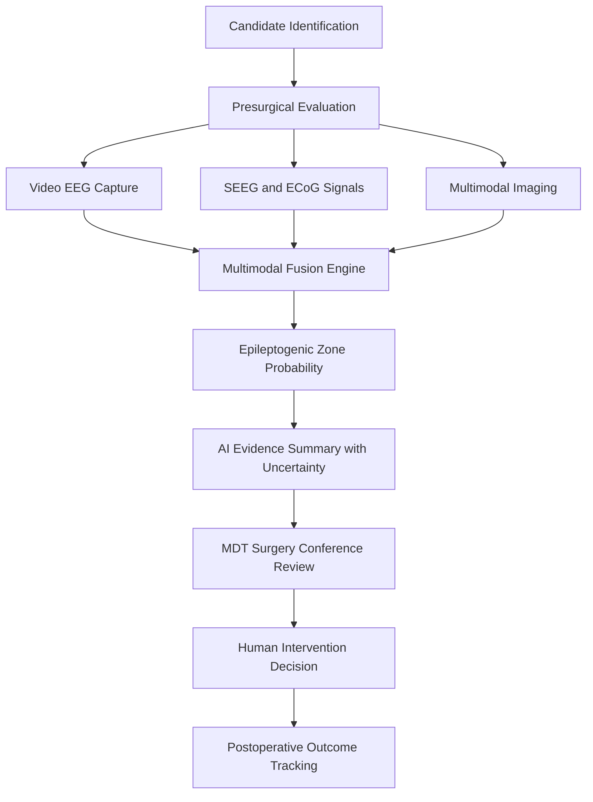
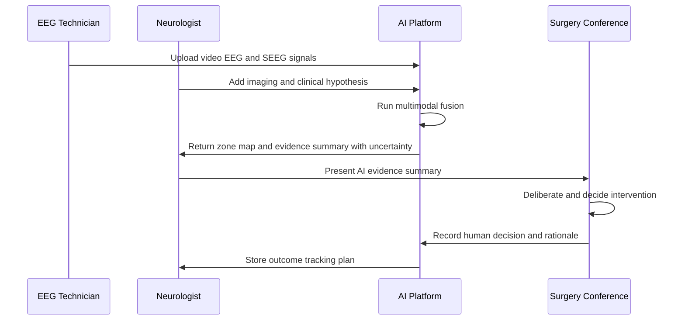
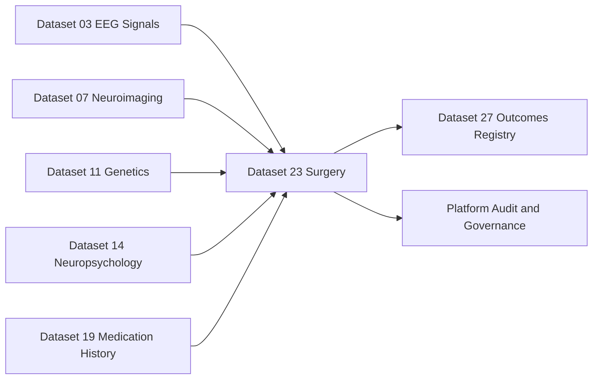
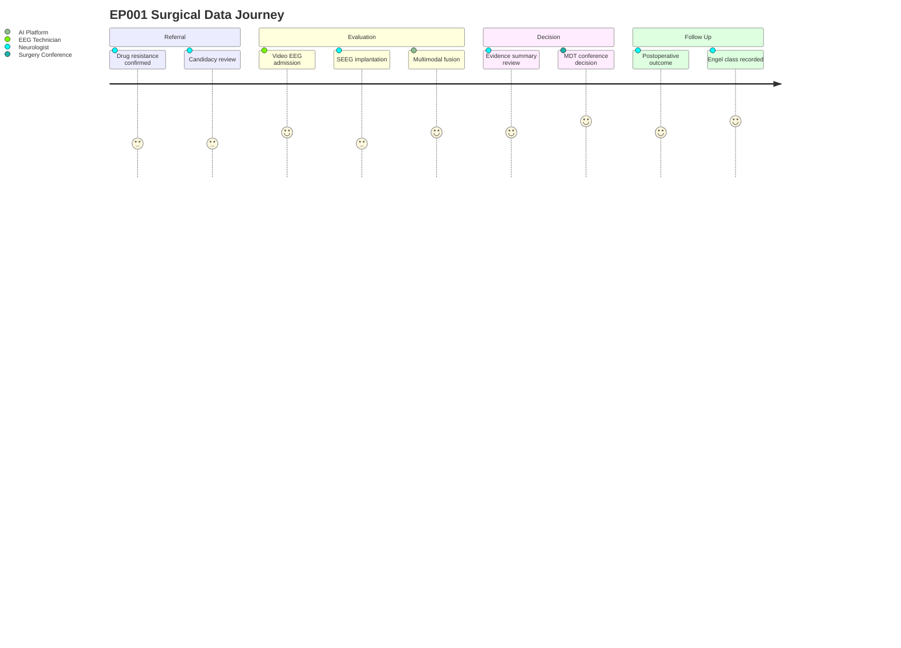

# Dataset 23 - Epilepsy Surgery, Intraoperative Monitoring & Neuromodulation

> **Why (this doc):** Drug-resistant epilepsy affects roughly one-third of people with epilepsy, and surgical or neuromodulatory intervention is the only path to seizure freedom for many of them; a rigorous, explainable dataset schema is needed so that the Enterprise AI Platform for Explainable Multimodal Epilepsy Intelligence can support presurgical decision-making without ever replacing the multidisciplinary team.
> **How:** This dossier defines the surgery/monitoring/neuromodulation data dictionary as Markdown tables, maps its integration with other platform datasets, illustrates data and role flows with four Mermaid diagrams, and frames every AI capability as decision support that summarizes evidence and refers to the epilepsy surgery conference — never as an autonomous recommender of surgery.

---

## 1. Problem

> **Why:** Anchors the dataset in the clinical reality it must serve. **How:** States the burden of drug-resistant epilepsy and the fragmentation of presurgical data.

Approximately 30% of people with epilepsy do not achieve seizure control with adequate trials of two tolerated, appropriately chosen antiseizure medications, meeting the ILAE definition of drug-resistant epilepsy. For these patients, resective surgery, laser ablation, or neuromodulation can dramatically reduce or eliminate seizures. Yet the presurgical evaluation generates heterogeneous, siloed data — video-EEG, stereo-EEG, imaging, neuropsychology, functional mapping — that is difficult to fuse, interpret, and audit. Reference patient EP001 (29-year-old male, focal impaired awareness seizures, left-temporal focus) exemplifies a candidate whose evaluation spans a dozen data sources that no single clinician can hold in working memory at once.

## 2. Sub-Problems

> **Why:** Decomposes the overarching problem into tractable data challenges. **How:** Enumerates the specific gaps this dataset closes.

*Caption - This table breaks the surgical-intelligence problem into discrete, addressable sub-problems, each of which maps to fields defined later in the dossier.*

| Sub-Problem | Description / Example |
| --- | --- |
| Candidate identification | Detecting when a patient meets drug-resistance criteria, e.g. EP001 failed lamotrigine and levetiracetam at adequate doses. |
| Data fusion | Aligning video-EEG, SEEG, MRI, PET, and MEG into one epileptogenic-zone estimate. |
| Zone localization uncertainty | Quantifying confidence in the epileptogenic zone rather than asserting a single point. |
| Eloquent cortex risk | Relating the resection target to language and motor maps to estimate deficit risk. |
| Intervention selection | Structuring options across resection, LITT, and neuromodulation for MDT review. |
| Outcome tracking | Standardizing follow-up with Engel and ILAE outcome scales. |

## 3. Research Problem

> **Why:** Converts the sub-problems into a single answerable research question. **How:** Frames it around explainable, uncertainty-aware decision support.

How can a multimodal dataset and explainable AI layer summarize presurgical epilepsy evidence and predict surgical outcomes with calibrated uncertainty, in a way that strengthens the multidisciplinary epilepsy surgery conference's decision-making while never autonomously recommending, prescribing, or performing surgery?

## 4. Research Objective

> **Why:** Declares what success looks like. **How:** Lists measurable objectives tied to the dataset.

*Caption - This table states the concrete objectives the dataset must enable, providing testable targets for the platform.*

| Objective | Description / Example |
| --- | --- |
| Standardize schema | Define a complete field dictionary for surgery, monitoring, and neuromodulation data. |
| Enable fusion | Support multimodal fusion into an epileptogenic-zone probability map for EP001. |
| Quantify uncertainty | Attach calibrated confidence intervals to every AI-generated outcome prediction. |
| Preserve human authority | Guarantee that all AI outputs route to the MDT conference as summarized evidence. |
| Track outcomes | Capture Engel and ILAE outcomes longitudinally for model validation. |

## 5. Flow

> **Why:** Shows how data moves from acquisition to decision support. **How:** A flowchart of the dataset pipeline.

*Caption - The flowchart below traces a record from candidate identification through fusion to MDT-facing decision support, making the human checkpoint explicit.*

## 6. Hypotheses

> **Why:** Makes the study falsifiable. **How:** States null and alternative hypotheses for the AI support layer.

*Caption - This table records the hypotheses the platform is designed to test, linking each to an outcome measure.*

| ID | Hypothesis |
| --- | --- |
| H1 | Multimodal fusion yields a higher concordance with the SEEG-defined epileptogenic zone than any single modality. |
| H0-1 | Fusion concordance equals best single-modality concordance. |
| H2 | Uncertainty-aware outcome prediction is better calibrated (lower Brier score) than a point-estimate model. |
| H0-2 | Calibration of the uncertainty-aware model equals that of the point-estimate model. |
| H3 | MDT decisions supported by AI evidence summaries show higher inter-rater agreement than unsupported decisions. |

## 7. Statistical Analysis

> **Why:** Specifies how hypotheses are evaluated. **How:** Names the methods and metrics.

*Caption - This table maps each analytic goal to a concrete statistical method, so reviewers can judge methodological soundness.*

| Analysis | Method / Metric |
| --- | --- |
| Zone concordance | Dice overlap and sensitivity vs SEEG reference, McNemar test across modalities. |
| Outcome prediction | Logistic and survival models for Engel I at 1 and 2 years; C-statistic, AUC. |
| Calibration | Brier score, reliability curves, expected calibration error. |
| Uncertainty | 95% credible intervals via Bayesian or conformal prediction. |
| Agreement | Cohen and Fleiss kappa for MDT inter-rater reliability. |

---

## 8. Dataset Content

> **Why:** This is the core data dictionary. **How:** Presents each domain of the surgical dataset as Field/Description tables.

### 8.1 Candidacy and Presurgical Evaluation

> **Why:** Defines who enters the surgical pathway and what baseline evidence exists. **How:** Fields for drug-resistance, candidacy, and phase-I workup.

*Caption - These fields capture the entry gate to surgery, ensuring drug-resistance is documented before any downstream intervention data is recorded.*

| Field | Description / Example |
| --- | --- |
| patient_id | Platform identifier, e.g. EP001. |
| drug_resistant_flag | Boolean per ILAE definition; EP001 = true after two failed ASMs. |
| failed_asms | List of adequately trialed medications, e.g. lamotrigine, levetiracetam. |
| surgical_candidate_status | Enum under_review, candidate, not_candidate, declined. |
| presurgical_phase | Enum phase_1_noninvasive, phase_2_invasive. |
| seizure_type | Focal impaired awareness for EP001. |
| hypothesized_focus | Anatomical hypothesis, e.g. left temporal. |
| neuropsych_summary | Baseline cognitive and language dominance findings. |
| referral_source | Referring neurologist or epilepsy center. |

### 8.2 Electrophysiological Monitoring

> **Why:** Captures the invasive and non-invasive recordings that localize seizures. **How:** Fields for video-EEG, SEEG, and ECoG.

*Caption - This table defines the signal-level evidence that dominates epileptogenic-zone localization, distinguishing scalp, depth, and surface recordings.*

| Field | Description / Example |
| --- | --- |
| video_eeg_session_id | Long-term monitoring admission identifier. |
| ictal_events_captured | Count and semiology of recorded seizures, e.g. 4 focal events. |
| seeg_implant_id | Stereo-EEG implantation record identifier. |
| seeg_electrode_count | Number of depth electrodes, e.g. 12 trajectories. |
| seeg_contacts | Per-contact anatomical labels and coordinates. |
| ecog_grid_id | Electrocorticography grid or strip identifier. |
| interictal_markers | Spikes, high-frequency oscillations per contact. |
| seizure_onset_contacts | Contacts showing earliest ictal change. |
| recording_sampling_rate | Signal sampling frequency, e.g. 2000 Hz. |

### 8.3 Functional Mapping and Fusion

> **Why:** Relates the epileptogenic target to eloquent cortex and merges modalities. **How:** Fields for stimulation mapping, functional maps, and the fused zone estimate.

*Caption - These fields encode both eloquent-cortex mapping and the multimodal fusion output, which together drive risk-benefit discussion at the MDT.*

| Field | Description / Example |
| --- | --- |
| electrical_stim_mapping | Cortical stimulation results per contact, e.g. language positive sites. |
| functional_map_source | fMRI, MEG, or direct stimulation. |
| eloquent_cortex_proximity | Distance from target to language or motor cortex in mm. |
| fusion_modalities_used | List, e.g. video_eeg, seeg, mri, pet, meg. |
| epileptogenic_zone_prob | Voxel-wise probability map handle for EP001 left temporal region. |
| fusion_confidence | Calibrated confidence score for the fused estimate. |
| concordance_flag | Whether modalities agree on the zone. |

### 8.4 Intervention and Surgical Planning

> **Why:** Records the planned and delivered interventions. **How:** Fields covering resection, LITT, and neuromodulation.

*Caption - This table catalogs every intervention option and delivered procedure, structured so the MDT sees a full menu rather than a single AI-preferred choice.*

| Field | Description / Example |
| --- | --- |
| planned_intervention | Enum resection, litt, vns, rns, dbs, none. |
| surgical_procedure | e.g. anterior temporal lobectomy, hemispherectomy, corpus callosotomy. |
| litt_target | Laser interstitial thermal therapy ablation target if applicable. |
| neuromod_device | VNS, RNS, or DBS device model if implanted. |
| neuromod_targets | Stimulation targets, e.g. anterior nucleus of thalamus for DBS. |
| planning_notes | Trajectory, margins, and eloquent-sparing plan. |
| mdt_decision_id | Link to the surgery conference decision record. |

### 8.5 Intraoperative Monitoring

> **Why:** Captures real-time safety signals during surgery. **How:** Fields for MEP and SSEP monitoring.

*Caption - These fields document intraoperative neurophysiology, the safety net that guards eloquent pathways during resection.*

| Field | Description / Example |
| --- | --- |
| iom_session_id | Intraoperative monitoring session identifier. |
| mep_baseline | Motor evoked potential baseline amplitudes. |
| mep_alerts | Timestamped significant MEP changes. |
| ssep_baseline | Somatosensory evoked potential baseline latencies. |
| ssep_alerts | Timestamped SSEP change events. |
| iom_actions_taken | Surgical responses to alerts, e.g. pause, irrigation. |

### 8.6 Outcomes and Complications

> **Why:** Closes the loop for model validation. **How:** Fields for complications and standardized outcome scales.

*Caption - This table standardizes postoperative outcome capture, providing the ground truth against which AI outcome predictions are validated.*

| Field | Description / Example |
| --- | --- |
| complications | Coded adverse events, e.g. transient dysphasia, infection, none. |
| engel_class | Engel I-IV at each follow-up; EP001 target Engel I. |
| ilae_outcome_class | ILAE surgical outcome class 1-6. |
| followup_interval | Months since surgery, e.g. 12, 24. |
| seizure_freedom_flag | Boolean at the given interval. |
| asm_status_postop | Medication changes after surgery. |
| qol_score | Quality-of-life instrument score if collected. |

### 8.7 AI Decision-Support Fields

> **Why:** Records AI outputs while enforcing the human-authority boundary. **How:** Fields that store summaries, predictions, and mandatory referral.

*Caption - These fields make the AI layer auditable and explicitly non-autonomous: every output is evidence for the MDT, carries uncertainty, and never states a surgery recommendation.*

| Field | Description / Example |
| --- | --- |
| ai_evidence_summary | Human-readable synthesis of multimodal findings for EP001. |
| ai_zone_explanation | Feature attributions behind the epileptogenic-zone estimate. |
| ai_outcome_prediction | Probability of Engel I with 95% interval, e.g. 0.72 [0.58-0.83]. |
| ai_uncertainty_flag | Elevated when modalities disagree or data are sparse. |
| ai_referral_action | Always refer_to_mdt_conference; never recommend_surgery. |
| ai_model_version | Traceable model identifier and version. |
| human_reviewer_id | Clinician who reviewed the AI output. |

## 9. Output Files

> **Why:** Defines the concrete artifacts the dataset produces. **How:** Lists file names, formats, and consumers.

*Caption - This table enumerates the machine- and human-readable outputs, clarifying which are AI evidence summaries versus raw signal exports.*

| Output File | Description / Example |
| --- | --- |
| ep_surgery_candidacy.parquet | Structured candidacy and drug-resistance records. |
| seeg_signals.edf | Standardized stereo-EEG signal export. |
| ecog_signals.edf | Electrocorticography signal export. |
| epileptogenic_zone_map.nii.gz | Voxel-wise zone probability volume, e.g. EP001. |
| functional_map.json | Stimulation and functional mapping results. |
| intraop_monitoring_log.json | MEP and SSEP events with timestamps. |
| ai_evidence_summary.pdf | Human-readable MDT briefing with uncertainty. |
| outcome_followup.parquet | Engel and ILAE outcomes over time. |
| audit_trail.jsonl | Full lineage of AI outputs and human reviews. |

## 10. Applicable AI Models

> **Why:** Names the model families the dataset feeds and constrains their role. **How:** Lists model types and their decision-support boundary.

*Caption - This table matches dataset content to appropriate model families while reiterating that each produces support, not autonomous decisions.*

| Model / Approach | Role (Decision Support Only) |
| --- | --- |
| Multimodal fusion network | Combine EEG, SEEG, imaging into a zone probability map. |
| Graph neural network | Model SEEG contact networks and propagation. |
| Bayesian or conformal predictor | Outcome prediction with calibrated uncertainty. |
| Explainability layer (SHAP, attention) | Produce feature attributions for the MDT. |
| NLP summarizer | Draft evidence summaries; never emit a surgery recommendation. |

## 11. System and Role Interactions

> **Why:** Shows who touches the data and in what order. **How:** A sequence diagram of roles and systems.

*Caption - The sequence below shows the Neurologist and EEG Technician interacting with platform systems, with the MDT as the sole decision authority.*

## 12. Dataset Integration

> **Why:** Situates Dataset 23 within the platform's data ecosystem. **How:** A table plus a network diagram of linkages.

*Caption - This integration table shows how the surgery dataset consumes from and contributes to sibling datasets, preventing duplication and preserving lineage.*

| Linked Dataset | Integration Description / Example |
| --- | --- |
| Dataset 03 EEG Signals | Supplies scalp video-EEG feeding candidacy and fusion. |
| Dataset 07 Neuroimaging | Provides MRI, PET, MEG for multimodal fusion. |
| Dataset 11 Genetics | Contributes genetic context for etiology and counseling. |
| Dataset 14 Neuropsychology | Supplies baseline language dominance and cognition. |
| Dataset 19 Medication History | Confirms drug-resistance via failed ASM trials. |
| Dataset 27 Outcomes Registry | Receives Engel and ILAE outcomes for longitudinal analysis. |

*Caption - The graph below visualizes the same integration as a network centered on the surgery dataset.*

## 13. Patient Data Journey

> **Why:** Communicates the lived path of a candidate through the data. **How:** A Mermaid journey for EP001.

*Caption - This journey traces EP001 from referral to follow-up, highlighting where data quality and human decisions shape experience.*

## 14. Professor Readiness (Defense Q&A)

> **Why:** Prepares the candidate for examiner scrutiny. **How:** Anticipates likely questions with concise, defensible answers.

### 14.1 How do you ensure the AI never recommends surgery on its own?

> **Why:** Tests the human-authority boundary. **How:** Points to schema-level enforcement.

The schema hard-codes ai_referral_action to refer_to_mdt_conference and forbids any recommend_surgery value. Every AI output is an evidence summary with uncertainty, logged with a human_reviewer_id, and the intervention decision is only ever written by the MDT conference record. The AI summarizes and refers; it does not diagnose, prescribe, or select surgery.

### 14.2 How do you handle patient consent and privacy for invasive recordings?

> **Why:** Tests ethics and privacy. **How:** Describes consent and de-identification controls.

Invasive SEEG and ECoG data are collected only under specific informed consent that covers research reuse, following APA and institutional review board standards. Identifiers are separated from signals, coordinates are stored in de-identified space, and the audit_trail records every access. Patients may withdraw consent, triggering downstream data handling per the governance policy.

### 14.3 Why quantify uncertainty rather than give a single outcome number?

> **Why:** Tests methodological rigor. **How:** Links calibration to clinical trust.

A point estimate can mislead the MDT into false confidence. Calibrated intervals via Bayesian or conformal methods communicate when evidence is thin or modalities disagree, so clinicians weigh the AI summary appropriately. Calibration is validated with Brier scores and reliability curves against recorded Engel and ILAE outcomes.

### 14.4 What prevents the fusion model from over-trusting one modality?

> **Why:** Tests robustness. **How:** Describes concordance checks and explainability.

The fusion output stores concordance_flag and per-modality attributions. When modalities disagree, ai_uncertainty_flag is raised and the evidence summary explicitly surfaces the conflict rather than silently averaging it. The explainability layer lets the neurologist inspect which contacts and voxels drove the estimate.

### 14.5 How is this decision support and not autonomous decision-making?

> **Why:** Tests the core framing. **How:** Restates the governance chain.

The platform's role ends at producing an explainable, uncertainty-aware evidence summary that a neurologist presents to the multidisciplinary surgery conference. Humans deliberate and decide; the AI never autonomously diagnoses, prescribes medication, or recommends or performs surgery. This mirrors Topol's vision of AI augmenting, not replacing, clinical judgment.

## 15. References

> **Why:** Grounds the dossier in authoritative sources. **How:** APA 7th edition entries spanning definitions, AI in medicine, ethics, and surgical epilepsy.

American Psychological Association. (2020). *Publication manual of the American Psychological Association* (7th ed.). American Psychological Association.

Fisher, R. S., Cross, J. H., French, J. A., Higurashi, N., Hirsch, E., Jansen, F. E., Lagae, L., Moshe, S. L., Peltola, J., Roulet Perez, E., Scheffer, I. E., & Zuberi, S. M. (2017). Operational classification of seizure types by the International League Against Epilepsy: Position paper of the ILAE Commission for Classification and Terminology. *Epilepsia, 58*(4), 522-530. https://doi.org/10.1111/epi.13670

Kwan, P., Arzimanoglou, A., Berg, A. T., Brodie, M. J., Hauser, W. A., Mathern, G., Moshe, S. L., Perucca, E., Wiebe, S., & French, J. (2010). Definition of drug resistant epilepsy: Consensus proposal by the ad hoc Task Force of the ILAE Commission on Therapeutic Strategies. *Epilepsia, 51*(6), 1069-1077. https://doi.org/10.1111/j.1528-1167.2009.02397.x

Wiebe, S., Blume, W. T., Girvin, J. P., & Eliasziw, M. (2001). A randomized, controlled trial of surgery for temporal-lobe epilepsy. *New England Journal of Medicine, 345*(5), 311-318. https://doi.org/10.1056/NEJM200108023450501

Jobst, B. C., & Cascino, G. D. (2015). Resective epilepsy surgery for drug-resistant focal epilepsy: A review. *JAMA, 313*(3), 285-293. https://doi.org/10.1001/jama.2014.17426

Topol, E. J. (2019). High-performance medicine: The convergence of human and artificial intelligence. *Nature Medicine, 25*(1), 44-56. https://doi.org/10.1038/s41591-018-0300-7

Scheffer, I. E., Berkovic, S., Capovilla, G., Connolly, M. B., French, J., Guilhoto, L., Hirsch, E., Jain, S., Mathern, G. W., Moshe, S. L., Nordli, D. R., Perucca, E., Tomson, T., Wiebe, S., Zhang, Y. H., & Zuberi, S. M. (2017). ILAE classification of the epilepsies: Position paper of the ILAE Commission for Classification and Terminology. *Epilepsia, 58*(4), 512-521. https://doi.org/10.1111/epi.13709

Fisher, R. S., Cross, J. H., D'Souza, C., French, J. A., Haut, S. R., Higurashi, N., Hirsch, E., Jansen, F. E., Lagae, L., Moshe, S. L., Peltola, J., Roulet Perez, E., Scheffer, I. E., Schulze-Bonhage, A., Somerville, E., Sperling, M., Yacubian, E. M., & Zuberi, S. M. (2017). Instruction manual for the ILAE 2017 operational classification of seizure types. *Epilepsia, 58*(4), 531-542. https://doi.org/10.1111/epi.13671

World Health Organization. (2019). *Epilepsy: A public health imperative*. World Health Organization.
