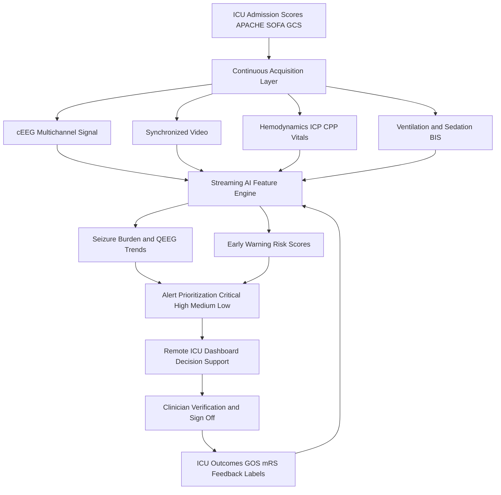
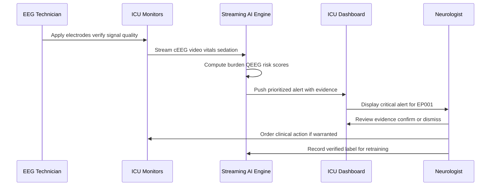
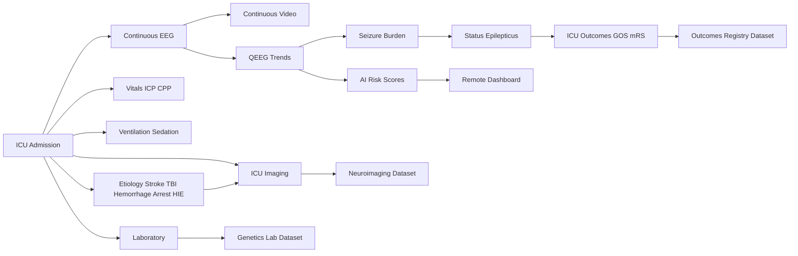
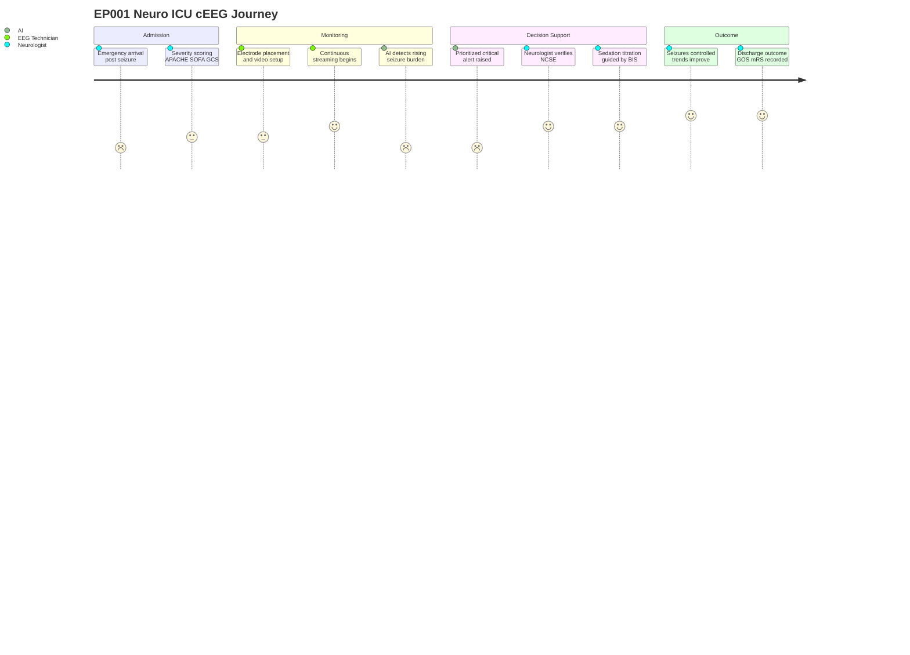

# Dataset 24 - ICU, Continuous Video EEG (cEEG) & Critical Care

> **Why (this doc):** Critically ill epilepsy and neuro-critical-care patients generate the platform's highest-stakes, highest-velocity data — continuous EEG, video, hemodynamics, ventilation, and sedation streams that must be fused in near real time to detect non-convulsive status epilepticus, ischemia, and neurological deterioration before irreversible injury. This dossier defines the schema, provenance, and governance of that ICU/cEEG dataset so it can power explainable, auditable decision *support*.
> **How:** It follows the research spine (Problem → Statistical Analysis), then specifies the dataset as Field/Description tables, four Mermaid views (data flow, role interaction, entity network, patient journey), a cross-dataset integration map, examiner Q&A, and APA-7 references. All AI functions are framed as clinician decision support — the platform never autonomously diagnoses, prescribes, or recommends surgery.

---

## 1. Problem

> **Why:** Frame the clinical and computational gap this dataset addresses. **How:** State the burden of undetected seizures and deterioration in the ICU and why current monitoring falls short.

Non-convulsive seizures (NCS) and non-convulsive status epilepticus (NCSE) are common in critically ill patients yet invisible to bedside observation because they produce little or no motor manifestation. Continuous EEG (cEEG) is the only reliable detector, but each 24-120 hour recording generates gigabytes of multichannel signal that a limited number of epileptologists must review retrospectively, often with a delay measured in hours. During that delay, ongoing electrographic seizures and rising seizure burden drive secondary neuronal injury, worsening outcomes after acute stroke, traumatic brain injury (TBI), intracranial hemorrhage, cardiac arrest, and neonatal hypoxic-ischemic encephalopathy (HIE). The problem is one of *timeliness, scale, and interpretability*: turning continuous multimodal ICU streams into prioritized, explainable alerts that reach the right clinician in time to act.

*Caption - The table below decomposes the ICU monitoring problem into its measurable pain points so each downstream objective and AI model maps to a concrete deficiency.*

| Field | Description / Example |
|---|---|
| Detection latency | Hours between seizure onset and human EEG review; target near real time |
| Seizure burden accrual | Cumulative electrographic seizure minutes per hour rising undetected |
| Reviewer scarcity | Few epileptologists for many concurrent cEEG beds |
| Signal volume | 24-120 h multichannel EEG + video + hemodynamics per admission |
| Alarm fatigue | Undifferentiated alerts desensitize staff to true events |
| Example patient | EP001, 29yo male, focal impaired awareness, left-temporal focus, admitted post prolonged seizure for cEEG rule-out of NCSE |

---

## 2. Sub-Problems

> **Why:** Break the macro problem into tractable engineering and clinical sub-questions. **How:** Enumerate discrete gaps that individual pipeline components resolve.

*Caption - This table lists the sub-problems so reviewers can trace each to a specific dataset field, diagram, or model later in the dossier.*

| Field | Description / Example |
|---|---|
| SP1 Seizure detection | Identify electrographic seizures and rhythmic/periodic patterns in cEEG |
| SP2 Burden quantification | Compute seizure burden and burst-suppression ratio over time |
| SP3 Deterioration forecasting | Predict neurological decline from EEG trends + ICP/CPP + vitals |
| SP4 Sedation control support | Relate BIS/suppression ratio to titration in refractory status |
| SP5 Multimodal fusion | Align EEG, video, ventilation, labs, imaging on one timeline |
| SP6 Alert prioritization | Rank events critical/high/medium/low to fight alarm fatigue |
| SP7 Explainability | Attribute each alert to signal evidence a clinician can verify |
| SP8 Outcome linkage | Connect ICU trajectories to GOS/mRS discharge outcomes |

---

## 3. Research Problem

> **Why:** Convert the sub-problems into one focused, researchable statement. **How:** Specify the fusion-and-explainability question at the dataset's core.

**Research Problem:** *Can an explainable, multimodal AI system continuously ingest ICU cEEG, video, hemodynamic, ventilation, and sedation data to detect electrographic seizures and neurological deterioration earlier than standard intermittent review, and deliver prioritized, clinician-verifiable decision support — without ever acting autonomously?*

---

## 4. Research Objective

> **Why:** Translate the problem into measurable objectives. **How:** Define what the dataset and its models must achieve and how success is measured.

*Caption - Objectives are tabulated with metrics so the statistical analysis section can bind each to a test and each AI model to an accountable target.*

| Field | Description / Example |
|---|---|
| O1 | Detect electrographic seizures with high sensitivity and low false-alarm rate vs expert cEEG annotation |
| O2 | Quantify seizure burden, alpha-delta ratio, spectral edge, and suppression ratio as continuous trends |
| O3 | Forecast neurological deterioration and mortality risk from fused streams |
| O4 | Prioritize alerts into critical/high/medium/low with explainable evidence |
| O5 | Link ICU trajectory to GOS/mRS outcomes for validation |
| O6 | Present all outputs as decision support on a remote ICU dashboard with clinician sign-off |

---

## 5. Flow

> **Why:** Give a narrative of how a record moves through the dataset before the formal diagrams. **How:** Describe ingestion to outcome linkage in one pass.

A neuro-ICU admission opens a record keyed to the patient (e.g., EP001). Admission severity scores (APACHE II, SOFA, GCS) are captured. cEEG electrodes and synchronized video begin streaming; hemodynamic (including ICP/CPP), ventilator, and sedation (BIS, suppression ratio) monitors feed the same timeline. Streaming AI computes quantitative EEG trends, seizure-burden curves, and early-warning risk scores continuously. Detected events are prioritized and pushed to the remote ICU dashboard, where a Neurologist verifies each alert and an EEG Technician confirms signal quality. Laboratory and imaging results are merged as they arrive. At discharge, outcomes (GOS, mRS) close the loop and become training labels.

### 5.1 Data Flow Diagram

> **Why:** Show the end-to-end path of ICU data. **How:** flowchart TD from acquisition to explainable dashboard.

### 5.2 Role and System Interaction

> **Why:** Clarify who touches the data and when. **How:** sequenceDiagram across roles and systems.

### 5.3 Dataset Entity Network

> **Why:** Show how this dataset's entities interconnect and bridge to other platform datasets. **How:** graph LR of entities and integration edges.

### 5.4 Patient Data Journey

> **Why:** Convey the lived timeline for a critically ill patient. **How:** journey diagram of EP001 through the ICU stay.

---

## 6. Hypotheses

> **Why:** State falsifiable claims the dataset enables. **How:** Pair each null and alternative with the metric that adjudicates it.

*Caption - Hypotheses are tabulated so the statistical analysis section can attach an explicit test and effect measure to each.*

| Field | Description / Example |
|---|---|
| H1 (alt) | AI cEEG detection reduces time-to-recognition of NCSE vs standard intermittent review |
| H1 (null) | No difference in time-to-recognition |
| H2 (alt) | Fused multimodal risk scores predict deterioration better than EEG alone |
| H2 (null) | Fusion adds no discriminative value |
| H3 (alt) | Alert prioritization lowers false-alarm burden without missing true events |
| H3 (null) | Prioritization changes neither false-alarm rate nor sensitivity |
| H4 (alt) | Higher AI-quantified seizure burden associates with worse GOS/mRS |
| H4 (null) | Seizure burden is unrelated to outcome |

---

## 7. Statistical Analysis

> **Why:** Specify how hypotheses are tested and models validated. **How:** Map each analysis to metrics, tests, and guardrails.

*Caption - This table binds objectives and hypotheses to concrete statistical methods so examiners can audit rigor and the decision-support (non-autonomous) boundary.*

| Field | Description / Example |
|---|---|
| Detection performance | Sensitivity, specificity, false alarms per hour, AUROC vs expert annotation |
| Agreement | Cohen kappa between AI events and epileptologist labels |
| Time-to-event | Cox proportional hazards and survival curves for deterioration and mortality |
| Fusion comparison | DeLong test comparing AUROC of multimodal vs EEG-only models |
| Trend association | Mixed-effects models linking alpha-delta ratio and burden to outcome |
| Outcome analysis | Ordinal logistic regression on GOS/mRS with confounder adjustment |
| Calibration | Brier score and calibration plots for AI risk scores |
| Uncertainty | Bayesian posterior credible intervals on risk estimates |
| Multiplicity | False discovery rate control across continuous alerting |
| Guardrail | All outputs reviewed by clinician; no metric triggers autonomous action |

---

## 8. Dataset Schema - ICU Admission and Severity

> **Why:** Establish the admission context that anchors every stream. **How:** Field/Example rows for severity and neurological baseline.

*Caption - Admission severity fixes the patient's baseline risk, letting later AI trends be interpreted relative to how sick the patient was on arrival.*

| Field | Description / Example |
|---|---|
| patient_id | Platform key, e.g., EP001 |
| icu_admission_id | Unique ICU stay identifier |
| admission_datetime | Timestamp of ICU admission |
| apache_ii_score | Acute Physiology and Chronic Health Evaluation II, e.g., 14 |
| sofa_score | Sequential Organ Failure Assessment, e.g., 6 |
| gcs_total | Glasgow Coma Scale total, e.g., 11 (E3 V3 M5) |
| admission_reason | e.g., prolonged focal seizure rule out NCSE |
| primary_etiology | Stroke, TBI, hemorrhage, cardiac arrest, HIE, epilepsy |
| epilepsy_history | Focal impaired awareness, left-temporal focus (EP001) |

---

## 9. Dataset Schema - Continuous EEG and Video

> **Why:** Define the core neurophysiology streams. **How:** Field/Example rows for cEEG signal, video, and derived seizure metrics.

*Caption - These are the highest-value fields: the raw and derived cEEG plus synchronized video that make electrographic seizures and status detectable.*

| Field | Description / Example |
|---|---|
| ceeg_start / ceeg_end | Recording window, typical duration 24-120 h |
| montage | Electrode montage, e.g., 10-20 international system |
| sampling_rate_hz | e.g., 256 Hz |
| channel_count | e.g., 21 channels |
| seizure_burden_pct | Percent of each hour in electrographic seizure, e.g., 18% |
| electrographic_seizure_count | Detected discrete seizures, e.g., 4 |
| burst_suppression_ratio | Fraction of epoch suppressed, e.g., 0.35 |
| periodic_pattern | GPDs, LPDs, or none per ACNS terminology |
| video_stream_id | Synchronized continuous video reference |
| video_event_flag | Clinical correlate observed on video, yes/no |
| signal_quality_index | Technician-verified quality, 0-1 |

---

## 10. Dataset Schema - Hemodynamics, Ventilation, Sedation

> **Why:** Capture the physiologic context that modulates brain state. **How:** Field/Example rows for ICP/CPP, ventilation, and sedation depth.

*Caption - Brain electrical activity cannot be interpreted without hemodynamic and sedation context; suppression from propofol looks different from ischemic suppression.*

| Field | Description / Example |
|---|---|
| icp_mmhg | Intracranial pressure, e.g., 14 mmHg |
| cpp_mmhg | Cerebral perfusion pressure, e.g., 68 mmHg |
| map_mmhg | Mean arterial pressure, e.g., 82 mmHg |
| heart_rate | e.g., 88 bpm |
| spo2_pct | Oxygen saturation, e.g., 97% |
| vent_mode | e.g., SIMV, PRVC, or none |
| fio2 / peep | Ventilator settings, e.g., 0.4 / 5 cmH2O |
| sedation_agent | e.g., propofol, midazolam |
| bis_index | Bispectral index depth of sedation, e.g., 45 |
| suppression_ratio | Sedation-driven EEG suppression, e.g., 0.20 |

---

## 11. Dataset Schema - Status Epilepticus and Etiology

> **Why:** Encode the acute diagnoses driving monitoring. **How:** Field/Example rows for SE subtypes and neuro-critical etiologies.

*Caption - This table distinguishes convulsive, non-convulsive, and refractory status and the underlying insult, which together determine treatment intensity and prognosis.*

| Field | Description / Example |
|---|---|
| se_type | Convulsive, non-convulsive (NCSE), or none |
| se_refractory_stage | Established, refractory, or super-refractory |
| se_onset_datetime | Time of status onset |
| etiology_stroke | Ischemic/hemorrhagic stroke flag and territory |
| etiology_tbi | TBI severity and mechanism |
| etiology_ich | Intracranial hemorrhage type and volume |
| etiology_cardiac_arrest | Post-arrest, downtime minutes, TTM status |
| etiology_neonatal_hie | HIE grade (Sarnat), cooling status (neonatal ICU) |
| treatment_line | First/second/third-line anti-seizure therapy given |

---

## 12. Dataset Schema - Laboratory and ICU Imaging

> **Why:** Provide biochemical and structural context. **How:** Field/Example rows for labs and imaging linked to the stay.

*Caption - Labs and imaging explain reversible seizure drivers and structural lesions, informing both the AI features and clinician verification.*

| Field | Description / Example |
|---|---|
| sodium / glucose | Metabolic seizure drivers, e.g., 138 mmol/L / 6.2 mmol/L |
| calcium / magnesium | Electrolyte panel values |
| lactate | Perfusion marker, e.g., 2.1 mmol/L |
| asm_level | Anti-seizure medication serum level |
| imaging_modality | CT, MRI, CT-angiography |
| imaging_datetime | Timestamp of ICU imaging |
| imaging_finding | e.g., left temporal encephalomalacia (EP001) |
| imaging_link | Reference into Neuroimaging dataset |

---

## 13. Dataset Schema - AI Monitoring, Trends, Alerts, Outcomes

> **Why:** Define the AI-produced fields consumed by the dashboard. **How:** Field/Example rows for QEEG trends, risk scores, alert priority, and outcomes.

*Caption - These derived fields are the decision-support surface; each is explainable and clinician-verifiable, and none triggers autonomous clinical action.*

| Field | Description / Example |
|---|---|
| alpha_delta_ratio | QEEG ischemia/arousal trend, e.g., 0.9 |
| spectral_edge_freq | 95% spectral edge frequency, e.g., 14 Hz |
| medication_response_index | Change in burden after ASM dose, e.g., -60% |
| ai_seizure_risk_score | 0-1 probability with credible interval |
| ai_deterioration_risk | Forecasted decline probability |
| early_warning_event | Flagged threshold crossing with timestamp |
| alert_priority | Critical, high, medium, or low |
| alert_evidence | Signal snippet and feature attribution for review |
| gos_score | Glasgow Outcome Scale at discharge, e.g., 4 |
| mrs_score | Modified Rankin Scale, e.g., 2 |
| clinician_verified | Boolean sign-off by Neurologist |

---

## 14. Dataset Integration

> **Why:** Show how this dataset links to the wider platform. **How:** Map integration keys and the direction of data exchange.

*Caption - The ICU/cEEG dataset is a hub feeding outcomes and pulling context from imaging, genetics, and pharmacology datasets; this table makes the join keys explicit.*

| Linked Dataset | Integration Key | Relationship / Example |
|---|---|---|
| Core Patient Registry | patient_id | Master demographics and epilepsy phenotype (EP001) |
| Routine EEG / Long-term Monitoring | patient_id | Baseline interictal EEG vs ICU cEEG comparison |
| Neuroimaging | imaging_link | ICU CT/MRI referenced to full imaging dataset |
| Genetics and Laboratory | patient_id | Metabolic and genetic seizure drivers |
| Pharmacology / ASM | asm_level, treatment_line | Drug levels and medication response context |
| Outcomes Registry | gos_score, mrs_score | Discharge and follow-up outcome linkage |
| Alert and Notification Service | alert_priority | Prioritized events routed to clinicians |

---

## 15. Output Files

> **Why:** Enumerate the concrete artifacts the pipeline emits. **How:** List file names, formats, and purpose.

*Caption - Standardized outputs let downstream datasets, dashboards, and audits consume ICU results without re-parsing raw streams.*

| Output File | Format | Purpose / Example |
|---|---|---|
| ceeg_signal_EP001.edf | EDF+ | Raw continuous EEG with annotations |
| ceeg_video_EP001.mp4 | MP4 | Synchronized continuous video |
| qeeg_trends_EP001.parquet | Parquet | Alpha-delta ratio, spectral edge, burden time series |
| seizure_events_EP001.json | JSON | Detected events with timestamps and evidence |
| ai_risk_scores_EP001.parquet | Parquet | Seizure and deterioration risk with credible intervals |
| alert_log_EP001.csv | CSV | Prioritized alerts and clinician verification status |
| icu_outcomes_EP001.json | JSON | GOS/mRS and discharge summary |
| explainability_report_EP001.html | HTML | Feature attributions per alert for defense/audit |

---

## 16. Applicable AI Models

> **Why:** State which models operate on this dataset and why each fits. **How:** Match model families to the ICU task they support, all as decision support.

*Caption - Each model targets a specific ICU sub-problem; the ensemble is explainable and advisory, with a clinician always in the loop.*

| Model | Role / Example |
|---|---|
| 1D CNN | Time-domain electrographic seizure detection on raw cEEG |
| EEGNet | Compact convolutional net for multichannel EEG pattern classification |
| Transformer | Long-range temporal modeling of 24-120 h sequences |
| Temporal Fusion Transformer (TFT) | Multimodal forecasting of deterioration from fused streams |
| Graph Neural Network (GNN) | Spatial channel-connectivity and cross-modal relations |
| Survival model | Time-to-deterioration and mortality hazard estimation |
| Bayesian model | Calibrated uncertainty and credible intervals on risk scores |

---

## 17. Professor Readiness (Defense Q&A)

> **Why:** Anticipate examiner scrutiny. **How:** Provide crisp, defensible answers covering ethics, privacy, consent, and the decision-support boundary.

### 17.1 How do you ensure the AI does not autonomously manage a critically ill patient?

> **Why:** Establish the non-autonomy guardrail. **How:** Describe the human-in-the-loop control.

Every AI output — seizure detection, risk score, prioritized alert — is advisory only. The system raises explainable alerts on the remote ICU dashboard, but a Neurologist must verify each event before any clinical action, and an EEG Technician confirms signal quality. The AI never titrates sedation, prescribes anti-seizure medication, diagnoses, or recommends surgery. Its role is to shorten time-to-recognition, not to decide.

### 17.2 How is patient consent and privacy handled for continuous video and EEG?

> **Why:** Address consent and surveillance concerns. **How:** Describe consent, de-identification, and access controls.

Continuous video EEG is high-sensitivity data. Consent (or, for incapacitated ICU patients, appropriate surrogate/emergency-research consent under IRB governance) is documented before recording where feasible and re-affirmed when capacity returns. Streams are encrypted in transit and at rest, faces are handled per institutional policy, and identifiers are separated from signal via a key vault. Access is role-restricted and fully audit-logged, consistent with HIPAA and GDPR principles.

### 17.3 How do you prevent alarm fatigue while keeping sensitivity high?

> **Why:** Justify the prioritization design. **How:** Explain tiered alerts and validation.

Alerts are tiered critical/high/medium/low using calibrated probabilities and clinical context (ICP/CPP, burden trajectory). Only critical/high events interrupt; lower tiers accumulate on the dashboard. Sensitivity and false-alarms-per-hour are validated against expert annotation, and thresholds are tuned to preserve high sensitivity for true electrographic seizures while suppressing benign artifact-driven flags. Technician signal-quality verification further filters noise.

### 17.4 How do you validate outputs given ICU heterogeneity across stroke, TBI, HIE, and cardiac arrest?

> **Why:** Address generalizability. **How:** Describe stratified evaluation and outcome linkage.

Models are evaluated stratified by etiology and by neonatal versus adult ICU, reporting per-subgroup sensitivity, calibration, and outcome association (GOS/mRS). Survival and Bayesian components expose uncertainty so low-confidence predictions are flagged rather than trusted blindly. External and prospective validation are planned before any clinical deployment.

### 17.5 What is the explainability story for a defense audience?

> **Why:** Demonstrate transparency. **How:** Describe evidence attached to every alert.

Each alert carries its evidence: the EEG snippet, the QEEG trend (alpha-delta ratio, spectral edge, suppression ratio), and feature attributions from the model. The explainability report renders these for retrospective audit. A clinician can therefore confirm *why* the system flagged an event, which is essential for trust, medico-legal accountability, and the decision-support framing.

---

## 18. References

> **Why:** Ground the dossier in authoritative literature. **How:** APA 7th edition entries spanning epilepsy classification, AI in medicine, ethics, and neuro-critical care.

American Psychological Association. (2020). *Publication manual of the American Psychological Association* (7th ed.). American Psychological Association.

Claassen, J., Mayer, S. A., Kowalski, R. G., Emerson, R. G., & Hirsch, L. J. (2004). Detection of electrographic seizures with continuous EEG monitoring in critically ill patients. *Neurology, 62*(10), 1743-1748. https://doi.org/10.1212/01.WNL.0000125184.88797.62

Fisher, R. S., Cross, J. H., French, J. A., Higurashi, N., Hirsch, E., Jansen, F. E., Lagae, L., Moshé, S. L., Peltola, J., Roulet Perez, E., Scheffer, I. E., & Zuberi, S. M. (2017). Operational classification of seizure types by the International League Against Epilepsy. *Epilepsia, 58*(4), 522-530. https://doi.org/10.1111/epi.13670

Herman, S. T., Abend, N. S., Bleck, T. P., Chapman, K. E., Drislane, F. W., Emerson, R. G., Gerard, E. E., Hahn, C. D., Husain, A. M., Kaplan, P. W., LaRoche, S. M., Nuwer, M. R., Quigg, M., Riviello, J. J., Schmitt, S. E., Simmons, L. A., Tsuchida, T. N., & Hirsch, L. J. (2015). Consensus statement on continuous EEG in critically ill adults and children, part I. *Journal of Clinical Neurophysiology, 32*(2), 87-95. https://doi.org/10.1097/WNP.0000000000000166

Hirsch, L. J., Fong, M. W. K., Leitinger, M., LaRoche, S. M., Beniczky, S., Abend, N. S., Lee, J. W., Wusthoff, C. J., Hahn, C. D., Westover, M. B., Gerard, E. E., Herman, S. T., Haider, H. A., Osman, G., Rodriguez-Ruiz, A., Maciel, C. B., Gilmore, E. J., Fernandez, A., Rosenthal, E. S., … Gaspard, N. (2021). American Clinical Neurophysiology Society's standardized critical care EEG terminology: 2021 version. *Journal of Clinical Neurophysiology, 38*(1), 1-29. https://doi.org/10.1097/WNP.0000000000000806

Rossetti, A. O., & Lowenstein, D. H. (2011). Management of refractory status epilepticus in adults. *The Lancet Neurology, 10*(10), 922-930. https://doi.org/10.1016/S1474-4422(11)70187-9

Topol, E. J. (2019). High-performance medicine: The convergence of human and artificial intelligence. *Nature Medicine, 25*(1), 44-56. https://doi.org/10.1038/s41591-018-0300-7

Trinka, E., Cock, H., Hesdorffer, D., Rossetti, A. O., Scheffer, I. E., Shinnar, S., Shorvon, S., & Lowenstein, D. H. (2015). A definition and classification of status epilepticus - Report of the ILAE Task Force on Classification of Status Epilepticus. *Epilepsia, 56*(10), 1515-1523. https://doi.org/10.1111/epi.13121

World Health Organization. (2019). *Epilepsy: A public health imperative*. World Health Organization. https://www.who.int/publications/i/item/epilepsy-a-public-health-imperative
