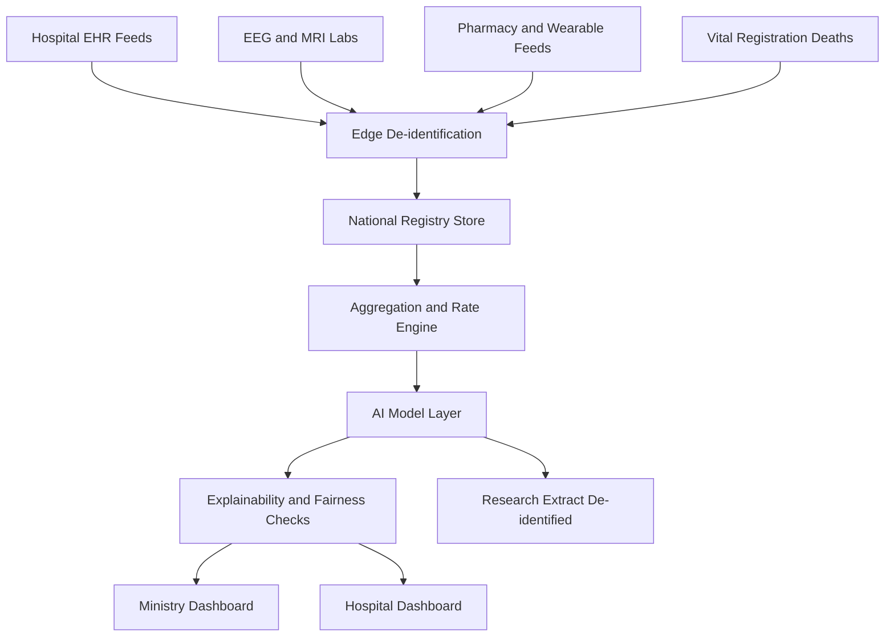
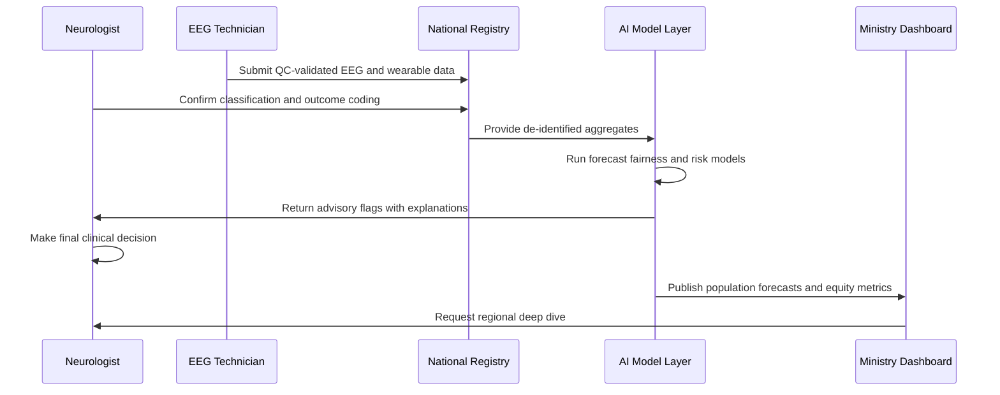
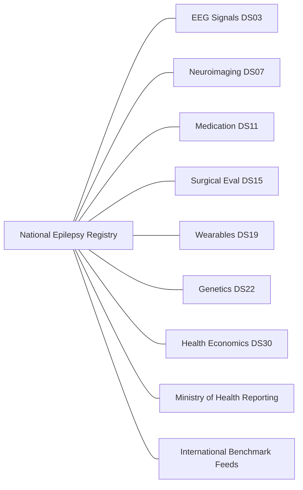
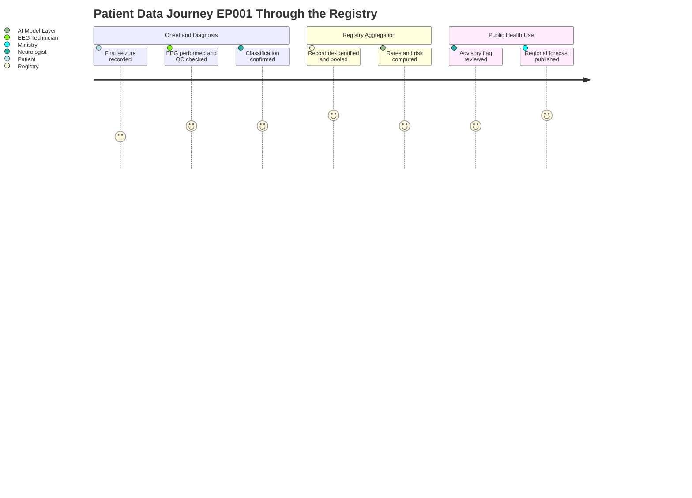

# Dataset 25 - Population Health, National Epilepsy Registry & Public Health

> **Why (this doc):** The Enterprise AI Platform for Explainable Multimodal Epilepsy Intelligence needs a population-scale evidence base so that individual clinical decisions (like those made for test patient EP001, a 29-year-old male with focal impaired awareness seizures and a left-temporal focus) are grounded in national epidemiology, equity monitoring, and health-system performance. This dossier defines the **National Epilepsy Registry** data dictionary: the fields, tables, entity network, and AI models that turn de-identified patient records into public-health intelligence.
> **How:** It follows a research spine (Problem → Sub-Problems → Research Problem → Objective → Flow → Hypotheses → Statistical Analysis), then presents every schema section as a Markdown table with a caption, includes four Mermaid diagrams, maps integration to other platform datasets, and closes with an examiner Q&A and APA 7 references. All AI here is **decision support only** — it forecasts, stratifies, and flags, but never autonomously diagnoses, prescribes, or recommends surgery.

---

## 1. Problem

> **Why:** Frame the population-level gap the registry exists to close. **How:** State the burden and the data fragmentation that blocks system-level action.

*Caption - This table anchors the whole dossier by quantifying why a national registry is needed: without pooled, standardized data, epilepsy care gaps stay invisible to planners.*

| Field | Description / Example |
|---|---|
| Burden | Epilepsy affects ~50 million people worldwide; a large treatment gap persists, especially in low-resource regions. |
| Fragmentation | Clinical data sits in siloed hospital EHRs, EEG labs, and pharmacy systems with no shared denominator. |
| Equity blind spot | Time-to-diagnosis, drug-resistance, and SUDEP mortality vary by geography and income but go unmeasured nationally. |
| Consequence | Ministries cannot target resources; AI models trained on single sites fail to generalize across the population. |

## 2. Sub-Problems

> **Why:** Decompose the macro problem into tractable data questions. **How:** Enumerate the specific measurement failures the registry schema must fix.

*Caption - Breaking the problem into sub-problems shows each registry section maps to a concrete unanswered question, justifying the schema's breadth.*

| Sub-Problem | Description / Example |
|---|---|
| SP1 Incidence/prevalence | No standardized national incidence or active-prevalence denominators. |
| SP2 Drug resistance | Proportion of drug-resistant epilepsy (ILAE definition) is unknown at scale. |
| SP3 Access equity | Time to first EEG/MRI and specialist review varies and is untracked. |
| SP4 Mortality/SUDEP | SUDEP and epilepsy-related deaths are under-ascertained. |
| SP5 AI oversight | No population registry of AI model accuracy, override rates, or fairness gaps. |
| SP6 Economics | Cost-per-patient, QALYs, and ICER for care pathways are not pooled. |

## 3. Research Problem

> **Why:** Converge the sub-problems into one researchable statement. **How:** Name the single question this dataset is designed to answer.

*Caption - The research problem sentence keeps the schema disciplined: every field must serve this one question.*

| Field | Description / Example |
|---|---|
| Research Problem | How can a de-identified national epilepsy registry, combined with explainable AI, measure population burden, monitor equity and AI fairness, and forecast demand to support (not replace) public-health decision-making? |

## 4. Research Objective

> **Why:** Convert the problem into measurable aims. **How:** List objectives that each yield a testable output in the schema.

*Caption - Objectives make the dossier auditable; each maps to a table or AI model later in the document.*

| Objective | Description / Example |
|---|---|
| O1 | Standardize national incidence, prevalence, and drug-resistance measurement. |
| O2 | Quantify care-access quality indicators (time to diagnosis, EEG, MRI). |
| O3 | Ascertain mortality and SUDEP with cause classification. |
| O4 | Monitor AI model accuracy, clinician override, and subgroup fairness. |
| O5 | Forecast service demand and stratify population risk for planning. |
| O6 | Compute health-economic metrics (cost, QALYs, ICER) for pathways. |

## 5. Flow

> **Why:** Show how data physically moves from source to public-health output. **How:** Narrate the pipeline that the first Mermaid diagram formalizes.

*Caption - The flow table and the flowchart below give reviewers a shared mental model of ingestion, de-identification, aggregation, and reporting.*

| Stage | Description / Example |
|---|---|
| Ingest | Hospital EHR, EEG lab, pharmacy, wearable, and vital-registration feeds. |
| De-identify | Hash patient IDs, apply k-anonymity, drop direct identifiers at the edge. |
| Aggregate | Roll up to district/region; compute rates against census denominators. |
| Model | Run forecasting, spatial, survival, causal, and GNN models. |
| Report | Render Ministry and Hospital executive dashboards with explanations. |

## 6. Hypotheses

> **Why:** State falsifiable expectations the registry can test. **How:** Pair each hypothesis with the analysis that will evaluate it.

*Caption - Explicit hypotheses turn the registry from a data lake into a research instrument with pre-specified tests.*

| ID | Hypothesis | Description / Example |
|---|---|---|
| H1 | Access gap | Longer time-to-EEG is associated with higher drug-resistance conversion. |
| H2 | Geographic equity | SUDEP mortality differs significantly across regions after age adjustment. |
| H3 | AI fairness | Model accuracy varies by subgroup unless fairness-constrained. |
| H4 | Economics | Earlier specialist referral lowers lifetime ICER per QALY. |
| H0 | Null | No regional difference in outcomes after risk adjustment. |

## 7. Statistical Analysis

> **Why:** Predefine methods to prevent post-hoc fishing. **How:** Map each hypothesis to an estimator and a correction strategy.

*Caption - This analysis plan documents the statistical machinery the registry supports, satisfying reproducibility expectations for a DBA defense.*

| Method | Description / Example |
|---|---|
| Directly age-standardized rates | Incidence/prevalence with 95% CIs against census weights. |
| Kaplan-Meier and Cox models | Time-to-diagnosis and survival/SUDEP hazard. |
| Poisson/negative binomial | Seizure-burden and utilization count outcomes. |
| Spatial scan (SaTScan-style) | Cluster detection for geographic hotspots. |
| Causal inference | Difference-in-differences and propensity weighting for policy effects. |
| Fairness metrics | Subgroup AUROC, equalized-odds gaps with bootstrap CIs. |
| Multiplicity control | Benjamini-Hochberg FDR across indicators. |

---

## 8. Registry Information

> **Why:** Define the registry's governance envelope. **How:** Capture provenance, scope, and consent basis per record.

*Caption - Establishes the registry's identity and legal basis so every downstream table inherits a clear governance context.*

| Field | Description / Example |
|---|---|
| registry_id | NER-2026-000001 |
| jurisdiction | National (all regions) |
| data_steward_role | Neurologist (clinical), EEG Technician (signal QC) |
| consent_basis | Broad de-identified research consent or public-health mandate |
| record_version | 3.2 |
| last_refresh | 2026-07-01 |

## 9. Population Demographics

> **Why:** Provide the denominator characteristics for every rate. **How:** Store de-identified age, sex, and geography bands.

*Caption - Demographics are the backbone of standardization; without these bands, no rate in the dossier is interpretable.*

| Field | Description / Example |
|---|---|
| patient_hash | SHA-256 pseudonymous key (EP001 -> 9f3a...) |
| age_band | 25-29 (EP001) |
| sex | Male (EP001) |
| region_code | R-04 Left-catchment district |
| urban_rural | Urban |
| socioeconomic_quintile | Q3 |

## 10. Epidemiology

> **Why:** Deliver the core public-health numbers. **How:** Compute incidence, prevalence, drug-resistance, and mortality rates.

*Caption - This is the registry's flagship output table; it converts individual records into the population metrics ministries act on.*

| Field | Description / Example |
|---|---|
| incidence_per_100k | 51.2 (new cases/year) |
| active_prevalence_per_1k | 7.6 |
| drug_resistant_pct | 31.4% (ILAE-defined) |
| all_cause_mortality_smr | 2.1 standardized mortality ratio |
| case_ascertainment_pct | 92% completeness estimate |

## 11. Disease Classification

> **Why:** Standardize how epilepsy type is coded. **How:** Use ILAE 2017 seizure and epilepsy classification fields.

*Caption - Consistent ILAE coding lets the registry compare like with like; EP001 illustrates a focal impaired-awareness entry.*

| Field | Description / Example |
|---|---|
| seizure_type | Focal impaired awareness (EP001) |
| epilepsy_type | Focal |
| etiology | Structural - left mesial temporal |
| syndrome | Temporal lobe epilepsy |
| icd11_code | 8A61.0 |

## 12. Seizure Burden

> **Why:** Measure disease severity across the population. **How:** Aggregate frequency and control status from diaries and wearables.

*Caption - Seizure-burden fields quantify the outcome that all interventions aim to reduce, feeding forecasting and economic models.*

| Field | Description / Example |
|---|---|
| median_monthly_seizures | 4 |
| seizure_free_12m_pct | 43% |
| status_epilepticus_events | 0.9 per 100 patient-years |
| burden_index | Composite 0-100 score |
| source | Diary + wearable-confirmed |

## 13. Healthcare Utilization

> **Why:** Track how the system is used. **How:** Count admissions, ED visits, and specialist contacts.

*Caption - Utilization data links clinical burden to system cost and demand, essential for the forecasting and economics sections.*

| Field | Description / Example |
|---|---|
| ed_visits_per_year | 1.3 |
| inpatient_admissions_per_year | 0.4 |
| neurology_visits_per_year | 2.6 |
| avg_length_of_stay_days | 3.1 |
| readmission_30d_pct | 11% |

## 14. Medication Registry

> **Why:** Monitor pharmacotherapy at scale. **How:** Record ASM regimens, adherence, and switches.

*Caption - The medication registry underpins drug-resistance definitions and pharmacovigilance; it is descriptive only and never auto-prescribes.*

| Field | Description / Example |
|---|---|
| asm_count | 2 concurrent ASMs (EP001) |
| primary_asm | Lamotrigine |
| adherence_pct | 88% (pharmacy-refill proxy) |
| regimen_changes_12m | 1 |
| adverse_event_flag | None recorded |

## 15. Surgery Registry

> **Why:** Capture surgical pathway data. **How:** Record evaluation, procedure, and eligibility status.

*Caption - Surgery fields are recorded for outcome tracking; the platform surfaces candidacy signals but never autonomously recommends surgery.*

| Field | Description / Example |
|---|---|
| presurgical_eval_status | Phase I complete (EP001) |
| candidacy_flag | Under MDT review (human-decided) |
| procedure_type | Not yet performed |
| procedure_date | Null |
| complication_grade | Not applicable |

## 16. Outcome Registry

> **Why:** Standardize outcome measurement. **How:** Use Engel/ILAE outcome scales and QoL scores.

*Caption - Outcome coding closes the loop between intervention and result, enabling causal and survival analyses.*

| Field | Description / Example |
|---|---|
| engel_class | Not applicable (non-surgical) |
| ilae_outcome | Class 3 |
| qolie_31_score | 62 |
| functional_status | Employed, driving restricted |
| followup_months | 18 |

## 17. Mortality and SUDEP Registry

> **Why:** Ascertain and classify deaths. **How:** Link vital registration and classify SUDEP category.

*Caption - SUDEP surveillance is a public-health priority; this table standardizes cause classification for mortality analytics.*

| Field | Description / Example |
|---|---|
| vital_status | Alive (EP001) |
| date_of_death | Null |
| sudep_category | Not applicable |
| cause_classification | Not applicable |
| autopsy_available | Not applicable |

## 18. Disability Registry

> **Why:** Measure functional impact beyond seizures. **How:** Record disability and comorbidity burden.

*Caption - Disability data captures the wider societal cost of epilepsy, informing QALY and equity analyses.*

| Field | Description / Example |
|---|---|
| disability_score | Mild (WHODAS band) |
| psychiatric_comorbidity | Anxiety (screened) |
| cognitive_impairment_flag | No |
| employment_status | Employed |
| caregiver_dependency | Independent |

## 19. Quality Indicators

> **Why:** Benchmark care-access timeliness. **How:** Measure intervals from onset to key diagnostics.

*Caption - Quality indicators expose access inequity; these intervals are the levers ministries can most directly improve.*

| Field | Description / Example |
|---|---|
| time_to_diagnosis_days | 96 (EP001) |
| time_to_first_eeg_days | 21 |
| time_to_mri_days | 44 |
| time_to_specialist_days | 30 |
| guideline_concordance_pct | 84% |

## 20. AI Registry

> **Why:** Govern AI performance transparently. **How:** Log accuracy, override, and fairness per deployed model.

*Caption - The AI registry is the accountability backbone; it records that clinicians retain final authority and that fairness is continuously monitored.*

| Field | Description / Example |
|---|---|
| model_id | EEG-FOCUS-v4 |
| population_auroc | 0.91 |
| clinician_override_rate | 12% (human authority preserved) |
| subgroup_fairness_gap | 0.03 AUROC max gap |
| decision_role | Decision support only, non-autonomous |

## 21. Wearable Registry

> **Why:** Track ambulatory monitoring at scale. **How:** Record device coverage and signal quality.

*Caption - Wearable data extends surveillance beyond clinics; EEG Technicians validate signal quality flagged here.*

| Field | Description / Example |
|---|---|
| device_type | Wrist accelerometer + PPG |
| coverage_days_per_year | 210 |
| signal_quality_pct | 89% (EEG Technician QC) |
| seizure_detection_sensitivity | 0.87 |
| false_alarm_rate_per_day | 0.4 |

## 22. Public Health Surveillance

> **Why:** Enable outbreak-style monitoring of trends. **How:** Track alerts, clusters, and reporting completeness.

*Caption - Surveillance fields let the registry act as an early-warning system for rising burden or care disruptions.*

| Field | Description / Example |
|---|---|
| surveillance_signal | Stable |
| cluster_alert_flag | None active |
| reporting_completeness_pct | 92% |
| notifiable_event_count | 0 |
| last_signal_review | 2026-06-28 |

## 23. Geographic Analytics

> **Why:** Localize burden and inequity. **How:** Store region-level rates and hotspot flags.

*Caption - Geographic analytics power the spatial models and the map layers of the Ministry dashboard.*

| Field | Description / Example |
|---|---|
| region_code | R-04 |
| age_std_prevalence | 8.1 per 1000 |
| hotspot_flag | No |
| access_deprivation_index | 0.34 |
| specialist_density_per_100k | 1.2 |

## 24. AI Population Dashboard

> **Why:** Summarize model-driven population insight. **How:** Expose forecasts and risk tiers for planners.

*Caption - This table specifies the analytic payload behind executive dashboards, keeping AI outputs explainable and bounded to support.*

| Field | Description / Example |
|---|---|
| forecast_horizon_months | 12 |
| projected_new_cases | 5120 (national) |
| high_risk_population_pct | 9% |
| capacity_gap_flag | EEG capacity tight in R-04 |
| explanation_available | Yes (SHAP summary attached) |

## 25. Quality Improvement Targets

> **Why:** Anchor performance goals. **How:** Store target vs current for each indicator.

*Caption - QI targets convert measurement into accountability, giving the platform a scoreboard for improvement.*

| Field | Description / Example |
|---|---|
| indicator | Time to first EEG |
| current_value | 21 days |
| target_value | 14 days |
| gap | 7 days |
| target_year | 2027 |

## 26. International Benchmarking

> **Why:** Contextualize national performance. **How:** Compare indicators to peer and WHO benchmarks.

*Caption - Benchmarking situates the country against global standards, a key framing for Ministry decision-makers.*

| Field | Description / Example |
|---|---|
| indicator | Drug-resistant prevalence |
| national_value | 31.4% |
| peer_median | 30.0% |
| who_reference | ~30% |
| percentile_rank | 55th |

## 27. Research Registry

> **Why:** Track de-identified research use. **How:** Record extracts, cohorts, and ethics approvals.

*Caption - The research registry documents secondary use, ensuring every extract is ethics-approved and de-identified.*

| Field | Description / Example |
|---|---|
| extract_id | RX-2026-018 |
| cohort_definition | Focal drug-resistant, 18-40y |
| ethics_approval_ref | IRB-2026-231 |
| de_identification_level | k-anonymity k=10 |
| linkage_permitted | Yes, hashed only |

## 28. Health Economics

> **Why:** Quantify value and cost. **How:** Compute cost-per-patient, QALYs, and ICER.

*Caption - Economic fields let the platform answer the ministry's core question of value for money without ever auto-deciding funding.*

| Field | Description / Example |
|---|---|
| annual_cost_per_patient | 2450 currency units |
| lifetime_qalys | 22.4 |
| icer_per_qaly | 8600 per QALY (early referral pathway) |
| cost_category_split | Drugs 40%, admissions 35%, diagnostics 25% |
| productivity_loss | 1100 per year |

## 29. AI Population Risk Stratification

> **Why:** Prioritize populations for intervention. **How:** Assign explainable risk tiers, human-reviewed.

*Caption - Risk stratification directs scarce resources; tiers are advisory flags reviewed by a Neurologist, never automatic actions.*

| Field | Description / Example |
|---|---|
| risk_tier | Moderate (EP001) |
| driver_features | Drug-resistance, seizure frequency |
| sudep_risk_flag | Low-moderate (advisory) |
| recommended_review | Clinician follow-up suggested |
| autonomy_note | Flag only, no autonomous action |

## 30. Executive Dashboards

> **Why:** Deliver role-tailored summaries. **How:** Define Ministry and Hospital dashboard payloads.

*Caption - This table specifies the two executive views, showing how the same registry serves national policy and hospital operations.*

| Field | Description / Example |
|---|---|
| ministry_view | National rates, equity map, forecasts, benchmarks |
| hospital_view | Local utilization, waitlists, AI override rates |
| refresh_cadence | Daily aggregate, monthly certified |
| access_control | Role-based (Neurologist, planner, EEG Technician) |
| explainability_panel | SHAP and fairness summaries embedded |

## 31. AI Models

> **Why:** Catalog the analytic engines. **How:** List model families, purpose, and support-only role.

*Caption - The model catalog makes explicit which techniques run on the registry and reaffirms their bounded, non-autonomous role.*

| Model | Description / Example |
|---|---|
| Time-series forecasting | Project case volume and service demand (12-month horizon). |
| Spatial analysis | Detect geographic clusters and access deprivation hotspots. |
| Survival models | Estimate time-to-diagnosis and SUDEP hazard (Cox, competing risks). |
| Causal inference | Estimate policy/pathway effects (DiD, propensity weighting). |
| Graph neural network | Model referral and care-network structure across facilities. |
| Foundation models | Multimodal embeddings for cohort discovery and summarization. |
| Governance note | All outputs are decision support; clinicians and planners decide. |

## 32. Output Files

> **Why:** Define deliverables for downstream systems. **How:** Enumerate file names, formats, and consumers.

*Caption - Listing output files makes the registry's contract with dashboards, researchers, and ministries concrete and testable.*

| File | Description / Example |
|---|---|
| ner_epidemiology_summary.parquet | Age-standardized rates by region. |
| ner_quality_indicators.csv | Access intervals and QI targets. |
| ner_mortality_sudep.parquet | De-identified mortality and SUDEP classification. |
| ner_ai_registry.json | Model accuracy, override, fairness metrics. |
| ner_economics.csv | Cost, QALY, and ICER outputs. |
| ner_ministry_dashboard.json | Executive Ministry payload. |
| ner_research_extract.parquet | Ethics-approved de-identified cohort. |

## 33. Dataset Integration

> **Why:** Show the registry's place in the platform. **How:** Map links to other datasets via hashed keys.

*Caption - The integration table proves this registry is not a silo; it is the aggregation layer that other clinical datasets feed and query.*

| Linked Dataset | Link Key | Description / Example |
|---|---|---|
| Dataset 03 EEG Signals | patient_hash | Supplies seizure-detection and focus features for burden. |
| Dataset 07 Neuroimaging MRI | patient_hash | Provides structural etiology for classification. |
| Dataset 11 Medication and Pharmacy | patient_hash | Feeds ASM adherence and drug-resistance status. |
| Dataset 15 Surgical Evaluation | patient_hash | Contributes presurgical and outcome data. |
| Dataset 19 Wearables and Telemetry | device_id | Streams ambulatory seizure and signal-quality data. |
| Dataset 22 Genetics | patient_hash | Adds etiological subtyping for cohort research. |
| Dataset 30 Health Economics Source | region_code | Supplies cost inputs for ICER computation. |

---

## Professor Readiness (Defense Q&A)

> **Why:** Anticipate examiner scrutiny. **How:** Provide crisp, defensible answers on ethics, methodology, and scope.

### Q1. How do you protect privacy in a national registry?

> **Why:** Privacy is the first challenge for any population dataset. **How:** Describe layered de-identification and governance.

Direct identifiers are dropped at the edge; patient IDs are replaced with salted SHA-256 hashes. Extracts enforce k-anonymity (k>=10) and are released only under IRB approval logged in the research registry. Linkage across datasets uses hashed keys only, and role-based access separates Neurologist, planner, and EEG Technician views.

### Q2. Is consent valid for secondary public-health use?

> **Why:** Examiners probe the legal basis. **How:** Distinguish broad research consent from public-health mandate.

Records enter under either broad de-identified research consent or a statutory public-health surveillance mandate, recorded per record in the Registry Information table. Patients retain the right to withdraw future research use; surveillance aggregates remain de-identified and non-re-identifiable.

### Q3. Does the AI ever make decisions on its own?

> **Why:** The platform's ethical core is human authority. **How:** Reaffirm the decision-support boundary.

No. Every model output is advisory. The AI registry logs a 12% clinician override rate precisely to demonstrate that humans decide. The system never autonomously diagnoses epilepsy, prescribes ASMs, or recommends surgery; for EP001 the surgical candidacy flag is set to human MDT review, not automated.

### Q4. How do you ensure fairness across regions and subgroups?

> **Why:** Population AI can amplify inequity. **How:** Describe continuous fairness monitoring.

The AI registry tracks subgroup AUROC and equalized-odds gaps with bootstrap confidence intervals; the current max gap is 0.03. Spatial models flag access-deprivation hotspots so that model performance and care access are audited together, and FDR correction guards against spurious subgroup findings.

### Q5. Why include health economics in a clinical registry?

> **Why:** Examiners test scope justification. **How:** Tie economics to decision support, not rationing.

Cost-per-patient, QALYs, and ICER let ministries compare pathway value (e.g., early referral at ~8600 per QALY). These are planning inputs surfaced with explanations; funding and rationing decisions remain human policy choices, consistent with the decision-support-only mandate.

---

## References

> **Why:** Ground the dossier in authoritative sources. **How:** Cite classification, AI, ethics, and public-health literature in APA 7.

American Psychological Association. (2020). *Publication manual of the American Psychological Association* (7th ed.). American Psychological Association.

Beghi, E., Giussani, G., & Sander, J. W. (2015). The natural history and prognosis of epilepsy. *Epileptic Disorders, 17*(3), 243-253. https://doi.org/10.1684/epd.2015.0751

Devinsky, O., Hesdorffer, D. C., Thurman, D. J., Lhatoo, S., & Richerson, G. (2016). Sudden unexpected death in epilepsy: Epidemiology, mechanisms, and prevention. *The Lancet Neurology, 15*(10), 1075-1088. https://doi.org/10.1016/S1474-4422(16)30158-2

Fisher, R. S., Cross, J. H., French, J. A., Higurashi, N., Hirsch, E., Jansen, F. E., Lagae, L., Moshé, S. L., Peltola, J., Roulet Perez, E., Scheffer, I. E., & Zuberi, S. M. (2017). Operational classification of seizure types by the International League Against Epilepsy. *Epilepsia, 58*(4), 522-530. https://doi.org/10.1111/epi.13670

GBD 2016 Epilepsy Collaborators. (2019). Global, regional, and national burden of epilepsy, 1990-2016: A systematic analysis for the Global Burden of Disease Study 2016. *The Lancet Neurology, 18*(4), 357-375. https://doi.org/10.1016/S1474-4422(18)30454-X

Kalilani, L., Sun, X., Pelgrims, B., Noack-Rink, M., & Villanueva, V. (2018). The epidemiology of drug-resistant epilepsy: A systematic review and meta-analysis. *Epilepsia, 59*(12), 2179-2193. https://doi.org/10.1111/epi.14596

Kwan, P., Arzimanoglou, A., Berg, A. T., Brodie, M. J., Hauser, W. A., Mathern, G., Moshé, S. L., Perucca, E., Wiebe, S., & French, J. (2010). Definition of drug resistant epilepsy: Consensus proposal by the ad hoc Task Force of the ILAE Commission on Therapeutic Strategies. *Epilepsia, 51*(6), 1069-1077. https://doi.org/10.1111/j.1528-1167.2009.02397.x

Rajkomar, A., Dean, J., & Kohane, I. (2019). Machine learning in medicine. *New England Journal of Medicine, 380*(14), 1347-1358. https://doi.org/10.1056/NEJMra1814259

Scheffer, I. E., Berkovic, S., Capovilla, G., Connolly, M. B., French, J., Guilhoto, L., Hirsch, E., Jain, S., Mathern, G. W., Moshé, S. L., Nordli, D. R., Perucca, E., Tomson, T., Wiebe, S., Zhang, Y.-H., & Zuberi, S. M. (2017). ILAE classification of the epilepsies. *Epilepsia, 58*(4), 512-521. https://doi.org/10.1111/epi.13709

Topol, E. J. (2019). High-performance medicine: The convergence of human and artificial intelligence. *Nature Medicine, 25*(1), 44-56. https://doi.org/10.1038/s41591-018-0300-7

World Health Organization. (2019). *Epilepsy: A public health imperative*. World Health Organization.
