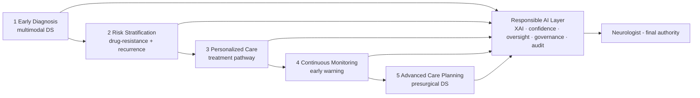

# DBA Strategy & Prioritization — Governance-Centered Framework + Validation Scenarios

> **Thesis:** *Responsible Explainable AI Governance for Retrospective EEG-Based Epilepsy Analytics
> Under Human Clinical Oversight.*
>
> **Why (this doc):** The problem set was ranked through three lenses — EEG-dependency, patient
> outcomes, and DBA/business impact. They converge on one framing: the **contribution is a
> generalizable Responsible-AI decision-support framework**; the epilepsy tasks are its **validation
> scenarios**; the whole is packaged as **four business pillars**. **How:** reconciles the three
> rankings, states the core-6 framework problems and the 6 validation scenarios, the patient journey,
> the pillars, and an honest build status. Supersedes the flat problem lists in
> [research-problems](research-problems.md) and [dissertation-flagship-problems](dissertation-flagship-problems.md).

## 1. Three lenses → one decision

*Caption - The same 20 problems ranked three ways; the convergence tells us what the DBA contribution should be.*

| Lens | Top priority | Implication |
|---|---|---|
| **EEG-dependency** (data/scope) | Early Diagnosis · Explainable EEG · Drug-Resistance · Recurrence · Presurgical · Multimodal | The *validation scenarios* must be EEG-heavy |
| **Patient outcomes** | Early Diagnosis · Drug-Resistance · Personalized Tx · Recurrence · Remote Monitoring · Presurgical | The scenarios must show patient value along the *care journey* |
| **DBA / business impact** | **Human Oversight · Governance · Explainability · Multimodal · Confidence · Concordance** | The *core contribution* is the governance framework, not one ML model |

**Decision:** make the **governance framework the core contribution**; use the clinical tasks as
**validation scenarios**. This is broader and more defensible for a DBA than solving a single task.

## 2. Core contribution — the Responsible-AI framework (6 problems)

*Caption - The six governance-centered problems that ARE the dissertation's contribution, and their build status.*

| # | Framework problem | Role | Repo status |
|---|---|---|---|
| C1 | **Human Clinical Oversight Framework** | Who decides; when AI defers to the clinician | 🟡 documented ([decision-ai](responsible-ai/16-decision-ai.md), fusion HITL) — no enforced service |
| C2 | **Responsible AI Governance** (risk, audit, compliance, accountability) | Lifecycle control | 🟡 16 pillars + implementation docs; audit table unused |
| C3 | **Explainable AI for CDS** (clinician-friendly) | Why the recommendation | 🟢 runnable SHAP/LIME ([RAI runtime](analysis/responsible-ai-runtime.md)) |
| C4 | **Multimodal Decision Support** (EEG + clinical + MRI) | The fusion engine | 🟢 fusion built (synthetic) |
| C5 | **AI Confidence & Uncertainty Estimation** (when to abstain) | Safe deferral | 🟢 built — [`analysis/governance.py`](analysis/governance-confidence-concordance.md): calibration + abstention (acc 0.907→0.942 on confident 80%) |
| C6 | **Clinical Evidence Concordance Engine** (agreement/conflict) | Trust across sources | 🟢 built — `governance.py` concordance engine (flags discordant patients for review; EP001 Concordant) |

**Built (2026-07-11):** C5 (confidence/uncertainty → abstention) and C6 (concordance engine) are now
runnable code with tests, extending the fusion engine. **Real EEG integrated (2026-07-12):** the
pipeline now runs on **real epilepsy EEG** — CHB-MIT chb01_03 (ictal-vs-interictal CV AUC **0.970**;
see [chbmit-real-analysis](analysis/chbmit-real-analysis.md)) and EEG-Eye-State (external AUC 0.979).
**Remaining gap:** scale to the full CHB-MIT/Siena corpus with subject-level splits + clinician validation.

## 3. Validation scenarios (the framework proves itself on these)

*Caption - The clinical use cases, repositioned as validation scenarios for the framework rather than separate studies.*

| Scenario | Demonstrates | Status |
|---|---|---|
| S1 Seizure/epilepsy classification | Explainability + oversight on multi-class | 🟢 built (synthetic) |
| S2 Drug-resistant prediction | Confidence + fairness on a binary risk | 🟢 built (synthetic) |
| S3 Seizure recurrence risk | Uncertainty on time-to-event | ⬜ new (survival) |
| S4 Presurgical decision support | Concordance + human oversight | 🟢 doc + concordance |
| S5 Personalized treatment pathway | Governed recommendation | 🟡 partial (CDSS) |
| S6 Remote monitoring & follow-up | Advisory + alerting under oversight | 🟢 docs (remote) |

## 4. Patient-journey roadmap (keeps the patient central)

**Reason:** To keep patient needs central while showcasing governance. **Why:** Reviewers ask "who benefits" — the journey answers it stage-by-stage. **What is happening:** Each care stage is a scenario; the Responsible-AI layer spans all of them. **How it is happening:** One framework wraps every stage with explainability, confidence, oversight, and audit. **Reference:** Topol (2019); NIST (2023).

## 5. Four business pillars (B2B + B2C)

*Caption - The platform packaged for adoption: who buys, who uses, and the capabilities per pillar.*

| Pillar | Primary customers | Capabilities |
|---|---|---|
| **Responsible AI Platform** | Hospitals, regulators, health systems (B2B) | Human oversight, governance, explainability, confidence, audit trails |
| **Clinical Intelligence Platform** | Neurologists, epilepsy centers (B2B) | Classification, multimodal DS, recurrence + drug-resistance prediction, presurgical support |
| **Operational Excellence Platform** | Hospitals, diagnostic centers (B2B) | Workflow optimization, report generation, referral support, EEG quality assessment |
| **Patient Engagement Platform** | Patients, caregivers, virtual care (B2C) | Voice onboarding, remote monitoring, education, symptom tracking, reminders, SOS |

## 6. Stakeholder value (why each cares)

| Clinicians value | Patients value |
|---|---|
| Higher diagnostic confidence; better localization; less review time; fewer unnecessary tests; easier MDT collaboration; explainability; auditability; lower medico-legal risk | Faster diagnosis; earlier referral; fewer visits/tests; clear explanations; better communication; ongoing monitoring; improved QoL; confidence in care |

## 7. Honest build status vs. this framing

| Element | Status |
|---|---|
| Explainability (C3), Multimodal (C4), scenarios S1/S2/S4/S6 | 🟢 built (on **synthetic** EEG) |
| Human oversight (C1), Governance (C2), Concordance (C6) | 🟡 documented, not fully coded |
| **Confidence/Uncertainty (C5)**, recurrence (S3) | ⬜ **not built** |
| **Real retrospective EEG** (Siena/TUH) | ⬜ **not integrated — the #1 enabling gap** |

## Professor Readiness (Defense Q&A)

**Q1: What is the actual contribution?** A generalizable, governed, explainable, human-oversight
decision-support **framework**, validated on six epilepsy scenarios — not a single ML model.

**Q2: Why are clinical tasks "scenarios" not "problems"?** So the contribution generalizes beyond
epilepsy; the scenarios demonstrate the framework's practical application and patient value.

**Q3: What must you build next?** Confidence/uncertainty estimation (C5) and the concordance engine
(C6) as runnable governance capabilities, and integrate a real EEG corpus so the scenarios report
defensible results.

## References

NIST. (2023). *Artificial Intelligence Risk Management Framework (AI RMF 1.0)*.

Topol, E. J. (2019). *Deep medicine*. Basic Books.

American Psychological Association. (2020). *Publication manual of the American Psychological Association* (7th ed.).
