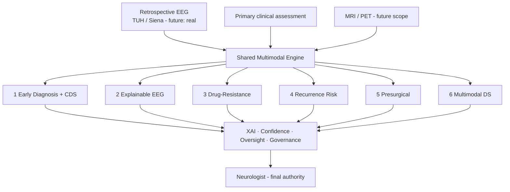

# Dissertation — EEG-Centric Flagship Research Problems

> **Thesis title:** *Responsible Explainable AI Governance for Retrospective EEG-Based Epilepsy
> Analytics Under Human Clinical Oversight.*
>
> **Why (this doc):** Fixes the dissertation scope to **six EEG-dependent flagship problems** that
> share one multimodal engine, so explainability, human oversight, confidence, and governance are
> evaluated on a single framework rather than many disconnected systems. **How:** the ranked problem
> set (EEG dependency prioritised), the six flagships, their shared architecture, and an honest map to
> what is already in this repo vs. what remains.

## Selection criterion

The research is **retrospective, EEG-based** epilepsy analytics. Problems are prioritised by
**EEG dependency** alongside patient value, novelty, and DBA fit — high-EEG problems align with the
available secondary data and the governance thesis.

## The six flagship problems (build these)

*Caption - The six EEG-centric flagships, their method, and current status in this repo (honest).*

| # | Flagship problem | EEG dependency | Method | Repo status | Gap to close |
|---|---|---|---|---|---|
| 1 | **Early Diagnosis & Clinical Decision Support** | ⭐⭐⭐⭐⭐ | EEG + clinical history → classification + CDSS | 🟡 severity/type classification built (synthetic) | Real EEG; "early" framing + time-to-diagnosis |
| 2 | **Explainable AI for EEG Interpretation** | ⭐⭐⭐⭐⭐ | SHAP/saliency/attention on EEG features & spectrograms | 🟡 SHAP/LIME runtime on clinical model | EEG-signal-level XAI on real data |
| 3 | **Drug-Resistant Epilepsy Prediction** | ⭐⭐⭐⭐⭐ | EEG trends + clinical → resistance risk | 🟢 `drug_resistant` model (AUC 0.969, synthetic) | Real EEG trend features |
| 4 | **Seizure Recurrence Risk Prediction** | ⭐⭐⭐⭐⭐ | Survival / time-to-event from EEG + factors | 🟢 built — [`analysis/recurrence.py`](analysis/recurrence-risk.md): Kaplan-Meier + Cox (C-index 0.663), EP001 High risk | Real EEG trend features |
| 5 | **Presurgical Decision Support** | ⭐⭐⭐⭐⭐ | EEG + MRI + clinical concordance | 🟢 doc + concordance model ([surgical](surgical-recommendation.md)) | Real multimodal concordance |
| 6 | **Multimodal Decision Support (engine)** | ⭐⭐⭐⭐⭐ | Fuse EEG + clinical + imaging — the overarching engine | 🟢 fusion built (AUC 0.976, synthetic) | Real EEG/imaging inputs |

**Cross-cutting (the governance thesis, applied to all six):** Explainability, Human Clinical
Oversight, Confidence/Uncertainty estimation, Bias/Fairness, and Responsible-AI Governance — already
scaffolded in [responsible-ai](responsible-ai/index.md) and the runnable
[RAI runtime](analysis/responsible-ai-runtime.md).

## Shared multimodal engine (why six problems, one system)

**Reason:** To show the six flagships are heads on one engine. **Why:** A single framework lets the thesis evaluate explainability/oversight/governance consistently, not per-project. **What is happening:** Retrospective EEG + clinical (+ future imaging) feed one engine serving all six problems under a shared governance layer. **How it is happening:** Common feature store + model registry + XAI/confidence wrappers; the neurologist decides. **Reference:** Topol (2019); NIST (2023).

## Full problem ranking (reference)

*Caption - The 20 candidate problems ranked by EEG dependency + patient value + DBA fit; top 6 are the flagships.*

| Rank | Problem | Patient impact | EEG dep. | Novelty | DBA fit | Overall |
|---|---|---|---|---|---|---|
| 1 | Early Diagnosis & CDS | 5 | 5 | 4 | 5 | 10.0 |
| 2 | Explainable AI for EEG | 5 | 5 | 5 | 5 | 10.0 |
| 3 | Drug-Resistant Prediction | 5 | 5 | 5 | 5 | 10.0 |
| 4 | Seizure Recurrence Risk | 5 | 5 | 4 | 5 | 9.9 |
| 5 | Presurgical Decision Support | 5 | 5 | 5 | 5 | 9.9 |
| 6 | Multimodal Decision Support | 5 | 5 | 5 | 5 | 9.9 |
| 7 | EEG Quality Assessment | 4 | 5 | 5 | 5 | 9.8 |
| 8 | Clinical Evidence Concordance | 4 | 4 | 5 | 5 | 9.7 |
| 9 | AI Confidence & Uncertainty | 4 | 4 | 5 | 5 | 9.7 |
| 10 | Personalized Treatment Rec. | 5 | 4 | 4 | 4 | 9.6 |
| 11 | Human Clinical Oversight | 4 | 3 | 5 | 5 | 9.5 |
| 12 | Remote Patient Monitoring | 5 | 3 | 4 | 4 | 9.4 |
| 13 | Bias & Fairness Assessment | 4 | 3 | 5 | 5 | 9.3 |
| 14 | Voice AI Onboarding | 4 | 1 | 3 | 4 | 8.8 |
| 15 | Clinical Workflow Optimization | 3 | 1 | 4 | 5 | 8.6 |
| 16 | AI Report Generation | 3 | 2 | 4 | 4 | 8.5 |
| 17 | Responsible AI Governance | 3 | 1 | 5 | 5 | 8.4 |
| 18 | Clinical Timeline Intelligence | 4 | 2 | 4 | 4 | 8.3 |
| 19 | Referral Recommendation | 4 | 2 | 4 | 4 | 8.2 |
| 20 | SOS & Emergency Workflow | 4 | 1 | 2 | 3 | 7.8 |

**Note on the earlier 5-problem framing:** onboarding (voice), remote support/SOS, and monitoring
(previous Problems 2–4, ranks 12/14/20) are **lower EEG-dependency** and become *supporting modules /
future scope*, not flagship studies. Problems 1 and 5 are retained and elevated.

## Critical enabling step (honest)

Every flagship currently runs on a **seeded synthetic EEG cohort** — a methodology demonstration.
The single highest-leverage next step is to substitute a **real retrospective EEG dataset**
(**Siena Scalp EEG** or **TUH EEG Corpus**) into the shared engine; the six problem heads then
produce defensible results. Until then, results must be framed as *simulated, pending clinical validation*.

## Professor Readiness (Defense Q&A)

**Q1: Why these six?** They are the highest EEG-dependency, highest-value problems, and they share one
engine — letting the governance thesis (XAI, oversight, confidence, fairness) be evaluated uniformly.

**Q2: What happened to onboarding / SOS / monitoring?** They are lower EEG-dependency supporting
modules (future scope), not flagship studies — kept to show the care pathway, not the core contribution.

**Q3: Biggest threat to validity?** Synthetic EEG. Mitigation: port a real public EEG corpus into the
shared engine before reporting performance; frame current numbers as simulated.

## References

NIST. (2023). *Artificial Intelligence Risk Management Framework (AI RMF 1.0)*.

Rosenow, F., & Luders, H. (2001). Presurgical evaluation of epilepsy. *Brain, 124*(9), 1683–1700.

Topol, E. J. (2019). *Deep medicine*. Basic Books.
