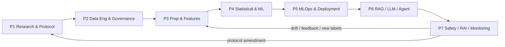
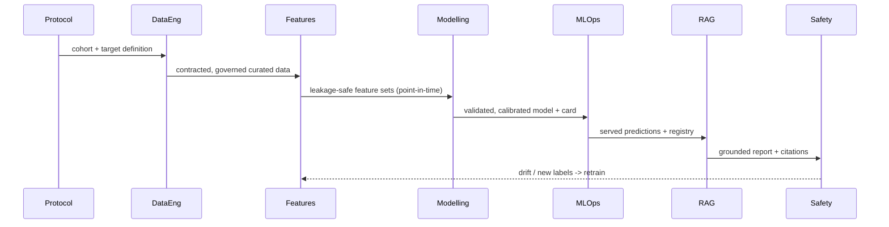
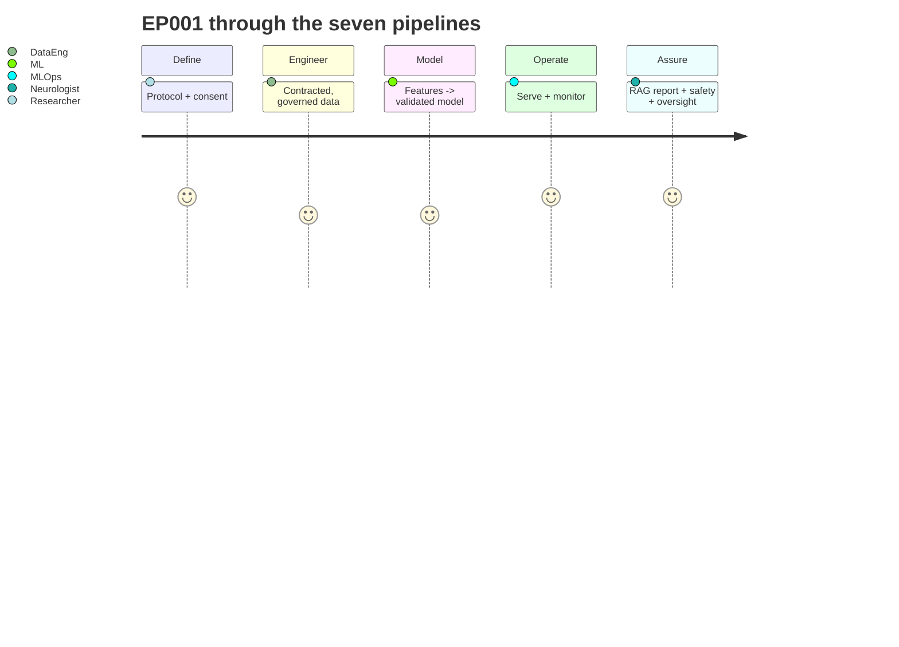

# Enterprise Operating Model — Seven Connected Pipelines (Epilepsy)

> **Why (this doc):** An expert review found the platform strong on analytics/modelling but weak on
> **system boundaries and operational ownership** — research methodology, data engineering, MLOps,
> GenAI, clinical operations, and governance were fused into one flow. This doc re-frames the whole
> platform as **seven connected pipelines**, each with its own owner, inputs, outputs, and controls,
> and maps the **40-stage enterprise architecture** onto them. **How:** each stage cites the module/doc
> that implements it or marks it a documented gap. Scope: **epilepsy only** (the reviewer's
> schizophrenia/PANSS/relapse examples are translated to epilepsy — see the translation key below).

## Translation key (schizophrenia → epilepsy)
*Caption — the reviewer used psychiatry examples; every one maps cleanly to an epilepsy analogue.*

| Reviewer term | Epilepsy analogue used here |
|---|---|
| Schizophrenia diagnosis | Epilepsy diagnosis / seizure-disorder classification (ILAE 2017) |
| PANSS total / severity | Seizure-severity level L1–L4 + seizure frequency + EEG severity |
| Relapse within 90 days | **Breakthrough seizure / seizure recurrence within 90 days** |
| Psychiatric hospitalization | Seizure-related ED visit / status-epilepticus admission |
| Antipsychotic / adherence | Anti-seizure medication (ASM) / ASM adherence |
| Psychiatrist | Neurologist / epileptologist |
| Sleep, mood, functioning | Sleep (a real seizure trigger), stress, ASM side-effects, functioning |

## The seven pipelines
*Caption — each pipeline is a bounded operating unit with a clear owner; arrows are hand-offs, not code coupling.*

| # | Pipeline | Owner | Answers | Key artefacts |
|---|---|---|---|---|
| P1 | **Research & Clinical Protocol** | DBA researcher + epileptologist + statistician | *What clinical problem, which population, what outcome?* | protocol, cohort def, target def, SAP, ethics |
| P2 | **Data Engineering & Governance** | Data architect + data steward | *How does data arrive, get contracted, governed, versioned?* | data contracts, lakehouse zones, catalog, lineage |
| P3 | **Data Prep & Feature Engineering** | ML/data engineer | *How is data cleaned, labelled, made leakage-safe, stored as features?* | feature registry, feature store, leakage review |
| P4 | **Statistical & ML Modelling** | ML architect + statistician | *What model, validated how, calibrated, fair?* | experiments, baselines, validation, calibration |
| P5 | **MLOps & Deployment** | ML platform engineer | *How is the model registered, served, rolled back, monitored?* | registry, serving, rollback, monitoring |
| P6 | **RAG, LLM & Agent Engineering** | GenAI engineer | *How is knowledge retrieved and generated safely?* | vector DB, prompt registry, agent policy, LLM eval |
| P7 | **Clinical Safety, Responsible-AI & Monitoring** | Clinical safety lead + privacy officer | *How is it kept safe, fair, private, and overseen?* | safety layer, fairness, consent, audit |

## The 40-stage architecture, mapped to pipelines & status
*Caption — the reviewer's 40-stage enterprise flow, each stage assigned to a pipeline and marked implemented / partial / documented-gap with the artefact that proves it.*

| # | Stage | Pipeline | Status | Evidence / gap |
|---|---|---|---|---|
| 1 | Business & clinical problem definition | P1 | ✅ | [pipeline-1](pipeline-1-research-clinical-protocol.md) |
| 2 | Research questions & hypotheses | P1 | ✅ | pipeline-1 · docs/analysis/hypotheses.md |
| 3 | Outcome / target / horizon definition | P1 | ✅ | pipeline-1 (seizure-recurrence-90d) |
| 4 | Study design & cohort protocol | P1 | ✅ | pipeline-1 |
| 5 | Ethics, consent & data-use approval | P1/P7 | ✅ | governance/01-irb, 02-consent |
| 6 | Source-system identification | P2 | ⚠️ partial | [pipelines-2-7](pipelines-2-7-and-missing-layers.md) §2 |
| 7 | Data ownership & data contract | P2 | ⚠️ partial | mlops/data_contract.py + §3 |
| 8 | Batch/stream/API/CDC ingestion | P2 | ⚠️ partial | §4 (documented patterns) |
| 9 | Landing zone & raw immutable storage | P2 | ❌ gap | §5 lakehouse zones (documented) |
| 10 | Schema & contract validation | P2 | ✅ | mlops/data_contract.py |
| 11 | Invalid-record quarantine | P2 | ⚠️ partial | §5 |
| 12 | Master patient index & entity resolution | P2 | ❌ gap | §7 (documented) |
| 13 | Cleaning & harmonisation | P3 | ✅ | analysis/preprocessing.py |
| 14 | Clinical terminology standardisation | P2 | ⚠️ partial | ILAE/SNOMED map (documented) |
| 15 | Data-quality scoring | P2 | ✅ | mlops/data_quality.py + §10 |
| 16 | Metadata / catalog / lineage | P2 | ⚠️ partial | §8 (documented catalog) |
| 17 | Sensitive-data classification & security | P2/P7 | ✅ | governance/00-security-compliance |
| 18 | Curated clinical dataset | P3 | ✅ | data/analysis/*clean* |
| 19 | Annotation, labelling & adjudication | P3 | ⚠️ partial | §12 label management (documented) |
| 20 | Temporal alignment & cohort construction | P3 | ✅ | make_cohort.py + pipeline-1 windows |
| 21 | Exploratory & statistical analysis | P4 | ✅ | analysis/eda.py, primary/secondary |
| 22 | Missing-data & outlier strategy | P3 | ✅ | preprocessing.py + §11 taxonomy |
| 23 | Encoding, scaling, transformation | P3 | ✅ | preprocessing.py |
| 24 | Feature engineering | P3 | ✅ | feature_store.py, secondary_eeg_full |
| 25 | Leakage review | P3 | ✅ | §15 + subject-level splits |
| 26 | Feature validation & registry | P3 | ⚠️ partial | §13 feature spec (documented) |
| 27 | Offline & online feature store | P3 | ⚠️ partial | mlops/feature_store.py (offline) + §14 |
| 28 | Baseline model development | P4 | ✅ | §18 baselines |
| 29 | Classical / survival / time-series | P4 | ✅ | primary_analysis, recurrence, timeseries |
| 30 | Experiment tracking & HPO | P4/P5 | ✅ | experiment_tracker.py + GridSearchCV |
| 31 | Internal / temporal / external validation | P4 | ✅ | external_validation.csv (real) |
| 32 | Calibration, fairness, explainability | P4/P7 | ✅ | responsible_ai_runtime.py |
| 33 | Clinical utility & safety validation | P7 | ⚠️ partial | §30 safety layer |
| 34 | Model registry & approval | P5 | ✅ | model_registry.py |
| 35 | Batch / real-time deployment | P5 | ✅ | api/main.py |
| 36 | RAG & agent integration | P6 | ⚠️ partial | vector_db_pipeline.py + §36-45 |
| 37 | Human clinical oversight | P7 | ✅ | human-in-the-loop (all reports) |
| 38 | Observability, drift, quality monitoring | P5/P7 | ✅ | observability.py + §24 |
| 39 | Retraining, recalibration, rollback | P5 | ✅ | retrain.py + §23,26 |
| 40 | Retention, archival, deletion, retirement | P2/P7 | ⚠️ partial | §35 retention workflow |

## Coverage assessment — before vs target
*Caption — the reviewer's coverage estimate, plus where this documentation set moves each area.*

| Area | Reviewer % | After this set | Lever |
|---|---|---|---|
| Research design | 85 | 95 | Pipeline 1 full protocol |
| Clinical data collection | 90 | 92 | source-system layer §2 |
| Statistical analysis | 90 | 92 | SAP formalised (P1) |
| Feature engineering | 85 | 90 | feature registry §13 |
| Classical ML | 90 | 92 | baselines §18 |
| Time-series ML | 80 | 85 | §27 gaps closed |
| Data engineering | 45 | 75 | §4-9 lakehouse/ingestion/contracts |
| Data quality mgmt | 65 | 85 | §10 measurable dimensions |
| Feature-store mgmt | 35 | 65 | §14 offline+online spec |
| MLOps | 55 | 80 | registry/rollback/monitoring §20-26 |
| GenAI/RAG/agent | 40 | 70 | §36-45 full lifecycle |
| Clinical safety | 55 | 80 | §30-31 safety+abstention |
| Responsible AI | 65 | 85 | §32 fairness ops |
| Security & privacy | 50 | 80 | §33-35 + governance pack |
| Production observability | 60 | 82 | §24-25 five-category monitoring |
| Research reproducibility | 55 | 80 | §16 cohort/dataset versioning |

> **Honest note:** "After" values reflect **documented + partially implemented** maturity, not certified
> production. The gaps in [pipelines-2-7](pipelines-2-7-and-missing-layers.md) name exactly what remains code-vs-doc.

## Roles & responsibilities (RACI summary)
*Caption — who owns each pipeline, so the operating model has clear accountability.*

| Role | Primary pipeline | Responsibility |
|---|---|---|
| DBA researcher | P1 | research question, protocol, methodology |
| Epileptologist / neurologist | P1/P7 | clinical definitions, outcomes, safety |
| Neuropsychologist | P1 | assessment interpretation |
| Statistician | P1/P4 | hypotheses, power, analysis plan |
| Data architect | P2 | source & data-model design |
| Data engineer | P2/P3 | cohort extraction, pipelines |
| ML architect | P4/P5 | model design & validation strategy |
| Privacy officer | P7 | consent, purpose, privacy controls |
| Ethics board (IRB) | P1/P7 | research approval |
| Clinical safety lead | P7 | risk & escalation rules |
| Data steward | P2 | data definitions & quality ownership |

## Diagrams

### Sequence — a hand-off across all seven pipelines

### Journey — patient EP001 through the operating model

## C4 (context) — the operating model as a system
- **Persons:** Patient, Neurologist, EEG Technician, Data Steward, Privacy Officer, IRB, Safety Lead.
- **System:** Epilepsy Remote-Care AI Platform (seven pipelines).
- **External:** EMR/HIS/LIS, Pharmacy, Wearables, KMS, Identity Provider, Guideline sources (ILAE), Audit/SIEM.

**Reason:** impose enterprise boundaries. **Why:** a single fused flow is comprehensive but unimplementable
and unexplainable; healthcare needs owned, governed pipelines. **What is happening:** the platform is split
into seven owned pipelines mapped onto a 40-stage architecture. **How it is happening:** each stage cites its
implementing module or documented gap; hand-offs are explicit. **Reference:** Sculley et al. (2015); Kleppmann (2017); Dehghani (2022, Data Mesh).

## Professor Readiness (Defense Q&A)
### Why seven pipelines instead of one flow?
Ownership and safety. Each pipeline has a distinct owner, control set, and failure mode; fusing them hides accountability and makes governance impossible.
### Which areas were weakest and what closed them?
Data engineering (45→75), feature-store (35→65), GenAI (40→70) — closed by §4-9, §13-14, §36-45 respectively.
### Is this implemented or documented?
Mixed and labelled honestly in the 40-stage table (✅/⚠️/❌) — modelling/serving/monitoring are code; lakehouse/MPI/online-feature-store are documented designs.

## References

Dehghani, Z. (2022). *Data Mesh: Delivering Data-Driven Value at Scale*. O'Reilly.

Kleppmann, M. (2017). *Designing Data-Intensive Applications*. O'Reilly.

Sculley, D., et al. (2015). Hidden technical debt in machine learning systems. *NeurIPS 28*.
