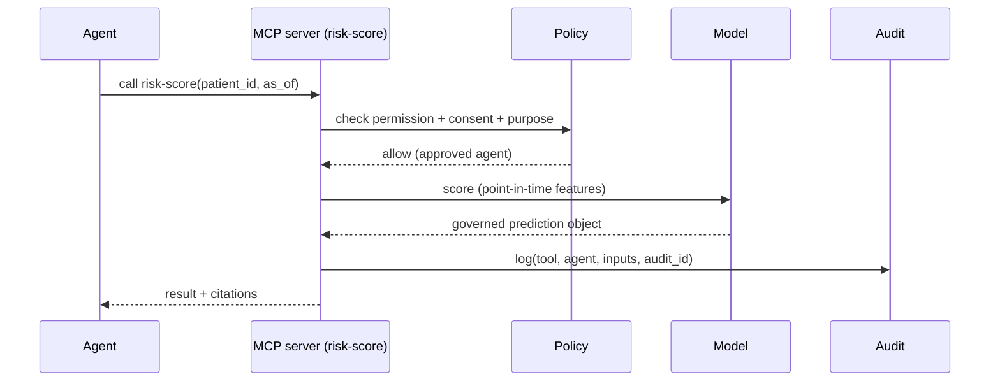
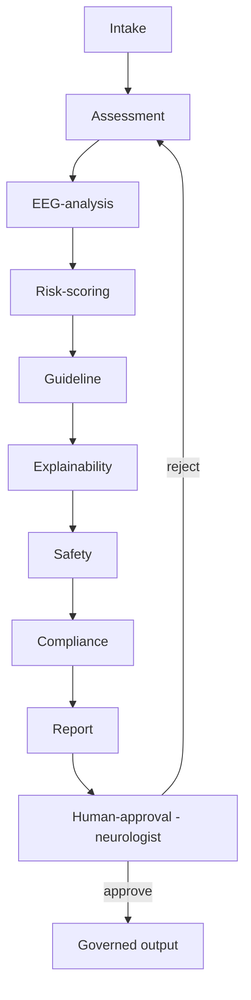
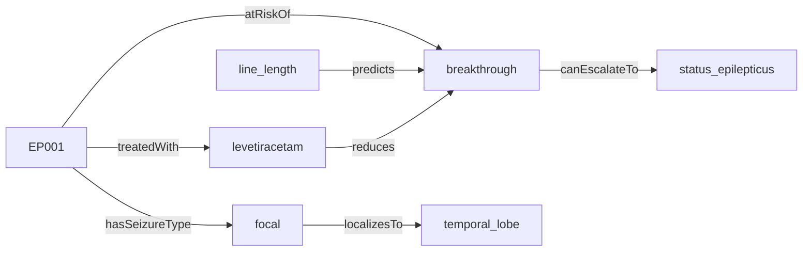
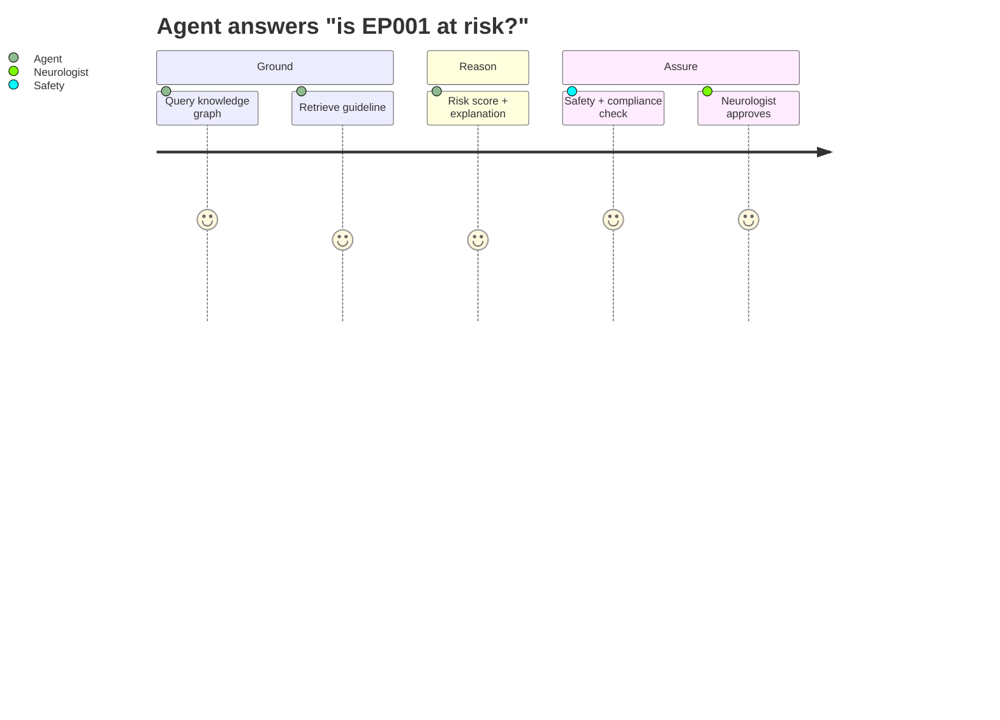

# MCP · Multi-Agent Orchestration · Knowledge Graph / RDF (Epilepsy)

> **Why (this doc):** The GenAI layer (Pipeline 6) needs three things the earlier flow only hinted at:
> a **standard tool interface** (Model Context Protocol), **governed multi-agent orchestration**, and a
> **semantic knowledge graph (RDF)** the agents reason over instead of free text. This doc specifies all
> three, translated to epilepsy. **How:** the graph is real (`analysis/knowledge_graph_export.py` →
> `epilepsy-kg.ttl` + `kg_nodes.csv`/`kg_edges.csv`); MCP + agents are specified with schemas and policies.

## Research spine
- **Problem:** LLM agents that call tools and read documents can be unsafe and ungrounded in clinical use.
- **Sub-problems:** standard tool access, least-privilege agents, semantic grounding, auditability.
- **Research problem:** *How do agents safely retrieve epilepsy knowledge and patient context and act under governance?*
- **Objective:** MCP-standard tools + role-scoped agents + an RDF knowledge graph + human oversight.
- **Hypothesis:** graph-grounded, MCP-mediated agents reduce hallucination and unsafe actions vs free-text RAG.

## 1. Model Context Protocol (MCP)
MCP is the standard interface between the LLM/agent layer and the platform's **tools, resources, and
prompts** — so every capability is discovered, permissioned, schema-typed, and audited the same way.

*Caption — the MCP servers this platform exposes, each with a risk tier and access rule.*

| MCP server | Kind | Exposes | Risk | Access rule |
|---|---|---|---|---|
| `kg-query` | Resource/Tool | SPARQL-like query over the epilepsy knowledge graph | low | read-only, all agents |
| `guideline-retrieval` | Tool | vector-DB search over ILAE/SOP corpus | low | read-only |
| `patient-context` | Resource | de-identified EP001 features (point-in-time) | high | consent + purpose check |
| `eeg-analysis` | Tool | run seizure-detection model on an epoch | medium | approved agents |
| `risk-score` | Tool | 90-day breakthrough-seizure risk | medium | approved agents |
| `write-note` | Tool | append clinical note | high | requires human approval |
| `send-alert` | Tool | patient/clinician alert | high | clinical authorization |

*Caption — MCP tool descriptor (what every tool must declare) so calls are typed and governed.*

| Field | Example (`risk-score`) |
|---|---|
| name / version | risk-score / 1.2 |
| description | 90-day breakthrough-seizure risk for a patient |
| input schema | `{patient_id, as_of_date}` |
| output schema | governed prediction object (see prediction-output-schema) |
| permission | approved agents only |
| timeout / retry | 5s / 1 |
| cost / risk tier | low / medium |
| approval / audit | audit required |
| fallback | clinical baseline rule |

### MCP sequence


## 2. Multi-agent orchestration
Distinct agents, each with **least-privilege tools** and an explicit policy — no agent can do everything.

*Caption — the agent roster, its allowed MCP tools, and its escalation rule.*

| Agent | Job | Allowed tools | Escalates when |
|---|---|---|---|
| Intake | gather context, consent check | patient-context (read), kg-query | consent missing |
| Assessment | structure role assessments | kg-query, guideline-retrieval | ambiguous input |
| EEG-analysis | run signal model | eeg-analysis | low signal quality |
| Risk-scoring | compute risk | risk-score | OOD / low confidence |
| Guideline | retrieve evidence | guideline-retrieval, kg-query | no grounding found |
| Explainability | attach SHAP/graph reasons | kg-query | conflicting drivers |
| Safety | apply clinical rules, abstain | (read-only) | any red-flag |
| Compliance | consent/PII/audit checks | (read-only) | violation |
| Report | assemble doctor/patient report | guideline-retrieval | — |
| Human-approval | route to neurologist | write-note (gated), send-alert (gated) | always (final gate) |

### Orchestration controls
Agent identity, agent-specific policy, shared-state controls, **state-machine validation**, max step
count, loop detection, cost limit, mandatory **human escalation** before any high-risk tool.



## 3. Knowledge graph (RDF) — the semantic backbone
Agents reason over a **graph**, not free text: patients, seizure types, EEG biomarkers, ASMs,
assessments, outcomes, guidelines, and their relationships. Exported as **RDF Turtle**
(`epilepsy-kg.ttl`, loadable into any triple store / graph DB) and as node/edge CSVs for the viewer.

*Caption — the graph's node types (classes) and edge types (predicates).*

| Node classes | Edge predicates |
|---|---|
| Patient, SeizureType, EEGFeature, ASM, Assessment, Outcome, Guideline, Severity, BrainRegion | hasSeizureType, hasSeverity, treatedWith, assessedBy, atRiskOf, localizesTo, canEvolveTo, predicts, indicates, measures, prescribes, reduces, treats, classifiedBy, canEscalateTo, grounds |

### Example triples (Turtle)
```turtle
kg:EP001 a kg:Patient ; rdfs:label "Patient EP001" .
kg:EP001 kg:hasSeizureType kg:focal .
kg:EP001 kg:treatedWith kg:levetiracetam .
kg:line_length kg:predicts kg:breakthrough .
kg:levetiracetam kg:reduces kg:breakthrough .
kg:focal kg:localizesTo kg:temporal_lobe .
```

### Graph (network diagram)


### Why a graph + RDF (vs a table)
- **Multi-hop reasoning:** "which ASM reduces the outcome this patient's biomarkers predict?" is a graph traversal.
- **Interoperability:** RDF + SNOMED/ILAE URIs let external systems merge knowledge.
- **Grounding:** agents cite graph nodes/edges, making explanations checkable.
- **Database:** load `epilepsy-kg.ttl` into a triple store (GraphDB, Blazegraph, Neo4j n10s) and query with SPARQL/Cypher.

## Diagrams

### Journey — an agent answering a clinical question, graph-grounded


### C4 (container) — GenAI layer
- **Containers:** MCP gateway, agent orchestrator, vector DB, **triple store (RDF graph DB)**, model service, audit log.
- **Relationships:** agents → MCP gateway → {kg-query→triple store, guideline→vector DB, risk-score→model service}; every call → audit.

**Reason:** make agents safe, standard, and grounded. **Why:** ungoverned tool-calling + free-text RAG is
unsafe in clinical epilepsy care. **What is happening:** MCP standardises tools; least-privilege agents
orchestrate under a human gate; an RDF graph provides semantic grounding. **How it is happening:** MCP
descriptors + agent policies + `epilepsy-kg.ttl` triple store + human approval. **Reference:** Anthropic
(2024, MCP); Lewis et al. (2020, RAG); Hogan et al. (2021, Knowledge Graphs).

## Professor Readiness (Defense Q&A)
### Why MCP instead of ad-hoc function calls?
MCP gives one discoverable, permissioned, audited interface for every tool/resource/prompt — consistent governance instead of scattered integrations.
### Why can't one agent do everything?
Least privilege limits blast radius: the Safety and Compliance agents are read-only; only the human-approval gate can trigger high-risk tools (write-note, send-alert).
### What does the graph add over the feature table?
Multi-hop clinical reasoning and interoperable, citable grounding — e.g., linking a biomarker → predicted outcome → mitigating ASM in one traversal.

## References

Anthropic. (2024). *Model Context Protocol (MCP) specification*.

Hogan, A., et al. (2021). Knowledge graphs. *ACM Computing Surveys, 54*(4), 1–37.

Lewis, P., et al. (2020). Retrieval-augmented generation for knowledge-intensive NLP tasks. *NeurIPS 33*.
