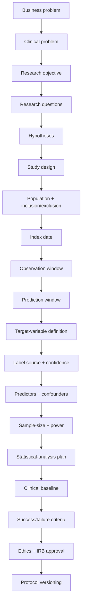
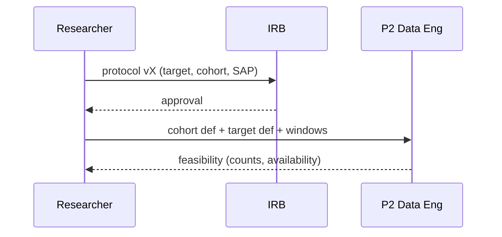
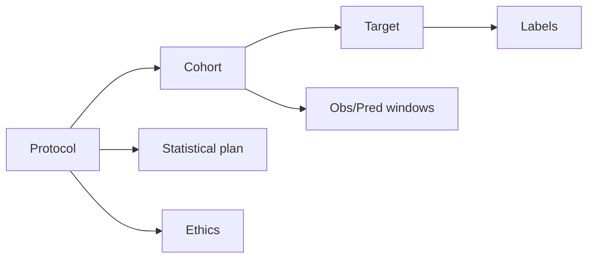
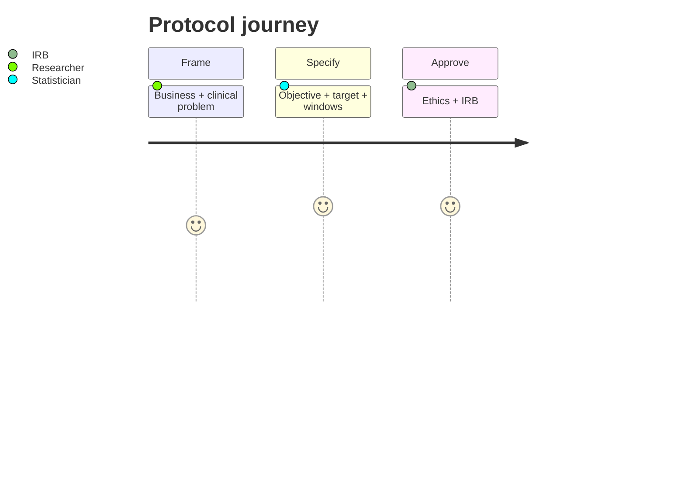

# Pipeline 1 — Research & Clinical Protocol (Epilepsy)

> **Why (this doc):** This pipeline defines **what clinical problem is studied, who is included, what
> outcome is predicted, and how the study stays scientifically valid** — *before* any data is touched.
> Without it, even a technically strong model can be clinically meaningless or invalid. **How:** it fixes
> the business problem → clinical problem → objectives → questions → hypotheses → design → cohort →
> windows → target → labels → predictors → confounders → power → SAP → baseline → success/failure →
> ethics → versioning. Scope: **epilepsy** (translated from the reviewer's schizophrenia examples).

## Research spine
- **Problem → Sub-problems → Research Problem → Objective → Flow → Hypotheses → Statistical Analysis** are all defined below, in order.

## Flow


## 1. Business problem
Current epilepsy care requires repeated in-clinic assessments, review of fragmented records (EEG,
ASM history, seizure diaries), and delayed recognition of deterioration — increasing time-to-review
and delaying recognition of patients at risk of a **breakthrough seizure**.

*Caption — measurable business KPIs frame success in operational, not algorithmic, terms.*

| KPI | Current | Target |
|---|---|---|
| Average onboarding/triage time | 90 min | 45 min |
| Assessment completion rate | 70% | 90% |
| Seizure-deterioration recognition delay | 14 days | < 3 days |
| Avoidable seizure-related ED visits | 18% | −20% |

> The objective is **not** "build an AI model" — it is *"improve a measurable clinical/operational
> outcome using an AI-supported process."*

## 2. Clinical problem
Convert the business problem into clinical tasks: (a) flag patients who may need further epileptologist
review; (b) estimate current seizure-severity; (c) **predict breakthrough-seizure risk over the next
90 days**; (d) identify ASM-adherence intervention needs; (e) detect rapid decline in sleep/mood/adherence.

**Boundary (safety):** the system does **not** diagnose epilepsy or prescribe. It *"identifies patterns
associated with elevated seizure risk and recommends additional neurologist assessment."*

## 3-4. Research objectives
**Primary objective (drives sample size + evaluation):**
> Develop and validate an explainable ML model that uses demographic, clinical, EEG, cognitive,
> functional and longitudinal ASM-adherence data to estimate **90-day breakthrough-seizure risk**
> among adults receiving outpatient epilepsy care, under neurologist oversight.

**Secondary objectives:** classify current seizure-severity (L1–L4); identify strongest risk factors;
test whether longitudinal data beats a single baseline; compare classical ML vs time-series/survival;
assess fairness across age/sex; evaluate whether AI-assisted triage reduces onboarding time; measure
clinician agreement with explanations. *(One primary outcome only.)*

## 5. Research questions
1. Can clinical + EEG + functional + behavioural features predict a breakthrough seizure within 90 days?
2. Does longitudinal information improve prediction vs a single baseline assessment?
3. Which features contribute most to predicted seizure risk?
4. Does performance differ across demographic/clinical subgroups?
5. Can AI-assisted onboarding reduce assessment time without reducing clinical completeness?

## 6. Hypotheses
*Caption — statistical and operational hypotheses, each with H0/H1 and a test.*

| Type | H0 | H1 | Test |
|---|---|---|---|
| Predictive | AUC(proposed) = AUC(logistic baseline) | AUC(proposed) > AUC(baseline) | DeLong |
| Longitudinal | longitudinal adds no lift | longitudinal improves AUC | nested CV + DeLong |
| Operational | AI onboarding does not reduce mean time | reduces mean time ≥ 20% | two-sample t / Mann-Whitney |
| Fairness | subgroup AUC gap = 0 | gap ≠ 0 | bootstrap CI on gap |

## 7. Study design
**Retrospective longitudinal cohort study** — supports historical EEG + repeated assessments + ASM
timelines + seizure history + 90-day recurrence + time-series + human validation.

*Caption — design options and why the longitudinal cohort fits.*

| Design | Use | Chosen |
|---|---|---|
| Retrospective cohort | historical data | ✅ base |
| Prospective cohort | future follow-up | phase 2 |
| Cross-sectional | severity at one time | secondary obj |
| Case-control | recurrence vs none | sensitivity |
| Diagnostic-accuracy | screening performance | secondary |
| Pragmatic | workflow impact | operational obj |

## 8. Unit of analysis
| Task | One row = |
|---|---|
| Severity classification | one clinical assessment visit |
| **Breakthrough-seizure prediction** | one patient **prediction date** + prior 180 days of data |
| Remote monitoring | one patient-day |

Patient-level and visit-level rows are **not** mixed without an explicit relationship.

## 9-11. Population, inclusion, exclusion
**Population:** adults 18–65 in outpatient epilepsy care with a documented epilepsy/seizure-disorder
diagnosis and ≥2 assessments in the study period.

*Caption — inclusion/exclusion are measurable from available data; incomplete data alone is not an exclusion.*

| Inclusion | Exclusion |
|---|---|
| Age ≥ 18 | Insufficient follow-up (< 90 days) |
| Confirmed epilepsy-spectrum diagnosis | Missing target outcome |
| ≥1 baseline assessment (+ EEG) | Duplicate / unresolved-identity record |
| ≥1 follow-up assessment | Invalid assessment timestamp |
| ≥ 90 days follow-up | Acute non-epileptic event confounding baseline |
| ASM history available | Data recorded **after** the outcome occurred (leakage) |
| Valid pseudonymous ID | Patient overlapping a prior dataset split |

## 12-15. Index date, observation & prediction windows, follow-up
- **Index date** = date of the reference event (e.g., clinic assessment, or discharge after a seizure-related admission).
- **Observation window** = **180 days before** index (feature creation only).
- **Prediction window** = **next 90 days** (outcome detection).
- **Follow-up:** min 90 days, max 12 months; track loss-to-follow-up, transfer, withdrawal, data-availability end.

```
Observation window        Index date          Prediction window
Previous 180 days             │                 Next 90 days
──────────────────────────────┼──────────────────────────────
Feature creation              │                 Outcome detection
```
Only information available **during/before** the observation window may be used.

## 16. Target-variable definition
**Target:** `breakthrough_seizure_within_90_days`

*Caption — an exact clinical definition of positive/negative/unknown, so evaluation is valid.*

| Label | Definition (within 90 days of index) |
|---|---|
| **Positive (1)** | any of: seizure-related hospitalization; ED visit for seizure; status epilepticus; neurologist-confirmed breakthrough seizure; crisis/rescue-medication use; documented cluster |
| **Negative (0)** | no qualifying event across a *sufficiently complete* follow-up; no unresolved outcome uncertainty |
| **Unknown** | incomplete follow-up; transferred care; missing records; unverifiable outcome; lost to follow-up — **use "unknown", not 0** |

Every target row also stores: target name, clinical definition, data source, label source, label date,
label confidence, label version, reviewer, adjudication status, prediction horizon.

## 17. Label source & confidence
*Caption — an authoritative label hierarchy; administrative codes are not automatic ground truth.*

| Confidence | Basis |
|---|---|
| 1.00 | confirmed independently by two neurologists |
| 0.90 | confirmed by one neurologist |
| 0.80 | structured assessment + EEG supports outcome |
| 0.70 | hospital/ED record strongly supports |
| 0.50 | administrative (ICD) code only |
| 0.30 | patient self-report only |
| < 0.30 | exclude or send to adjudication |

Store: label confidence, source, annotator, annotation date, guideline version, adjudication status, disagreement reason.

## 18-21. Predictors, confounders, mediators/moderators
*Caption — predictors are grouped; only information available before prediction time is eligible.*

| Group | Examples (epilepsy) |
|---|---|
| Demographic | age, sex, education, employment, living status, region |
| Clinical | epilepsy duration, seizure type (focal/generalized), comorbidities, prior status epilepticus, MRI lesion, family history |
| EEG / assessment | interictal spikes, focus lobe, band-power features, ILAE severity, QoL, functioning |
| Medication | ASM type, dose, adherence %, side-effects, polypharmacy, recent ASM change |
| Behavioural | sleep duration/variability (trigger), appointment attendance, self-reported aura frequency, stress |
| Temporal | Δ seizure frequency, adherence trend, time since last seizure, time since ASM change, sleep variability |

- **Confounders:** age, illness duration, baseline severity, comorbid substance use, socioeconomic status, treatment intensity, access to care, ASM type, prior admissions.
- **Mediator example:** ASM adherence → seizure control → lower recurrence (control mediates).
- **Moderator example:** the adherence↔recurrence link may differ by age (age moderates).

## 22. Sample-size & power
*Caption — sample size is derived from events-per-predictor, not merely data availability.*

| Assumption | Value |
|---|---|
| Expected 90-day recurrence prevalence | ~20% |
| Candidate predictors | ~25 |
| Min events per predictor | 10–20 |
| Required recurrence events | ~250–500 |
| Approx. total cohort | ~1,250–2,500 patients |

For a smaller DBA study, **reduce predictors/model complexity** rather than overfit. Multiple-testing
correction (Benjamini–Hochberg) applies across secondary tests.

## 23. Statistical-analysis plan (pre-specified)
Descriptive (mean/SD, median/IQR, counts/%); missing-data analysis (MCAR/MAR/MNAR); group comparison
(t / Mann-Whitney; χ² / Fisher); correlation; regression (logistic, ordinal for L1–L4); survival (Cox,
random survival forest) for time-to-recurrence; time-series; multiple-testing correction; CIs + effect
sizes; sensitivity + subgroup analyses; model comparison; calibration.

## 24. Clinical baseline
*Caption — the AI must beat a meaningful clinical baseline to add value.*

| Baseline | Rule |
|---|---|
| B1 | prior seizure in last 12 months |
| B2 | ILAE severity threshold |
| B3 | logistic regression |
| B4 (proposed) | longitudinal gradient-boosting / EEG-fused model |

## 25-26. Success & failure criteria
*Caption — pre-registered go/no-go thresholds across technical, clinical, and operational axes.*

| Success | Failure (do not proceed) |
|---|---|
| ROC-AUC ≥ 0.80; PR-AUC > baseline | insufficient positive outcomes |
| Sensitivity ≥ 80%; Specificity ≥ 70% | high label uncertainty |
| Calibration slope 0.8–1.2; Brier < baseline | large subgroup gaps / poor calibration |
| Clinician agreement ≥ 80% | external-validation failure |
| Low-confidence → human review; **no autonomous dx** | unacceptable false-negative rate |
| Onboarding time −20%; completeness +15% | data leakage detected / cannot beat baseline |

## 27. Ethics & approval
Institutional ethics (IRB) approval, data-use agreement, informed-consent review (or retrospective
waiver), privacy-impact assessment, data-security review, clinical-safety review, retention approval.
See [governance/01-irb-submission](../governance/01-irb-submission.md) and [02-consent](../governance/02-patient-consent-eula.md).
Statement: *research + decision-support only; not autonomous diagnosis/prescription; final decisions rest with clinicians.*

## 28. Protocol versioning
*Caption — any change to target/cohort after seeing results must be versioned and justified.*

| Field | Example |
|---|---|
| Protocol ID | EPI-RECUR-001 |
| Version | 2.1 |
| Primary target | breakthrough seizure within 90 days |
| Observation window | 180 days |
| Approved date | 2026-07-01 |
| Change reason / approver | logged per amendment |

## Diagrams

### Sequence — protocol governs data access


### Network — protocol artefacts


### Journey — from business pain to approved protocol


**Reason:** make the study valid before modelling. **Why:** target/cohort/window errors invalidate every
downstream metric. **What is happening:** a pre-registered protocol fixes population, windows, target,
labels, baseline, and success criteria. **How it is happening:** the 28 elements above, versioned and
ethics-approved. **Reference:** Collins et al. (2015, TRIPOD); Moons et al. (2019, PROBAST).

## Roles & tools
| Role | Responsibility | Tools |
|---|---|---|
| DBA researcher | question, protocol, methodology | REDCap, Git/DVC |
| Epileptologist | clinical definitions, outcomes, safety | SNOMED/ICD-10/ILAE |
| Statistician | hypotheses, power, SAP | R, G*Power, Python |
| Data steward | definitions, quality ownership | OpenMetadata/DataHub |
| IRB | approval | institutional REB portal |

## Deliverables (gate to Pipeline 2)
Business/clinical-problem statements; primary + secondary objectives; research questions; hypotheses;
study-design doc; cohort definition; inclusion/exclusion; index date; observation/prediction windows;
target definition; label-source hierarchy; predictor + confounder lists; sample-size justification;
SAP; clinical baseline; success/failure criteria; ethics approvals; protocol version + change log.

## Professor Readiness (Defense Q&A)
### Why 180-day observation and 90-day prediction?
180 days captures ASM-adherence and seizure-frequency trends; 90 days is a clinically actionable recurrence horizon and yields enough events at ~20% prevalence.
### Why is "unknown" a label, not 0?
Assigning 0 to lost-to-follow-up patients fabricates negatives and biases sensitivity; "unknown" is excluded or adjudicated.
### How do you prevent target leakage?
Any feature derived after the index date (e.g., an ASM change made *because* of the seizure) is prohibited; only observation-window data is eligible, enforced in P3.

## References

Collins, G. S., et al. (2015). Transparent Reporting of a multivariable prediction model (TRIPOD). *Annals of Internal Medicine, 162*(1), 55–63.

Fisher, R. S., et al. (2017). ILAE operational classification of seizure types. *Epilepsia, 58*(4), 522–530.

Moons, K. G. M., et al. (2019). PROBAST: assessing risk of bias in prediction models. *Annals of Internal Medicine, 170*(1), W1–W33.
