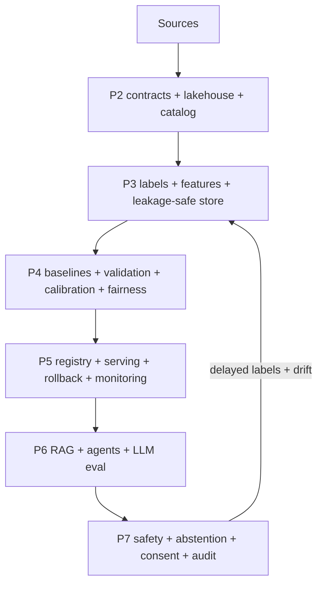
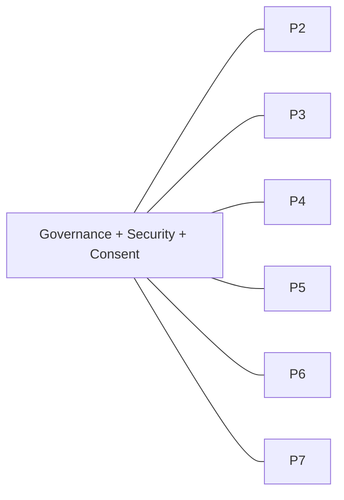

# Pipelines 2–7 + Every Missing Layer (Epilepsy)

> **Why (this doc):** The review listed ~45 enterprise layers the original flow under-specified
> (data contracts, lakehouse zones, MPI, feature store, MLOps, RAG/agent lifecycle, safety, etc.).
> This doc places **every one** into its owning pipeline (P2–P7), with a compact spec, its status
> (✅ code / ⚠️ partial / ❌ documented), and the implementing module or the path to close it. **How:**
> section numbers match the review's sections so nothing is dropped. Scope: **epilepsy**.

---
# Pipeline 2 — Data Engineering & Governance
> *How does data arrive, get contracted, governed, versioned, and made trustworthy?*

## §2 Source-system layer  ⚠️
*Caption — every source needs owner, steward, extraction, refresh, sensitivity metadata.*

| Source (epilepsy) | Steward | Extraction | Refresh | Sensitivity |
|---|---|---|---|---|
| EMR / HIS | Neurology dept | FHIR API | daily | high |
| EEG / LIS (EDF) | EEG lab | file/DICOM-EEG | per study | high |
| Pharmacy (ASM) | Pharmacy | HL7 | daily | high |
| Seizure diary / mobile app | Patient | API | streaming | moderate |
| Wearables (sleep/HR) | Patient | API | streaming | moderate |
| Hospitalization / ED | HIS | batch | daily | high |
| Caregiver observations | Caregiver | app | ad-hoc | moderate |

Per source store: source system, owner, steward, extraction method, refresh, reliability, authoritative flag, retention, sensitivity, region, time-zone.

## §3 Data contracts  ⚠️ (`mlops/data_contract.py`)
*Caption — the producer's promise + consumer's expectation, versioned.*

Contract example — **Patient_Assessment**: PK `assessment_id`; FK `patient_id`; refresh 24 h; max
ingestion latency 4 h; required `patient_id, assessment_type, assessment_date`; ILAE-severity range
1–4; seizure-frequency ≥ 0; null threshold for critical fields 0%; duplicate < 0.1%; schema
backward-compatible; retention 7 y; classification **restricted clinical**. Contract fields: name,
owner, producer, consumer, schema, field defs, types, required/optional, allowed values, PK/FK,
uniqueness, nullability, time-zone, refresh, expected volume, DQ thresholds, late-arrival policy,
schema-change + breaking-change policy, retention, security class, compliance, SLOs, escalation owner.

## §4 Ingestion & ETL/ELT  ⚠️
Patterns: batch · micro-batch · streaming · CDC · API · file · event-driven · DB replication · manual
research upload. **Sequence:** source → API/FHIR/HL7/file connector → landing → schema validation →
quarantine invalid → raw immutable → clean/harmonise → curated → features → feature store → train/infer.
Ingestion metadata: ingestion/source/event/processing timestamps, file name + checksum, batch ID,
pipeline-run ID, source-system ID, record/failed/rejected/duplicate counts, latency, freshness, replay status.

## §5 Lakehouse zones  ❌ (documented)
*Caption — raw clinical records stay immutable; cleaning never overwrites source.*

| Zone | Purpose |
|---|---|
| Landing | temporary arrival |
| Raw/Bronze | immutable source copy |
| Validated | schema-checked |
| Quarantine | invalid/suspicious |
| Cleaned/Silver | harmonised |
| Curated/Gold | analysis-ready |
| Feature | reusable ML features |
| Serving | real-time app data |
| Archive | long-term retained |

Raw stays immutable for audit, reproducibility, reprocessing, error investigation, regulatory review.

## §6 Partitioning  ❌
Partition by `/year/month/region/facility/data_source`. **Avoid** partitioning by patient ID (too many
small partitions, exposes identifiers, hurts query efficiency).

## §7 Master Patient Index & entity resolution  ❌
Pseudonymisation, MPI, deterministic + probabilistic matching, duplicate detection, merge/unmerge rules,
caregiver/provider/facility resolution. Distinguish duplicate **file / record / assessment / encounter /
patient / near-duplicate note / patient-across-train-test** (the last is a leakage risk, not just a dupe).

## §8 Metadata & catalog  ⚠️
Four categories: **business** (definition, clinical meaning, owner, steward, approved use); **technical**
(table/column, type, source, pipeline, storage, transform logic); **operational** (refresh, last-refresh,
status, row count, null %, freshness, latency); **governance** (sensitivity class, consent restriction,
retention, residency, compliance tag, encryption status, access policy). Plus lineage (column/feature/
model/report), ownership, glossary, dataset certification.

## §9 Data mesh + data fabric  ❌ (operating models, not steps)
**Mesh = ownership:** each domain (registration, neurology, pharmacy, EEG lab, remote monitoring,
hospitalization, outcomes) publishes a governed **data product** (owner, contract, schema, SLA, quality
score, docs, access policy, version, lineage). **Fabric = integration tech:** metadata, catalog, lineage,
APIs, policy enforcement, semantic models, virtualization. **Lakehouse = storage/processing.** Complementary.

## §10 Data-quality framework  ✅ (`mlops/data_quality.py`)
*Caption — measurable DQ dimensions + a weighted score.*

| Dimension | Measurement |
|---|---|
| Completeness | % non-null |
| Accuracy | agreement w/ authoritative source |
| Validity | conformance to format/range |
| Consistency | agreement across sources |
| Uniqueness | % unique business keys |
| Timeliness | event→availability delay |
| Freshness | time since last update |
| Integrity | valid FK relationships |
| Conformity | standard-terminology compliance |
| Reliability | stability across runs |

`DQ = 0.20·Completeness + 0.20·Accuracy + 0.15·Validity + 0.15·Consistency + 0.10·Uniqueness + 0.10·Timeliness + 0.10·Integrity`.
Also store: validation-rule ID, failed-rule count, severity, error/missing reason, corrective action,
resolution status/steward/timestamp, quality trend, threshold, exception approval.

## §35 Retention & deletion  ⚠️
Store retention class, duration, legal hold, archive/deletion dates, deletion method, backup expiration,
feature-store + vector-store deletion, model-training impact, derived-data handling, deletion confirmation.
Policy needed on whether **trained model parameters are derived data** affected by consent withdrawal.

---
# Pipeline 3 — Data Prep & Feature Engineering
> *How is data cleaned, labelled, made leakage-safe, and stored as reusable features?*

## §11 Missing-value taxonomy  ✅
Store the **reason** (not collected / patient declined / clinician skipped / not applicable / device
failure / integration failure / unknown / lost in migration / late-arriving / redacted). Classify
MCAR/MAR/MNAR. Imputation: mean/median/mode, ffill/bfill, interpolation, KNN, MICE, iterative,
model-based, + missing-indicator feature. **Fit imputation on training only** (else leakage).

## §12 Annotation & label management  ⚠️
Store annotator ID/role, timestamp, guideline version, label source, confidence, clinical certainty,
inter-rater agreement, adjudication result/adjudicator, disagreement reason, label version, reannotation
status. Agreement metrics: Cohen's/Fleiss' κ, Krippendorff's α, ICC, %/positive/negative agreement.
*An ICD code ≠ a neurologist-confirmed diagnosis.*

## §13 Feature specification & registry  ⚠️
*Caption — every feature has a formal, versioned definition.*

| Field | Example (epilepsy) |
|---|---|
| name | `sleep_variability_30d` |
| description | 30-day SD of sleep duration (seizure trigger) |
| source | wearable / diary |
| type / unit | float / hours |
| valid range | 0–12 |
| transformation | 30-day rolling SD |
| lookback | 30 days |
| missing method | median + missing flag |
| version / owner | 2.1 / clinical ML |
| availability | batch / online |
| compatible models | recurrence v3+ |

Plus: feature group, clinical interpretation, encoding, scaling, aggregation, freshness, valid-from/to,
online/offline, lineage, leakage-review status, fairness sensitivity, importance history.

## §14 Feature store (offline + online)  ⚠️ (`mlops/feature_store.py` offline)
**Offline:** training, backtesting, reproducibility. **Online:** real-time seizure-risk scoring,
remote-monitoring alerts, low-latency inference. Sequence: curated → transform → validate → offline
store → training set → materialize → online store → real-time inference. **Point-in-time-correct
retrieval** is mandatory: only features available *before* the prediction timestamp may be used.

## §15 Leakage prevention  ✅ (subject-level splits enforced)
Types: target, future-data, temporal, patient-overlap, duplicate-entity, imputation, scaling,
feature-selection, preprocessing, outcome-derived, clinician-decision. Example: using *"ASM changed
after the seizure"* to predict an earlier seizure is leakage. All preprocessing (impute→encode→scale→
select→**SMOTE**→train) is fitted **inside the training fold**. **Never SMOTE before splitting.**

## §17 Class imbalance (governed)  ✅
Methods: random over/under-sampling, SMOTE, Borderline-SMOTE, ADASYN, Tomek, SMOTE-ENN, class weights,
focal loss, balanced RF, threshold optimization. Evaluate with **PR-AUC, recall, specificity, balanced
accuracy, MCC, F1, class-wise calibration** — accuracy alone misleads for rare breakthrough seizures.

## §16 Cohort & dataset versioning  ⚠️
Store cohort ID/version, dataset version, extraction query/date, inclusion/exclusion, patient +
encounter counts, observation period, source-system + schema + label + feature-set versions, code
commit, data checksum. Lineage: `Dataset v3.2 → Feature set v5.1 → Experiment 184 → Model v7 → Release 2026.07`.

---
# Pipeline 4 — Statistical & ML Modelling
> *What model, validated how, calibrated, and fair?*

## §18 Model-development lifecycle  ✅
Sequence: clinical baseline → statistical baseline → simple ML → advanced ML → time-series → calibration
→ subgroup eval → clinical-utility → champion/challenger. Baselines: majority-class, current clinical
rule, logistic regression, LOCF, existing risk score, threshold model. *A complex model must beat the clinical baseline.*

## §19 Experiment tracking  ✅ (`mlops/experiment_tracker.py`)
Store experiment ID, hypothesis, dataset/cohort/feature-set/code/env versions, hyperparameters, seed,
timings, hardware, metrics, calibration, fairness, artefacts, model signature, preprocessing pipeline,
explainability, reviewer, approval. Tools: MLflow/W&B/DVC/ClearML.

## §27 Time-series gaps  ⚠️
Add: event-vs-processing time, patient-specific timelines, irregular sampling, informative missingness,
censoring, competing events, time-varying covariates, delayed entry, left-truncation, right-censoring.
Features: lag/rolling mean-median-variance/EWM, trend slope, rate-of-change, time-since-last-seizure/
ASM-change/hospitalization, event count in lookback, seasonality, change-points. Metrics: MAE/RMSE/
MAPE/sMAPE/MASE, C-index, time-dependent AUC, integrated Brier. **Avoid random splits when predicting future events.**

## §28 Survival / event-risk  ✅ (`analysis/recurrence.py`)
Kaplan-Meier, Cox PH, AFT, competing-risk, random survival forest, survival GBM, DeepSurv, dynamic +
recurrent-event models — often better than binarizing time-to-breakthrough-seizure.

## §29 Causal analysis  ❌ (documented; kept separate from prediction)
For *"Does ASM X reduce breakthrough seizures?"*: propensity matching/weighting, IPTW, doubly-robust,
difference-in-differences, instrumental variables, target-trial emulation, causal forests, unmeasured-
confounding sensitivity. **Prediction ≠ treatment effect.**

## §32 Fairness & subgroup evaluation  ✅ (`analysis/responsible_ai_runtime.py`)
Subgroups: age, sex, (ethnicity only where lawful), language, region, facility, socioeconomic, disability,
comorbidity, ASM category. Metrics: demographic-parity diff, equal-opportunity diff, equalized odds,
predictive parity, FPR/FNR gaps, per-group calibration, intersectional. *Always report subgroup n + CI.*

---
# Pipeline 5 — MLOps & Deployment
> *How is the model registered, served, rolled back, and monitored?*

## §20 Model registry & promotion  ✅ (`mlops/model_registry.py`)
Stages: development → candidate → validated → clinically-reviewed → approved → staging → production →
deprecated → archived. Store model ID/version/type/signature, input/output schema, feature-set + dataset
versions, threshold, calibration, performance, subgroup performance, known limitations, intended +
prohibited use, clinical + technical owner, approval record, deployment history.

## §21 Model compatibility  ⚠️
Validate model↔feature, ↔schema, ↔runtime, ↔library, ↔hardware, ↔API, ↔explanation, ↔threshold. A
production model must **reject incompatible feature/schema versions**, not silently mispredict.

## §22 Deployment architecture  ✅ (`api/main.py`)
Serving: batch, scheduled-batch, sync API, async API, event-driven, streaming, edge, human-triggered.
Inference flow: app → API gateway → authn/authz → **consent + purpose validation** → feature retrieval →
schema validation → model routing → prediction → calibration → explanation → **clinical safety rule** →
human review → report + audit log.

## §23 Rollback & resilience  ✅ (`mlops/retrain.py` champion-challenger)
Champion + challenger + previous-stable; canary / blue-green / shadow deployment; rollback trigger, kill
switch, **fallback clinical rule**, manual scoring, circuit breaker, retry/timeout, dead-letter queue.
Rollback conditions: error-rate/latency SLA breach, calibration decay, drift/fairness gap over threshold,
rising clinician override, critical adverse event.

## §24 Model monitoring (five categories)  ✅ (`mlops/observability.py`, `system_monitor.py`)
*Caption — monitoring is split into five distinct concerns.*

| Category | Signals |
|---|---|
| Performance | acc/prec/recall/spec, ROC-AUC, PR-AUC, calibration, Brier, FPR/FNR, decision-curve net benefit |
| Prediction | prediction/confidence/class distribution, alert frequency, abstention rate, threshold crossings, override rate |
| Data | missing %, outlier/duplicate rate, schema violations, new categories, freshness, volume |
| Drift | PSI, KS, Jensen-Shannon, Wasserstein, χ², feature/prediction/concept/label drift |
| System | CPU/mem/GPU/GPU-mem/disk/network, API latency/throughput/error, queue depth, restarts, feature-store latency |

## §25 Delayed-outcome monitoring  ⚠️
True breakthrough-seizure labels mature weeks–months later. Track outcome-arrival delay, pending-label
queue, mature-label window, performance-recalculation date, backfill, retrospective validation, cohort-
maturity rules. **Real production accuracy can't be computed immediately.**

## §26 Recalibration & retraining  ✅
DQ checks daily; drift weekly; performance monthly (post-maturity); calibration quarterly; full review
6–12 months; emergency review on safety event. Define drift threshold, min new-label count, trigger vs
scheduled retraining, approval workflow, regression testing, rollback plan, post-retrain validation.

---
# Pipeline 6 — RAG, LLM & Agent Engineering
> *How is knowledge retrieved and generated safely?* (base: `analysis/vector_db_pipeline.py`)

## §36 Document ingestion for RAG  ⚠️
Guideline source → source authorization → extraction → OCR → layout parsing → table/image extraction →
cleaning → chunking → metadata enrichment → embedding → vector + keyword indexing → quality validation →
publication. Chunk metadata: title, version, publisher, publication/effective/expiration dates,
jurisdiction, specialty, guideline strength, evidence level, source URL, chunk ID, section, page, access class.

## §37 Context engineering  ⚠️
Query classification, intent detection, query rewriting, medical-abbreviation expansion, patient-context
filtering, temporal filtering, jurisdiction filtering, role-aware retrieval, **hybrid retrieval**,
reranking, context compression, citation binding, context-window management, contradiction detection.

## §38 Prompt registry  ❌
Store prompt ID/version, system prompt, user template, model compatibility, allowed tools, safety policy,
input/output schema, test dataset, eval score, owner, approval, effective date. *Prompts ≠ inline code.*

## §39 Semantic cache  ❌
Query embedding, similarity threshold, **patient/role/tenant isolation**, TTL, source-version + consent
validation, invalidation rules. *Never return cached clinical info across patients/users/facilities/consent.*

## §40 Conversation memory  ❌
Separate session / short-term working / long-term patient / user-preference / clinical-record memory /
agent scratchpad, each with retention, consent, access control, redaction, patient isolation, deletion,
summary versioning. *Clinical facts come from authoritative records, not chat memory.*

## §41 Tool-selection strategy  ❌
Tool registry: description, permission, input/output schema, timeout, retry, cost, risk level, approval,
audit, fallback. E.g. read-guideline = low risk; retrieve-patient-record = high sensitivity; update-record
= high risk + approval; send-patient-alert = requires clinical authorization.

## §42 Multi-agent orchestration  ❌
Roles: intake, assessment, clinical-data retrieval, risk-scoring, guideline-retrieval, explainability,
safety, compliance, report-generation, human-approval. Least-privilege tools, agent identity + policy,
shared-state controls, state-machine validation, max step count, loop detection, cost limit, human escalation.

## §43 LLM evaluation  ⚠️
**Retrieval:** Recall@K, Precision@K, MRR, NDCG, context relevance, coverage. **Generation:** faithfulness,
groundedness, answer relevance, citation correctness, completeness, clinical consistency, unsupported-claim
rate. **Safety:** hallucination rate, harmful-recommendation rate, prompt-injection resistance, PII leakage,
refusal correctness, unsafe tool-call rate. **Operational:** token usage, latency, cost/request, cache-hit,
tool-call count, failure rate, human-escalation rate.

## §44 Model routing  ❌
Route by use-case, risk level, data sensitivity, modality, context length, required accuracy, latency,
cost, region, availability, safety certification. E.g. summarization → small model; identifiable data →
approved private deployment; high-risk treatment question → human review.

## §45 Hallucination control (layered)  ⚠️
Authoritative retrieval → metadata filtering → reranking → grounded prompt → structured output → citation
verification → contradiction detection → confidence assessment → clinical-rule validation → human review.
*A single hallucination score is insufficient.*

---
# Pipeline 7 — Clinical Safety, Responsible-AI & Monitoring
> *How is it kept safe, fair, private, and overseen?*

## §30 Clinical safety layer  ⚠️
Intended-use statement, contraindications, exclusion rules, unsupported-population detection, low-
confidence abstention, OOD detection, safety threshold, critical-risk escalation, emergency protocol,
false-negative + false-positive review, clinical override + reason, adverse-event reporting, post-market
surveillance, model-limitation notice. Supported actions: **predict / approve / override / defer /
request-additional-assessment / abstain / escalate.**

## §31 Uncertainty & abstention  ✅ (`analysis/governance.py` confidence/abstention)
Probability, calibrated probability, prediction interval, CI, uncertainty score, epistemic + aleatoric
uncertainty, OOD score, abstention threshold + reason. Example output: *predicted 90-day seizure risk 72%
· calibrated 64% · uncertainty moderate · action: requires neurologist review.*

## §33 Security & privacy engineering  ✅/⚠️ (see `governance/00-security-compliance.md`)
Identity mgmt, RBAC, **ABAC**, purpose-based access, least privilege, MFA, PAM, consent enforcement, data
masking, tokenization, pseudonymization, de-identification, encryption at rest + in transit, key + secret
mgmt, network segmentation, private endpoints, DLP, exfiltration monitoring, break-glass access,
vulnerability + container + dependency scanning, backup encryption, sensitive-data classification
(public / internal / confidential / restricted / highly-restricted).

## §34 Consent & purpose limitation  ✅ (`governance/02-patient-consent-eula.md`)
Track consent version/date/purpose, withdrawal date, permitted + prohibited use, research project, data
types permitted, retention/recontact/sharing/model-training/secondary-use permission. Withdrawal →
locate affected records → restrict future use → remove from future training → deletion or retention
exception → update lineage → audit evidence.

## §46 A/B testing & experimentation (safe)  ⚠️
Unrestricted A/B is unsafe in healthcare. Prefer offline eval, shadow testing, silent deployment,
clinician-only pilot, stepped-wedge rollout, controlled prospective validation, champion/challenger.
Experiment metadata: hypothesis, population, safety criteria, stopping rule, sample size, primary +
guardrail metric, approval, rollback criteria.

---
## Diagrams

### Flowchart — where each pipeline sits in the data-to-decision path

### Network — governance spans all pipelines

**Reason:** enumerate and own every enterprise layer. **Why:** the gap was operational, not algorithmic.
**What is happening:** ~45 layers are each assigned an owner pipeline, spec, and honest status. **How it is
happening:** this catalog + the cited modules + the documented designs for the remaining gaps. **Reference:**
Sculley et al. (2015); OWASP (2023, LLM Top-10); Kleppmann (2017).

## Professor Readiness (Defense Q&A)
### Which layers are code vs documented design?
Code: DQ, leakage/split, imbalance, experiment tracking, registry, serving, rollback, monitoring, fairness,
abstention, consent, vector DB. Documented design: lakehouse zones, MPI, online feature store, prompt
registry, semantic cache, agent memory, model routing, causal. The 40-stage table marks each ✅/⚠️/❌.
### What's the single highest-value gap to close next?
The **online feature store with point-in-time retrieval** (§14) — it unblocks safe real-time seizure-risk scoring.

## References

Kleppmann, M. (2017). *Designing Data-Intensive Applications*. O'Reilly.

OWASP. (2023). *OWASP Top 10 for LLM Applications*.

Sculley, D., et al. (2015). Hidden technical debt in machine learning systems. *NeurIPS 28*.
