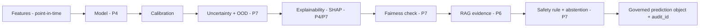

# Prediction Output Schema (Epilepsy) — Every Prediction Is a Governed Object

> **Why (this doc):** A production clinical prediction must carry far more than a risk category — it
> must be **traceable, calibrated, explainable, fair-checked, and safety-gated**. This is the required
> output contract for every seizure-risk prediction. **How:** the schema below is emitted by the serving
> layer (`api/main.py`) and logged for audit; an example is exported to `data/analysis/prediction_output_example.csv`.
> Scope: **epilepsy** (90-day breakthrough-seizure risk, per [Pipeline 1](pipeline-1-research-clinical-protocol.md)).

## The schema
*Caption — every field a prediction must contain, its purpose, and the pipeline that owns it.*

| Field | Purpose | Owner |
|---|---|---|
| patient_pseudonymous_id | de-identified subject (EP001) | P2 |
| prediction_timestamp | when scored | P5 |
| prediction_horizon | e.g. 90 days | P1 |
| model_name / model_version | provenance | P5 |
| feature_set_version / dataset_version | reproducibility | P3 |
| predicted_class | seizure-recurrence yes/no (or severity L1–4) | P4 |
| raw_probability | model output | P4 |
| calibrated_probability | after calibration | P4 |
| uncertainty_level | low/moderate/high (epistemic+aleatoric) | P7 |
| risk_category | banded risk | P4 |
| top_contributing_factors | SHAP/permutation drivers | P4/P7 |
| protective_factors | risk-reducing features | P7 |
| missing_critical_information | fields absent that matter | P3 |
| out_of_distribution_indicator | input is OOD? | P7 |
| fairness_warning | subgroup caution flag | P7 |
| clinical_guideline_evidence | retrieved citations (RAG) | P6 |
| recommended_next_assessment | suggested action | P7 |
| human_review_status | pending/approved/rejected | P7 |
| clinician_override_status / override_reason | human authority | P7 |
| audit_id | immutable audit link | P7 |

## Example prediction (JSON)
```json
{
  "patient_pseudonymous_id": "EP001",
  "prediction_timestamp": "2026-07-12T09:14:00-06:00",
  "prediction_horizon_days": 90,
  "model_name": "epi-recurrence-fusion",
  "model_version": "7.2.0",
  "feature_set_version": "5.1",
  "dataset_version": "3.2",
  "predicted_class": "breakthrough_seizure",
  "raw_probability": 0.72,
  "calibrated_probability": 0.64,
  "uncertainty_level": "moderate",
  "risk_category": "elevated",
  "top_contributing_factors": ["line_length_up", "asm_adherence_low", "sleep_variability_high"],
  "protective_factors": ["stable_asm_regimen"],
  "missing_critical_information": ["recent_ambulatory_EEG"],
  "out_of_distribution_indicator": false,
  "fairness_warning": null,
  "clinical_guideline_evidence": ["ILAE ictal-EEG guidance", "ASM-adherence evidence"],
  "recommended_next_assessment": "neurologist review + repeat EEG within 2 weeks",
  "human_review_status": "pending",
  "clinician_override_status": null,
  "override_reason": null,
  "audit_id": "aud-2026-07-12-0009"
}
```

## Rendered example
Human-readable summary the clinician sees:

> **EP001 — 90-day breakthrough-seizure risk: 72% (calibrated 64%), uncertainty moderate.**
> Drivers: ↑ line-length, low ASM adherence, high sleep variability. Protective: stable ASM regimen.
> Missing: recent ambulatory EEG. **Action: requires neurologist review + repeat EEG within 2 weeks.**
> *Decision-support only — not a diagnosis.*

## Diagram — how the object is assembled


**Reason:** make every prediction accountable. **Why:** a bare risk score is unsafe and un-auditable in
healthcare. **What is happening:** the model output is wrapped with provenance, calibration, uncertainty,
explanation, fairness, evidence, and a safety gate. **How it is happening:** the serving layer composes
the object and logs `audit_id`. **Reference:** Collins et al. (2015, TRIPOD); Sendak et al. (2020, Model Facts).

## Professor Readiness (Defense Q&A)
### Why include calibrated probability separately?
Raw model scores are often mis-calibrated; the clinician needs a probability that means what it says (64% ≈ 64-in-100).
### Why store missing_critical_information?
It tells the clinician the prediction was made without a key input (e.g., recent EEG), so they can weight it and collect more data.
### Why an audit_id on every prediction?
Regulatory traceability — every prediction can be reconstructed (model/feature/dataset versions + inputs + reviewer).

## References

Collins, G. S., et al. (2015). TRIPOD statement. *Annals of Internal Medicine, 162*(1), 55–63.

Sendak, M. P., et al. (2020). Presenting machine learning model information to clinical end users with model facts labels. *npj Digital Medicine, 3*, 41.
