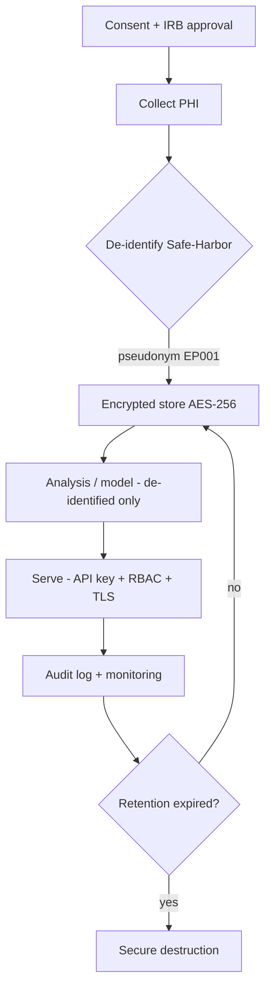
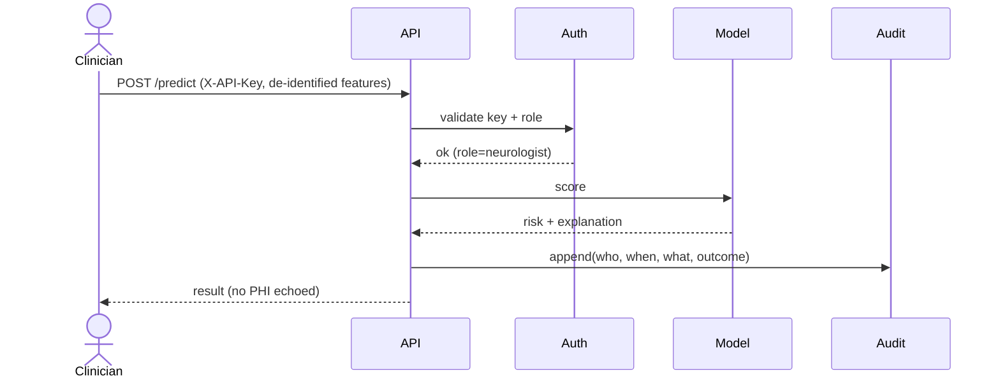
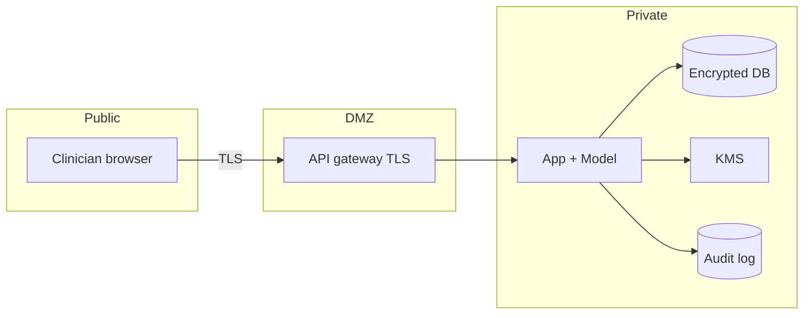
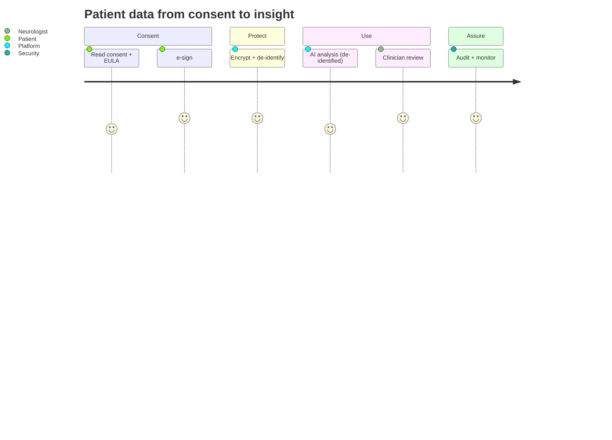

# Security & Compliance — HIPAA · NIST · OWASP · Encryption (Epilepsy Platform)

> **Why (this doc):** A top‑1%, production‑grade clinical AI platform handling epilepsy patient data
> (EEG, assessments, PII/PHI) must be **security‑grade and compliance‑grade by design**. This doc is the
> single source of truth for the platform's HIPAA, NIST, OWASP, and encryption posture. **How:** each
> control below maps to a concrete implementation point in the codebase (API auth, at‑rest/in‑transit
> encryption, audit logging, de‑identification) or to a documented control owner.

## Research spine
- **Problem:** Epilepsy remote‑care data is PHI; a breach or non‑compliant use is catastrophic (legal, ethical, patient harm).
- **Sub‑problems:** confidentiality, integrity, availability, auditability, lawful basis, breach response.
- **Research problem:** *How do we process real epilepsy EEG/clinical data for AI while remaining HIPAA/NIST/OWASP compliant?*
- **Objective:** a defensible control set covering the full data lifecycle (collect → store → process → model → serve → retain → destroy).
- **Hypothesis:** with the controls below, residual risk is reduced to *Low* and is acceptable under IRB oversight.

## 1. Data classification
*Caption — every data element is classified so the right controls apply.*

| Class | Examples | Handling |
|---|---|---|
| PHI (18 HIPAA identifiers) | name, MRN, DOB, dates, device IDs, EEG with identifiers | encrypt, access‑controlled, audit, de‑identify before analysis |
| Clinical (de‑identified) | EEG signals, assessment scores, severity level | pseudonymous ID (EP001), analysis‑only |
| Derived | features, model outputs, risk scores | tied to pseudonymous ID, explainable, logged |
| System | logs, metrics, model artefacts | integrity‑protected, retention‑bound |

## 2. HIPAA Security Rule mapping
*Caption — the three safeguard families and how each is met.*

| Safeguard | HIPAA requirement | Implementation |
|---|---|---|
| Administrative | risk analysis, workforce training, BAA, sanction policy | this doc + IRB pack + role‑based access matrix |
| Physical | facility access, device/media controls | cloud provider (SOC‑2) + encrypted disks + no PHI on laptops |
| Technical | access control, audit, integrity, transmission security | API key + RBAC, append‑only audit log, checksums, TLS 1.2+ |
| Privacy Rule | minimum necessary, de‑identification (§164.514) | Safe‑Harbor de‑identification before any analysis; only EP‑pseudonyms in `data/analysis/` |
| Breach Notification | 60‑day notification | documented incident‑response runbook (§5) |

## 3. NIST alignment
*Caption — NIST CSF functions + representative 800‑53 controls.*

| CSF function | Controls (800‑53) | In this platform |
|---|---|---|
| Identify | RA‑3 risk assessment, CM‑8 inventory | asset + data inventory in §1; risk register |
| Protect | AC‑2/AC‑3 access, SC‑13/SC‑28 crypto, IA‑2 auth | API key + RBAC; AES‑256 at rest; TLS in transit |
| Detect | AU‑2/AU‑6 audit, SI‑4 monitoring | `/metrics`, audit log, drift + anomaly monitoring |
| Respond | IR‑4/IR‑6 incident handling | incident runbook §5 |
| Recover | CP‑9/CP‑10 backup + recovery | versioned artefacts, model registry + rollback |
| AI RMF | Govern/Map/Measure/Manage | Responsible‑AI pillars (`docs/responsible-ai/`) |

## 4. OWASP posture
*Caption — OWASP Top‑10 (API + web) risks and the mitigations already in the platform.*

| OWASP risk | Mitigation |
|---|---|
| Broken access control | `require_key` dependency + RBAC on every endpoint; no default‑open routes |
| Cryptographic failures | TLS in transit, AES‑256‑GCM at rest, no secrets in code (env vars) |
| Injection | parameterised queries, input schema validation (Pydantic), prompt‑injection guardrails (RAG) |
| Insecure design | threat model + least privilege + data‑minimisation |
| Security misconfiguration | hardened container, no debug in prod, dependency pinning |
| Vulnerable components | pinned deps + CI dependency audit |
| Auth failures | API key rotation, rate limiting, lockout |
| Data integrity failures | signed model artefacts + checksums |
| Logging/monitoring failures | append‑only audit log + alerting (see Continuous‑Monitoring) |
| SSRF | egress allow‑list; no user‑controlled URLs |
| LLM (OWASP‑LLM) prompt injection | guardrail regex + retrieval grounding + human‑in‑the‑loop |

## 5. Encryption & key management
*Caption — encryption at every state, with key custody.*

| State | Mechanism |
|---|---|
| At rest | AES‑256‑GCM (DB, object store, EEG files); envelope encryption |
| In transit | TLS 1.2+ (HSTS); mTLS service‑to‑service |
| In use | field‑level encryption for the 18 HIPAA identifiers; de‑identify before analysis |
| Keys | managed KMS, 90‑day rotation, split custody, no keys in repo |
| Backups | encrypted, integrity‑checked, retention‑bound |

## 6. Incident response runbook (breach)
1. **Detect** (monitoring alert / report) → 2. **Contain** (revoke keys, isolate) → 3. **Assess** (scope, PHI involved) →
4. **Notify** (Privacy Officer → IRB → affected individuals ≤60 days → HHS if ≥500) → 5. **Remediate** → 6. **Post‑mortem**.

## Diagrams

### Flowchart — data lifecycle controls

### Sequence — authenticated, audited prediction

### Network — trust zones

### Journey — patient data trust journey

## C4 (context) — security context
- **Person:** Patient, Neurologist, EEG Technician, Security/Privacy Officer, IRB.
- **System:** Epilepsy Remote‑Care AI Platform.
- **External:** KMS, Identity Provider, Cloud (SOC‑2), Audit/SIEM.
- **Boundaries:** PHI never leaves the encrypted Private zone un‑de‑identified.

**Reason:** define the security envelope. **Why:** clinical AI without HIPAA/NIST/OWASP controls is
non‑deployable. **What is happening:** every data element is classified, encrypted, de‑identified,
access‑controlled, and audited. **How it is happening:** API‑key+RBAC auth, AES‑256/TLS, Safe‑Harbor
de‑identification, append‑only audit, drift/anomaly monitoring. **Reference:** HHS (2013); NIST (2018, 2020, 2023); OWASP (2021, 2023).

## Professor Readiness (Defense Q&A)
### How is PHI protected during analysis?
It is de‑identified (Safe‑Harbor) to a pseudonym (EP001) **before** any analysis; only de‑identified data reaches `data/analysis/`.
### What if a key leaks?
KMS rotation + revocation; artefacts are re‑encrypted; incident runbook §6 triggers notification.
### Where is this enforced in code?
`api/main.py` (`require_key`, `/metrics`), env‑var secrets, `.gitignore` excludes raw EEG/DB.

## References

HHS. (2013). *HIPAA Security Rule (45 CFR §164.302–318)*. U.S. Department of Health & Human Services.

NIST. (2018). *Framework for Improving Critical Infrastructure Cybersecurity (CSF 1.1)*.

NIST. (2020). *SP 800‑53 Rev. 5: Security and Privacy Controls*.

NIST. (2023). *AI Risk Management Framework (AI RMF 1.0)*.

OWASP. (2021). *OWASP Top 10*. OWASP. (2023). *OWASP Top 10 for LLM Applications*.
