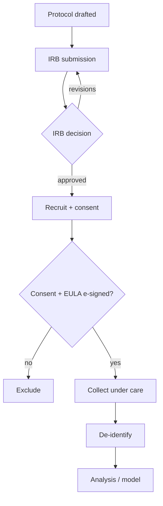
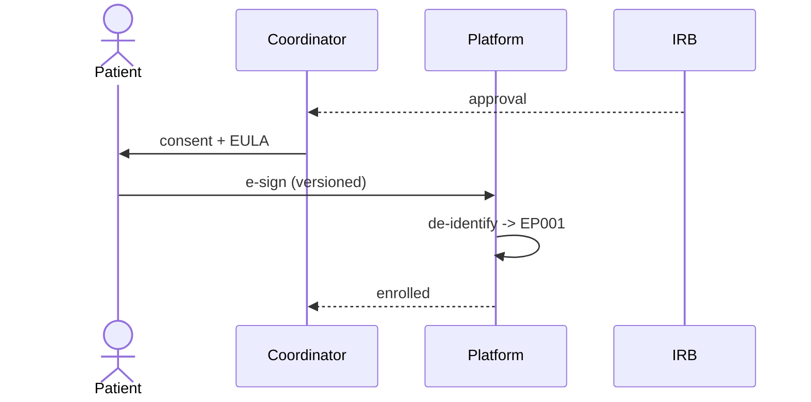
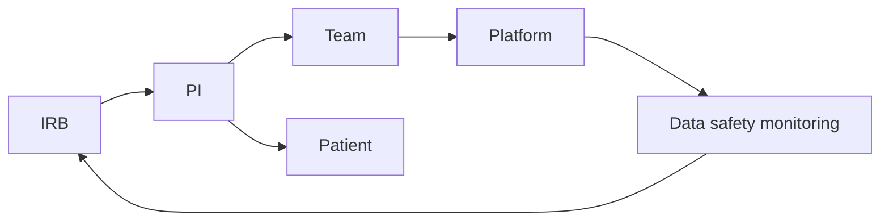
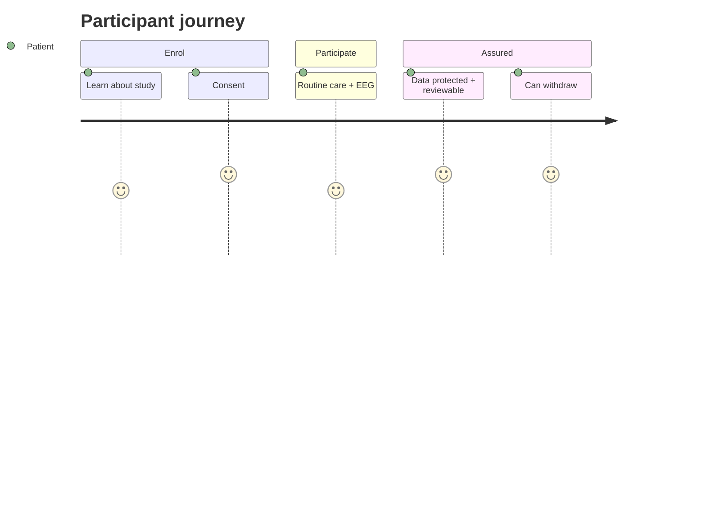

# IRB Submission Pack — Epilepsy Remote‑Care AI Study

> **Why (this doc):** Using real epilepsy patient data (EEG + clinical assessments) for AI research
> requires **Institutional Review Board (IRB) approval**. This is the protocol/submission package a
> reviewer would file. **How:** it states the study, risks, protections, consent process, and data
> plan, cross‑referencing the [Security & Compliance](00-security-compliance.md) controls and the
> [Consent + EULA](02-patient-consent-eula.md).

## Research spine
- **Problem:** clinical AI needs real, labelled epilepsy data, but human‑subjects data use is ethically and legally regulated.
- **Sub‑problems:** informed consent, risk minimisation, privacy, equitable selection, data governance.
- **Research problem:** *Can we ethically collect/use epilepsy EEG + assessment data to build explainable seizure‑risk models?*
- **Objective:** obtain IRB approval under minimal‑risk, with valid consent and robust de‑identification.
- **Hypothesis:** risks are minimal and outweighed by knowledge gained; approvable under 45 CFR 46.

## 1. Study summary
| Field | Value |
|---|---|
| Title | Explainable AI‑Driven Remote Epilepsy Care: EEG + Multimodal Assessment |
| PI | (name / credentials) |
| Type | Retrospective + prospective, minimal‑risk, observational + model development |
| Population | Adults & paediatric epilepsy patients under standard care |
| Sample | Pilot n≈50–500 (pseudonymous EP001…) |
| Data | Scalp EEG (EDF), role assessments, severity labels — **de‑identified** |
| Duration | 12 months + retention per policy |
| Risk level | Minimal (no change to clinical care; de‑identified analysis) |

## 2. Background & aims
Seizure detection/severity support using real EEG (e.g., CHB‑MIT‑style scalp EEG) + structured
clinician assessments, with explainable (SHAP/permutation) outputs and human‑in‑the‑loop review.
Aim 1: build a subject‑level seizure‑detection model. Aim 2: fuse EEG + assessment for severity.
Aim 3: evaluate fairness, explainability, and clinical utility.

## 3. Procedures
1. Eligible patients receive the **consent form + EULA** (§[Consent](02-patient-consent-eula.md)).
2. On e‑signed consent, data is collected under routine care (no extra procedures).
3. Data is **de‑identified (HIPAA Safe‑Harbor)** to a pseudonym before analysis.
4. Models are trained/evaluated on de‑identified data with subject‑level splits.
5. A neurophysiologist reviews all AI outputs; **no autonomous diagnosis**.

## 4. Risks, benefits, minimisation
| Risk | Likelihood | Minimisation |
|---|---|---|
| Privacy/PHI breach | Low | encryption, de‑identification, RBAC, audit (see Security doc) |
| Re‑identification | Low | Safe‑Harbor + no linkage keys in analysis env |
| Model error influencing care | Low | decision‑support only + mandatory clinician review |
| Group harm / bias | Low | fairness evaluation (subgroup metrics) + reporting |

**Benefits:** potential improved seizure‑risk stratification; societal knowledge. No direct guarantee to participant.

## 5. Informed consent process
- Written + electronic consent; capacity assessed; assent + parental permission for minors.
- Voluntary; withdrawal any time without affecting care.
- Consent covers **specific use**: model development, validation, and de‑identified secondary analysis.
- Documented in the platform with timestamp, version, and revocation status.

## 6. Data management & confidentiality
- Storage: encrypted (AES‑256), access‑controlled, audited.
- Sharing: de‑identified only; no PHI leaves the secure zone.
- Retention: per policy; secure destruction at end of retention.
- Governance: Responsible‑AI pillars + Continuous‑Monitoring.

## 7. Equitable selection
Inclusion regardless of sex, race, socioeconomic status; paediatric inclusion justified (epilepsy onset is often paediatric) with added protections.

## Diagrams

### Flowchart — IRB + consent gate before any data use

### Sequence — consent-to-analysis

### Network — oversight relationships

### Journey — participant experience

**Reason:** obtain ethical approval. **Why:** human‑subjects research is regulated (45 CFR 46 / Common Rule).
**What is happening:** minimal‑risk study with valid consent + de‑identification. **How it is happening:**
consent gate → de‑identify → subject‑level modelling → clinician‑reviewed outputs. **Reference:** HHS (2018, Common Rule); WMA (2013, Declaration of Helsinki).

## Professor Readiness (Defense Q&A)
### Why is this minimal risk?
No change to clinical care; analysis is on de‑identified data; outputs are clinician‑reviewed decision‑support.
### How do minors get protected?
Parental permission + assent + additional safeguards (45 CFR 46 Subpart D).
### What is the withdrawal effect?
Withdrawal any time, no impact on care; already‑de‑identified aggregated data may be retained per protocol.

## References

HHS. (2018). *Federal Policy for the Protection of Human Subjects (Common Rule), 45 CFR 46*.

World Medical Association. (2013). *Declaration of Helsinki: Ethical principles for medical research involving human subjects*. *JAMA, 310*(20), 2191–2194.
