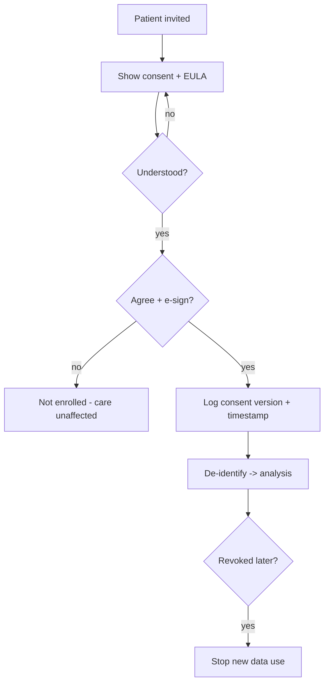
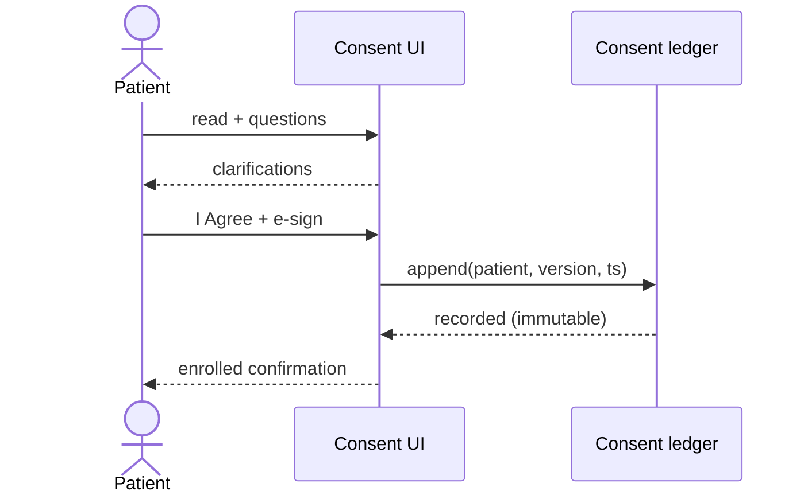
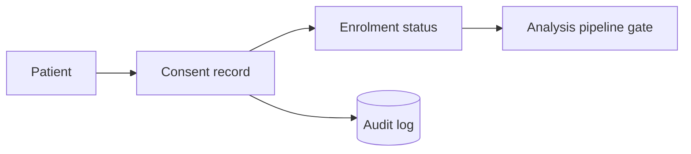
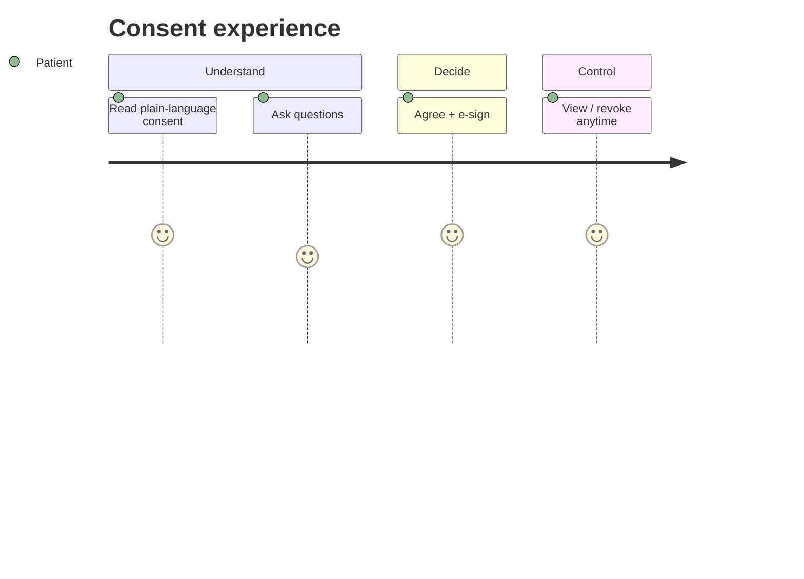

# Patient Consent + EULA — Data Use for Epilepsy AI Analysis

> **Why (this doc):** Before any patient's epilepsy data (EEG, assessments) is used for AI analysis,
> the platform must capture **informed consent** and agreement to an **End‑User Licence Agreement
> (EULA)** governing data use. This is the consent/EULA text and the capture workflow. **How:** the
> viewer's *Survey* / *AI Forms* tabs present this as a gated first step; consent is versioned,
> timestamped, and revocable, per the [IRB pack](01-irb-submission.md) and [Security doc](00-security-compliance.md).

## 1. Informed consent (plain language)
*Caption — the core disclosures a participant must understand before agreeing.*

| Element | Statement |
|---|---|
| Purpose | Your EEG and assessment answers may be used to develop and test AI that supports epilepsy care. |
| Voluntary | Participation is voluntary. Declining will **not** affect your care. |
| What we collect | EEG recordings, questionnaire answers, and severity information. |
| De‑identification | Your identity is removed and replaced with a code (e.g., EP001) before analysis. |
| Who sees it | Your care team and authorised researchers under strict security. |
| AI is support only | AI never diagnoses you. A neurologist reviews all results. |
| Risks | Main risk is privacy; we encrypt and de‑identify to minimise it. |
| Benefits | You may not directly benefit; findings may help future patients. |
| Withdrawal | You may withdraw any time; we stop using new data and honour deletion where feasible. |
| Contact | PI / IRB contact details for questions or complaints. |

**Consent statement:** *"I have read and understood the above. I voluntarily consent to the collection,
de‑identification, and use of my epilepsy data for the described AI research."* — e‑signature + date + version.

## 2. EULA (data‑use licence) — key clauses
*Caption — the licence terms governing how the platform may use the de‑identified data.*

| Clause | Term |
|---|---|
| Licence grant | Non‑exclusive licence to use **de‑identified** data for model development, validation, and secondary analysis. |
| Scope limitation | No re‑identification attempts; no sale of data; no use outside the stated research purpose. |
| Security | Data protected per HIPAA/NIST/OWASP controls (encryption, RBAC, audit). |
| Retention | Data retained only for the retention period, then securely destroyed. |
| Revocation | Consent may be revoked; downstream use of new data ceases. |
| Liability & disclaimer | AI output is decision‑support, not medical advice; no warranty of diagnostic accuracy. |
| Governing terms | Subject to IRB oversight and applicable law (HIPAA, Common Rule). |
| Acceptance | Explicit "I Agree" required; agreement is logged (who/when/version). |

## 3. Consent capture workflow
1. Present consent + EULA (this doc) in the patient's language, readable format.
2. Verify comprehension (teach‑back / questions).
3. Capture **e‑signature** + timestamp + document version.
4. Store consent record (immutable, audited); set participant status = *consented*.
5. Only *consented* participants' data flows to de‑identification → analysis.
6. Revocation flips status; pipeline excludes new data.

## Diagrams

### Flowchart — consent gate

### Sequence — e-consent

### Network — consent record relationships

### Journey — consent experience

**Reason:** obtain lawful, ethical basis to use patient data. **Why:** without consent + EULA, data use is
unlawful and unethical. **What is happening:** patient is informed, agrees, and can revoke; only consented,
de‑identified data is analysed. **How it is happening:** gated e‑consent → immutable log → pipeline gate.
**Reference:** HHS (2018); WMA (2013); GDPR Art. 7 (where applicable).

## Professor Readiness (Defense Q&A)
### Is EULA acceptance enough?
No — EULA governs data‑use licence; **informed consent** (IRB‑approved) is the ethical basis. Both are captured.
### How is revocation honoured technically?
Consent status is a pipeline gate; on revocation, new data is excluded and deletion is honoured where feasible (aggregates may persist).
### Where does the UI enforce this?
The *Survey* / *AI Forms* tabs present consent as step 0; analysis datasets carry only consented pseudonyms.

## References

HHS. (2018). *Federal Policy for the Protection of Human Subjects (Common Rule), 45 CFR 46*.

World Medical Association. (2013). *Declaration of Helsinki*. *JAMA, 310*(20), 2191–2194.

European Parliament. (2016). *General Data Protection Regulation (EU 2016/679)*, Art. 7.
