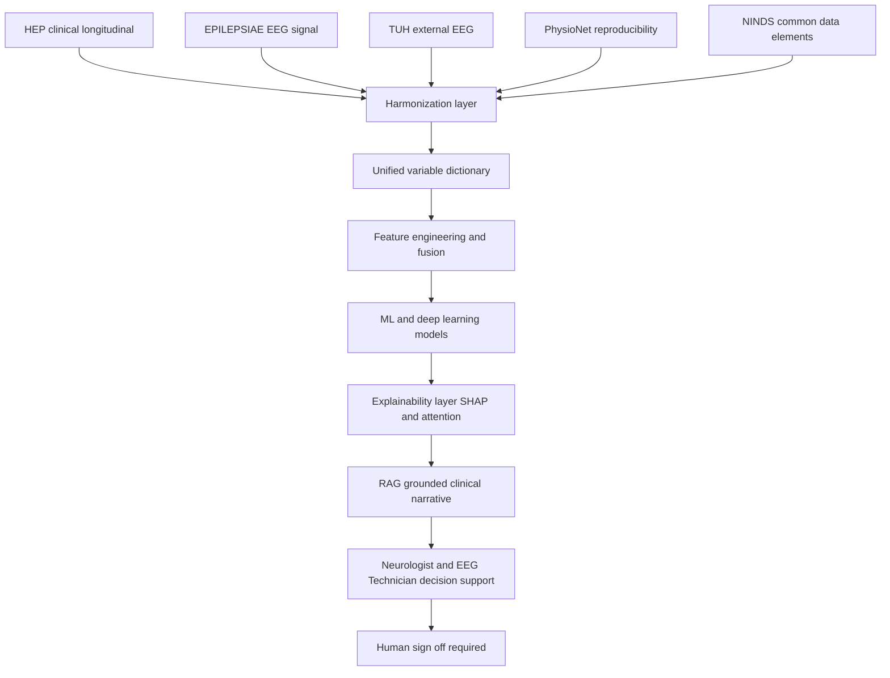
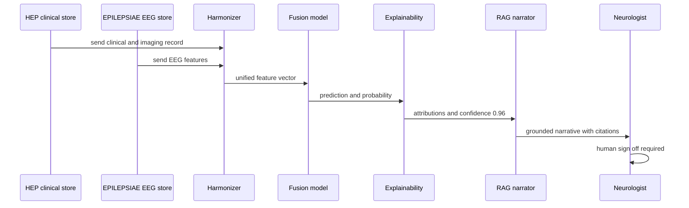
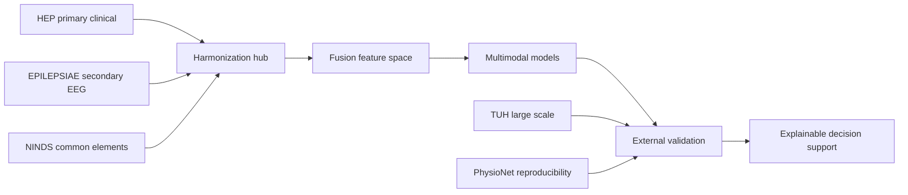
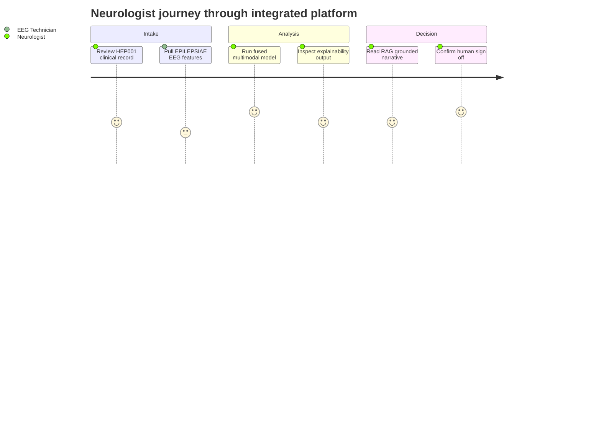

# HEP + EPILEPSIAE Cross-Dataset Integration Framework

> **Why (this doc):** This document is the dissertation core that unifies the primary clinical-longitudinal dataset (Human Epilepsy Project, HEP) with the EEG-signal-rich secondary dataset (EPILEPSIAE), plus external validation cohorts (TUH, PhysioNet, NINDS), into one explainable multimodal epilepsy intelligence platform for Neurologists and EEG Technicians. It specifies exactly how heterogeneous variables are mapped, where each dataset is strong or weak, and how a single AI pipeline consumes them as decision support only.
> **How:** It presents a cross-dataset variable mapping matrix, a gap analysis, a 10-section master epilepsy data dictionary, a unified variable dictionary, a unified AI pipeline, and an external-validation strategy — each as captioned Markdown tables and four Mermaid diagrams — anchored to the exemplar patient HEP001 (27F, focal impaired awareness seizures, suspected temporal lobe epilepsy, left hippocampal sclerosis, diagnostic confidence 96%).

---

## 1. Problem

> **Why:** Frame the clinical and data-engineering pain that motivates cross-dataset integration. **How:** State the fragmentation problem in one paragraph grounded in real datasets.

Epilepsy intelligence is fragmented across incompatible data silos. EPILEPSIAE offers long-term intracranial and scalp EEG with rich signal detail but shallow longitudinal, medication, and quality-of-life (QOL) context. HEP offers deep clinical trajectories — seizure diaries, medication adherence, imaging, QOL, and outcomes over years — but comparatively coarse continuous EEG. TUH, PhysioNet, and NINDS each encode variables under different schemas, units, and ontologies. Without a harmonized variable model, no single model can learn from imaging, EEG, medication, and outcome signals together, and results cannot be externally validated. For HEP001, her left temporal spikes (EEG), left hippocampal sclerosis (MRI), left temporal hypometabolism (PET), Levetiracetam adherence (~85-95%), and seizure diary live in different representations that must be reconciled before any explainable prediction is trustworthy.

## 2. Sub-Problems

> **Why:** Decompose the umbrella problem into tractable engineering questions. **How:** Enumerate discrete sub-problems that each map to a later table or diagram.

*Caption - The table below decomposes the integration problem so that every downstream artifact (mapping matrix, dictionary, pipeline) traces to a named sub-problem, making the dissertation scope auditable.*

| # | Sub-Problem | Why it matters | Resolved by |
|---|-------------|----------------|-------------|
| SP1 | Variables differ in name, unit, and granularity across datasets | Blocks any joint model | Cross-dataset mapping matrix (§8) |
| SP2 | Each dataset has complementary strengths and blind spots | Naive pooling amplifies bias | Gap analysis (§9) |
| SP3 | No shared controlled vocabulary spans clinical to governance layers | Prevents reproducibility | Master data dictionary (§10) |
| SP4 | Modalities must fuse into one feature space | Enables multimodal ML/DL | Unified variable dictionary (§11) + pipeline (§12) |
| SP5 | Findings must generalize beyond training cohorts | Clinical safety | External validation strategy (§13) |
| SP6 | Longitudinal structure creates leakage and correlation risks | Invalid statistics | Statistical Analysis (§7) + Q&A (§14) |

## 3. Research Problem

> **Why:** Compress the sub-problems into one falsifiable statement. **How:** One sentence naming the construct, datasets, and constraint.

Can a harmonized, explainable multimodal AI platform integrate the longitudinal-clinical strengths of HEP with the EEG-signal strengths of EPILEPSIAE — externally validated on TUH and PhysioNet — to improve epilepsy decision support for clinicians without ever acting autonomously?

## 4. Research Objective

> **Why:** Convert the problem into measurable deliverables. **How:** List objectives mapped to acceptance criteria.

*Caption - This table binds each research objective to a concrete, measurable acceptance criterion, so examiners can judge completion rather than intent.*

| Obj | Objective | Acceptance criterion |
|-----|-----------|----------------------|
| O1 | Build a bidirectional variable mapping matrix across 5 datasets | 100% of core clinical + EEG variables mapped or flagged missing |
| O2 | Quantify dataset gaps | Strength/weakness scored per modality with justification |
| O3 | Publish a 10-section master data dictionary | Every field has type, unit, provenance, ontology code |
| O4 | Deliver a unified AI pipeline consuming fused features | End-to-end run on HEP001 producing explainable output |
| O5 | Define external validation protocol | TUH + PhysioNet protocol with leakage controls |

## 5. Flow

> **Why:** Give a visual map of how data moves from raw datasets to explainable decision support. **How:** A Mermaid flowchart with ASCII-only node labels.

*Caption - The flowchart traces the end-to-end route each dataset takes into the unified pipeline, showing where HEP and EPILEPSIAE converge before fusion and inference.*

## 6. Hypotheses

> **Why:** State testable predictions with directionality. **How:** Null and alternative pairs for the key integration claims.

*Caption - Formal hypotheses make the integration claims falsifiable; each pairs a null with a directional alternative tied to a metric evaluated in the Statistical Analysis section.*

| ID | Null (H0) | Alternative (H1) | Metric |
|----|-----------|------------------|--------|
| Hyp1 | Fused HEP+EPILEPSIAE features do not improve prediction over EEG-only | Fusion improves discrimination | AUROC delta, DeLong test |
| Hyp2 | Medication adherence adds no predictive value to seizure-outcome models | Adherence improves calibration | Brier score, LRT |
| Hyp3 | Models trained on HEP+EPILEPSIAE do not generalize to TUH | External AUROC within 0.05 of internal | External AUROC |
| Hyp4 | Longitudinal correlation does not bias naive models | Mixed-effects reduces overoptimism | Variance components |

## 7. Statistical Analysis

> **Why:** Specify the rigor that keeps longitudinal, multimodal inference valid. **How:** Name each method and the risk it controls.

*Caption - This table lists the statistical machinery required for longitudinal multimodal data, mapping each method to the specific validity threat it neutralizes, which is essential for defense.*

| Method | Purpose | Risk controlled |
|--------|---------|-----------------|
| Linear/generalized mixed-effects models | Model repeated seizure/QOL measures per patient | Within-patient correlation |
| Cox proportional hazards + time-varying covariates | Time-to-seizure-freedom with medication as covariate | Censoring, dropout |
| Patient-level (grouped) train/test splitting | Prevent same-patient records across folds | Data leakage |
| DeLong test / bootstrap CIs | Compare AUROCs across fusion vs EEG-only | Type I error |
| Multiple imputation (MICE) | Handle cross-dataset missingness (e.g., no PET in TUH) | Bias from listwise deletion |
| Calibration (Brier, reliability curves) | Trustworthy probabilities for clinicians | Overconfidence |

---

## 8. Cross-Dataset Variable Mapping Matrix

> **Why:** Establish the canonical correspondence of variables so datasets can be joined. **How:** Map each core variable across all five datasets with availability and unit notes.

*Caption - The mapping matrix is the backbone of integration: it shows, per core variable, where the data exists, under what name/unit, and where a gap must be imputed — resolving Sub-Problem SP1.*

| Canonical variable | EPILEPSIAE | HEP | TUH | PhysioNet | NINDS |
|--------------------|-----------|-----|-----|-----------|-------|
| Age | Present (years) | Present (years, exemplar 27) | Present (years) | Present (years) | Present (CDE demographics) |
| Gender | Present | Present (exemplar female) | Present | Partial | Present |
| Medication / AED | Sparse | Strong (Levetiracetam, dose, class) | Absent | Absent | Present (medication CDE) |
| Medication adherence | Absent | Strong (exemplar 85-95%) | Absent | Absent | Partial |
| MRI findings | Partial | Strong (left hippocampal sclerosis) | Absent | Absent | Present (imaging CDE) |
| PET findings | Absent | Present (left temporal hypometabolism) | Absent | Absent | Partial |
| Scalp EEG signal | Strong (long-term) | Moderate (routine, left temporal spikes) | Strong (large-scale) | Strong (curated) | Sparse |
| Intracranial EEG | Strong | Limited | Limited | Limited | Absent |
| Seizure type / semiology | Present | Strong (focal impaired awareness, aura, automatisms) | Coarse | Sparse | Present (ILAE CDE) |
| Follow-up / outcome | Limited | Strong (longitudinal QOL, seizure freedom) | Absent | Absent | Present |
| Diagnostic confidence | Derived | Present (exemplar 96%) | Absent | Absent | Absent |

## 9. Gap Analysis

> **Why:** Make explicit which dataset compensates for which weakness, justifying fusion. **How:** Score modality strength and state the compensating dataset.

*Caption - The gap analysis proves that HEP and EPILEPSIAE are complementary rather than redundant, justifying multimodal fusion and identifying which external cohort backstops each residual weakness (Sub-Problem SP2).*

| Modality / dimension | EPILEPSIAE | HEP | Gap and compensation |
|----------------------|-----------|-----|----------------------|
| Continuous EEG signal | Strong | Weak | HEP relies on EPILEPSIAE for signal depth |
| Longitudinal trajectory | Weak | Strong | EPILEPSIAE relies on HEP for follow-up |
| Medication + adherence | Weak | Strong | HEP fills AED behavioral gap |
| Quality of life (QOL) | Absent | Strong | HEP unique contribution |
| Multimodal imaging (MRI/PET) | Partial | Strong | HEP anchors structural/metabolic truth |
| Sample scale / diversity | Moderate | Moderate | TUH supplies large-scale scalp EEG |
| Reproducibility harness | Moderate | Limited | PhysioNet supplies open benchmarks |
| Standardized elements | Partial | Partial | NINDS CDEs supply shared ontology |

## 10. Master Epilepsy Data Dictionary (10 Sections)

> **Why:** Provide the controlled vocabulary spanning raw clinical data through governance. **How:** One captioned table per section; every field carries type, unit, and provenance.

> **Why:** The dictionary is the shared contract enabling reproducibility and cross-dataset joins. **How:** Sections progress from data capture to responsible-AI governance.

### 10.1 Demographics
> **Why:** Anchor every record to a de-identified patient identity. **How:** Minimal, privacy-preserving demographic fields.

*Caption - Demographic fields normalize identity and confounders (age, sex) across all five datasets so models control for them consistently.*

| Field | Type | Unit / values | Provenance |
|-------|------|---------------|-----------|
| patient_id | string | de-identified | All datasets |
| age | integer | years (HEP001 = 27) | All |
| sex | categorical | M/F/other (HEP001 = F) | All |
| handedness | categorical | L/R/ambi | HEP, NINDS |

### 10.2 Clinical Assessment
> **Why:** Capture diagnosis, semiology, and treatment context. **How:** Structured clinical fields aligned to ILAE terms.

*Caption - Clinical assessment fields encode the neurologist-facing diagnosis and treatment picture, exemplified by HEP001's focal impaired awareness seizures on Levetiracetam.*

| Field | Type | Unit / values | Provenance |
|-------|------|---------------|-----------|
| seizure_type | categorical | ILAE (focal impaired awareness) | HEP, NINDS |
| aura | text/coded | rising epigastric sensation | HEP |
| automatisms | text/coded | lip smacking | HEP |
| suspected_localization | categorical | temporal lobe (left) | HEP |
| aed_name | categorical | Levetiracetam | HEP, NINDS |
| adherence_pct | float | percent (85-95) | HEP |
| diagnostic_confidence | float | percent (96) | HEP |

### 10.3 EEG Metadata
> **Why:** Describe acquisition context needed to compare recordings. **How:** Montage, sampling, and channel descriptors.

*Caption - EEG metadata harmonizes acquisition parameters so EPILEPSIAE, TUH, and PhysioNet recordings can be compared and pooled without montage artifacts.*

| Field | Type | Unit / values | Provenance |
|-------|------|---------------|-----------|
| sampling_rate | integer | Hz | EPILEPSIAE, TUH, PhysioNet |
| montage | categorical | 10-20 / bipolar | EPILEPSIAE, TUH |
| n_channels | integer | count | All EEG datasets |
| recording_type | categorical | scalp / intracranial | EPILEPSIAE |
| ictal_flag | boolean | seizure segment | EPILEPSIAE, TUH |

### 10.4 Signal Processing
> **Why:** Standardize preprocessing so features are comparable. **How:** Filter, epoch, and artifact fields.

*Caption - Signal-processing fields record the exact preprocessing applied, a prerequisite for reproducible feature engineering across datasets.*

| Field | Type | Unit / values | Provenance |
|-------|------|---------------|-----------|
| bandpass_low | float | Hz | Pipeline |
| bandpass_high | float | Hz | Pipeline |
| notch | float | Hz (50/60) | Pipeline |
| epoch_length | float | seconds | Pipeline |
| artifact_method | categorical | ICA / threshold | Pipeline |

### 10.5 Feature Engineering
> **Why:** Define the derived quantitative features feeding models. **How:** Spectral, temporal, and connectivity features.

*Caption - Feature-engineering fields catalog the quantitative EEG and clinical descriptors that become the fused model input space.*

| Field | Type | Unit / values | Provenance |
|-------|------|---------------|-----------|
| band_power | float | uV^2 per band | Pipeline |
| spectral_entropy | float | unitless | Pipeline |
| line_length | float | derived | Pipeline |
| connectivity_coh | float | coherence 0-1 | Pipeline |
| adherence_feature | float | normalized | HEP-derived |

### 10.6 Machine Learning
> **Why:** Track classical model configuration and outputs. **How:** Model, split, and metric fields.

*Caption - ML fields document model type and evaluation setup, including the patient-level split that prevents leakage in longitudinal data.*

| Field | Type | Unit / values | Provenance |
|-------|------|---------------|-----------|
| model_type | categorical | RF / XGBoost / logistic | Pipeline |
| split_strategy | categorical | patient-level grouped | Pipeline |
| auroc | float | 0-1 | Pipeline |
| brier_score | float | 0-1 | Pipeline |

### 10.7 Deep Learning
> **Why:** Capture neural architectures for raw-signal and multimodal learning. **How:** Architecture and training fields.

*Caption - Deep-learning fields specify architectures (e.g., CNN on EEG, transformer fusion) so multimodal experiments are reproducible.*

| Field | Type | Unit / values | Provenance |
|-------|------|---------------|-----------|
| architecture | categorical | CNN / LSTM / transformer | Pipeline |
| fusion_type | categorical | early / late / attention | Pipeline |
| epochs | integer | count | Pipeline |
| learning_rate | float | scalar | Pipeline |

### 10.8 Explainability
> **Why:** Ensure every prediction is interpretable for clinicians. **How:** Attribution and saliency fields.

*Caption - Explainability fields log the interpretation method behind each output, satisfying the platform mandate that AI act as transparent decision support.*

| Field | Type | Unit / values | Provenance |
|-------|------|---------------|-----------|
| shap_values | array | per-feature | Pipeline |
| attention_weights | array | per-channel/time | Pipeline |
| saliency_map | array | signal overlay | Pipeline |
| confidence | float | 0-1 (HEP001 = 0.96) | Pipeline |

### 10.9 RAG (Retrieval-Augmented Generation)
> **Why:** Ground generated clinical narratives in retrieved evidence. **How:** Source, citation, and guardrail fields.

*Caption - RAG fields track the retrieved evidence and guardrails behind any generated narrative, preventing unsupported or hallucinated clinical claims.*

| Field | Type | Unit / values | Provenance |
|-------|------|---------------|-----------|
| retrieved_source | string | guideline / literature id | Knowledge base |
| citation | string | APA reference | Knowledge base |
| grounding_score | float | 0-1 | Pipeline |
| guardrail_flag | boolean | blocked autonomous action | Governance |

### 10.10 Governance
> **Why:** Enforce safety, privacy, and human oversight. **How:** Consent, audit, and human-sign-off fields.

*Caption - Governance fields encode the non-negotiable controls: de-identification, audit trail, and mandatory human sign-off that keep the platform decision-support only.*

| Field | Type | Unit / values | Provenance |
|-------|------|---------------|-----------|
| consent_status | categorical | IRB approved | All |
| deidentified | boolean | true | All |
| audit_log_id | string | trace id | Governance |
| human_signoff | boolean | required true | Governance |
| autonomy_block | boolean | no auto diagnosis/prescription/surgery | Governance |

## 11. Unified Variable Dictionary

> **Why:** Collapse the mapping matrix and master dictionary into the single fused schema used by models. **How:** One canonical row per fused variable with its source layer.

*Caption - The unified variable dictionary is the final integrated schema that the AI pipeline actually consumes, resolving Sub-Problem SP4 by naming each fused feature and its originating modality.*

| Unified variable | Modality | Primary source | Notes |
|------------------|----------|----------------|-------|
| demo_age | Clinical | HEP/all | Confounder control |
| demo_sex | Clinical | HEP/all | Confounder control |
| clin_seizure_type | Clinical | HEP/NINDS | ILAE coded |
| clin_adherence | Behavioral | HEP | Unique HEP strength |
| img_mri_hs | Imaging | HEP | Left hippocampal sclerosis |
| img_pet_hypometab | Imaging | HEP | Left temporal |
| eeg_bandpower | Signal | EPILEPSIAE/TUH | Spectral |
| eeg_connectivity | Signal | EPILEPSIAE | Coherence |
| eeg_spikes | Signal | HEP/EPILEPSIAE | Left temporal spikes |
| outcome_seizure_free | Longitudinal | HEP | Survival endpoint |
| qol_score | Longitudinal | HEP | Unique HEP strength |
| model_confidence | Derived | Pipeline | Explainable output |

## 12. Unified AI Pipeline

> **Why:** Show the runtime integration and the request/response contract between components. **How:** A Mermaid sequenceDiagram of one inference for HEP001.

*Caption - The sequence diagram makes the runtime integration concrete, tracing a single HEP001 inference from data harmonization through explainable output and mandatory clinician sign-off (Objective O4).*

*Caption - The graph below depicts the integration network topology, showing how the primary HEP dataset and secondary EPILEPSIAE pipeline connect through the harmonization hub to external validators.*

## 13. External Validation Strategy

> **Why:** Ensure the integrated model generalizes beyond development cohorts. **How:** Assign each external dataset a validation role with leakage controls.

*Caption - The external validation strategy operationalizes generalization: TUH tests scale and diversity, PhysioNet tests reproducibility, and both use strict patient-level separation to prevent leakage (Objective O5, Sub-Problem SP5).*

| Dataset | Validation role | Protocol | Leakage control |
|---------|-----------------|----------|-----------------|
| TUH | Large-scale scalp EEG generalization | Frozen model, external test only | No TUH patient in training |
| PhysioNet | Reproducibility benchmark | Public code + fixed seeds | Version-pinned splits |
| NINDS | Ontology and CDE conformance | Schema validation | N/A (metadata) |
| HEP+EPILEPSIAE | Internal development | Patient-level grouped CV | Grouped folds |

*Caption - The journey diagram summarizes the neurologist's experience across the integrated workflow, highlighting satisfaction where integration reduces effort and where human oversight remains mandatory.*

## 14. Professor Readiness (Defense Q&A)

> **Why:** Prepare defensible answers to the hardest integration and rigor questions. **How:** Four examiner questions as sub-headings with concise, technical answers.

### 14.1 How do you prevent data leakage when the same patient contributes many longitudinal records?
> **Why:** Leakage is the top threat to longitudinal validity. **How:** Describe grouped splitting and its rationale.

All cross-validation and train/test splits are patient-level (grouped): every record from a given patient falls entirely in one fold. This prevents the model from memorizing patient-specific signal and inflating performance. External validation on TUH further ensures no development patient appears at test time.

### 14.2 Why mixed-effects and survival models instead of standard regression?
> **Why:** Justify the statistical machinery. **How:** Tie methods to the data structure.

Repeated seizure counts and QOL scores per patient violate independence, so mixed-effects models add per-patient random intercepts/slopes to separate within- from between-patient variance. Time-to-seizure-freedom is right-censored (patients exit follow-up), so Cox proportional hazards with time-varying medication covariates handles censoring that logistic regression cannot.

### 14.3 If EPILEPSIAE lacks medication and QOL, how is fusion valid rather than fabricated?
> **Why:** Address the missingness/imputation critique. **How:** Explain principled handling.

Fusion operates on the unified dictionary where each variable's provenance is explicit. Where a dataset structurally lacks a modality (e.g., EPILEPSIAE QOL), the field is flagged missing-by-design and handled via multiple imputation with a missingness indicator, never silently zero-filled. Ablation studies (Hyp2) quantify each modality's marginal contribution so no claim rests on fabricated values.

### 14.4 How does the platform stay decision-support only?
> **Why:** Confirm the safety mandate. **How:** Point to governance controls.

The governance layer enforces an autonomy_block flag and a mandatory human_signoff on every output. The AI produces explainable, citation-grounded recommendations (SHAP, attention, RAG narrative) but never issues autonomous diagnosis, prescription, or surgical decisions; the neurologist confirms every action, as shown in the sequence and journey diagrams.

### 14.5 How do you know integration actually helps rather than adding noise?
> **Why:** Demonstrate empirical justification. **How:** Reference hypotheses and tests.

Hyp1 tests fused HEP+EPILEPSIAE against EEG-only using AUROC deltas with the DeLong test and bootstrap confidence intervals; calibration is checked via Brier score and reliability curves. Only statistically and clinically significant improvements — replicated on TUH — are reported as integration benefit.

## 15. References

> **Why:** Ground the framework in authoritative clinical and AI sources. **How:** APA 7th edition entries covering epilepsy classification, medical AI, standards, and longitudinal methods.

American Psychological Association. (2020). *Publication manual of the American Psychological Association* (7th ed.). American Psychological Association.

Fisher, R. S., Cross, J. H., French, J. A., Higurashi, N., Hirsch, E., Jansen, F. E., Lagae, L., Moshé, S. L., Peltola, J., Roulet Perez, E., Scheffer, I. E., & Zuberi, S. M. (2017). Operational classification of seizure types by the International League Against Epilepsy: Position paper of the ILAE Commission for Classification and Terminology. *Epilepsia, 58*(4), 522-530. https://doi.org/10.1111/epi.13670

Topol, E. J. (2019). High-performance medicine: The convergence of human and artificial intelligence. *Nature Medicine, 25*(1), 44-56. https://doi.org/10.1038/s41591-018-0300-7

Ihle, M., Feldwisch-Drentrup, H., Teixeira, C. A., Witon, A., Schelter, B., Timmer, J., & Schulze-Bonhage, A. (2012). EPILEPSIAE - A European epilepsy database. *Computer Methods and Programs in Biomedicine, 106*(3), 127-138. https://doi.org/10.1016/j.cmpb.2010.08.011

Obeid, I., & Picone, J. (2016). The Temple University Hospital EEG data corpus. *Frontiers in Neuroscience, 10*, 196. https://doi.org/10.3389/fnins.2016.00196

Goldberger, A. L., Amaral, L. A. N., Glass, L., Hausdorff, J. M., Ivanov, P. C., Mark, R. G., Mietus, J. E., Moody, G. B., Peng, C.-K., & Stanley, H. E. (2000). PhysioBank, PhysioToolkit, and PhysioNet: Components of a new research resource for complex physiologic signals. *Circulation, 101*(23), e215-e220. https://doi.org/10.1161/01.CIR.101.23.e215

Cox, D. R. (1972). Regression models and life-tables. *Journal of the Royal Statistical Society: Series B (Methodological), 34*(2), 187-202. https://doi.org/10.1111/j.2517-6161.1972.tb00899.x

Laird, N. M., & Ware, J. H. (1982). Random-effects models for longitudinal data. *Biometrics, 38*(4), 963-974. https://doi.org/10.2307/2529876

van Buuren, S., & Groothuis-Oudshoorn, K. (2011). mice: Multivariate imputation by chained equations in R. *Journal of Statistical Software, 45*(3), 1-67. https://doi.org/10.18637/jss.v045.i03

DeLong, E. R., DeLong, D. M., & Clarke-Pearson, D. L. (1988). Comparing the areas under two or more correlated receiver operating characteristic curves: A nonparametric approach. *Biometrics, 44*(3), 837-845. https://doi.org/10.2307/2531595

Lundberg, S. M., & Lee, S.-I. (2017). A unified approach to interpreting model predictions. In *Advances in Neural Information Processing Systems 30* (pp. 4765-4774). Curran Associates.
