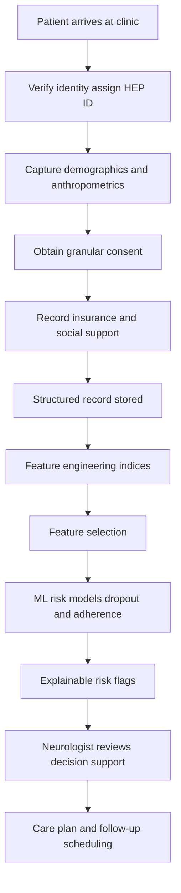
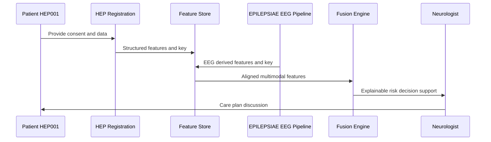
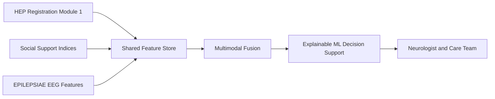
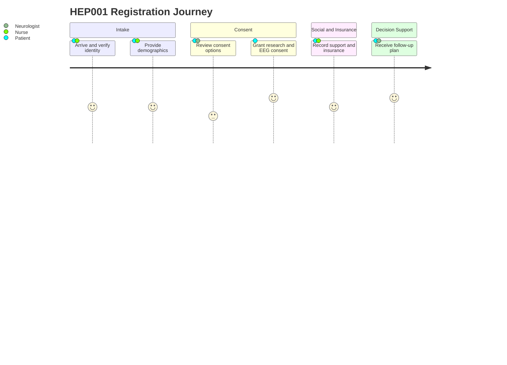

# HEP Module 1 - Patient Registration

> **Why (this doc):** Patient Registration is the entry point of the Human Epilepsy Project (HEP), the PRIMARY clinical and longitudinal dataset that anchors the Enterprise AI Platform for Explainable Multimodal Epilepsy Intelligence. Clean, consented, structured registration data is the foundation for every downstream module (seizure characterization, treatment tracking, outcome prediction) and for fusion with the EPILEPSIAE (EEG) secondary dataset. This document specifies WHAT is captured at registration, WHY each field matters clinically and statistically, and HOW it feeds explainable decision-support machine learning — never autonomous diagnosis.
> **How:** We follow a research spine (Problem to Statistical Analysis), present all data in captioned Markdown tables, provide four Mermaid diagrams, show integration with the EPILEPSIAE EEG pipeline, and close with a defense Q&A and APA references. The running example is patient HEP001, a 27-year-old female with suspected temporal lobe epilepsy.

---

## 1. Problem
> **Why:** Without a rigorous, consented, structured intake, every longitudinal analysis inherits missing data, selection bias, and privacy risk. **How:** We define the registration problem precisely so the whole platform rests on a valid denominator of patients.

Epilepsy care is longitudinal: patients are followed for years across neurology visits, medication changes, EEG studies, imaging, and psychosocial events. In practice, registration data are captured inconsistently, social determinants are rarely coded, and consent scope is ambiguous. This produces loss-to-follow-up, unquantified adherence, and cohorts that cannot be linked to the EEG-centric EPILEPSIAE dataset. The problem is to design a registration module that yields a high-fidelity, consented, machine-readable patient record that is both clinically usable by a Neurologist and EEG Technician and analytically sound for longitudinal modeling.

*Caption - The table below frames the registration problem against the operational pain points it must solve, so the reader sees why a dedicated Module 1 exists.*

| Pain point | Consequence if unsolved | What Module 1 must guarantee |
|---|---|---|
| Ad hoc demographic capture | Biased, non-reproducible cohorts | Standardized structured fields |
| Ambiguous consent scope | Illegal secondary use / data-sharing blocked | Granular consent flags per use |
| Missing social determinants | No adherence or dropout modeling | Caregiver, access, socioeconomic scores |
| Unlinkable identifiers | Cannot fuse with EPILEPSIAE EEG | Stable de-identified patient key |

## 2. Sub-Problems
> **Why:** The umbrella problem decomposes into tractable pieces that map to concrete data fields and models. **How:** We enumerate sub-problems so each has a named owner (role) and a downstream analytic use.

*Caption - This table breaks the registration problem into addressable sub-problems and assigns the responsible clinical role, clarifying accountability at intake.*

| # | Sub-problem | Responsible role | Downstream use |
|---|---|---|---|
| SP1 | Capture unique, stable patient identity | EEG Technician / Nurse | Record linkage, fusion |
| SP2 | Record demographics and anthropometrics | Nurse | Risk stratification, covariates |
| SP3 | Obtain granular, auditable consent | Neurologist / Nurse | Legal basis for analytics |
| SP4 | Quantify social and caregiver support | Neuropsychologist / Nurse | Adherence, dropout prediction |
| SP5 | Encode insurance and access-to-care | Nurse | Equity analysis, follow-up planning |
| SP6 | Produce analysis-ready features | Data/ML team | Feature engineering and selection |

## 3. Research Problem
> **Why:** We must state the researchable question that Module 1 data can actually answer. **How:** We phrase it so it is testable with the structured registration variables collected here.

Can structured registration data (demographics, consent scope, insurance, and engineered social-support indices) predict, at or shortly after intake, which epilepsy patients are at elevated risk of loss-to-follow-up and sub-optimal medication adherence, with sufficient explainability that a Neurologist can act on the prediction as decision support rather than automated instruction?

## 4. Research Objective
> **Why:** A crisp objective bounds scope and defines success. **How:** We specify measurable objectives tied to the ML deliverables.

*Caption - The objectives below translate the research problem into measurable targets with explicit success metrics, keeping the module evaluable.*

| Objective | Description | Success metric |
|---|---|---|
| O1 | Build a consented, structured HEP registration record | 100% mandatory-field completeness, granular consent on file |
| O2 | Engineer social/access features (caregiver, access, socioeconomic) | Validated indices with documented ranges |
| O3 | Predict loss-to-follow-up and adherence risk | AUROC >= 0.75, calibrated probabilities |
| O4 | Flag high-risk patients explainably | SHAP-style per-patient attributions surfaced to clinician |
| O5 | Enable fusion with EPILEPSIAE EEG pipeline | Shared key, aligned schema |

## 5. Flow
> **Why:** The reader needs the end-to-end sequence from patient arrival to a decision-support flag. **How:** A flowchart shows how registration data moves into features, models, and clinician review.

*Caption - This flowchart traces a patient from arrival through consent, structured capture, feature engineering, ML scoring, and clinician-reviewed decision support, making the data pipeline explicit.*

## 6. Hypotheses
> **Why:** Explicit hypotheses make the statistical analysis falsifiable. **How:** We state paired null and alternative hypotheses aligned to the objectives.

*Caption - The hypotheses table lists the null and alternative statements the module's statistics will test, ensuring the analysis is confirmatory rather than exploratory only.*

| ID | Null hypothesis (H0) | Alternative (H1) | Test |
|---|---|---|---|
| H1 | Caregiver support score is unrelated to loss-to-follow-up | Higher caregiver support lowers dropout hazard | Cox proportional hazards |
| H2 | Access-to-care score does not affect adherence | Lower access predicts lower adherence | Mixed-effects logistic regression |
| H3 | Socioeconomic index has no effect on adherence trajectory | SES index shifts adherence over time | Linear mixed model |
| H4 | Registration features do not predict high-risk status | Features predict high-risk status above chance | Classifier AUROC vs 0.5 |

## 7. Statistical Analysis
> **Why:** Registration data are structured and longitudinal, so the analysis must respect repeated measures and censoring. **How:** We pair descriptive and inferential methods, and name the longitudinal models used to avoid naive pooling.

Descriptive statistics summarize the cohort and the HEP001 index case. Inferential statistics test the hypotheses. Because patients are followed over time, we use mixed-effects models (random intercept per patient) for repeated adherence measures and survival analysis (Kaplan-Meier, Cox) for loss-to-follow-up, guarding against data leakage by splitting at the patient level and using only intake-available features for baseline prediction.

*Caption - This table maps each analytic question to its method and rationale, showing that longitudinal structure (repeated measures, censoring) is handled correctly rather than ignored.*

| Question | Method | Why this method |
|---|---|---|
| Cohort description | Mean, SD, counts, proportions | Summarize demographics and scores |
| Group differences | t-test / Mann-Whitney, chi-square | Compare adherent vs non-adherent |
| Adherence over time | Linear / logistic mixed-effects | Repeated measures per patient |
| Time to dropout | Kaplan-Meier + Cox PH | Right-censored follow-up |
| Feature-outcome association | Multivariable regression with SHAP | Explainable effect sizes |
| Leakage control | Patient-level split, temporal cutoff | Prevent optimistic bias |

*Caption - Descriptive statistics for the index patient HEP001 versus illustrative HEP cohort summaries, grounding the abstract variables in a concrete registered patient.*

| Variable | HEP001 value | Cohort summary (illustrative) |
|---|---|---|
| Age (years) | 27 | 34.2 mean, SD 11.6 |
| Sex | Female | 54% female |
| BMI | 22.7 | 25.9 mean |
| Region | Ontario, Canada | Multi-site |
| Marital status | Married | 48% married |
| Employment | Employed | 61% employed |
| Medication | Levetiracetam | Mixed ASMs |
| Adherence | 85-95% | 78% mean |
| Diagnostic confidence | 96% | 88% mean |

---

## Module Content

### Patient Identifier and Demographics
> **Why:** A stable identifier plus standardized demographics are the covariates and linkage key for all analytics. **How:** We store a de-identified HEP key and coded demographic fields.

*Caption - Core identity and demographic fields for HEP001; these are the structured backbone every other module joins against.*

| Field | Value | Type | Notes |
|---|---|---|---|
| Patient ID | HEP001 | Categorical key | De-identified, stable |
| Age | 27 | Numeric | Years at registration |
| Sex | Female | Categorical | |
| BMI | 22.7 | Numeric | Anthropometric covariate |
| Region | Ontario, Canada | Categorical | Access/equity context |
| Marital status | Married | Categorical | Social support proxy |
| Employment | Employed | Categorical | SES and access proxy |
| Suspected diagnosis | Temporal lobe epilepsy (focal impaired awareness) | Categorical | Clinical context only |

### Contact and Consent
> **Why:** Consent scope is the legal basis for every secondary and fusion use; contact quality drives follow-up. **How:** We capture granular per-purpose consent flags and reachable contact channels.

*Caption - Granular consent flags for HEP001 show that research, data-sharing, imaging, and EEG uses are each independently authorized, which is what permits fusion with EPILEPSIAE.*

| Consent domain | Status (HEP001) | Enables |
|---|---|---|
| Research participation | Granted | Inclusion in analytic cohort |
| Data sharing | Granted | Cross-site and secondary use |
| Imaging (MRI/PET) | Granted | Multimodal features |
| EEG | Granted | Fusion with EPILEPSIAE pipeline |
| Contact for follow-up | Granted (phone + email) | Loss-to-follow-up mitigation |

### Insurance, Family and Social Support
> **Why:** Social determinants are the strongest HEP-specific predictors of adherence and dropout and are absent from EEG-only datasets. **How:** We record insurance, support network, and derived indices on documented scales.

*Caption - Insurance and social-support variables for HEP001, including the engineered indices that later become model features; these fields are HEP's distinctive advantage over EEG-centric data.*

| Field | Value (HEP001) | Scale / range | Role |
|---|---|---|---|
| Insurance | Provincial (OHIP) + employer supplemental | Categorical | Access-to-care input |
| Family support | Spouse + local family | Categorical | Caregiver input |
| Socioeconomic index | 0.72 | 0 low to 1 high | Feature |
| Caregiver support score | 8 / 10 | 0-10 | Feature |
| Access-to-care score | 7 / 10 | 0-10 | Feature |

### Feature Engineering and Selection
> **Why:** Raw fields must become model-ready features without leaking future information. **How:** We derive composite indices and select features by clinical relevance and statistical signal.

*Caption - This table documents how registration fields are transformed into engineered features and the selection rationale, making the ML inputs transparent and auditable.*

| Engineered feature | Derived from | Selection rationale |
|---|---|---|
| Caregiver support score | Household, family proximity, marital status | Predicts adherence and dropout |
| Access-to-care score | Insurance, region, employment, distance | Predicts follow-up attendance |
| Socioeconomic index | Employment, insurance tier, region | Confounder and predictor |
| Baseline adherence estimate | Self-report + pharmacy refill | Target and covariate |
| Contactability flag | Verified phone/email + consent | Dropout mitigation |

### Machine Learning (Decision Support)
> **Why:** The module's payoff is intake-time risk flags the Neurologist can act on. **How:** We train patient-level, explainable classifiers/survival models on structured features; deep learning begins only after EEG is fused.

*Caption - The ML task table specifies each prediction target, model family, and the human-in-the-loop guardrail, reinforcing that outputs are decision support and never autonomous action.*

| Task | Model family | Output | Guardrail |
|---|---|---|---|
| Loss-to-follow-up risk | Cox PH / gradient boosting | Dropout hazard + flag | Neurologist reviews before action |
| Medication adherence | Mixed-effects logistic / boosting | Adherence probability | Clinician confirms, no auto-refill |
| High-risk patient flag | Ensemble classifier | Risk tier + SHAP reasons | Explainable, advisory only |

*Note: Registration data are STRUCTURED. Deep learning (CNN/RNN/transformer models) begins only AFTER the EEG signal from EPILEPSIAE is fused; Module 1 uses interpretable classical and mixed-effects/survival models.*

### Integration with EPILEPSIAE (EEG) Secondary Pipeline
> **Why:** HEP's clinical/longitudinal strength must combine with EPILEPSIAE's EEG signal for multimodal intelligence. **How:** A shared de-identified key aligns HEP registration features with EEG-derived features at fusion time.

*Caption - This sequence diagram shows the handshake between the HEP registration store and the EPILEPSIAE EEG pipeline, clarifying where the two datasets meet and who reviews the fused output.*

*Caption - This network graph positions Module 1 within the platform and its link to the EEG secondary dataset, showing that registration is the hub feeding fusion.*

*Caption - The comparison below contrasts HEP and EPILEPSIAE on the dimensions that matter for this module, showing HEP is the stronger source for social and longitudinal signal.*

| Dimension | HEP (primary) | EPILEPSIAE (secondary) |
|---|---|---|
| Primary modality | Structured clinical + social | Continuous EEG signal |
| Longitudinal depth | Strong (years of follow-up) | Session/recording focused |
| Social determinants | Rich (caregiver, access, SES) | Minimal or absent |
| Adherence tracking | Yes | No |
| Best used for | Dropout/adherence, outcomes | Seizure/EEG signal analysis |
| Role in fusion | Clinical + social backbone | EEG feature contributor |

*Caption - This journey diagram captures HEP001's experience through registration, highlighting satisfaction points that themselves inform dropout risk.*

---

## Professor Readiness (Defense Q&A)

### Q1. Why is HEP the primary dataset if EPILEPSIAE has the rich EEG signal?
> **Why:** Examiners probe dataset roles. **How:** Justify by analytic purpose.

HEP is longitudinal and clinical: it carries adherence, follow-up, and social determinants that EEG-only data lack. The research question here is dropout and adherence, which are driven by social and access variables. EPILEPSIAE contributes EEG features at fusion but cannot answer psychosocial questions. HEP is therefore primary for outcomes; EPILEPSIAE is a complementary secondary signal.

### Q2. How do you handle the longitudinal structure without inflating significance?
> **Why:** Tests repeated-measures rigor. **How:** Name the models and their assumptions.

Repeated adherence measures per patient violate independence, so we use linear/logistic mixed-effects models with a random intercept (and slope where warranted) per patient, rather than pooling observations. For loss-to-follow-up we use survival analysis (Kaplan-Meier, Cox proportional hazards) to respect right-censoring, checking the proportional-hazards assumption via Schoenfeld residuals.

### Q3. How do you prevent data leakage in the intake prediction models?
> **Why:** Leakage is the classic longitudinal failure. **How:** Describe splitting and temporal cutoffs.

We split at the patient level (never mixing a patient's records across train and test) and use only features available at or before registration for baseline prediction. Future-derived variables (e.g., later refill data) are excluded from the intake model or used only in explicitly time-aware models. Cross-validation folds are grouped by patient.

### Q4. Why not use deep learning at registration?
> **Why:** Tests modeling judgment. **How:** Tie model choice to data type.

Registration data are low-dimensional and structured, where interpretable models (regularized regression, gradient boosting, mixed-effects, Cox) perform well and yield the explainability clinicians require. Deep learning is reserved for high-dimensional EEG signal from EPILEPSIAE and begins only after fusion, where representation learning adds value.

### Q5. How is this decision support and not autonomous decision-making?
> **Why:** Safety and governance. **How:** Describe the human-in-the-loop guardrail.

Every model output is a probability or risk tier accompanied by per-patient explanations (SHAP-style attributions) surfaced to the Neurologist, who decides. The system never auto-diagnoses, auto-prescribes, or schedules surgery. It flags and explains; the clinician acts.

---

## References

American Psychological Association. (2020). *Publication manual of the American Psychological Association* (7th ed.). American Psychological Association.

Cox, D. R. (1972). Regression models and life-tables. *Journal of the Royal Statistical Society: Series B (Methodological), 34*(2), 187-202.

Fisher, R. S., Cross, J. H., French, J. A., Higurashi, N., Hirsch, E., Jansen, F. E., Lagae, L., Moshe, S. L., Peltola, J., Roulet Perez, E., Scheffer, I. E., & Zuberi, S. M. (2017). Operational classification of seizure types by the International League Against Epilepsy. *Epilepsia, 58*(4), 522-530. https://doi.org/10.1111/epi.13670

Laird, N. M., & Ware, J. H. (1982). Random-effects models for longitudinal data. *Biometrics, 38*(4), 963-974. https://doi.org/10.2307/2529876

Lundberg, S. M., & Lee, S. I. (2017). A unified approach to interpreting model predictions. In *Advances in Neural Information Processing Systems 30* (pp. 4765-4774).

Singer, J. D., & Willett, J. B. (2003). *Applied longitudinal data analysis: Modeling change and event occurrence*. Oxford University Press.

Topol, E. J. (2019). High-performance medicine: The convergence of human and artificial intelligence. *Nature Medicine, 25*(1), 44-56. https://doi.org/10.1038/s41591-018-0300-7
