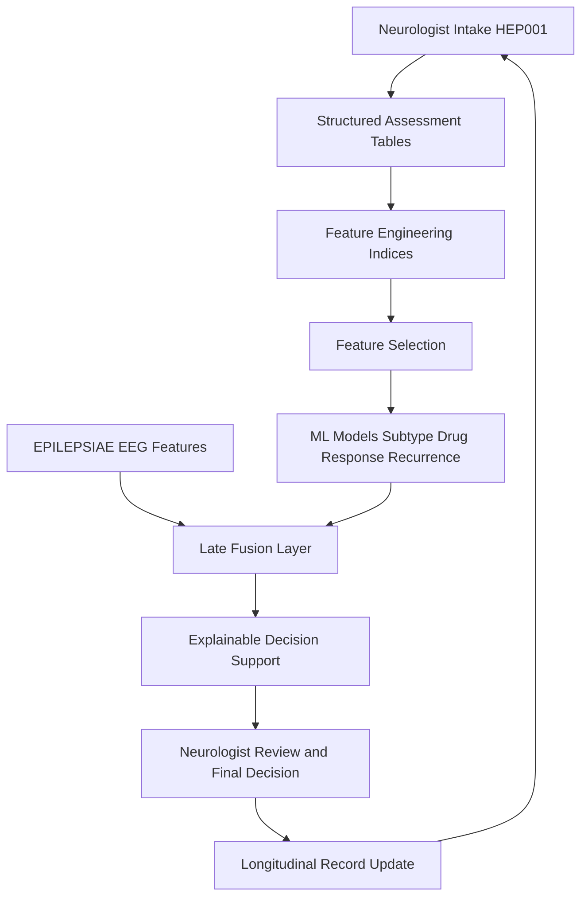
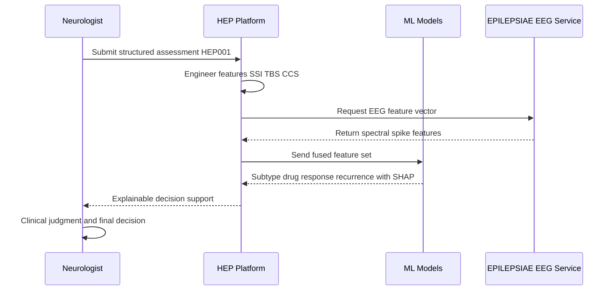
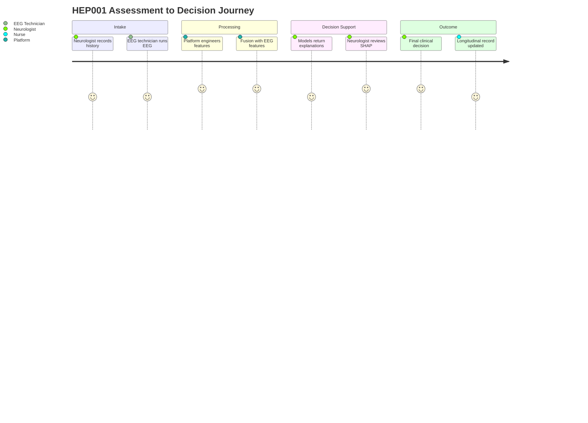

# HEP Module 2 - Comprehensive Neurologist Assessment

> **Why (this doc):** The Human Epilepsy Project (HEP) is the primary, clinical, longitudinal dataset of the platform, and Module 2 captures the neurologist's structured intake that anchors every downstream inference for the example patient HEP001 (27-year-old female, focal impaired awareness seizures, suspected temporal lobe epilepsy). This document turns a free-text clinical encounter into machine-usable, explainable features while keeping the neurologist as the sole decision-maker.
> **How:** It follows a numbered research spine (Problem through Statistical Analysis), then presents the assessment content as captioned Markdown tables, four Mermaid diagrams, and a fusion story with the EEG-focused EPILEPSIAE secondary dataset. AI is positioned strictly as decision support - never autonomous diagnosis, prescription, or surgical recommendation.

---

## 1. Problem

> **Why:** Frame the clinical and computational gap Module 2 addresses so the rest of the document has a clear target. **How:** State the core tension between rich clinical narrative and structured, auditable AI inputs.

Epilepsy diagnosis and management depend on a dense, unstructured neurologist narrative (semiology, history, triggers, exam), yet most AI systems consume only EEG signals. Without a rigorous, structured clinical assessment layer, longitudinal decision support for HEP001 and similar patients is neither reproducible nor explainable, and it cannot be safely fused with the EPILEPSIAE EEG pipeline.

---

## 2. Sub-Problems

> **Why:** Decompose the broad problem into tractable components each addressed by a table or model below. **How:** List the specific gaps in capture, standardization, and modeling.

*Caption - The table below enumerates the discrete sub-problems so each maps cleanly to a section, feature, or model later in the module.*

| # | Sub-Problem | Consequence if Unsolved | Addressed In |
|---|-------------|-------------------------|--------------|
| SP1 | Free-text HPI and semiology are not machine-readable | No reproducible features | Sections 8-10, 20 |
| SP2 | Seizure severity is not quantified | Cannot track longitudinal change | Feature Engineering (Sec 20) |
| SP3 | Trigger and adherence burden is subjective | Weak recurrence prediction | Trigger Burden Score (Sec 20) |
| SP4 | Differential diagnosis lacks confidence calibration | Overconfident automation risk | Sections 17-18, ML (Sec 22) |
| SP5 | Clinical intake is siloed from EEG | No multimodal fusion | Integration (Sec 24) |
| SP6 | Longitudinal leakage in retrospective features | Optimistic, invalid models | Statistical Analysis (Sec 7) |

---

## 3. Research Problem

> **Why:** Sharpen the sub-problems into a single answerable research statement. **How:** Bind clinical capture, feature engineering, and safe decision support into one question.

How can a neurologist's comprehensive epilepsy assessment for HEP001 be transformed into standardized, leakage-safe, longitudinal features that (a) support explainable prediction of epilepsy subtype, drug response, and recurrence, and (b) fuse coherently with EPILEPSIAE EEG evidence, without displacing clinician judgment?

---

## 4. Research Objective

> **Why:** Convert the research problem into concrete, measurable objectives. **How:** Specify deliverables spanning capture, engineering, modeling, and integration.

*Caption - This table lists the objectives that the module must satisfy, each with a verifiable success criterion for the DBA defense.*

| Objective | Description | Success Criterion |
|-----------|-------------|-------------------|
| O1 | Structure the full neurologist assessment | All 15 intake domains captured as tables |
| O2 | Engineer clinical indices | Seizure Severity Index, Trigger Burden, Clinical Complexity computed |
| O3 | Enable explainable ML | Subtype, drug-response, recurrence models with feature attributions |
| O4 | Enforce longitudinal rigor | Time-aware split, no future leakage |
| O5 | Fuse with EPILEPSIAE EEG | Defined join keys and late-fusion layer |
| O6 | Preserve clinician authority | Every output flagged as decision support only |

---

## 5. Flow

> **Why:** Give a single visual of how a clinical encounter becomes fused, explainable output. **How:** A top-down flowchart from intake to clinician-reviewed decision support.

*Caption - The flowchart traces HEP001's assessment from neurologist intake through feature engineering and ML to a clinician-gated recommendation, showing where EEG fusion enters.*

---

## 6. Hypotheses

> **Why:** State testable claims that the statistical plan will evaluate. **How:** Pair each hypothesis with its null and the analysis that tests it.

*Caption - The hypotheses below make the module's clinical and computational claims falsifiable and tie each to a downstream test.*

| ID | Hypothesis (H1) | Null (H0) | Test |
|----|-----------------|-----------|------|
| Hy1 | Higher Seizure Severity Index predicts shorter time-to-recurrence | No association | Cox proportional hazards |
| Hy2 | Trigger Burden Score adds predictive value beyond EEG alone | No incremental value | Nested model likelihood-ratio |
| Hy3 | Multimodal fusion outperforms clinical-only for subtype | Equal performance | AUC comparison, DeLong |
| Hy4 | Adherence (85-95%) modifies drug-response probability | No effect | Mixed-effects logistic |

---

## 7. Statistical Analysis

> **Why:** Specify the longitudinal-rigorous methods that keep results valid and defensible. **How:** Map each hypothesis and outcome to a model, guarding against leakage.

*Caption - This table defines the statistical toolkit, emphasizing mixed-effects and survival methods appropriate to HEP's repeated-measures, time-to-event structure.*

| Analysis | Method | Rationale | Leakage Guard |
|----------|--------|-----------|---------------|
| Recurrence timing | Cox proportional hazards / time-varying covariates | Right-censored longitudinal follow-up | Only pre-visit covariates enter risk set |
| Seizure count over visits | Poisson/negative-binomial mixed-effects | Overdispersed repeated counts per patient | Random intercept per patient |
| Drug response | Mixed-effects logistic regression | Clustered visits within patient | Time-ordered train/validation split |
| Model comparison | DeLong AUC test, likelihood-ratio test | Compare fusion vs clinical-only | Patient-level (not visit-level) splits |
| Missing data | Multiple imputation (MICE) | Preserve power, reduce bias | Imputation fit on training folds only |

Longitudinal leakage is prevented by patient-level splitting, time-ordered feature windows (features use only data available at or before the visit), and imputation/scaling fit inside cross-validation folds.

---

## 8. Visit Information and Chief Complaint

> **Why:** Establish the encounter context that timestamps all longitudinal features. **How:** Record visit metadata and the presenting complaint verbatim-to-structured.

*Caption - Visit metadata provides the temporal anchor for leakage-safe feature windows and the longitudinal record.*

| Field | Value |
|-------|-------|
| Patient ID | HEP001 |
| Visit Type | New patient - comprehensive neurology assessment |
| Visit Date | 2026-07-03 |
| Provider | Neurologist (epileptologist) |
| Age / Sex | 27 / Female |
| Chief Complaint | Recurrent episodes of altered awareness with lip smacking |
| Referral Source | Primary care, for suspected temporal lobe epilepsy |

---

## 9. History of Present Illness

> **Why:** Capture the narrative that drives semiology and differential reasoning. **How:** Convert the HPI into discrete, codable attributes.

*Caption - Structuring the HPI turns clinician prose into fields usable by feature engineering while preserving clinical meaning.*

| Attribute | Detail |
|-----------|--------|
| Onset | Episodes began ~1 year prior, age 26 |
| Episode Description | Rising stomach sensation followed by staring and lip smacking |
| Awareness | Impaired during events |
| Duration | 60-90 seconds typical |
| Frequency | 3-4 per month |
| Postictal | Confusion 5-15 minutes |
| Progression | Stable-to-slightly-increasing with poor sleep |

---

## 10. Seizure History and Semiology

> **Why:** Semiology is the strongest clinical signal for lobar localization. **How:** Separate temporal, semiologic, and evolution features into two tables.

*Caption - Seizure history records onset and burden metrics that feed the Seizure Severity Index.*

| Field | Value |
|-------|-------|
| Age at Onset | 26 |
| Years Since Onset | ~1 |
| Current Frequency | 3-4 focal impaired awareness seizures / month |
| Longest Seizure-Free Interval | ~6 weeks |
| Secondary Generalization | Rare (1 reported) |
| Nocturnal Events | Occasional |

*Caption - The semiology table decomposes the ictal sequence, the localizing pattern most consistent with left temporal lobe epilepsy.*

| Phase | Feature | Localizing Value |
|-------|---------|------------------|
| Aura | Rising epigastric sensation | Mesial temporal (amygdala/insula) |
| Early ictal | Behavioral arrest, staring | Temporal |
| Automatisms | Lip smacking (oroalimentary) | Mesial temporal |
| Motor | Head turning | Lateralizing sign |
| Ictal | Impaired awareness | Temporal network involvement |
| Postictal | Confusion 5-15 min | Temporal lobe seizure |

---

## 11. Triggers

> **Why:** Triggers drive the Trigger Burden Score and recurrence risk. **How:** Rate each modifiable trigger for salience.

*Caption - Trigger cataloging quantifies modifiable risk, directly informing the Trigger Burden Score and counseling.*

| Trigger | Present | Modifiable | Weight |
|---------|---------|------------|--------|
| Sleep deprivation | Yes | Yes | High |
| Stress | Yes | Partial | Medium |
| Medication non-adherence | Yes (adherence 85-95%) | Yes | High |
| Alcohol | Occasional | Yes | Low |
| Menstrual (catamenial) | Under observation | No | Medium |

---

## 12. Past Medical History

> **Why:** Comorbid and historical factors shape differential and drug choice. **How:** List relevant history with epilepsy-related implications.

*Caption - Past medical history screens for secondary etiologies and treatment constraints.*

| Item | Status |
|------|--------|
| Febrile seizures in childhood | Reported (single, complex) |
| Head trauma | None significant |
| CNS infection | None |
| Psychiatric history | Mild anxiety |
| Pregnancy status | Not pregnant; counseled on AED teratogenicity |

---

## 13. Family History

> **Why:** Family history informs genetic contribution and recurrence context. **How:** Record affected relatives and inheritance signal.

*Caption - Family history documents the paternal epilepsy link relevant to genetic-risk framing.*

| Relative | Condition | Note |
|----------|-----------|------|
| Father | Epilepsy | Type unspecified; supports familial susceptibility |
| Mother | None | - |
| Siblings | None reported | - |

---

## 14. Medication History

> **Why:** Drug exposure and adherence drive drug-response modeling. **How:** Capture agent, dose, adherence, and tolerability.

*Caption - Medication history anchors the drug-response model and adherence-adjusted risk.*

| Field | Value |
|-------|-------|
| Current AED | Levetiracetam |
| Dose | 1000 mg BID (titrated) |
| Adherence | ~85-95% (self-report + pharmacy refill) |
| Efficacy | Partial - breakthrough seizures persist |
| Tolerability | Mild irritability |
| Prior AEDs | None (first-line) |

---

## 15. Comorbidities

> **Why:** Comorbidities affect complexity, drug choice, and outcomes. **How:** List active comorbid conditions with relevance.

*Caption - Comorbidity capture feeds the Clinical Complexity Score and safety checks.*

| Comorbidity | Relevance |
|-------------|-----------|
| Anxiety (mild) | Levetiracetam behavioral caution |
| Sleep insufficiency | Modifiable seizure trigger |
| No cardiac/hepatic/renal disease | Broad AED options preserved |

---

## 16. Neurological Examination

> **Why:** A normal interictal exam supports focal epilepsy without gross deficit. **How:** Record systematic exam findings.

*Caption - The neurological exam documents an unremarkable interictal baseline, consistent with focal epilepsy of mesial temporal origin.*

| Domain | Finding |
|--------|---------|
| Mental status | Alert, oriented, normal |
| Cranial nerves | Intact |
| Motor | Normal tone and power |
| Sensory | Intact |
| Reflexes | Symmetric, normal |
| Coordination / gait | Normal |
| Memory screen | Mild verbal memory concern (neuropsychology referral) |

---

## 17. Differential Diagnosis

> **Why:** Explicit differentials calibrate confidence and prevent premature closure. **How:** Rank alternatives with supporting and opposing evidence.

*Caption - The differential list, with the leading diagnosis at 96% confidence, calibrates the ML subtype output and guards against overconfident automation.*

| Diagnosis | Support | Against | Est. Probability |
|-----------|---------|---------|------------------|
| Temporal lobe epilepsy (focal impaired awareness) | Aura, automatisms, MRI/EEG/PET concordance | - | 96% |
| Frontal lobe epilepsy | Head turning | Long duration, oroalimentary automatisms atypical | 2% |
| Psychogenic non-epileptic seizures | Stress trigger | EEG spikes, stereotyped semiology | 1% |
| Syncope | Altered awareness | No cardiovascular prodrome | 1% |

---

## 18. Initial Epilepsy Classification

> **Why:** ILAE classification standardizes the diagnosis for coding and fusion. **How:** Assign seizure type, epilepsy type, and etiology.

*Caption - Classification follows the ILAE 2017 framework, producing standardized labels used as ML targets and EEG-fusion keys.*

| Level | Classification |
|-------|----------------|
| Seizure type | Focal impaired awareness |
| Epilepsy type | Focal |
| Syndrome/localization | Left temporal lobe epilepsy (mesial) |
| Etiology | Structural - left hippocampal sclerosis |
| Supporting studies | MRI (L hippocampal sclerosis), EEG (L temporal spikes), PET (L temporal hypometabolism) |
| Diagnostic confidence | 96% |

---

## 19. Management Plan

> **Why:** Document the clinician-led plan the AI supports but never replaces. **How:** List actions across pharmacologic, workup, and safety domains.

*Caption - The management plan makes explicit that all AI outputs are advisory inputs to a neurologist-owned decision.*

| Domain | Action |
|--------|--------|
| Pharmacologic | Optimize Levetiracetam; consider adjunct if breakthrough persists |
| Adherence | Reinforce dosing; refill monitoring |
| Workup | Video-EEG, neuropsychology, epilepsy-protocol MRI review |
| Surgical | Refer to epilepsy surgery conference if drug-resistant (advisory only) |
| Safety | Driving, seizure precautions, sleep hygiene counseling |
| Decision support | AI predictions reviewed at each visit; clinician retains authority |

---

## 20. Feature Engineering

> **Why:** Convert structured assessment into quantitative indices for modeling. **How:** Define composite scores with transparent, auditable formulas.

*Caption - Feature engineering derives three interpretable indices from the tables above; transparency is required so the neurologist can trust and override them.*

| Feature | Inputs | Formula (illustrative) | HEP001 Value |
|---------|--------|------------------------|--------------|
| Seizure Severity Index (SSI) | Frequency, duration, secondary generalization, postictal | Weighted sum, 0-100 | 58 (moderate) |
| Trigger Burden Score (TBS) | Weighted count of active triggers | Sum of trigger weights, 0-10 | 7 (high) |
| Clinical Complexity Score (CCS) | Comorbidities, differential breadth, workup pending | Weighted composite, 0-10 | 5 (moderate) |

*Caption - This table shows the encoded feature vector passed to models, illustrating the mix of derived indices and categorical clinical fields.*

| Feature | Type | Encoding |
|---------|------|----------|
| age_at_onset | numeric | 26 |
| ssi | numeric | 58 |
| tbs | numeric | 7 |
| ccs | numeric | 5 |
| aura_epigastric | binary | 1 |
| automatism_oroalimentary | binary | 1 |
| family_history_epilepsy | binary | 1 |
| adherence_pct | numeric | 0.90 |
| mri_hippocampal_sclerosis | binary | 1 |

---

## 21. Feature Selection

> **Why:** Reduce dimensionality and leakage risk while keeping clinical interpretability. **How:** Combine clinical priors with statistical filters inside CV folds.

*Caption - The selection strategy balances predictive value against interpretability and leakage safety, all evaluated within training folds only.*

| Method | Purpose | Guardrail |
|--------|---------|-----------|
| Clinical prior filter | Retain guideline-relevant features | Neurologist-reviewed |
| L1 (LASSO) regularization | Sparse, stable subset | Fit on training folds |
| Mutual information ranking | Nonlinear relevance | Patient-level CV |
| Collinearity pruning (VIF) | Remove redundancy | Threshold VIF < 5 |
| Leakage audit | Drop post-outcome features | Time-window check |

---

## 22. Machine Learning Models

> **Why:** Deliver the three decision-support predictions central to HEP. **How:** Specify target, model family, output, and explainability per task.

*Caption - This table defines the three explainable models; each emits calibrated probabilities plus attributions, and each remains advisory to the clinician.*

| Task | Target | Model | Output | Explainability |
|------|--------|-------|--------|----------------|
| Epilepsy subtype | Temporal vs extratemporal focal | Gradient-boosted trees | Subtype probability | SHAP values |
| Drug response | Responder vs non-responder to Levetiracetam | Mixed-effects logistic | Response probability | Coefficient + random effects |
| Recurrence | Time to next seizure | Cox / survival gradient boosting | Hazard, risk curve | Time-varying attributions |

*Caption - The sequence diagram shows the runtime interaction among clinician, platform, models, and the EEG service for a single HEP001 inference.*

---

## 23. Model Performance Targets

> **Why:** Set measurable bars for the defense and monitoring. **How:** List metrics with target ranges appropriate to each task.

*Caption - Performance targets give the examiners concrete acceptance thresholds and reflect calibration, not just discrimination.*

| Model | Primary Metric | Target |
|-------|----------------|--------|
| Subtype | AUC | >= 0.85 |
| Drug response | AUC / calibration slope | >= 0.80 / near 1.0 |
| Recurrence | Concordance (C-index) | >= 0.75 |
| All | Brier score | Low, monitored over time |

---

## 24. Integration with EPILEPSIAE (EEG) Secondary Pipeline

> **Why:** The platform's value is multimodal fusion of HEP clinical data with EPILEPSIAE EEG. **How:** Define join keys, fusion strategy, and the network view.

*Caption - This table specifies how HEP Module 2 clinical features join and fuse with EPILEPSIAE EEG features, including the fusion layer and conflict handling.*

| Aspect | HEP (Primary) | EPILEPSIAE (Secondary) | Fusion Mechanism |
|--------|---------------|------------------------|------------------|
| Data type | Structured clinical assessment | Multichannel EEG signals | Late fusion at feature level |
| Key features | SSI, TBS, CCS, semiology, MRI/PET | Spectral power, spike rate, HFOs | Concatenated feature vector |
| Localization | Semiology + imaging (L temporal) | EEG spike focus (L temporal) | Concordance boosts confidence |
| Join key | patient_id + visit_timestamp | recording_session_id | Time-aligned linkage |
| Conflict handling | Clinician-weighted | Signal-derived | Flag discordance for review |
| Output | Subtype, drug response, recurrence | Seizure/spike detection | Unified explainable dashboard |

*Caption - The network graph shows the integration topology linking clinical intake, EEG, the fusion core, and clinician review.*

*Caption - The journey diagram maps the neurologist and EEG technician experience across the assessment-to-decision workflow, highlighting satisfaction at each stage.*

---

## 25. Professor Readiness (Defense Q&A)

> **Why:** Anticipate examiner scrutiny on rigor, ethics, and integration. **How:** Provide concise, defensible answers to likely questions.

### Q1. How do you prevent longitudinal data leakage in the recurrence model?

> **Why:** Leakage is the most common fatal flaw in longitudinal ML. **How:** Describe temporal and patient-level safeguards.

Splits are patient-level, not visit-level, so no patient appears in both train and test. Features use only information available at or before the visit timestamp (time-varying covariates in the Cox model enter the risk set only when observed). Imputation, scaling, and feature selection are fit inside training folds. Follow-up is right-censored, and the C-index is reported on held-out patients.

### Q2. Why mixed-effects models rather than pooled regression?

> **Why:** HEP is repeated-measures with visits nested in patients. **How:** Justify random effects.

Multiple visits per patient violate independence. A random patient intercept (and slope where warranted) captures between-patient heterogeneity in baseline seizure risk and adherence, yielding correct standard errors and separating within- from between-patient effects - critical for the adherence-by-drug-response hypothesis (Hy4).

### Q3. How is this different from an EEG-only system, and what does fusion add?

> **Why:** Establishes the multimodal contribution. **How:** Contrast information content.

EPILEPSIAE captures ictal/interictal signal but not aura, adherence, triggers, or comorbidity. HEP contributes semiology and longitudinal clinical context; EEG contributes objective electrographic localization. Late fusion concatenates both feature sets; concordant left-temporal evidence across semiology, MRI, PET, and EEG raises subtype confidence, and we test incremental value with nested-model likelihood-ratio and DeLong AUC comparisons (Hy2, Hy3).

### Q4. How do you ensure the AI does not overstep into autonomous diagnosis?

> **Why:** Clinical safety and regulatory posture. **How:** Describe the human-in-the-loop design.

Every model emits a calibrated probability plus SHAP attributions labeled as decision support. No output triggers a prescription, diagnosis, or surgical referral automatically; the neurologist reviews and owns the final decision at each visit. Discordance between clinical and EEG evidence is flagged for human adjudication rather than auto-resolved.

### Q5. How do you handle the small-sample and confidence-calibration risk (e.g., 96% diagnostic confidence)?

> **Why:** Overconfidence with limited data is a defense vulnerability. **How:** Describe calibration and uncertainty.

The 96% is the clinician's structured differential estimate, used as a prior, not a model certainty. Models report calibrated probabilities (Brier score, calibration slope) with confidence intervals; multiple imputation propagates missing-data uncertainty. Where sample size is limited, we favor regularized and mixed-effects models, report patient-level cross-validated metrics, and present uncertainty explicitly to the clinician.

---

## 26. References

- American Psychological Association. (2020). *Publication manual of the American Psychological Association* (7th ed.). American Psychological Association.
- Fisher, R. S., Cross, J. H., French, J. A., Higurashi, N., Hirsch, E., Jansen, F. E., Lagae, L., Moshe, S. L., Peltola, J., Roulet Perez, E., Scheffer, I. E., & Zuberi, S. M. (2017). Operational classification of seizure types by the International League Against Epilepsy: Position paper of the ILAE Commission for Classification and Terminology. *Epilepsia, 58*(4), 522-530. https://doi.org/10.1111/epi.13670
- Scheffer, I. E., Berkovic, S., Capovilla, G., Connolly, M. B., French, J., Guilhoto, L., Hirsch, E., Jain, S., Mathern, G. W., Moshe, S. L., Nordli, D. R., Perucca, E., Tomson, T., Wiebe, S., Zhang, Y. H., & Zuberi, S. M. (2017). ILAE classification of the epilepsies: Position paper of the ILAE Commission for Classification and Terminology. *Epilepsia, 58*(4), 512-521. https://doi.org/10.1111/epi.13709
- Topol, E. J. (2019). High-performance medicine: The convergence of human and artificial intelligence. *Nature Medicine, 25*(1), 44-56. https://doi.org/10.1038/s41591-018-0300-7
- Cox, D. R. (1972). Regression models and life-tables. *Journal of the Royal Statistical Society: Series B (Methodological), 34*(2), 187-202. https://doi.org/10.1111/j.2517-6161.1972.tb00899.x
- Laird, N. M., & Ware, J. H. (1982). Random-effects models for longitudinal data. *Biometrics, 38*(4), 963-974. https://doi.org/10.2307/2529876
- Harrell, F. E., Lee, K. L., & Mark, D. B. (1996). Multivariable prognostic models: Issues in developing models, evaluating assumptions and adequacy, and measuring and reducing errors. *Statistics in Medicine, 15*(4), 361-387.
- van Buuren, S., & Groothuis-Oudshoorn, K. (2011). mice: Multivariate imputation by chained equations in R. *Journal of Statistical Software, 45*(3), 1-67. https://doi.org/10.18637/jss.v045.i03
- Lundberg, S. M., & Lee, S.-I. (2017). A unified approach to interpreting model predictions. *Advances in Neural Information Processing Systems, 30*, 4765-4774.
- DeLong, E. R., DeLong, D. M., & Clarke-Pearson, D. L. (1988). Comparing the areas under two or more correlated receiver operating characteristic curves: A nonparametric approach. *Biometrics, 44*(3), 837-845. https://doi.org/10.2307/2531595
