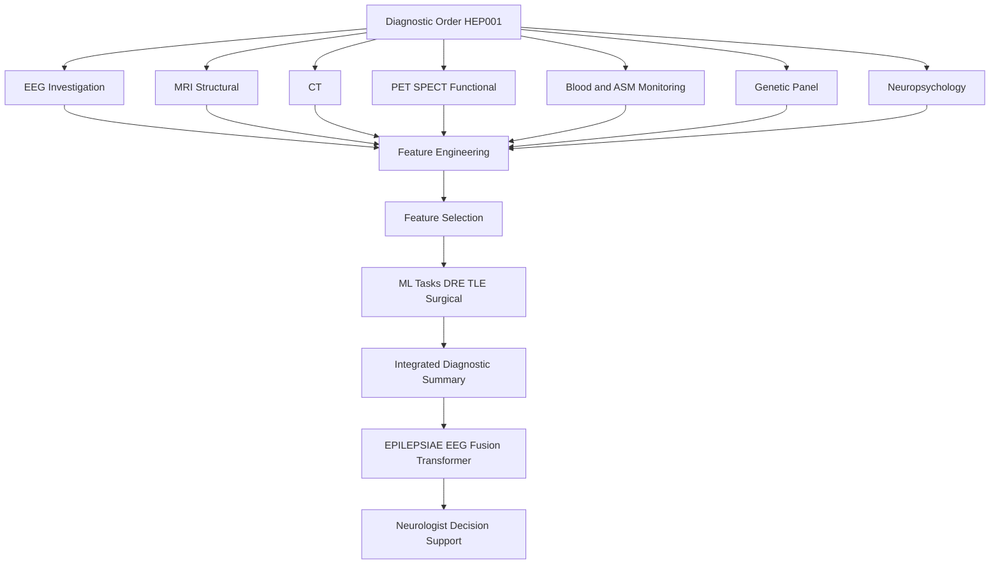
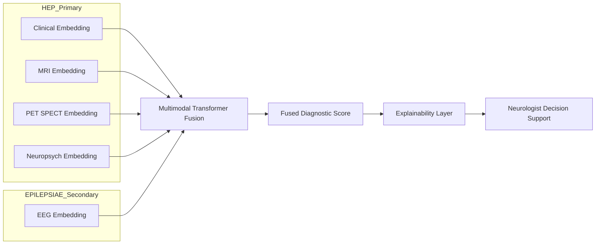
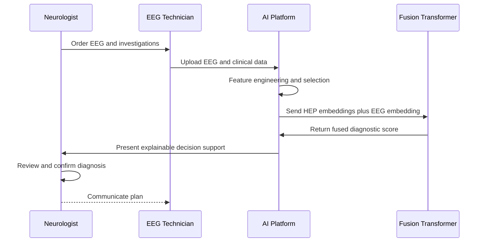
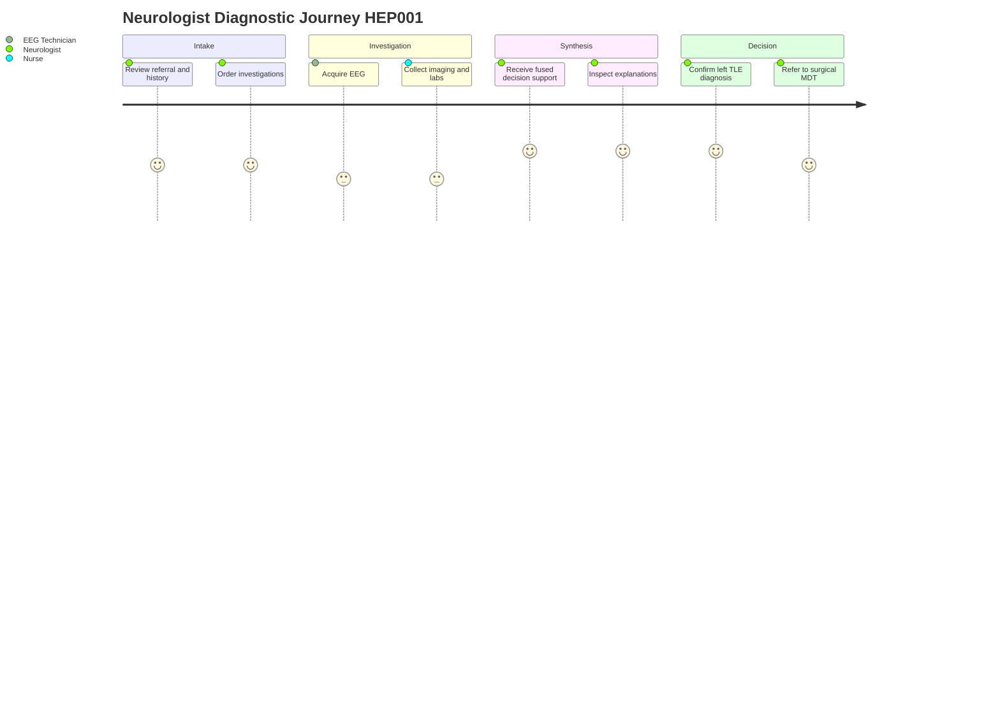

# HEP Module 3 - Comprehensive Diagnostic Investigation

> **Why (this doc):** Module 3 is the diagnostic core of the Human Epilepsy Project (HEP), the primary clinical and longitudinal dataset. It converts raw multimodal investigations (EEG, MRI, CT, PET/SPECT, blood and anti-seizure drug levels, genetics, neuropsychology) into engineered features, a machine-learning readiness layer, and a defensible integrated diagnosis for the example patient HEP001. It is the explicit bridge into the EPILEPSIAE (EEG) secondary pipeline, where a multimodal transformer fuses clinical, imaging, neuropsychological, and EEG embeddings.
> **How:** Each investigation is summarized in a captioned table, converted into normalized feature scores, ranked by feature selection, and passed to three clinical ML tasks (drug-resistant epilepsy, temporal lobe epilepsy localization, surgical candidacy). Four Mermaid diagrams show the diagnostic flow, the human-in-the-loop sequence, the integration network with EPILEPSIAE, and the clinician journey. AI here is decision support only. It never issues an autonomous diagnosis, prescription, or surgical decision. The final sign-off is always a licensed neurologist.

---

## 1. Problem

> **Why:** Frames the clinical gap that justifies a multimodal, explainable diagnostic module. **How:** States the epilepsy-specific diagnostic burden and the risk of single-modality reasoning.

Epilepsy diagnosis and localization remain fragmented across siloed investigations. A neurologist must mentally fuse EEG, structural MRI, functional PET/SPECT, laboratory drug monitoring, genetics, and neuropsychology under time pressure, with high inter-rater variability and delayed recognition of drug resistance. For a suspected temporal lobe epilepsy (TLE) patient such as HEP001, the concordance of left-lateralizing findings is decisive for surgical candidacy, yet no single modality is sufficient. The problem is to produce a transparent, reproducible, longitudinally consistent diagnostic synthesis that a clinician can audit and trust.

*Caption - The table below decomposes the umbrella problem into the concrete failure modes this module must address, so each downstream sub-problem is traceable to a real clinical pain point.*

| Failure mode | Clinical consequence | Module 3 response |
|---|---|---|
| Single-modality bias | Missed or mislateralized focus | Multimodal fusion score |
| Manual synthesis variability | Inter-rater disagreement | Standardized feature engineering |
| Late drug-resistance recognition | Delayed surgical referral | Drug-resistant epilepsy ML flag |
| Opaque AI outputs | Clinician distrust, no adoption | Explainable, decision-support only |

---

## 2. Sub-Problems

> **Why:** Breaks the problem into independently solvable, testable pieces. **How:** Maps each investigation stream to a specific engineering and modeling sub-task.

*Caption - This table enumerates the sub-problems so that each has an owner role, an input modality, and a measurable output, making the module auditable end-to-end.*

| # | Sub-problem | Primary modality | Responsible role | Output |
|---|---|---|---|---|
| S1 | Reliable EEG abnormality summary | EEG | EEG Technician / Neurologist | Interictal spike localization |
| S2 | Structural lesion quantification | MRI, CT | Neurologist / Radiology | Structural lesion score |
| S3 | Functional deficit quantification | PET, SPECT | Neurologist | Functional imaging score |
| S4 | Therapeutic drug status | Blood / ASM levels | Nurse / Neurologist | Adherence and therapeutic flag |
| S5 | Genetic contribution | Gene panel | Neurologist | Genetic risk contribution |
| S6 | Cognitive lateralization | Neuropsych battery | Neuropsychologist | Memory deficit score |
| S7 | Integrated fusion and ML readiness | All | Data / Neurologist | Multimodal diagnostic score |

---

## 3. Research Problem

> **Why:** Converts the sub-problems into a single researchable statement. **How:** Specifies what is being learned and constrained.

Can an explainable multimodal feature-engineering and machine-learning layer, built over HEP's longitudinal clinical investigations and fused with EPILEPSIAE EEG embeddings, produce a diagnostic confidence and localization for temporal lobe epilepsy that matches expert neurologist consensus while remaining fully auditable and strictly decision-support?

---

## 4. Research Objective

> **Why:** States the concrete, measurable target. **How:** Lists objectives tied to features, models, and the fusion bridge.

*Caption - The objectives table binds each research aim to a metric and an acceptance threshold, so the defense can point to falsifiable success criteria.*

| Objective | Metric | Target |
|---|---|---|
| O1 Quantify structural lesion burden | MRI risk index | Calibrated 0-1 |
| O2 Quantify functional deficit | Functional imaging score | Calibrated 0-1 |
| O3 Produce integrated diagnostic score | Multimodal diagnostic score | Concordant with expert |
| O4 Flag drug-resistant epilepsy | ROC-AUC | >= 0.85 |
| O5 Localize TLE and rank surgical candidacy | Lateralization accuracy | >= 90% |
| O6 Bridge to EPILEPSIAE EEG fusion | Fused vs clinical-only AUC gain | Positive, significant |

---

## 5. Flow

> **Why:** Gives the end-to-end pipeline at a glance before detail. **How:** A flowchart TD from investigations to fused decision support.

---

## 6. Hypotheses

> **Why:** Makes the claims testable. **How:** Null and alternative pairs for the key quantitative bets.

*Caption - This table lists the formal hypotheses so statistical tests in Section 7 map one-to-one to defensible claims.*

| ID | Null H0 | Alternative H1 |
|---|---|---|
| H1 | Multimodal score equals best single modality | Multimodal score exceeds best single modality |
| H2 | EEG fusion adds no AUC over clinical-only | EEG fusion improves AUC significantly |
| H3 | MRI risk index unrelated to surgical candidacy | Higher MRI risk index predicts candidacy |
| H4 | Adherence unrelated to seizure-control trajectory | Lower adherence predicts poorer control over time |

---

## 7. Statistical Analysis

> **Why:** Specifies the longitudinal-rigorous methods. **How:** Names the model per hypothesis with leakage controls.

*Caption - The table ties each hypothesis to a concrete statistical model appropriate for repeated-measures, time-to-event, and paired-model-comparison data, addressing the longitudinal nature of HEP.*

| Hypothesis | Method | Rationale |
|---|---|---|
| H1 | Paired bootstrap on multimodal score | Compares fused vs single modality |
| H2 | DeLong test on ROC-AUC | Correlated ROC comparison, clinical-only vs fused |
| H3 | Cox proportional-hazards (time to surgery) | Survival framing of candidacy |
| H4 | Linear mixed-effects (random patient intercept and slope) | Repeated seizure counts within patient |

Leakage controls: patient-level (grouped) train/validation/test splits so no visit from a patient appears in more than one fold; temporal split for longitudinal validation (train on earlier visits, test on later); imputation and scaling fit on train folds only. Calibration assessed with reliability curves and Brier score.

---

## 8. Diagnostic Order Summary

> **Why:** Records the ordered investigation sequence and status for HEP001. **How:** One row per ordered test with clinical intent and result state.

*Caption - This table is the master ledger of what was ordered for HEP001 and why, establishing the provenance for every feature computed later.*

| Order # | Investigation | Clinical intent | Status | Headline result |
|---|---|---|---|---|
| 1 | EEG (interictal) | Localize epileptiform activity | Complete | Left temporal spike-and-wave, abnormal |
| 2 | MRI brain (epilepsy protocol) | Detect structural lesion | Complete | Left hippocampal sclerosis |
| 3 | CT head | Exclude acute or gross lesion | Complete | No acute abnormality |
| 4 | PET (FDG interictal) | Detect functional deficit | Complete | Left temporal hypometabolism |
| 5 | SPECT | Perfusion correlate | Complete | Left temporal hypoperfusion pattern |
| 6 | Blood panel and ASM level | Safety and drug monitoring | Complete | Therapeutic Levetiracetam |
| 7 | Genetic panel | Detect monogenic cause | Complete | Negative |
| 8 | Neuropsychology | Cognitive lateralization | Complete | Mild verbal memory deficit |

---

## 9. EEG Investigation Summary

> **Why:** EEG is the anchoring electrophysiological evidence and the tie-in to EPILEPSIAE. **How:** Summarizes findings that become EEG-derived features.

*Caption - This table captures the interictal EEG findings for HEP001; these localize the epileptogenic zone and provide the embedding target that EPILEPSIAE fuses against.*

| Feature | Finding | Interpretation |
|---|---|---|
| Dominant abnormality | Left temporal spike-and-wave | Interictal epileptiform discharge |
| Lateralization | Left | Concordant with imaging |
| Background | Mild left temporal slowing | Focal dysfunction |
| Overall read | Abnormal | Supports focal TLE |
| EEG Technician role | Acquisition, artifact rejection, montage QC | Data quality assurance |

---

## 10. MRI Investigation Summary

> **Why:** Structural lesion is the strongest surgical predictor. **How:** Reports lesion findings and the derived MRI risk index.

*Caption - This table records the structural MRI findings and the quantified MRI risk index (0.82), the single most influential structural feature for surgical candidacy.*

| Feature | Finding | Value |
|---|---|---|
| Primary lesion | Left hippocampal sclerosis | Present |
| Secondary finding | Mild left temporal atrophy | Present |
| Lateralization | Left | Concordant |
| MRI risk index | Composite structural risk | 0.82 |
| Actionability | Surgically relevant lesion | High |

---

## 11. CT Investigation Summary

> **Why:** CT rules out acute or gross pathology and confirms safety. **How:** Reports the exclusionary result.

*Caption - CT is a negative-but-necessary safety investigation; the table documents that no acute lesion confounds the TLE interpretation.*

| Feature | Finding |
|---|---|
| Acute hemorrhage | None |
| Mass or tumor | None |
| Calcification | None significant |
| Overall | No acute abnormality |

---

## 12. PET / SPECT Investigation Summary

> **Why:** Functional imaging confirms the metabolic focus and boosts localization confidence. **How:** Reports hypometabolism and its feature contribution.

*Caption - This table quantifies the functional deficit; concordant left temporal hypometabolism and hypoperfusion strongly reinforce the structural and EEG lateralization.*

| Modality | Finding | Contribution |
|---|---|---|
| FDG-PET | Left temporal hypometabolism | Functional imaging score |
| SPECT | Left temporal hypoperfusion | Corroborating perfusion evidence |
| Concordance with MRI and EEG | Full left-lateralized concordance | Raises diagnostic confidence |

---

## 13. Blood Investigations and Anti-Seizure Drug Monitoring

> **Why:** Confirms therapeutic drug status and links to longitudinal adherence. **How:** Reports labs and Levetiracetam level as therapeutic.

*Caption - This table documents drug and safety monitoring for HEP001; the therapeutic Levetiracetam level with 85-95% adherence is a covariate in the longitudinal seizure-control model.*

| Test | Result | Status |
|---|---|---|
| Levetiracetam level | Within reference range | Therapeutic |
| Adherence estimate | 85-95% | Good, monitored |
| CBC | Normal | No toxicity |
| Liver and renal panel | Normal | Safe to continue |
| Electrolytes | Normal | No confounder |

---

## 14. Genetic Testing Summary

> **Why:** Rules in or out a monogenic cause, affecting prognosis and counseling. **How:** Reports the negative panel and its modeling implication.

*Caption - This table records the negative genetic panel; a negative result lowers the genetic risk contribution feature and supports an acquired (hippocampal sclerosis) etiology.*

| Feature | Finding |
|---|---|
| Epilepsy gene panel | Negative |
| Pathogenic variant | None detected |
| Etiology implication | Favors acquired structural cause |
| Genetic risk contribution | Low |

---

## 15. Neuropsychological Assessment Summary

> **Why:** Cognitive profile lateralizes function and informs surgical risk. **How:** Reports the mild memory deficit consistent with left temporal involvement.

*Caption - This table summarizes the neuropsychology battery; a mild verbal memory deficit is concordant with left mesial temporal dysfunction and feeds the memory deficit score.*

| Domain | Result | Lateralizing value |
|---|---|---|
| Verbal memory | Mild deficit | Left temporal |
| Visual memory | Preserved | Right relatively intact |
| Language | Intact | Baseline for surgical risk |
| Executive function | Within normal limits | No diffuse involvement |
| Memory deficit score | Mild | Feeds multimodal fusion |

---

## 16. Integrated Diagnostic Summary

> **Why:** Fuses all modalities into one auditable verdict. **How:** Aggregates lateralization concordance and confidence.

*Caption - This table is the multimodal synthesis for HEP001; full left-lateralized concordance across modalities yields an overall diagnostic confidence of 96%.*

| Modality | Finding | Lateralization | Confidence contribution |
|---|---|---|---|
| EEG | Left temporal spikes | Left | High |
| MRI | Left hippocampal sclerosis | Left | Very high |
| PET/SPECT | Left temporal hypometabolism | Left | High |
| Neuropsych | Mild verbal memory deficit | Left | Moderate |
| Genetics | Negative | Neutral | Supports acquired cause |
| **Overall diagnostic confidence** | **Focal impaired awareness seizures, left TLE** | **Left** | **96%** |

---

## 17. Multimodal Feature Engineering

> **Why:** Turns heterogeneous findings into normalized numeric features. **How:** Defines the three composite scores and their inputs.

*Caption - This table defines the engineered composite features; each is a bounded, interpretable score assembled from named raw inputs, ensuring explainability.*

| Feature | Inputs | HEP001 value | Interpretation |
|---|---|---|---|
| Structural lesion score | MRI risk index, temporal atrophy, CT | 0.82 | High structural burden |
| Functional imaging score | PET hypometabolism, SPECT hypoperfusion | High | Concordant deficit |
| Multimodal diagnostic score | Structural + functional + EEG + neuropsych | 0.96 | Strong left TLE |

---

## 18. Feature Selection

> **Why:** Reduces dimensionality and ranks clinically meaningful predictors. **How:** Uses model-based importance with stability under grouped folds.

*Caption - This table ranks selected features by importance for the ML tasks, retaining only stable, high-signal predictors and discarding low-value inputs to prevent overfitting on the longitudinal HEP cohort.*

| Rank | Feature | Method | Retained |
|---|---|---|---|
| 1 | MRI risk index | Permutation importance | Yes |
| 2 | EEG lateralization | Permutation importance | Yes |
| 3 | Functional imaging score | SHAP mean-abs | Yes |
| 4 | Memory deficit score | SHAP mean-abs | Yes |
| 5 | Adherence trajectory | Mixed-model coefficient | Yes |
| 6 | Genetic risk contribution | Low importance | Dropped |

---

## 19. Machine Learning Tasks

> **Why:** Delivers the three actionable clinical predictions as decision support. **How:** One model head per task with metric and human sign-off.

*Caption - This table specifies the three ML tasks; each produces a probability and an explanation, and each is explicitly gated by neurologist review, never autonomous.*

| Task | Target | Model | HEP001 output | Human gate |
|---|---|---|---|---|
| Drug-resistant epilepsy | DRE flag | Gradient-boosted + calibration | Monitor, adherence good | Neurologist confirms |
| Temporal lobe epilepsy | TLE localization | Multimodal classifier | Left TLE, high probability | Neurologist confirms |
| Surgical candidacy | Candidacy ranking | Cox + classifier ensemble | Candidate, refer to MDT | MDT and neurologist decide |

---

## 20. Integration with EPILEPSIAE (EEG) Secondary Pipeline

> **Why:** Shows the fusion bridge that is the module's purpose. **How:** A graph LR network from HEP clinical embeddings to the EPILEPSIAE EEG transformer.

*Caption - This diagram shows how HEP's clinical, MRI, PET, and neuropsych embeddings join the EPILEPSIAE EEG embeddings inside a multimodal transformer, producing the fused decision-support output.*

### 20.1 Human-in-the-Loop Sequence

> **Why:** Documents the ordering and approval handshake across roles. **How:** A sequenceDiagram from order to sign-off.

*Caption - This sequence shows the interaction order among the EEG Technician, the AI platform, and the Neurologist, making explicit that AI output is advisory and the Neurologist signs off.*

### 20.2 Clinician Journey

> **Why:** Captures the experienced workflow and satisfaction points. **How:** A journey diagram over the diagnostic session.

*Caption - This journey diagram tracks the neurologist experience through the diagnostic session, highlighting where the platform reduces friction and where human judgment remains essential.*

---

## 21. Professor Readiness (Defense Q&A)

> **Why:** Prepares defensible answers to likely examiner challenges. **How:** Four to five questions as sub-headings with concise, rigorous answers.

### 21.1 How do you prevent data leakage in a longitudinal cohort like HEP?

> **Why:** Leakage inflates metrics and invalidates claims. **How:** Explains grouping and temporal splits.

We use patient-level grouped splits so no visit from one patient spans folds, and a temporal split (train on earlier visits, test on later) to mimic prospective use. All imputation, scaling, and feature selection are fit on training folds only, then applied to held-out folds.

### 21.2 Why mixed-effects models rather than pooled regression?

> **Why:** Repeated measures violate independence. **How:** Justifies random effects.

Seizure counts are repeated within patients and correlated. A linear mixed-effects model with random patient intercept and slope separates within-patient change (e.g. adherence effect) from between-patient variation, avoiding pseudo-replication and biased standard errors.

### 21.3 How is surgical candidacy modeled given it is time-to-event?

> **Why:** Candidacy unfolds over time. **How:** Justifies survival analysis.

We frame time-to-surgical-referral with a Cox proportional-hazards model, testing the proportional-hazards assumption via scaled Schoenfeld residuals. This yields interpretable hazard ratios (e.g. for MRI risk index) rather than a single static probability.

### 21.4 How do you show EEG fusion actually helps?

> **Why:** The fusion bridge must earn its complexity. **How:** Names the paired AUC test.

We compare clinical-only versus fused ROC curves on the same held-out patients using the DeLong test for correlated AUCs, reporting the AUC gain with confidence intervals and calibration (Brier, reliability curves).

### 21.5 How do you guarantee this stays decision support, not autonomous diagnosis?

> **Why:** Safety and regulatory posture. **How:** Describes the human gate.

Every ML output is advisory, accompanied by SHAP-based explanations, and is gated by neurologist confirmation (and MDT for surgery). The platform never issues a diagnosis, prescription, or surgical decision. The 96% confidence is a support signal, not an autonomous verdict.

---

## 22. References

> **Why:** Grounds the module in authoritative sources. **How:** APA 7th edition entries spanning epilepsy definitions, AI in medicine, reporting standards, and longitudinal and survival methods.

American Psychological Association. (2020). *Publication manual of the American Psychological Association* (7th ed.). American Psychological Association.

Cox, D. R. (1972). Regression models and life-tables. *Journal of the Royal Statistical Society: Series B (Methodological), 34*(2), 187-202. https://doi.org/10.1111/j.2517-6161.1972.tb00899.x

DeLong, E. R., DeLong, D. M., & Clarke-Pearson, D. L. (1988). Comparing the areas under two or more correlated receiver operating characteristic curves: A nonparametric approach. *Biometrics, 44*(3), 837-845. https://doi.org/10.2307/2531595

Fisher, R. S., Cross, J. H., French, J. A., Higurashi, N., Hirsch, E., Jansen, F. E., Lagae, L., Moshe, S. L., Peltola, J., Roulet Perez, E., Scheffer, I. E., & Zuberi, S. M. (2017). Operational classification of seizure types by the International League Against Epilepsy: Position paper of the ILAE Commission for Classification and Terminology. *Epilepsia, 58*(4), 522-530. https://doi.org/10.1111/epi.13670

Kwan, P., Arzimanoglou, A., Berg, A. T., Brodie, M. J., Hauser, W. A., Mathern, G., Moshe, S. L., Perucca, E., Wiebe, S., & French, J. (2010). Definition of drug resistant epilepsy: Consensus proposal by the ad hoc Task Force of the ILAE Commission on Therapeutic Strategies. *Epilepsia, 51*(6), 1069-1077. https://doi.org/10.1111/j.1528-1167.2009.02397.x

Laird, N. M., & Ware, J. H. (1982). Random-effects models for longitudinal data. *Biometrics, 38*(4), 963-974. https://doi.org/10.2307/2529876

Topol, E. J. (2019). High-performance medicine: The convergence of human and artificial intelligence. *Nature Medicine, 25*(1), 44-56. https://doi.org/10.1038/s41591-018-0300-7
