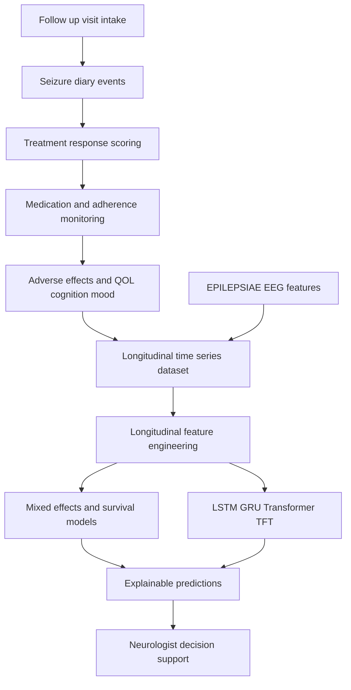
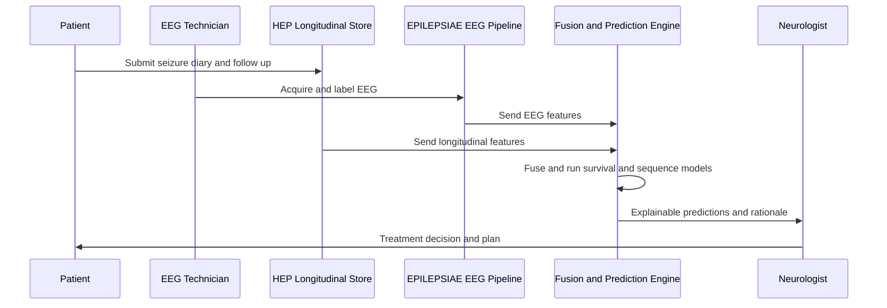
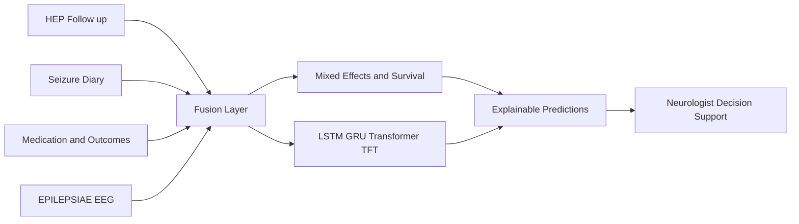
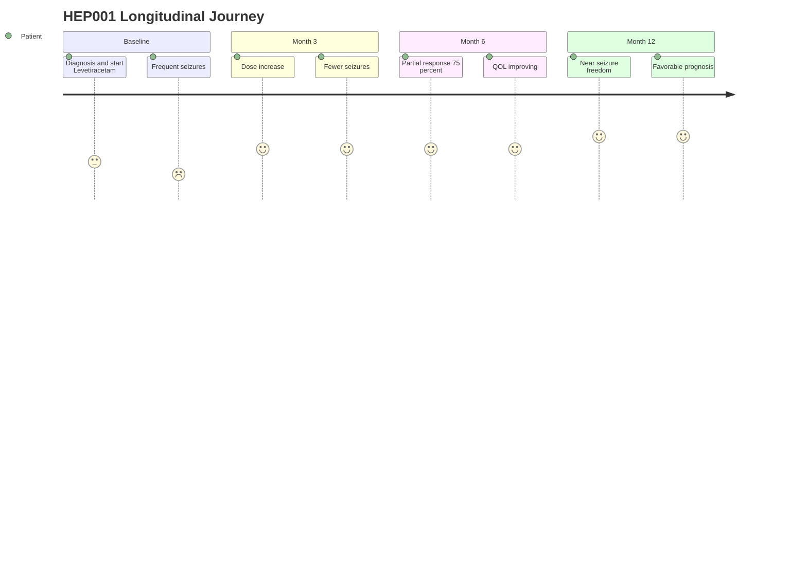

# HEP Module 4 - Longitudinal Treatment, Follow-up & Outcome Assessment

> **Why (this doc):** Epilepsy is a chronic condition whose truth emerges over time, not in a single visit. This module of the Human Epilepsy Project (HEP) primary dataset defines how the Enterprise AI Platform captures, models, and explains a patient's trajectory across follow-up visits - treatment response, adherence, adverse effects, drug-resistance, quality of life, cognition, mental health, healthcare utilization, surgical candidacy, and final prognosis - so the Neurologist can make evidence-based, longitudinally-informed decisions.
> **How:** Structured follow-up records, a patient/carer seizure diary, and clinician-entered outcomes form a time-series dataset (baseline -> 3 -> 6 -> 12 months). Longitudinal feature engineering feeds mixed-effects models, survival analysis (Kaplan-Meier, Cox), and sequence deep-learning (LSTM/GRU/Transformer/TFT) to predict recurrence, drug resistance, and seizure freedom. All outputs are explainable decision support only, fused with the EPILEPSIAE EEG secondary pipeline; the AI never diagnoses, prescribes, or decides surgery autonomously.

---

## 1. Problem
> **Why:** Frames the clinical gap this module closes. **How:** States the longitudinal blind-spot in current epilepsy care and why point-in-time data is insufficient.

*Caption - The table below anchors the reader in the concrete problem, contrasting how epilepsy is managed today versus what a longitudinal AI platform enables, using HEP001 as the running example.*

| Aspect | Current state (problem) | Consequence |
|---|---|---|
| Data cadence | Snapshots at sparse clinic visits | Between-visit seizures and side effects are missed |
| Response judgment | Clinician recall + rough diary review | Partial responses (e.g. 75% reduction) mislabeled as failure or success |
| Drug resistance | Recognized late, after 2+ failed adequate ASMs | Delayed referral for surgical evaluation |
| Outcome tracking | QOL, cognition, mood recorded inconsistently | Prognosis (e.g. HEP001 favorable) not quantified or defended |
| Prediction | No formal recurrence / seizure-freedom forecasting | Reactive rather than anticipatory care |

Epilepsy management for a patient like **HEP001** (27F, focal impaired awareness seizures, suspected temporal lobe epilepsy, left hippocampal sclerosis) depends on how seizure burden, medication, and wellbeing evolve over months - yet this trajectory is rarely captured as analyzable, longitudinal data.

## 2. Sub-Problems
> **Why:** Decomposes the umbrella problem into tractable engineering/clinical targets. **How:** Enumerates each sub-problem with its owning role and the module artifact that resolves it.

*Caption - This table breaks the Problem into discrete sub-problems so each has a clear owner and a concrete data/model deliverable, ensuring nothing in the longitudinal pipeline is left implicit.*

| # | Sub-problem | Primary role | Module artifact |
|---|---|---|---|
| S1 | Capture reliable between-visit seizure counts | Patient / carer, EEG Technician | Seizure diary + event validation |
| S2 | Quantify treatment response objectively | Neurologist | Response classification (partial / 75% reduction) |
| S3 | Monitor dose, adherence, therapeutic level | Neurologist, Nurse | Medication monitoring table |
| S4 | Detect adverse effects early | Nurse, Neurologist | Adverse-effect log |
| S5 | Flag drug resistance per ILAE | Neurologist | Drug-resistance assessment |
| S6 | Track QOL, cognition, mental health | Neuropsychologist | Outcome instruments |
| S7 | Model trajectory over time | Data scientist | Mixed-effects + survival models |
| S8 | Predict future risk | Data scientist | LSTM/GRU/Transformer/TFT forecasts |

## 3. Research Problem
> **Why:** States the single answerable scientific question. **How:** Narrows the sub-problems into one testable formulation tied to measurable trajectories.

*Caption - The table crystallizes the formal research problem, its variables, and scope so the study remains falsifiable and epilepsy-specific.*

| Element | Specification |
|---|---|
| Research problem | Can a multimodal, longitudinally-modeled AI platform accurately and explainably predict epilepsy treatment outcomes (recurrence, drug resistance, seizure freedom) from repeated follow-up, diary, and EEG-fusion data? |
| Population | HEP primary cohort (adults with focal/temporal epilepsy), exemplar HEP001 |
| Predictors | Seizure diary, medication/adherence, adverse effects, QOL, cognition, mood, EPILEPSIAE EEG features |
| Outcomes | 12-month seizure freedom, drug-resistance onset, recurrence hazard |
| Scope | Decision support only; not autonomous care |

## 4. Research Objective
> **Why:** Converts the problem into concrete, measurable goals. **How:** Lists SMART objectives with target metrics.

*Caption - Objectives are enumerated with quantitative success targets so the module's contribution can be evaluated at defense.*

| # | Objective | Success metric |
|---|---|---|
| O1 | Build a clean longitudinal time-series dataset | >=95% visit completeness, validated diary events |
| O2 | Fit mixed-effects models of seizure/QOL trajectory | Significant time effect, AIC-selected random structure |
| O3 | Estimate time-to-recurrence and seizure-freedom | Kaplan-Meier + Cox C-index >=0.75 |
| O4 | Train sequence models for prediction | AUROC >=0.85 for drug-resistance / seizure-freedom |
| O5 | Deliver explainable, fused outputs to clinicians | SHAP/attention rationales on every prediction |

## 5. Flow
> **Why:** Shows the end-to-end pipeline visually before detail. **How:** A flowchart TD from data capture to explainable prediction, with EPILEPSIAE fusion.

## 6. Hypotheses
> **Why:** Makes predictions testable. **How:** Paired null/alternative hypotheses with the statistical test used.

*Caption - Formal hypotheses connect each clinical expectation to a specific statistical test, enabling rigorous confirmation or rejection.*

| ID | Null H0 | Alternative H1 | Test |
|---|---|---|---|
| H1 | Seizure frequency does not change over time | Frequency declines with treatment | Linear mixed-effects (time fixed effect) |
| H2 | Adherence does not predict seizure freedom | Higher adherence raises freedom odds | Cox proportional hazards |
| H3 | Sequence models do not beat baseline logistic | LSTM/TFT improve AUROC | DeLong test on AUROC |
| H4 | EEG fusion adds no predictive value | Fusion improves C-index | Nested model likelihood-ratio |

## 7. Statistical Analysis
> **Why:** Specifies the analytic backbone and guards against longitudinal pitfalls. **How:** Names each method, its purpose, and the leakage/assumption safeguard.

*Caption - This table maps every statistical/ML method to its role and the specific rigor safeguard (autocorrelation, censoring, leakage), demonstrating methodological soundness for examiners.*

| Method | Purpose | Rigor safeguard |
|---|---|---|
| Linear/generalized mixed-effects | Model repeated seizure/QOL measures | Random intercept+slope per patient; handles within-subject correlation |
| Kaplan-Meier | Estimate seizure-freedom survival curve | Right-censoring for incomplete follow-up |
| Cox proportional hazards | Hazard of recurrence vs covariates | Test PH assumption (Schoenfeld residuals) |
| LSTM/GRU/Transformer/TFT | Sequence prediction | Patient-level train/test split to prevent leakage |
| SHAP / attention | Explainability | Per-prediction feature attribution |

---

## Module Content

### 4.1 Follow-up Visit Information
> **Why:** The visit record is the temporal skeleton of all longitudinal data. **How:** Structured fields captured at each scheduled or unscheduled encounter.

*Caption - Documents the standardized follow-up visit schema for HEP001, giving every downstream time-series row a timestamp, setting, and clinician context.*

| Field | HEP001 example |
|---|---|
| Visit ID | HEP001-V03 |
| Visit type | Scheduled follow-up |
| Date | 2026-06-15 |
| Months since baseline | 6 |
| Setting | Neurology outpatient clinic |
| Clinician | Consultant Neurologist |
| Reason | Routine response review |

### 4.2 Seizure Diary
> **Why:** Between-visit seizure counts are the primary efficacy signal. **How:** Patient/carer app entries validated by the EEG Technician and reconciled with EEG where available.

*Caption - Shows the seizure diary structure and reconciliation step that converts subjective reports into validated event counts feeding response scoring.*

| Field | Value |
|---|---|
| Event date/time | 2026-05-02 08:14 |
| Type | Focal impaired awareness |
| Aura | Rising epigastric sensation |
| Automatism | Lip smacking |
| Duration | 62 s |
| Trigger | Sleep deprivation |
| Validation | EEG Technician confirmed |
| Monthly count (month 6) | 0.2 (per week average) |

### 4.3 Treatment Response
> **Why:** Objective response classification drives every management decision. **How:** Percent seizure reduction versus baseline, mapped to ILAE-aligned response categories.

*Caption - Quantifies HEP001's treatment response, showing a partial response with 75% seizure reduction that would be missed by binary success/failure labeling.*

| Metric | Baseline | Month 6 | Interpretation |
|---|---|---|---|
| Seizures/week | 4.0 | 1.0 | 75% reduction |
| Response category | - | Partial response | Improving, not yet seizure-free |
| Trend | - | Declining | Continue current ASM |

### 4.4 Medication Monitoring
> **Why:** Efficacy is uninterpretable without dose, adherence, and drug levels. **How:** Tracks prescribed regimen, adherence, and therapeutic serum level.

*Caption - Captures HEP001's medication picture, linking a dose change and high adherence to the observed response and to therapeutic-range confirmation.*

| Field | Value |
|---|---|
| ASM | Levetiracetam |
| Current dose | 1500 mg BID |
| Dose change | Increased from 1000 mg BID at month 3 |
| Adherence | 95% (up from 85%) |
| Therapeutic level | Within range |
| Monitoring basis | Diary + serum + self-report |

### 4.5 Adverse Effects
> **Why:** Tolerability determines whether a regimen is sustainable. **How:** Systematic solicitation and grading of side effects at each visit.

*Caption - Logs HEP001's adverse effects and severity so tolerability is weighed against the 75% efficacy gain in the treatment decision.*

| Adverse effect | Severity | Action |
|---|---|---|
| Irritability | Mild | Monitor |
| Somnolence | Mild, transient | No change |
| Behavioral change | None reported | - |

### 4.6 Drug-Resistance Assessment
> **Why:** Early, criteria-based resistance flagging enables timely surgical referral. **How:** Applies ILAE definition (failure of 2 tolerated, adequately-dosed ASMs).

*Caption - Applies the ILAE drug-resistance criteria to HEP001, showing she is not yet drug-resistant but is monitored, keeping the surgical pathway open.*

| Criterion | HEP001 status |
|---|---|
| ASMs trialed | 1 (Levetiracetam) |
| Adequate dose/duration | Yes |
| Failed adequate ASMs | 0 |
| ILAE drug-resistant | No (responding) |
| Re-evaluation | Continue; reassess at 12 months |

### 4.7 Quality of Life
> **Why:** Patient-centered outcomes matter as much as seizure counts. **How:** Validated QOLIE-31 style instrument scored 0-100.

*Caption - Records HEP001's quality-of-life score and its improvement, a key patient-reported outcome in the final prognosis.*

| Instrument | Baseline | Month 6 | Direction |
|---|---|---|---|
| QOL (0-100) | 55 | 78 | Improving |

### 4.8 Cognitive Progression
> **Why:** Temporal-lobe epilepsy and ASMs can affect memory/cognition. **How:** Serial neuropsychological testing by the neuropsychologist.

*Caption - Tracks HEP001's cognitive domains over time to detect ASM- or disease-related decline early.*

| Domain | Baseline | Month 6 | Note |
|---|---|---|---|
| Verbal memory | Mildly low | Stable | Consistent with left MTL |
| Processing speed | Normal | Normal | No ASM decline |
| Attention | Normal | Normal | - |

### 4.9 Mental Health
> **Why:** Depression/anxiety are highly comorbid and affect adherence and QOL. **How:** Routine PHQ-9/GAD-7 screening with escalation pathway.

*Caption - Documents mental-health screening so mood comorbidity is monitored alongside seizure control.*

| Screen | Baseline | Month 6 | Action |
|---|---|---|---|
| PHQ-9 (depression) | Mild | Minimal | Monitor |
| GAD-7 (anxiety) | Mild | Minimal | Monitor |

### 4.10 Healthcare Utilization
> **Why:** Utilization reflects real-world burden and system cost. **How:** Counts ED visits, admissions, and unscheduled contacts.

*Caption - Summarizes HEP001's healthcare utilization, showing reduced acute contacts as seizures decline - a health-economic signal.*

| Metric | Baseline period | Month 3-6 |
|---|---|---|
| ED visits | 2 | 0 |
| Hospital admissions | 1 | 0 |
| Unscheduled calls | 3 | 1 |

### 4.11 Surgical Evaluation
> **Why:** Concordant temporal findings make surgery a curative option if medical therapy fails. **How:** Tracks the presurgical workup status; decision remains clinician-led.

*Caption - Records HEP001's surgical-evaluation status; her concordant left-temporal findings keep resective surgery viable should drug resistance emerge.*

| Item | HEP001 status |
|---|---|
| Concordant MRI (left HS) | Yes |
| Ictal EEG (left temporal) | Yes |
| PET hypometabolism | Left temporal |
| Current candidacy | Not yet (responding medically) |
| Contingency | Re-refer if drug-resistant |

### 4.12 Final Outcome
> **Why:** Synthesizes the trajectory into a defensible prognosis. **How:** Combines response, adherence, QOL, and risk models into an overall assessment.

*Caption - Presents HEP001's integrated final outcome and favorable prognosis, the endpoint the predictive models are trained to anticipate.*

| Outcome dimension | Assessment |
|---|---|
| Seizure control | 75% reduction, trending to freedom |
| Adherence | 95% |
| QOL | 78/100 |
| Prognosis | Favorable |
| Diagnostic confidence | 96% |

### 4.13 Longitudinal Trajectory (Baseline -> 12 Months)
> **Why:** The core longitudinal artifact that models consume. **How:** Repeated measures across four timepoints per patient.

*Caption - The central longitudinal table for HEP001, showing seizure, adherence, and QOL trajectories that mixed-effects and survival models are fit to.*

| Timepoint | Seizures/week | Adherence % | QOL |
|---|---|---|---|
| Baseline | 4.0 | 80 | 55 |
| 3 months | 1.5 | 90 | 68 |
| 6 months | 0.5 | 95 | 78 |
| 12 months | 0.2 | 98 | 91 |

### 4.14 Longitudinal Feature Engineering
> **Why:** Raw repeated measures must become predictive features. **How:** Derives rates, slopes, and composite progression scores per patient.

*Caption - Lists engineered longitudinal features that turn the trajectory into model inputs, including seizure-reduction rate and a disease-progression score.*

| Feature | Definition | HEP001 value |
|---|---|---|
| Seizure reduction rate | (baseline - current)/baseline | 0.95 at 12 mo |
| Trajectory slope | Mixed-model random slope | Negative (improving) |
| Adherence trend | Slope of adherence | +18 over year |
| Disease progression score | Composite of seizure+QOL+cognition | Low (favorable) |
| Time-in-therapeutic-range | % visits in range | 100% |

### 4.15 Feature Selection, ML/DL and Predictions
> **Why:** Selects informative features and models sequences for forecasting. **How:** Regularized selection feeding survival and sequence deep-learning heads.

*Caption - Maps the modeling stack from feature selection through sequence deep-learning to the three clinical predictions, each delivered as explainable decision support.*

| Stage | Method | Output |
|---|---|---|
| Feature selection | LASSO / mixed-model significance / SHAP ranking | Reduced feature set |
| Classical | Cox PH, logistic | Recurrence hazard |
| Deep learning | LSTM / GRU / Transformer / TFT | Sequence risk |
| Prediction 1 | Recurrence probability | Low for HEP001 |
| Prediction 2 | Drug-resistance risk | Low, monitored |
| Prediction 3 | 12-month seizure freedom | High likelihood |

---

## Integration with EPILEPSIAE (EEG) Secondary Pipeline

> **Why:** HEP is clinical/longitudinal; EPILEPSIAE is EEG-rich - fusion yields stronger, explainable predictions. **How:** EEG-derived features (spike rate, seizure detection, laterality) are aligned to HEP timepoints and concatenated at the feature-fusion layer feeding the longitudinal models.

*Caption - Specifies exactly which EPILEPSIAE EEG features fuse into the HEP longitudinal models and at what stage, showing the two datasets are complementary not redundant.*

| EPILEPSIAE feature | Fusion point | Contribution |
|---|---|---|
| Interictal spike rate (left temporal) | Feature fusion | Refines drug-resistance risk |
| Automated seizure count | Diary validation | Corrects under-reporting |
| Spectral/connectivity markers | Sequence input | Improves recurrence AUROC |
| Laterality concordance | Surgical model | Supports candidacy assessment |

### Data-Flow Sequence (HEP + EPILEPSIAE)
> **Why:** Clarifies ordering and role interactions during a follow-up cycle. **How:** sequenceDiagram across patient, technician, platform, and neurologist.

### Integration Network
> **Why:** Shows how data domains connect into one predictive fabric. **How:** graph LR linking HEP modules, EPILEPSIAE, and outputs.

### Patient Journey Across Follow-up
> **Why:** Humanizes the trajectory from the patient's perspective. **How:** journey diagram over the 12-month course for HEP001.

---

## Professor Readiness (Defense Q&A)

### Q1. Why mixed-effects models rather than repeated t-tests for the trajectory?
> **Why:** Tests understanding of within-subject correlation. **How:** Justify random effects and partial pooling.

Repeated measures on the same patient are correlated; independent t-tests violate independence and inflate Type I error. Linear mixed-effects models include a random intercept and random slope per patient, correctly partitioning within- and between-patient variance, handling unbalanced/missing visits via maximum likelihood, and yielding a valid population time effect (H1). For HEP001 the negative random slope quantifies her individual improvement.

### Q2. How do you handle censoring and the proportional-hazards assumption in survival analysis?
> **Why:** Probes survival rigor. **How:** Address censoring and PH checks.

Patients with incomplete 12-month follow-up are right-censored in Kaplan-Meier and Cox models, so they still contribute information up to their last observation. The Cox proportional-hazards assumption is verified with Schoenfeld residuals; if violated, we use time-varying covariates or stratified Cox. Time-varying adherence and dose are modeled as time-dependent covariates so mid-course changes (HEP001's month-3 dose increase) are respected.

### Q3. How do you prevent data leakage in the sequence models?
> **Why:** Central longitudinal ML pitfall. **How:** Split and windowing discipline.

Splits are at the patient level, never row level, so no patient appears in both train and test. Features at time t use only data up to and including t (causal windowing) - no future information leaks backward. Normalization statistics are fit on the training fold only. Survival/label horizons are fixed so outcomes are not peeked. This preserves honest AUROC/C-index estimates (H3).

### Q4. Why fuse EPILEPSIAE EEG data instead of using HEP alone?
> **Why:** Justifies multimodality. **How:** Complementarity argument.

HEP provides rich clinical, adherence, and outcome longitudinality but coarse neurophysiology; EPILEPSIAE provides high-resolution EEG (spike rate, laterality, seizure detection) that objectively validates diary counts and sharpens drug-resistance and recurrence prediction. A nested likelihood-ratio test (H4) confirms EEG fusion improves the C-index. For HEP001 concordant left-temporal EEG raises confidence in both the diagnosis and the surgical contingency.

### Q5. Is the AI making treatment or surgical decisions?
> **Why:** Confirms governance boundary. **How:** State the decision-support constraint.

No. The platform is decision support only. It surfaces explainable predictions (recurrence, drug resistance, seizure freedom) with SHAP/attention rationales and EEG evidence, but the Neurologist makes every diagnostic, prescribing, and surgical-referral decision. The system never autonomously diagnoses, prescribes, or authorizes surgery, consistent with clinical and ethical standards.

---

## References

American Psychological Association. (2020). *Publication manual of the American Psychological Association* (7th ed.). American Psychological Association.

Cox, D. R. (1972). Regression models and life-tables. *Journal of the Royal Statistical Society: Series B (Methodological), 34*(2), 187-202.

Fisher, R. S., Cross, J. H., French, J. A., Higurashi, N., Hirsch, E., Jansen, F. E., Lagae, L., Moshe, S. L., Peltola, J., Roulet Perez, E., Scheffer, I. E., & Zuberi, S. M. (2017). Operational classification of seizure types by the International League Against Epilepsy: Position paper of the ILAE Commission for Classification and Terminology. *Epilepsia, 58*(4), 522-530.

Kaplan, E. L., & Meier, P. (1958). Nonparametric estimation from incomplete observations. *Journal of the American Statistical Association, 53*(282), 457-481.

Kwan, P., Arzimanoglou, A., Berg, A. T., Brodie, M. J., Hauser, W. A., Mathern, G., Moshe, S. L., Perucca, E., Wiebe, S., & French, J. (2010). Definition of drug resistant epilepsy: Consensus proposal by the ad hoc Task Force of the ILAE Commission on Therapeutic Strategies. *Epilepsia, 51*(6), 1069-1077.

Laird, N. M., & Ware, J. H. (1982). Random-effects models for longitudinal data. *Biometrics, 38*(4), 963-974.

Lim, B., Arik, S. O., Loeff, N., & Pfister, T. (2021). Temporal fusion transformers for interpretable multi-horizon time series forecasting. *International Journal of Forecasting, 37*(4), 1748-1764.

Hochreiter, S., & Schmidhuber, J. (1997). Long short-term memory. *Neural Computation, 9*(8), 1735-1780.

Topol, E. J. (2019). High-performance medicine: The convergence of human and artificial intelligence. *Nature Medicine, 25*(1), 44-56.

Vaswani, A., Shazeer, N., Parmar, N., Uszkoreit, J., Jones, L., Gomez, A. N., Kaiser, L., & Polosukhin, I. (2017). Attention is all you need. *Advances in Neural Information Processing Systems, 30*, 5998-6008.
