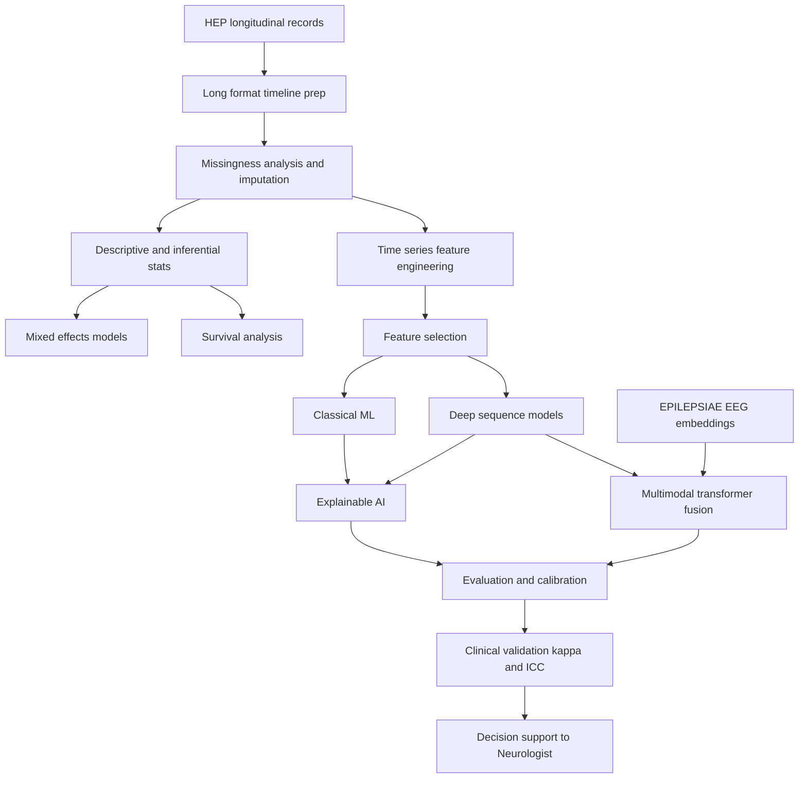
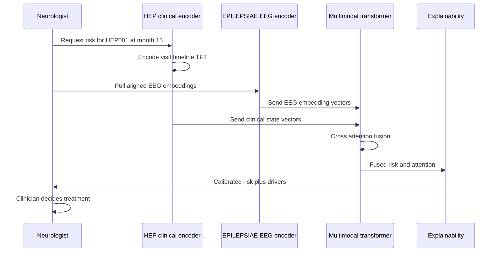
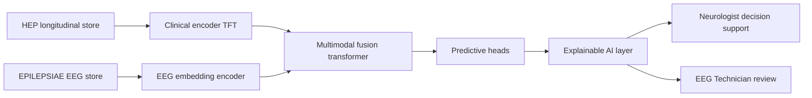
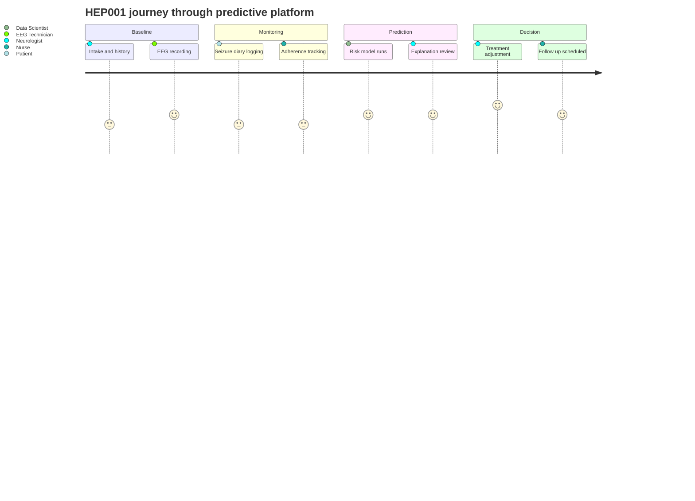

# HEP Module 5 - Advanced Statistical Modeling, Time-Series & Predictive AI

> **Why (this doc):** The Human Epilepsy Project (HEP) is our PRIMARY clinical, longitudinal dataset. Modules 1-4 curated the multimodal record for patients such as HEP001 (27-year-old female, focal impaired awareness seizures, suspected left temporal lobe epilepsy). This module turns those repeated-measures records into rigorous statistical inference and validated, explainable predictive AI that forecasts drug resistance, seizure freedom, hospitalization and cognitive decline. It exists so that a Neurologist gets defensible risk estimates and an EEG Technician sees how longitudinal clinical trends fuse with EPILEPSIAE EEG signal embeddings.
>
> **How:** We prepare the longitudinal timeline, handle missingness principally, run descriptive and inferential statistics, fit mixed-effects and survival models, engineer time-series features, select features (SHAP/Boruta/LASSO/RFE/MI), train classical and deep sequence models (LSTM/GRU/Transformer/TFT/Neural ODE), explain them (SHAP/attention/integrated gradients), evaluate (ROC-AUC, calibration, Brier), clinically validate (Cohen kappa, ICC), and finally fuse the HEP clinical timeline with EPILEPSIAE EEG embeddings through a multimodal transformer. All outputs are decision support only; the AI never diagnoses, prescribes, or plans surgery autonomously.

---

## 1. Problem

> **Why:** Frame the clinical gap this module closes. **How:** State the mismatch between rich longitudinal epilepsy data and the shallow, non-temporal analytics used in routine care.

*Caption - The problem statement below anchors every later modeling choice; it lists the concrete clinical pains that a longitudinal predictive platform must resolve for HEP patients.*

| # | Problem dimension | Current state in epilepsy care | Consequence for HEP001-type patient |
|---|---|---|---|
| P1 | Temporal blindness | Visits analyzed as isolated snapshots | Seizure-frequency trend and adherence drift missed |
| P2 | Missing data | Irregular visits, skipped diaries, dropout | Biased estimates, unusable rows |
| P3 | No risk timing | Binary "resistant vs not" without a clock | Cannot answer *when* seizure freedom is likely |
| P4 | Opaque prediction | Black-box scores clinicians distrust | Neurologist cannot justify a treatment change |
| P5 | Modality silos | Clinical timeline and EEG analyzed apart | Fusion signal (spikes + trend) lost |

## 2. Sub-Problems

> **Why:** Decompose P1-P5 into tractable analytical tasks. **How:** Map each problem to a specific statistical or ML method owned by this module.

*Caption - This table shows the divide-and-conquer plan; each sub-problem becomes one downstream section so examiners can trace method to motivation.*

| Sub-problem | Question | Method assigned | Section |
|---|---|---|---|
| SP1 | How to structure repeated visits? | Long-format longitudinal prep | 6.1 |
| SP2 | How to handle gaps? | Missingness taxonomy + imputation | 6.2 |
| SP3 | Do trends differ per patient? | Mixed-effects (random slopes) | 6.4 |
| SP4 | When does an event occur? | Survival (KM, Cox, time-dependent) | 6.5 |
| SP5 | Which signals matter? | Feature engineering + selection | 6.6-6.7 |
| SP6 | Can we forecast outcomes? | Classical + deep sequence models | 6.8-6.9 |
| SP7 | Why did the model decide? | Explainable AI | 6.10 |
| SP8 | Is it trustworthy? | Evaluation + clinical validation | 6.12-6.13 |
| SP9 | Can EEG improve it? | Multimodal fusion with EPILEPSIAE | 6.14 |

## 3. Research Problem

> **Why:** Collapse the sub-problems into one falsifiable statement. **How:** Name the target, the data, and the constraint (explainability, no data leakage).

*Caption - The single research-problem statement below is what the thesis defends; it binds longitudinal rigor to explainable prediction under a strict no-leakage constraint.*

| Element | Specification |
|---|---|
| Research problem | Can a leakage-safe, explainable AI system, trained on HEP longitudinal multimodal records and fused with EPILEPSIAE EEG embeddings, predict clinically important epilepsy outcomes with calibrated, defensible risk estimates? |
| Target outcomes | Drug resistance, seizure freedom, hospitalization, cognitive decline |
| Hard constraints | Temporal validity (no future leakage), explainability, decision-support-only |

## 4. Research Objective

> **Why:** Convert the problem into measurable objectives. **How:** Give each objective a success metric and an owning role.

*Caption - Objectives are written as testable targets with thresholds so the defense can judge success or failure objectively rather than narratively.*

| # | Objective | Success metric | Primary role |
|---|---|---|---|
| O1 | Build a leakage-safe longitudinal feature store | 100% features use only pre-index data | EEG Technician + Data Eng |
| O2 | Quantify and impute missingness principally | Sensitivity analysis stable across imputations | Neuropsychologist |
| O3 | Fit interpretable mixed-effects + survival models | Convergence, PH assumption checked | Neurologist |
| O4 | Train and explain predictive models | ROC-AUC >= 0.80, Brier <= 0.15, SHAP available | Data Scientist |
| O5 | Fuse clinical + EEG modalities | Fusion AUC > best single modality | Neurologist + EEG Tech |

## 5. Flow (Analytical Pipeline)

> **Why:** Give a single visual of the end-to-end pipeline. **How:** Flowchart from raw longitudinal records to fused explainable predictions.

*Caption - The flowchart makes the module's execution order explicit, showing where the leakage-safe split sits (before any fitting) and where EPILEPSIAE fusion enters.*

## 6. Module Content

### 6.1 Longitudinal Data Preparation

> **Why:** Repeated-measures models need a tidy long format with a valid time index. **How:** One row per patient-visit, an index date, and elapsed-time covariate; illustrated with HEP001's timeline.

*Caption - HEP001's visit timeline is shown in long format; note the irregular spacing (a key reason mixed-effects and time-dependent survival are required rather than fixed-interval methods).*

| Visit | Months from baseline | Seizure freq / month | QOLIE-31 | Adherence % | LEV dose mg/day | Notable |
|---|---|---|---|---|---|---|
| V0 baseline | 0 | 6.0 | 52 | 88 | 1000 | Left temporal spikes on EEG |
| V1 | 3 | 4.5 | 55 | 92 | 1500 | Aura rising epigastric persists |
| V2 | 6 | 3.0 | 61 | 95 | 1500 | Lip-smacking automatisms noted |
| V3 | 9 | 3.5 | 60 | 85 | 1500 | Missed doses (travel) |
| V4 | 12 | 2.0 | 66 | 94 | 2000 | Hippocampal sclerosis confirmed MRI |
| V5 | 15 | 2.5 | 64 | 90 | 2000 | PET left temporal hypometabolism |

*Caption - The variable dictionary defines each modeled quantity and its temporal role, preventing accidental use of a future-derived field as a predictor.*

| Variable | Type | Temporal role | Leakage risk |
|---|---|---|---|
| seizure_freq | count | outcome + predictor (lagged) | High if not lagged |
| QOLIE-31 | ordinal | outcome / covariate | Medium |
| adherence | continuous | time-varying covariate | Low |
| dose | continuous | time-varying covariate | Low |
| diagnostic_confidence 96% | static | index-time only | Low |

### 6.2 Missing Data Analysis & Imputation

> **Why:** Naive deletion biases longitudinal estimates. **How:** Classify mechanism (MCAR/MAR/MNAR), then choose an imputation family and stress-test it.

*Caption - The mechanism table justifies the imputation strategy; assuming MAR for diary gaps but treating dropout as potentially MNAR drives the sensitivity analysis.*

| Field | % missing (HEP cohort) | Likely mechanism | Rationale |
|---|---|---|---|
| Seizure diary | 12 | MAR | Missing more when busy/traveling |
| QOLIE-31 | 8 | MAR | Skipped at rushed visits |
| Adherence | 15 | MNAR possible | Non-adherers under-report |
| Dropout visits | 6 | MNAR possible | Sicker patients leave |

*Caption - Comparing imputation methods clarifies why multiple imputation is the primary approach and simpler methods are diagnostic baselines only.*

| Method | Idea | Pros | Cons | Use here |
|---|---|---|---|---|
| Mean/median | Fill with column center | Trivial | Kills variance, biases SE | Baseline only |
| LOCF | Carry last value forward | Clinically intuitive | Biases toward stability | Sensitivity check |
| KNN | Neighbors in feature space | Captures structure | Sensitive to scaling/k | Secondary |
| Multiple imputation (MICE) | m datasets, pool via Rubin | Honest uncertainty | Compute, model spec | PRIMARY |

### 6.3 Descriptive & Inferential Statistics

> **Why:** Establish the cohort baseline and test simple contrasts before modeling. **How:** Report distributions, then apply the correct test per data type with effect sizes and CIs.

*Caption - Descriptive statistics summarize the HEP analytic cohort so reviewers can judge generalizability of any model trained on it.*

| Statistic | Value (illustrative HEP cohort) |
|---|---|
| N patients | 420 |
| Female % | 54 |
| Median age (IQR) | 34 (26-45) |
| Focal impaired awareness % | 61 |
| Median baseline seizure freq/month | 5.0 |
| Drug-resistant at 24 mo % | 33 |

*Caption - The inferential-test matrix maps each research question to a valid test, preventing the common defense pitfall of applying a t-test to skewed count data.*

| Question | Data type | Test | Effect size |
|---|---|---|---|
| Adherence differs resistant vs not? | continuous | Welch t / Mann-Whitney | Cohen d / rank-biserial |
| Sclerosis vs resistance? | 2x2 | Chi-square / Fisher | Odds ratio |
| Seizure freq change over visits? | repeated count | Friedman / mixed model | Kendall W |

### 6.4 Longitudinal Mixed-Effects Models

> **Why:** Repeated measures within a patient are correlated; ignoring this deflates standard errors. **How:** Fixed effects for population trends, random intercepts/slopes for patient heterogeneity.

*Caption - The fixed-versus-random contrast is the core teaching point of this section and a frequent examiner probe; the table separates the two unambiguously.*

| Effect type | Interprets | Example in HEP |
|---|---|---|
| Fixed - time | Average population trend | Mean seizure freq drops 0.25/month |
| Fixed - adherence | Average covariate effect | +10% adherence lowers freq |
| Random intercept | Patient baseline differs | HEP001 starts at 6/month |
| Random slope | Patient trajectory differs | HEP001 improves faster than average |

*Caption - The candidate-model ladder shows the principled build-up from null to random-slope models, compared by likelihood-ratio test and AIC rather than cherry-picking.*

| Model | Specification | Selection criterion |
|---|---|---|
| M0 null | freq ~ 1 + (1 &#124; patient) | reference |
| M1 | + time | LRT vs M0 |
| M2 | + adherence + dose | AIC |
| M3 | + (time &#124; patient) random slope | LRT, AIC |

### 6.5 Survival Analysis

> **Why:** Many questions are about *time to event* (first seizure-free interval, resistance onset, hospitalization) with censoring. **How:** Kaplan-Meier for curves, log-rank for group contrasts, Cox PH and time-dependent Cox for covariates.

*Caption - This table pairs each survival method with the exact HEP question it answers and its key assumption, so the defense can see method selection is deliberate.*

| Method | HEP question | Key assumption | Note |
|---|---|---|---|
| Kaplan-Meier | Time to 6-month seizure freedom | Non-informative censoring | Unadjusted |
| Log-rank | Sclerosis vs no sclerosis | Proportional hazards | Group test |
| Cox PH | Hazard of resistance by covariates | Proportional hazards | Hazard ratios |
| Time-dependent Cox | Adherence changes over time | PH given time-varying X | Handles dose changes |

*Caption - Illustrative hazard ratios show how the Cox model translates covariates into interpretable risk for a Neurologist, with confidence intervals to convey uncertainty.*

| Covariate | HR (95% CI) | Direction |
|---|---|---|
| Hippocampal sclerosis | 1.9 (1.3-2.8) | higher resistance risk |
| Adherence per +10% | 0.82 (0.71-0.95) | protective |
| Baseline freq per +1/mo | 1.12 (1.05-1.20) | higher risk |

### 6.6 Time-Series Feature Engineering

> **Why:** Raw visit values under-use the trajectory; slopes and stability carry prognostic signal. **How:** Derive trend, volatility, and stability features over rolling windows, strictly from pre-index data.

*Caption - The engineered-feature catalog documents each derived signal and its clinical meaning, and flags the leakage guard (window must end before the prediction index).*

| Feature | Definition | Clinical meaning | Leakage guard |
|---|---|---|---|
| seizure_trend_slope | OLS slope of freq over window | Worsening vs improving | Window < index date |
| qol_trend | Slope of QOLIE-31 | Wellbeing trajectory | Window < index date |
| adherence_stability | 1 - SD(adherence) | Consistency of intake | Window < index date |
| dose_escalations | Count of increases | Treatment intensity | Window < index date |
| interseizure_interval_var | Variance of gaps | Rhythm irregularity | Window < index date |

### 6.7 Feature Selection

> **Why:** Many correlated features risk overfitting and hurt interpretability. **How:** Combine model-agnostic (MI, SHAP), wrapper (RFE, Boruta) and embedded (LASSO) methods, then keep the consensus set.

*Caption - Presenting complementary selection families prevents reliance on a single biased method; consensus across families is the defensible selection rule.*

| Method | Family | Strength | Weakness |
|---|---|---|---|
| Mutual information | Filter | Nonlinear, fast | Ignores interactions |
| LASSO | Embedded | Sparse, stable | Linear bias |
| RFE | Wrapper | Model-tuned | Compute cost |
| Boruta | Wrapper (RF) | Handles interactions | Slow |
| SHAP importance | Post-hoc | Consistent, local+global | Needs trained model |

### 6.8 Classical Machine Learning

> **Why:** Strong, interpretable baselines must beat before deep models are justified. **How:** Logistic regression, random forest, gradient boosting on the engineered feature store with nested cross-validation.

*Caption - The classical-model table sets the performance floor; deep models later must clear these baselines to earn their added complexity and compute.*

| Model | Why included | Interpretability |
|---|---|---|
| Penalized logistic regression | Transparent, calibrated | High (coefficients) |
| Random forest | Nonlinear, robust | Medium (importance) |
| XGBoost / gradient boosting | Usually top tabular | Medium (SHAP) |

### 6.9 Deep Learning (Sequence Models)

> **Why:** Irregular, long clinical sequences may hold patterns tabular models miss. **How:** Compare recurrent, attention, and continuous-time architectures with proper temporal validation.

*Caption - The architecture comparison explains why each deep model is a candidate for irregular longitudinal epilepsy data and what trade-off it brings.*

| Architecture | Fit for HEP | Trade-off |
|---|---|---|
| LSTM | Long dependencies in visit sequence | Struggles with irregular spacing |
| GRU | Lighter LSTM alternative | Similar limits |
| Transformer | Attention over all visits | Needs positional/time encoding |
| Temporal Fusion Transformer (TFT) | Mixes static + time-varying + interpretable attention | Complex to tune |
| Neural ODE | Native continuous, irregular time | Compute, stability |

### 6.10 Explainable AI

> **Why:** A Neurologist will not act on an unexplained risk score; explainability is a clinical and regulatory requirement. **How:** Global and local attributions matched to each model class.

*Caption - Mapping explanation techniques to model types ensures every deployed model ships with a valid, faithful explanation rather than a post-hoc rationalization.*

| Technique | Applies to | Output |
|---|---|---|
| SHAP | Tree/tabular + any | Per-feature contribution |
| Attention weights | Transformer/TFT | Which visits mattered |
| Integrated gradients | Deep nets | Attribution along input path |
| Partial dependence / ALE | Any | Marginal effect shape |

### 6.11 Predictive Models (Clinical Targets)

> **Why:** Tie all machinery to the four decision-relevant outcomes. **How:** Define each target, its horizon, and its label definition to avoid ambiguous endpoints.

*Caption - The prediction-target table pins down horizons and label rules; ambiguous endpoints are a top cause of unreproducible clinical ML, so they are fixed here.*

| Target | Label definition | Horizon | Model family |
|---|---|---|---|
| Drug resistance | Failure of 2 tolerated ASMs (ILAE) | 24 mo | Boosting / TFT |
| Seizure freedom | >=12 mo seizure-free | 12-24 mo | Survival + classifier |
| Hospitalization | Any epilepsy admission | 12 mo | Boosting |
| Cognitive decline | >=1 SD drop in neuropsych score | 24 mo | Mixed model + classifier |

### 6.12 Model Evaluation

> **Why:** Discrimination alone is insufficient for clinical risk; calibration and probabilistic accuracy matter. **How:** Report ROC-AUC, PR-AUC, calibration curve/slope, and Brier score under temporal cross-validation.

*Caption - The metric panel enforces evaluation beyond accuracy; calibration and Brier are highlighted because miscalibrated risk misleads treatment decisions even at high AUC.*

| Metric | Measures | Target |
|---|---|---|
| ROC-AUC | Ranking discrimination | >= 0.80 |
| PR-AUC | Performance under class imbalance | context |
| Calibration slope | Risk reliability | ~1.0 |
| Brier score | Probabilistic accuracy | <= 0.15 |
| Decision curve | Net clinical benefit | positive |

### 6.13 Clinical Validation

> **Why:** Statistical fit must translate to agreement with expert judgment and reproducibility. **How:** Cohen kappa for model-vs-clinician agreement, ICC for repeated-measure reliability.

*Caption - Clinical-validation metrics bridge model output and clinician trust; kappa and ICC are the standard agreement/reliability statistics examiners expect for a deployment claim.*

| Metric | Compares | Good value |
|---|---|---|
| Cohen kappa | Model vs Neurologist label | >= 0.6 substantial |
| Weighted kappa | Ordinal severity agreement | >= 0.6 |
| ICC | Repeated QOLIE-31 reliability | >= 0.75 |

### 6.14 Multimodal Fusion with EPILEPSIAE

> **Why:** HEP clinical trajectory and EPILEPSIAE EEG carry complementary signal; fusing them should beat either alone. **How:** Encode each modality, align on patient/time, and merge via a multimodal transformer with cross-attention.

*Caption - The fusion-design table specifies how the HEP clinical timeline and EPILEPSIAE EEG embeddings are aligned and combined, and names the fusion stage explicitly for reproducibility.*

| Component | HEP (primary) | EPILEPSIAE (secondary) |
|---|---|---|
| Encoder | TFT over visit sequence | EEG deep embedding (spikes, spectral) |
| Token/embedding | Clinical state vectors per visit | Windowed EEG embedding vectors |
| Alignment key | patient_id + timestamp | patient_id + timestamp |
| Fusion stage | Cross-attention (intermediate fusion) | Cross-attention |
| Output | Joint risk + attention over modalities | Joint risk |

*Caption - The interaction sequence below traces one prediction request end-to-end across roles and both datasets, clarifying that the AI returns support to the Neurologist and never acts autonomously.*

*Caption - The integration network shows how this module sits between the two datasets and downstream decision support, positioning fusion as the convergence point.*

*Caption - The patient journey maps HEP001's experience of the platform across the care pathway, reminding reviewers that model outputs serve human decisions at each step.*

## 7. Hypotheses

> **Why:** State falsifiable claims the statistics will test. **How:** Pair each null with an alternative and the deciding test.

*Caption - Explicit null/alternative pairs let the defense confirm that every modeling claim is testable and pre-specified rather than post-hoc.*

| # | Null H0 | Alternative H1 | Test |
|---|---|---|---|
| H1 | Adherence unrelated to resistance | Higher adherence lowers resistance | Cox HR != 1 |
| H2 | No patient-specific trajectory | Random slopes improve fit | LRT M3 vs M2 |
| H3 | Sclerosis unrelated to time-to-freedom | Sclerosis shortens freedom time | Log-rank |
| H4 | Fusion equals best single modality | Fusion AUC greater | DeLong test |
| H5 | Model risk uncalibrated | Calibration slope ~ 1 | Calibration test |

## 8. Statistical Analysis (Plan)

> **Why:** Pre-register the analytical decisions to prevent p-hacking and leakage. **How:** Specify split strategy, multiplicity control, and assumption checks up front.

*Caption - The analysis plan fixes the rules of engagement (temporal splits, Rubin pooling, multiplicity control) before results are seen, which is the core defense against leakage and overfitting.*

| Element | Decision |
|---|---|
| Data split | Patient-level, temporally ordered; no visit crosses train/test |
| Cross-validation | Nested, blocked by time; outer for estimate, inner for tuning |
| Missing data | MICE (m=20), Rubin's rules; LOCF + KNN as sensitivity |
| Multiplicity | Benjamini-Hochberg FDR at 0.05 |
| Assumptions | PH via Schoenfeld residuals; mixed-model residual/QQ checks |
| Uncertainty | 95% CIs and bootstrap for AUC/Brier |
| Leakage audit | Feature-timestamp check < index date for every feature |

## 9. Professor Readiness (Defense Q&A)

> **Why:** Anticipate examiner scrutiny on longitudinal and predictive rigor. **How:** Five likely questions with concise, defensible answers.

### 9.1 How do you prevent data leakage in a longitudinal predictive model?

> **Why:** Leakage is the top reason clinical ML fails to replicate. **How:** Show temporal discipline across features, splits, and imputation.

We split at the patient level and order time so no future visit informs a past prediction; every engineered feature's window ends strictly before the index date (audited programmatically); imputation and scaling are fit on training folds only and applied to test folds; and target-derived quantities (for example, a later seizure-free interval) are never used as predictors of that same target.

### 9.2 Why mixed-effects models instead of repeated ANOVA or pooled regression?

> **Why:** Repeated measures violate independence. **How:** Justify random effects and their handling of imbalance.

Visits within a patient are correlated, so pooled regression underestimates standard errors and repeated-measures ANOVA cannot handle the irregular, unbalanced visit spacing in HEP. Mixed-effects models add random intercepts and slopes, borrowing strength across patients while capturing individual trajectories (for example, HEP001 improving faster than the cohort mean), and they accommodate missing visits under MAR without listwise deletion.

### 9.3 How do you justify the survival analysis choices, especially time-dependent Cox?

> **Why:** Covariates like adherence and dose change over follow-up. **How:** Explain PH checking and time-varying covariates.

Kaplan-Meier and log-rank give unadjusted group comparisons; Cox PH adds covariate adjustment via hazard ratios. Because adherence and LEV dose change over time, a standard Cox model with baseline-only covariates would be misspecified, so we use time-dependent Cox with the counting-process formulation. We verify proportional hazards with Schoenfeld residuals and, where violated, add time-interaction terms or stratify.

### 9.4 A deep model has higher AUC but is opaque and barely beats XGBoost. What do you deploy?

> **Why:** Complexity must be clinically justified. **How:** Weigh marginal gain against interpretability and calibration.

We deploy the model that maximizes net clinical benefit and calibration, not raw AUC. If a Temporal Fusion Transformer's improvement over calibrated XGBoost is within confidence intervals (DeLong) and its calibration is not better, we prefer the simpler, better-understood model with SHAP explanations. If the deep model clears the baseline meaningfully, we still ship its attention/integrated-gradients explanations and present it as decision support, with the Neurologist retaining the decision.

### 9.5 How does fusing EPILEPSIAE EEG with HEP clinical data improve outcomes without overfitting?

> **Why:** Fusion adds parameters and modality-alignment risk. **How:** Describe alignment, regularization, and ablation.

We align modalities on patient and timestamp, encode each separately, and fuse with cross-attention at an intermediate stage so each encoder can be pretrained and frozen if data is scarce. We regularize (dropout, weight decay), use patient-level temporal splits, and run modality-ablation studies; fusion is accepted only if it beats the best single modality by a DeLong-significant margin on held-out patients, confirming the EEG signal (for example, left temporal spikes) adds information beyond the clinical trend.

## 10. References

> **Why:** Ground methods and claims in authoritative sources. **How:** APA 7th edition, spanning epilepsy definitions, clinical AI, ethics, and longitudinal/survival/mixed-model methodology.

American Psychological Association. (2020). *Publication manual of the American Psychological Association* (7th ed.). American Psychological Association.

Cox, D. R. (1972). Regression models and life-tables. *Journal of the Royal Statistical Society: Series B (Methodological), 34*(2), 187-202. https://doi.org/10.1111/j.2517-6161.1972.tb00899.x

Fisher, R. S., Cross, J. H., French, J. A., Higurashi, N., Hirsch, E., Jansen, F. E., Lagae, L., Moshe, S. L., Peltola, J., Roulet Perez, E., Scheffer, I. E., & Zuberi, S. M. (2017). Operational classification of seizure types by the International League Against Epilepsy. *Epilepsia, 58*(4), 522-530. https://doi.org/10.1111/epi.13670

Kaplan, E. L., & Meier, P. (1958). Nonparametric estimation from incomplete observations. *Journal of the American Statistical Association, 53*(282), 457-481. https://doi.org/10.1080/01621459.1958.10501452

Kwan, P., Arzimanoglou, A., Berg, A. T., Brodie, M. J., Hauser, W. A., Mathern, G., Moshe, S. L., Perucca, E., Wiebe, S., & French, J. (2010). Definition of drug resistant epilepsy: Consensus proposal by the ad hoc Task Force of the ILAE Commission on Therapeutic Strategies. *Epilepsia, 51*(6), 1069-1077. https://doi.org/10.1111/j.1528-1167.2009.02397.x

Laird, N. M., & Ware, J. H. (1982). Random-effects models for longitudinal data. *Biometrics, 38*(4), 963-974. https://doi.org/10.2307/2529876

Lim, B., Arik, S. O., Loeff, N., & Pfister, T. (2021). Temporal fusion transformers for interpretable multi-horizon time series forecasting. *International Journal of Forecasting, 37*(4), 1748-1764. https://doi.org/10.1016/j.ijforecast.2021.03.012

Lundberg, S. M., & Lee, S.-I. (2017). A unified approach to interpreting model predictions. In *Advances in Neural Information Processing Systems* (Vol. 30, pp. 4765-4774). Curran Associates.

Rubin, D. B. (1987). *Multiple imputation for nonresponse in surveys*. John Wiley & Sons. https://doi.org/10.1002/9780470316696

Topol, E. J. (2019). High-performance medicine: The convergence of human and artificial intelligence. *Nature Medicine, 25*(1), 44-56. https://doi.org/10.1038/s41591-018-0300-7

Vaswani, A., Shazeer, N., Parmar, N., Uszkoreit, J., Jones, L., Gomez, A. N., Kaiser, L., & Polosukhin, I. (2017). Attention is all you need. In *Advances in Neural Information Processing Systems* (Vol. 30, pp. 5998-6008). Curran Associates.
