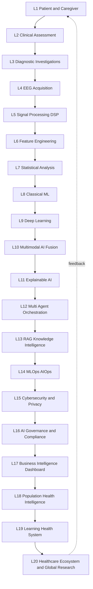
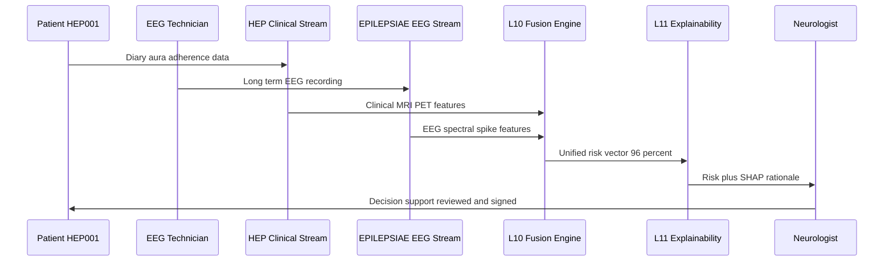
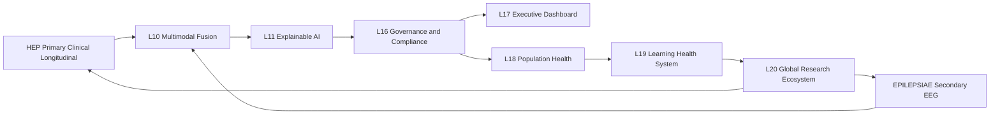
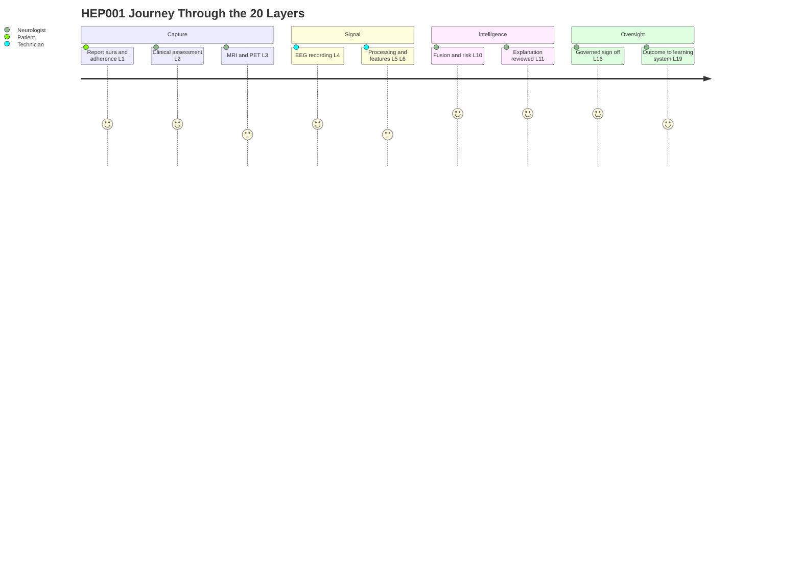

# Enterprise Healthcare AI Reference Architecture - 20 Layers

> **Why (this doc):** The Human Epilepsy Project (HEP) primary dataset and the EPILEPSIAE secondary EEG dataset must be governed by one coherent, auditable architecture so that clinical, signal, model, governance, and ecosystem concerns are traceable end to end for epilepsy care and DBA research. **How:** We define 20 vertically integrated layers (L1 Patient and Caregiver through L20 Healthcare Ecosystem and Global Research), give each a focus and concrete outputs, map HEP and EPILEPSIAE artifacts into each layer, and show fusion, orchestration, and governance via four Mermaid diagrams, all under a decision-support-only constraint.

---

## 1. Problem

> **Why:** Anchor the whole architecture in the real clinical and engineering pain point before naming any technology. **How:** State the fragmentation problem for a representative epilepsy patient (HEP001) whose data spans clinic, EEG lab, and imaging.

Epilepsy intelligence is built from fragmented, multimodal, longitudinal evidence: clinical history, seizure diaries, EEG, MRI, PET, medication adherence, and outcomes. Today these live in disconnected systems with no shared explainability, governance, or fusion layer. For HEP001 (27-year-old female, focal impaired awareness seizures, suspected temporal lobe epilepsy, aura = rising epigastric sensation, automatisms = lip smacking, on Levetiracetam, adherence 85-95%, left hippocampal sclerosis on MRI, left temporal spikes on EEG, left temporal hypometabolism on PET, diagnostic confidence 96%), a neurologist must mentally integrate all of this without a unifying, auditable platform.

*Caption - The problem table names the fragmentation each layer must later resolve, grounded in HEP001.*

| Fragmentation gap | Current state | Consequence for HEP001 |
|---|---|---|
| Modality silos | Clinic, EEG, MRI, PET stored separately | Neurologist manually reconciles left-temporal evidence |
| No shared explainability | Model outputs lack rationale | Low clinician trust in 96% confidence |
| No longitudinal spine | Snapshots, not trajectories | Adherence 85-95% not linked to seizure risk over time |
| Weak governance | Ad hoc access and audit | HIPAA/GDPR exposure, no lineage |

## 2. Sub-Problems

> **Why:** Decompose the monolithic problem into layer-addressable units so each of L1-L20 has a clear mandate. **How:** List discrete sub-problems that individual layers or layer clusters own.

*Caption - Sub-problems partition the architecture so every layer has an accountable scope.*

| # | Sub-problem | Owning layers |
|---|---|---|
| SP1 | Capture patient-reported and caregiver data reliably | L1, L2 |
| SP2 | Acquire and process EEG at clinical quality | L4, L5 |
| SP3 | Engineer features and fuse modalities | L6, L10 |
| SP4 | Model risk with classical and deep methods | L7, L8, L9 |
| SP5 | Explain and orchestrate decisions safely | L11, L12, L13 |
| SP6 | Operate, secure, and govern the platform | L14, L15, L16 |
| SP7 | Deliver insight and learn at population scale | L17, L18, L19, L20 |

## 3. Research Problem

> **Why:** Convert sub-problems into one researchable statement suitable for a DBA thesis. **How:** Frame as a single architecture-and-integration question.

**Research Problem:** How can a 20-layer enterprise AI reference architecture integrate a longitudinal clinical primary dataset (HEP) with an EEG-centric secondary dataset (EPILEPSIAE) to produce explainable, governed, decision-support epilepsy intelligence without autonomous clinical action?

## 4. Research Objective

> **Why:** Give a measurable target the architecture is judged against. **How:** State objective plus success criteria mapped to layers.

*Caption - Objectives are testable and each maps to layers, enabling defense-grade evaluation.*

| Objective | Success criterion | Primary layers |
|---|---|---|
| O1 Unify HEP and EPILEPSIAE | Single lineage from patient to ecosystem | L1-L20 |
| O2 Explainable fusion | Every risk output has SHAP or attention rationale | L10, L11 |
| O3 Longitudinal rigor | Mixed-effects and survival models with no leakage | L7, L9 |
| O4 Governed decision support | Human sign-off on all outputs, full audit | L15, L16 |

## 5. Flow

> **Why:** Show the end-to-end path data travels through the 20 layers before formal hypotheses. **How:** Narrative plus the master flowchart diagram.

Data flows upward: patient and caregiver input (L1) is structured by clinical assessment (L2) and diagnostic investigations (L3); EEG is acquired (L4), processed (L5), and turned into features (L6); statistics (L7) and models (L8-L9) generate predictions fused multimodally (L10), explained (L11), orchestrated by agents (L12) grounded in RAG knowledge (L13); the stack is operated (L14), secured (L15), and governed (L16); insight surfaces to executives (L17), populations (L18), the learning health system (L19), and the global ecosystem (L20).

## 6. Hypotheses

> **Why:** State falsifiable claims the architecture enables us to test. **How:** Pair null and alternative hypotheses tied to measurable outputs.

*Caption - Hypotheses make the architecture scientifically accountable, not just an engineering diagram.*

| ID | Null H0 | Alternative H1 |
|---|---|---|
| H1 | Multimodal fusion (L10) does not improve seizure-risk AUC over EEG-only | Fusion improves AUC significantly |
| H2 | Explainability (L11) has no effect on clinician trust | Explainability raises trust and adoption |
| H3 | Adherence (85-95%) is unrelated to time-to-seizure | Lower adherence shortens time-to-seizure (survival) |
| H4 | Patient random effects add nothing to risk models | Mixed-effects patient terms improve fit |

## 7. Statistical Analysis

> **Why:** Specify the longitudinal-statistics rigor the architecture must support at L7 and L9. **How:** Name models, validation, and leakage controls.

*Caption - This table binds each hypothesis to a concrete longitudinal method and a leakage-safe validation scheme.*

| Method | Purpose | Leakage control | Layer |
|---|---|---|---|
| Linear/GLMM mixed-effects | Adherence and seizure-count trajectories with patient random intercepts/slopes | Split by patient, never by visit | L7 |
| Cox proportional hazards / survival | Time-to-next-seizure vs adherence and MRI/PET burden | Landmark analysis, no future covariates | L7 |
| Nested CV with grouped folds | Classical ML tuning (L8) | Patient-grouped folds, no HEP001 in both folds | L8 |
| Temporal deep models (attention) | EEG sequence risk (L9) | Time-forward split, no cross-window bleed | L9 |
| DeLong test, bootstrap CI | Compare fusion vs EEG-only AUC (H1) | Held-out patients only | L10 |

---

## Layer Reference (L1-L20)

> **Why:** This is the core deliverable — each layer's focus, outputs, and HEP/EPILEPSIAE mapping. **How:** Grouped tables of five layers each, then the integration diagrams.

### Layers L1-L5 Clinical to Signal

> **Why:** These layers turn a human patient and raw EEG into clean, structured signal. **How:** Table of focus, outputs, and dataset mapping.

*Caption - The foundation layers where HEP contributes clinical/longitudinal data and EPILEPSIAE contributes long-term EEG.*

| Layer | Focus | Key outputs | HEP mapping | EPILEPSIAE mapping |
|---|---|---|---|---|
| L1 Patient and Caregiver | Patient-reported data, seizure diary, consent | Diary entries, adherence log, consent record | HEP001 aura and automatism diary, Levetiracetam 85-95% adherence | Consent for long-term monitoring |
| L2 Clinical Assessment | History, semiology, exam by neurologist/nurse | Structured semiology, differential | Focal impaired awareness, lip smacking, rising epigastric aura | Semiology annotations |
| L3 Diagnostic Investigations | MRI, PET, labs | Imaging reports, lesion localization | Left hippocampal sclerosis, left temporal PET hypometabolism | Imaging where available |
| L4 EEG Acquisition | Scalp/intracranial recording by EEG technician | Raw EDF, electrode montage, event markers | Interictal spike capture | Long-term multi-day EEG core dataset |
| L5 Signal Processing DSP | Filtering, artifact removal, montage re-reference | Cleaned epochs, spectral bands | Left temporal spike epochs | Ictal/interictal segmented recordings |

### Layers L6-L10 Features to Fusion

> **Why:** These layers convert signal into features and integrate all modalities into one risk representation. **How:** Table plus fusion emphasis.

*Caption - The analytic core where HEP clinical features and EPILEPSIAE EEG features are fused.*

| Layer | Focus | Key outputs | HEP mapping | EPILEPSIAE mapping |
|---|---|---|---|---|
| L6 Feature Engineering | Time/frequency/connectivity features | Feature matrix, embeddings | Adherence trend, semiology encoding | Band power, spikes/min, connectivity |
| L7 Statistical Analysis | Mixed-effects, survival, inference | Effect sizes, hazard ratios | Adherence vs seizure trajectory | EEG feature significance |
| L8 Classical ML | Interpretable baselines | RF/XGBoost risk scores | Clinical risk factors | EEG-derived features |
| L9 Deep Learning | Temporal/CNN EEG models | Seizure-risk probabilities | Fused clinical context | EEG sequence learning |
| L10 Multimodal AI | Fuse EEG + clinical + imaging | Unified risk vector, 96% confidence for HEP001 | Clinical + MRI + PET stream | EEG stream |

### Layers L11-L15 Explainability to Security

> **Why:** These layers make outputs trustworthy, orchestrated, knowledge-grounded, operable, and secure. **How:** Table of focus and outputs.

*Caption - Trust and operations layers ensuring outputs are explainable, governed by agents/knowledge, and protected.*

| Layer | Focus | Key outputs | HEP mapping | EPILEPSIAE mapping |
|---|---|---|---|---|
| L11 Explainable AI | SHAP, attention maps, saliency | Per-decision rationale | Why left-temporal for HEP001 | EEG channel attribution |
| L12 Multi-Agent Orchestration | Coordinate diagnostic, retrieval, safety agents | Agent workflow, human handoff | Route HEP001 case to neurologist | EEG review agent |
| L13 RAG and Knowledge Intelligence | Ground answers in guidelines/literature | Cited recommendations | ILAE-based guidance | EEG interpretation references |
| L14 MLOps AIOps | CI/CD, monitoring, drift | Model registry, drift alerts | Retrain triggers on new HEP visits | EEG model versioning |
| L15 Cybersecurity and Privacy | Encryption, de-identification, access | Audit trail, PHI protection | HEP001 de-identified | EEG de-identification |

### Layers L16-L20 Governance to Ecosystem

> **Why:** These layers govern, surface, and scale intelligence from one patient to global research. **How:** Table of focus and outputs.

*Caption - Governance-to-ecosystem layers turning individual decision support into population learning under compliance.*

| Layer | Focus | Key outputs | HEP mapping | EPILEPSIAE mapping |
|---|---|---|---|---|
| L16 AI Governance and Compliance | HIPAA/GDPR, model cards, human oversight | Approvals, model cards, sign-off | HEP001 output requires neurologist sign-off | EEG model governance |
| L17 Business Intelligence Dashboard | Executive and clinical KPIs | Dashboards, quality metrics | Case throughput, confidence trends | EEG lab utilization |
| L18 Population Health Intelligence | Cohort risk, epidemiology | Cohort strata, risk maps | HEP cohort trajectories | EEG cohort patterns |
| L19 Learning Health System | Feedback loop, continuous improvement | Outcome-linked retraining | HEP outcomes refine models | EEG label refinement |
| L20 Healthcare Ecosystem and Global Research | Federation, registries, external research | Federated insights, publications | HEP contribution to registries | EPILEPSIAE benchmark sharing |

---

## Integration with EPILEPSIAE (Fusion)

> **Why:** Show explicitly how the HEP primary clinical/longitudinal stream fuses with the EPILEPSIAE secondary EEG stream. **How:** A sequence diagram and a network graph.

*Caption - The sequence diagram traces one HEP001 decision from data capture through fusion, explanation, and mandatory human sign-off.*

*Caption - The network graph shows how both datasets feed shared fusion, governance, and ecosystem layers rather than parallel silos.*

*Caption - The journey diagram frames the architecture from the human perspective of HEP001 and her care team across the layers.*

---

## Professor Readiness (Defense Q&A)

> **Why:** Anticipate examiner scrutiny on rigor, safety, and integration. **How:** Five likely questions with concise, defensible answers.

### Q1 Why 20 layers and not a simpler pipeline?

> **Why:** Examiner probes over-engineering. **How:** Justify by separation of concerns.

Each layer owns a distinct, auditable concern (capture, signal, model, explain, govern, scale). Collapsing them would hide lineage and governance, which are exactly the DBA-relevant enterprise contributions. Layers can be instantiated thinly, but the reference boundaries remain.

### Q2 How do you prevent data leakage in the longitudinal models?

> **Why:** Core methodological risk in repeated-measures epilepsy data. **How:** Patient-grouped splits and time-forward validation.

All splits are by patient, never by visit or window, so HEP001 never appears in both train and test. Survival models use landmark analysis with no future covariates, and EEG deep models use time-forward splits to prevent temporal bleed. Mixed-effects models capture within-patient correlation via random intercepts and slopes.

### Q3 Why mixed-effects and survival rather than plain regression?

> **Why:** Tests statistical maturity. **How:** Repeated measures and censoring.

HEP is longitudinal: repeated seizure counts and adherence per patient violate independence, so GLMM random effects are required. Time-to-next-seizure is censored, so Cox/survival models are appropriate; ordinary regression would bias both standard errors and effect estimates.

### Q4 How does fusion with EPILEPSIAE add value beyond EEG alone?

> **Why:** Tests the integration claim (H1). **How:** Complementary modalities.

EPILEPSIAE supplies rich EEG dynamics; HEP supplies clinical semiology, MRI/PET localization, and adherence trajectories. Fusion at L10 lets left-temporal EEG evidence corroborate left hippocampal sclerosis and hypometabolism, raising confidence (96% for HEP001), tested via DeLong AUC comparison against EEG-only baselines.

### Q5 Where is the human, and why is this only decision support?

> **Why:** Safety and regulatory boundary. **How:** Mandatory oversight at L12 and L16.

The AI never diagnoses, prescribes, or performs surgery. L12 routes every case to a neurologist and L16 enforces human sign-off with full audit. Outputs are explainable recommendations only; clinical authority remains with the neurologist and care team.

---

## References

> **Why:** Ground claims in authoritative epilepsy, AI, ethics, and longitudinal-methods sources. **How:** APA 7th edition list.

American Psychological Association. (2020). *Publication manual of the American Psychological Association* (7th ed.). American Psychological Association.

Cox, D. R. (1972). Regression models and life-tables. *Journal of the Royal Statistical Society: Series B (Methodological), 34*(2), 187-202. https://doi.org/10.1111/j.2517-6161.1972.tb00899.x

Fisher, R. S., Cross, J. H., French, J. A., Higurashi, N., Hirsch, E., Jansen, F. E., Lagae, L., Moshe, S. L., Peltola, J., Roulet Perez, E., Scheffer, I. E., & Zuberi, S. M. (2017). Operational classification of seizure types by the International League Against Epilepsy. *Epilepsia, 58*(4), 522-530. https://doi.org/10.1111/epi.13670

Ienca, M., & Ignatiadis, K. (2020). Artificial intelligence in clinical neuroscience: Ethical considerations. *AJOB Neuroscience, 11*(2), 77-87. https://doi.org/10.1080/21507740.2020.1740352

Laird, N. M., & Ware, J. H. (1982). Random-effects models for longitudinal data. *Biometrics, 38*(4), 963-974. https://doi.org/10.2307/2529876

Lundberg, S. M., & Lee, S.-I. (2017). A unified approach to interpreting model predictions. *Advances in Neural Information Processing Systems, 30*, 4765-4774.

Topol, E. J. (2019). High-performance medicine: The convergence of human and artificial intelligence. *Nature Medicine, 25*(1), 44-56. https://doi.org/10.1038/s41591-018-0300-7
