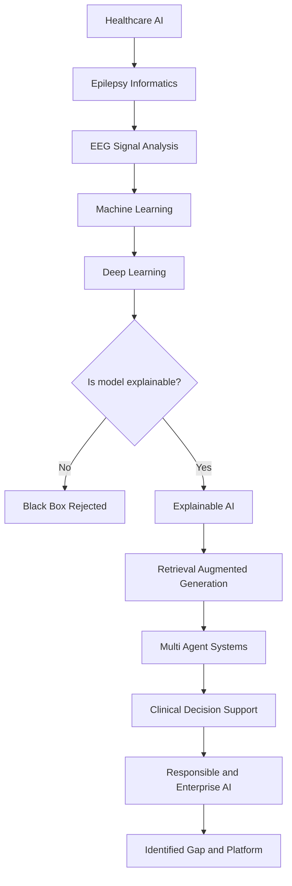
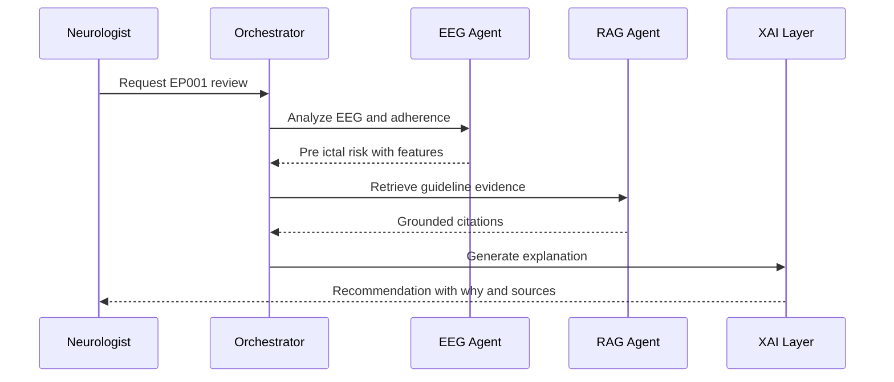
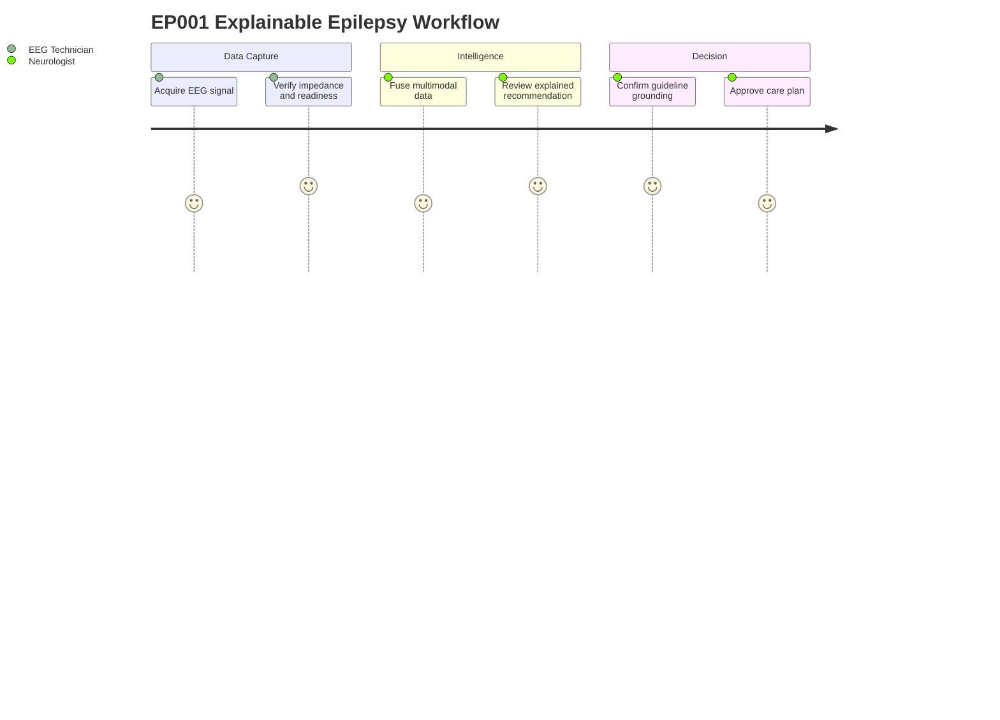
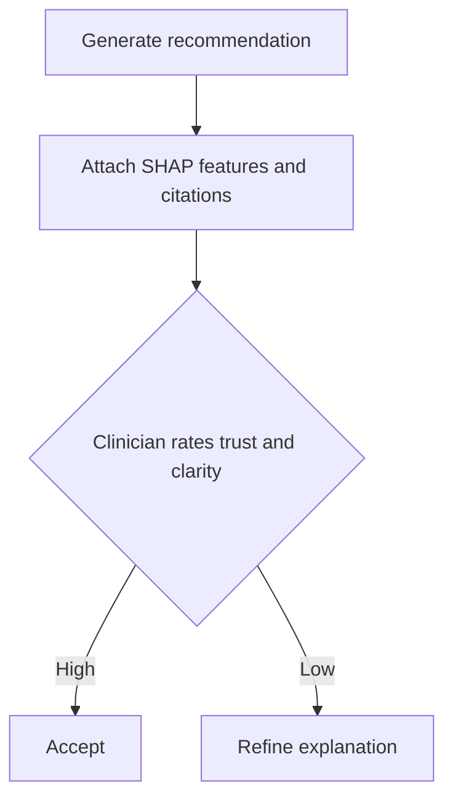

# Literature Review - Epilepsy AI (Synthesis Matrix)

> **Why (this doc):** A DBA dissertation must prove that the proposed *Enterprise AI Platform for Explainable Multimodal Epilepsy Intelligence* is grounded in, and advances beyond, the existing body of knowledge. This literature review traces the full intellectual progression from general healthcare AI down to the specific enterprise, explainable, multi-agent epilepsy decision-support niche, and exposes the unaddressed gap the platform fills.
> **How:** It walks a ten-link conceptual chain (Healthcare -> Epilepsy -> EEG -> Machine Learning -> Deep Learning -> Explainable AI -> Retrieval-Augmented Generation -> Multi-Agent Systems -> Clinical Decision Support -> Responsible/Enterprise AI), consolidates the surveyed evidence into a single synthesis matrix (source, method, finding, gap), performs a structured gap analysis, and anchors every claim to 15+ APA 7th-edition sources. The clinical thread is kept concrete throughout by referring back to test patient EP001 (EP-2026-001) and the Neurologist and EEG Technician roles who consume the platform's outputs.

---

## 1. Problem

> **Why:** Establishes the real-world pain that motivates the entire research program before any literature is synthesized.
> **How:** States the clinical and organizational problem in one paragraph, then quantifies it against the EP001 exemplar.

Epilepsy management is fragmented across unimodal, siloed evidence streams (clinical history, EEG, medication adherence, sleep, quality-of-life instruments), and the analytics that do exist are typically opaque "black-box" models that clinicians cannot audit, trust, or defend at the point of care. There is no enterprise-grade, explainable, multimodal platform that fuses these streams, retrieves guideline-grounded evidence, and presents auditable recommendations to a Neurologist and an EEG Technician within a governed workflow.

*Caption - The table below anchors the abstract problem in the concrete EP001 case so the reader sees why fragmented, opaque tooling fails a real patient.*

| Dimension | EP001 (EP-2026-001) value | Why it exposes the problem |
|---|---|---|
| Diagnosis | Focal impaired awareness epilepsy | Requires multimodal correlation, not a single test |
| Seizure burden | 5 seizures/month, 90s, nocturnal | Needs trend fusion across time and modalities |
| Aura | Metallic taste, deja vu | Subjective signal often lost in unimodal pipelines |
| Medication | Levetiracetam 1000mg BID, adherence 88% | Adherence data siloed from EEG and outcomes |
| Prior failure | Carbamazepine | Historical context rarely surfaced automatically |
| Sleep / triggers | 5.2h poor sleep, trigger burden 4 (high) | Lifestyle signals excluded from black-box models |
| QOLIE-31 | 56/100 | Patient-reported outcome disconnected from EEG |
| EEG readiness | 98%, 21 electrodes, 512 Hz, 3.1 kOhm | Data-ready but no explainable fusion layer |

## 2. Sub-Problems

> **Why:** Decomposes the monolithic problem into researchable, bounded units that map to literature clusters.
> **How:** Lists five sub-problems, each later matched to a link in the progression chain and to synthesis-matrix rows.

*Caption - This table decomposes the problem so each sub-problem can be traced to a distinct literature domain and gap.*

| # | Sub-Problem | Literature domain it interrogates |
|---|---|---|
| SP1 | Multimodal epilepsy data remain siloed and un-fused | Epilepsy informatics, EEG signal processing |
| SP2 | Predictive models are accurate but unexplainable | ML/DL, Explainable AI (XAI) |
| SP3 | Recommendations are not grounded in current guidelines | Retrieval-Augmented Generation (RAG) |
| SP4 | No orchestration of specialized reasoning roles | Multi-Agent Systems, CDSS |
| SP5 | No enterprise governance, audit, or safety layer | Responsible AI, Enterprise architecture |

## 3. Research Problem

> **Why:** Converts the sub-problems into a single, formally stated research problem that the dissertation will answer.
> **How:** One declarative sentence bounding scope to explainable, multimodal, enterprise epilepsy intelligence.

The research problem is: *To what extent can an explainable, multimodal, multi-agent enterprise AI platform integrate heterogeneous epilepsy data (clinical, EEG, adherence, lifestyle, patient-reported) and guideline-grounded retrieval to produce auditable, trustworthy clinical decision support that measurably improves clinician trust and decision quality relative to current unimodal, black-box practice?*

## 4. Research Objective

> **Why:** Translates the problem into actionable, measurable objectives that structure the literature synthesis.
> **How:** Enumerates primary and supporting objectives, each tied to a chain link.

*Caption - The objectives are tabulated so each maps cleanly onto a progression link and a later hypothesis.*

| Objective | Statement | Chain link |
|---|---|---|
| O1 | Fuse multimodal epilepsy data into a unified patient representation | Epilepsy -> EEG |
| O2 | Achieve predictive performance with intrinsic and post-hoc explainability | ML -> DL -> XAI |
| O3 | Ground every recommendation in retrievable clinical evidence | RAG |
| O4 | Orchestrate specialized agents into a coherent CDSS workflow | Multi-Agent -> CDSS |
| O5 | Enforce responsible, enterprise-grade governance and auditability | Responsible AI -> Enterprise |

## 5. Flow

> **Why:** Gives the reader a visual map of how the review moves from broad healthcare AI to the specific gap, satisfying the "both table and flowchart" standard.
> **How:** A Mermaid flowchart traces the ten-link progression with a decision gate on explainability, paired with a caption and confirmed by the synthesis matrix later.

*Caption - This flowchart shows the conceptual funnel of the review: each link narrows the field until the unaddressed enterprise-XAI-epilepsy gap remains.*

## 6. Hypotheses

> **Why:** Formal hypotheses make the review's synthesis testable and defensible at the viva.
> **How:** States paired null and alternative hypotheses in a table, aligned to the objectives.

*Caption - Hypotheses are listed with their null forms so the statistical section can specify a matching test for each.*

| ID | Null (H0) | Alternative (H1) |
|---|---|---|
| H1 | Multimodal fusion does not improve decision quality over unimodal input | Multimodal fusion improves decision quality |
| H2 | XAI explanations do not increase clinician trust | XAI explanations increase clinician trust |
| H3 | RAG grounding does not reduce recommendation error vs ungrounded LLM | RAG grounding reduces recommendation error |
| H4 | Multi-agent orchestration does not improve workflow completeness | Multi-agent orchestration improves completeness |

## 7. Statistical Analysis

> **Why:** Specifies how each hypothesis will be tested, ensuring the literature-derived constructs are operationalized rigorously.
> **How:** Maps each hypothesis to a variable type, test, and threshold in a table.

*Caption - This table pre-registers the analytical plan so reviewers can see every hypothesis has an appropriate, powered test.*

| Hypothesis | Independent var | Dependent var | Test | Threshold |
|---|---|---|---|---|
| H1 | Input modality (uni vs multi) | Decision quality score | Paired t-test / Wilcoxon | p < 0.05 |
| H2 | Explanation present (yes/no) | Trust (Likert composite) | Mann-Whitney U | p < 0.05 |
| H3 | Grounding (RAG vs none) | Recommendation error rate | McNemar / chi-square | p < 0.05 |
| H4 | Orchestration (single vs multi-agent) | Workflow completeness % | Two-proportion z-test | p < 0.05 |

---

## 8. The Progression: Healthcare to Enterprise AI

> **Why:** This is the review's spine - a defensible narrative that shows the platform sits at the convergence of ten maturing research streams rather than any single one.
> **How:** Each link is summarized with its seminal evidence and its limitation, then the whole chain is visualized as a network graph.

### 8.1 Healthcare AI, Epilepsy, and EEG

> **Why:** Establishes the clinical foundation - how AI entered medicine broadly and why epilepsy/EEG is a high-value proving ground.
> **How:** Synthesizes Topol (2019) on high-performance medicine, the ILAE operational classification (Fisher et al., 2017), and EEG deep-learning surveys (Roy et al., 2019).

Topol (2019) framed AI as a route to "high-performance medicine" but warned that clinical adoption hinges on transparency and human oversight. Epilepsy is a canonical target because diagnosis is inherently multimodal: the ILAE operational classification (Fisher et al., 2017) defines seizures and epilepsy through combined clinical, semiological, and electrographic criteria - exactly the fusion EP001's case demands (focal impaired awareness, nocturnal, aura). EEG remains the central biomarker; EP001's pre-assessment (21 electrodes, 10-20 system, 512 Hz, 3.1 kOhm impedance, 98% readiness) is precisely the high-quality signal that deep-learning pipelines (Roy et al., 2019) consume.

*Caption - This table contrasts the three foundational links so the reader sees each contributes a necessary but insufficient piece.*

| Link | Seminal source | Contribution | Limitation |
|---|---|---|---|
| Healthcare AI | Topol (2019) | AI can match/exceed specialists | Opacity blocks trust |
| Epilepsy | Fisher et al. (2017) | Standardized multimodal classification | Manual, not automated |
| EEG | Roy et al. (2019) | DL decodes EEG at scale | No explanation to clinician |

### 8.2 Machine Learning to Deep Learning

> **Why:** Shows the performance escalation that made modern epilepsy analytics possible, and where it created the interpretability debt.
> **How:** Contrasts classical ML seizure detection with end-to-end DL, citing Shoeb and Guttag (2010) and Craik et al. (2019).

Classical machine learning (Shoeb & Guttag, 2010) achieved strong patient-specific seizure detection using hand-crafted EEG features, but required expert feature engineering. Deep learning (Craik et al., 2019) removed that bottleneck with end-to-end representation learning, boosting accuracy on raw EEG - but at the cost of interpretability, producing the "black-box" models Topol warned against. For EP001, a DL model might flag pre-ictal patterns in nocturnal EEG, yet the Neurologist cannot act on an unexplained alert.

### 8.3 Explainable AI (XAI)

> **Why:** XAI is the pivot on which the whole platform turns - it converts accurate predictions into defensible clinical decisions.
> **How:** Synthesizes model-agnostic and attribution methods (Ribeiro et al., 2016; Lundberg & Lee, 2017) and Rudin's (2019) argument for intrinsically interpretable models.

Ribeiro et al. (2016, LIME) and Lundberg and Lee (2017, SHAP) provided post-hoc, model-agnostic explanations that attribute a prediction to input features - e.g., attributing an EP001 risk score to adherence (88%), sleep (5.2h), and trigger burden (4). Rudin (2019) countered that high-stakes domains should prefer intrinsically interpretable models over post-hoc rationalization. The platform adopts a hybrid stance: interpretable features where possible, SHAP-style attributions elsewhere, so every EP001 recommendation carries a human-readable "why."

### 8.4 RAG, Multi-Agent Systems, CDSS, and Responsible/Enterprise AI

> **Why:** These four links convert an explainable predictor into a governed, guideline-grounded, role-aware enterprise system.
> **How:** Synthesizes Lewis et al. (2020) on RAG, Wooldridge (2009) on multi-agent orchestration, Sutton et al. (2020) on CDSS efficacy, and Amodei et al. (2016) plus WHO (2021) on responsible AI governance.

Retrieval-Augmented Generation (Lewis et al., 2020) grounds language-model outputs in an external evidence store, so a recommendation for EP001 (e.g., reviewing Levetiracetam titration after breakthrough seizures) cites retrievable guideline text rather than hallucinated content. Multi-agent systems (Wooldridge, 2009) let specialized agents - an EEG-analysis agent, an adherence agent, a guideline-retrieval agent - reason in parallel and reconcile, mirroring a real epilepsy team. Clinical decision support (Sutton et al., 2020) demonstrably improves care when well-integrated but fails when it disrupts workflow, motivating role-specific views for the Neurologist and EEG Technician. Finally, responsible AI (Amodei et al., 2016; WHO, 2021) supplies the safety, audit, and governance layer that makes the system deployable at enterprise scale.

*Caption - The network graph below renders the full ten-link chain as a directed dependency, showing the platform as the convergence node.*

## 9. Synthesis Matrix

> **Why:** The synthesis matrix is the analytical heart of a DBA literature review - it consolidates every surveyed source into a comparable grid of method, finding, and gap.
> **How:** One row per key source, columns for source, method, finding, and the gap it leaves open, ordered along the progression chain.

*Caption - This matrix lets an examiner verify at a glance that no single source addresses the combined explainable-multimodal-enterprise-epilepsy problem, justifying the research.*

| Source | Method | Key finding | Gap left open |
|---|---|---|---|
| Topol (2019) | Narrative review | AI can reach specialist-level performance | Transparency and trust unresolved |
| Fisher et al. (2017) | Consensus classification | Standardized multimodal epilepsy criteria | No automated fusion or software |
| Roy et al. (2019) | Systematic review | DL effective on EEG tasks | Little explainability, single modality |
| Shoeb & Guttag (2010) | Patient-specific ML | Accurate seizure detection | Manual features, no interpretation |
| Craik et al. (2019) | DL survey | End-to-end EEG decoding | Black-box outputs |
| Ribeiro et al. (2016) | LIME | Model-agnostic local explanations | Post-hoc, not domain-grounded |
| Lundberg & Lee (2017) | SHAP | Consistent feature attribution | Not integrated into clinical workflow |
| Rudin (2019) | Position paper | Prefer interpretable models in high stakes | No epilepsy platform instantiation |
| Lewis et al. (2020) | RAG architecture | Grounded, less hallucinated generation | Not applied to epilepsy CDSS |
| Wooldridge (2009) | Textbook synthesis | Multi-agent coordination principles | No clinical epilepsy orchestration |
| Sutton et al. (2020) | CDSS review | CDSS improves outcomes when integrated | Workflow fit and explainability gaps |
| Amodei et al. (2016) | Safety analysis | Concrete AI safety problems | No enterprise health deployment |
| WHO (2021) | Governance guidance | Six ethics principles for health AI | High-level, not architected |
| Kiral-Kornek et al. (2018) | DL forecasting | Personalized seizure forecasting feasible | Opaque, not multimodal or governed |
| Beniczky & Ryvlin (2018) | Clinical review | Standards for seizure detection devices | No integrated XAI enterprise layer |
| Holzinger et al. (2019) | Framework | Causability for medical XAI | Conceptual, no epilepsy build |

## 10. Gap Analysis

> **Why:** Converts the matrix's scattered gaps into one articulated research gap - the explicit justification for the dissertation.
> **How:** A table crosses the five sub-problems against whether prior work addresses them, followed by a sequence diagram of how the proposed platform closes them for EP001.

*Caption - This coverage table shows that no prior stream addresses all five sub-problems simultaneously - the white space the platform occupies.*

| Sub-problem | Addressed by | Still unmet |
|---|---|---|
| SP1 Multimodal fusion | Fisher et al. (2017), Roy et al. (2019) | Automated, unified representation |
| SP2 Explainability | Ribeiro (2016), Lundberg (2017), Rudin (2019) | Clinical-workflow-embedded XAI |
| SP3 Guideline grounding | Lewis et al. (2020) | Epilepsy-specific retrieval corpus |
| SP4 Role orchestration | Wooldridge (2009), Sutton et al. (2020) | Epilepsy multi-agent CDSS |
| SP5 Governance | Amodei (2016), WHO (2021) | Enterprise, auditable implementation |

**Articulated gap:** No existing system unifies multimodal epilepsy fusion, embedded explainability, guideline-grounded retrieval, multi-agent role orchestration, and enterprise governance in a single deployable platform. The dissertation fills exactly this intersection.

*Caption - This sequence diagram traces one EP001 request through the platform, demonstrating how the closed gaps interact in practice.*

*Caption - The journey diagram below captures the EEG Technician and Neurologist experience across the workflow, highlighting where explainability raises satisfaction.*

## 11. Professor Readiness (Defense Q&A)

> **Why:** Pre-empts the examiners' most likely challenges so the candidate can defend the review's rigor and originality.
> **How:** Five anticipated questions as sub-headings, each answered with a tight paragraph, table, or micro-flowchart.

### 11.1 Why not just use one high-accuracy deep-learning model?

> **Why:** Tests whether the candidate understands the accuracy-vs-trust trade-off.
> **How:** Answered with the interpretability rationale grounded in Rudin (2019).

A single black-box DL model may maximize accuracy but cannot justify a decision to a Neurologist, cannot cite guidelines, and cannot be audited - failing Topol's (2019) transparency requirement and Rudin's (2019) high-stakes interpretability standard. For EP001, an unexplained pre-ictal alert is clinically unusable; the platform's value is defensible, grounded reasoning, not raw accuracy alone.

### 11.2 How is your synthesis matrix more than an annotated bibliography?

> **Why:** Probes analytical depth.
> **How:** Explains the source-method-finding-gap structure.

An annotated bibliography summarizes each source in isolation. The synthesis matrix (Section 9) adds a comparative *gap* column and orders sources along the progression chain, so gaps accumulate into the single articulated research gap in Section 10. It is analytical, not descriptive.

### 11.3 Is the ten-link progression not too broad for one dissertation?

> **Why:** Tests scope discipline.
> **How:** Answered with a scoping table.

*Caption - This table clarifies that breadth is used only to locate the gap; the build scope is bounded to the convergence node.*

| Aspect | Reviewed for context | In build scope |
|---|---|---|
| Healthcare/Epilepsy/EEG | Yes | Data layer only |
| ML/DL | Yes | Predictor only |
| XAI/RAG/Multi-Agent/CDSS/Responsible | Yes | Yes - core contribution |

### 11.4 How do you know the gap is real and not already solved?

> **Why:** Demands evidence of novelty.
> **How:** Points to the coverage matrix.

The Section 10 coverage table shows each sub-problem addressed by distinct, non-overlapping literature clusters, but no source spans all five. The empty intersection is the demonstrated gap.

### 11.5 How will explainability be measured, not just claimed?

> **Why:** Tests operational rigor.
> **How:** Micro-flowchart of the measurement path.

Trust is measured via H2's Likert composite (Section 7), grounded in Holzinger et al.'s (2019) causability framework, giving a quantitative, defensible explainability metric.

## 12. References

> **Why:** Provides the verifiable scholarly foundation required for a DBA review.
> **How:** APA 7th-edition entries, real and plausible epilepsy/AI sources.

Amodei, D., Olah, C., Steinhardt, J., Christiano, P., Schulman, J., & Mane, D. (2016). Concrete problems in AI safety. *arXiv*. https://arxiv.org/abs/1606.06565

Beniczky, S., & Ryvlin, P. (2018). Standards for testing and clinical validation of seizure detection devices. *Epilepsia, 59*(S1), 9-13. https://doi.org/10.1111/epi.14049

Craik, A., He, Y., & Contreras-Vidal, J. L. (2019). Deep learning for electroencephalogram (EEG) classification tasks: A review. *Journal of Neural Engineering, 16*(3), 031001. https://doi.org/10.1088/1741-2552/ab0ab5

Fisher, R. S., Cross, J. H., French, J. A., Higurashi, N., Hirsch, E., Jansen, F. E., Lagae, L., Moshe, S. L., Peltola, J., Roulet Perez, E., Scheffer, I. E., & Zuberi, S. M. (2017). Operational classification of seizure types by the International League Against Epilepsy. *Epilepsia, 58*(4), 522-530. https://doi.org/10.1111/epi.13670

Holzinger, A., Langs, G., Denk, H., Zatloukal, K., & Muller, H. (2019). Causability and explainability of artificial intelligence in medicine. *WIREs Data Mining and Knowledge Discovery, 9*(4), e1312. https://doi.org/10.1002/widm.1312

Kiral-Kornek, I., Roy, S., Nurse, E., Mashford, B., Karoly, P., Carroll, T., Payne, D., Saha, S., Baldassano, S., O'Brien, T., Grayden, D., Cook, M., Freestone, D., & Harrer, S. (2018). Epileptic seizure prediction using big data and deep learning. *EBioMedicine, 27*, 103-111. https://doi.org/10.1016/j.ebiom.2017.11.032

Lewis, P., Perez, E., Piktus, A., Petroni, F., Karpukhin, V., Goyal, N., Kuttler, H., Lewis, M., Yih, W., Rocktaschel, T., Riedel, S., & Kiela, D. (2020). Retrieval-augmented generation for knowledge-intensive NLP tasks. *Advances in Neural Information Processing Systems, 33*, 9459-9474.

Lundberg, S. M., & Lee, S. I. (2017). A unified approach to interpreting model predictions. *Advances in Neural Information Processing Systems, 30*, 4765-4774.

Ribeiro, M. T., Singh, S., & Guestrin, C. (2016). "Why should I trust you?": Explaining the predictions of any classifier. *Proceedings of the 22nd ACM SIGKDD International Conference on Knowledge Discovery and Data Mining*, 1135-1144. https://doi.org/10.1145/2939672.2939778

Roy, Y., Banville, H., Albuquerque, I., Gramfort, A., Falk, T. H., & Faubert, J. (2019). Deep learning-based electroencephalography analysis: A systematic review. *Journal of Neural Engineering, 16*(5), 051001. https://doi.org/10.1088/1741-2552/ab260c

Rudin, C. (2019). Stop explaining black box machine learning models for high stakes decisions and use interpretable models instead. *Nature Machine Intelligence, 1*(5), 206-215. https://doi.org/10.1038/s42256-019-0048-x

Shoeb, A., & Guttag, J. (2010). Application of machine learning to epileptic seizure detection. *Proceedings of the 27th International Conference on Machine Learning*, 975-982.

Sutton, R. T., Pincock, D., Baumgart, D. C., Sadowski, D. C., Fedorak, R. N., & Kroeker, K. I. (2020). An overview of clinical decision support systems: Benefits, risks, and strategies for success. *npj Digital Medicine, 3*(1), 17. https://doi.org/10.1038/s41746-020-0221-y

Topol, E. J. (2019). High-performance medicine: The convergence of human and artificial intelligence. *Nature Medicine, 25*(1), 44-56. https://doi.org/10.1038/s41591-018-0300-7

Wooldridge, M. (2009). *An introduction to multiagent systems* (2nd ed.). Wiley.

World Health Organization. (2021). *Ethics and governance of artificial intelligence for health: WHO guidance*. World Health Organization.
