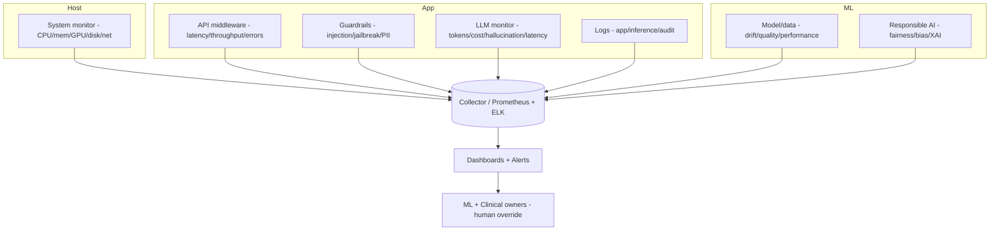

# Monitoring & Observability (System · API · LLM · Security · ResAI · Logging)

> **Why (this doc):** A production clinical-AI platform must be observable end-to-end — the host,
> the API, the models, the LLM calls, security events, Responsible-AI metrics, and logs. This maps
> each monitoring surface to its runnable implementation. **How:** the modules below emit metrics +
> a threshold/alert policy; in production they ship to Prometheus/Grafana + ELK/Loki.

## Monitoring surfaces

*Caption - Each monitoring surface, the metrics captured, and the implementing module.*

| Surface | Metrics | Implemented in |
|---|---|---|
| **System** | CPU %, memory %, **GPU**, disk %, network I/O + alert thresholds | `mlops/system_monitor.py` |
| **API** | latency (mean/per-path), throughput, error rate, **auth failures** | `api/main.py` middleware + `GET /metrics` |
| **Docker container** | liveness via `HEALTHCHECK` -> `/health`; restart on failure | `api/Dockerfile`, `docker-compose.yml` |
| **LLM** | token usage, **hallucination rate**, prompt latency (mean/p95), cost | `mlops/llm_ops.py` (`LLMMonitor`, `CostTracker`) |
| **Security** | authorised access (API key), **prompt injection / jailbreak**, PII | `api` auth + `responsible_ai_runtime.GuardrailChecker` |
| **Responsible AI** | fairness, bias, explainability, compliance | `responsible_ai_runtime.py` + `governance.py` + `docs/responsible-ai/` |
| **Data/model** | data drift (KS), concept drift, quality, performance | `mlops/observability.py` |
| **Logging** | application · **inference** · **audit** (JSON streams) | `mlops/logging_setup.py` |

## Observability architecture



**Reason:** Show every signal converging on dashboards + alerts. **Why:** Unobserved AI is ungovernable; each layer must be measurable. **What is happening:** Host, app, security, LLM, and ML signals feed a collector, dashboards, and on-call owners. **How it is happening:** Each module emits metrics/logs; breaches (CPU>85%, error-rate, drift p<0.05, hallucination, injection, contract violation) raise alerts. **Reference:** Sculley et al. (2015); NIST (2023).

## Alert thresholds

| Signal | Threshold |
|---|---|
| CPU / memory / disk | 85% / 90% / 90% |
| API error rate | > 2% |
| Data drift (KS) | p < 0.05 |
| Concept drift (relation) | Δcorr > 0.15 |
| LLM hallucination rate | > 5% |
| Security | any injection/jailbreak/PII or auth failure spike |
| Contract violation | any |

## Run it

```bash
python mlops/system_monitor.py     # host CPU/mem/GPU/disk/net + alerts
python mlops/observability.py      # model/data drift + quality
uvicorn api.main:app --reload      # then GET /metrics for API latency/throughput/error-rate
# logs -> mlops/store/logs/{application,inference,audit}.log
```

## References

Sculley, D., et al. (2015). Hidden technical debt in machine learning systems. *NeurIPS*.

NIST. (2023). *AI Risk Management Framework (AI RMF 1.0)*.
