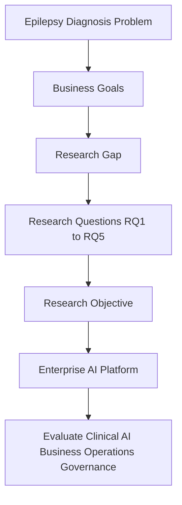
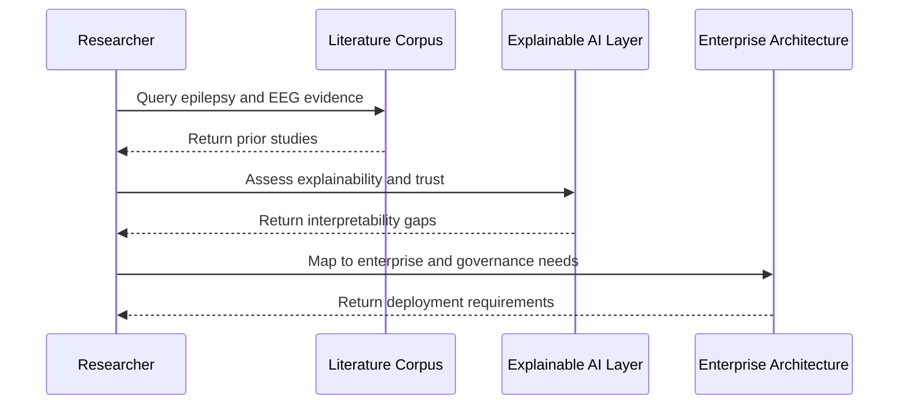
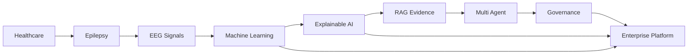
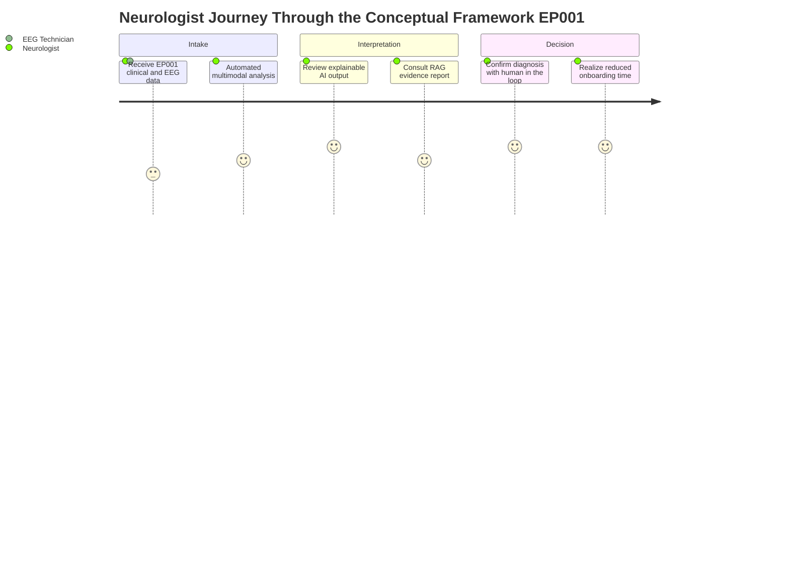

# PART I — Business Problem

> **Why (this doc):** This document establishes the foundational business and research rationale for an **Enterprise AI Platform for Explainable Multimodal Epilepsy Intelligence**, anchoring the DBA inquiry in a real organizational problem rather than a purely technical one.
> **How:** It frames the epilepsy diagnosis problem, defines business goals, isolates the research gap, states five research questions, and threads everything through a conceptual framework that terminates in measurable business value.

**Problem (research-spine):** Epilepsy diagnosis today is slow, expensive, fragmented, and poorly integrated across clinical and EEG data, with limited explainability and weak enterprise deployment — creating avoidable delay and cost for patients and clinicians.

**Research Objective (research-spine):** Develop and evaluate an enterprise-grade, explainable, multimodal AI platform for epilepsy that delivers organizational value across clinical, AI, business, operational, and governance dimensions — not model accuracy in isolation.

---

## Chapter 1 — Introduction

> **Why:** To ground the platform in a concrete, evidence-based business problem so the DBA contribution is organizational, not merely algorithmic. **How:** By stating the problem, the business goals, the research gap, and testable research questions in sequence.

### Business Problem

> **Why:** To name the operational pain points that justify enterprise investment. **How:** By enumerating the failure modes of current epilepsy diagnosis workflows.

Current epilepsy diagnosis is:

- Slow
- Expensive
- Fragmented
- Reactive
- Dependent on specialists
- Limited in remote monitoring
- Poorly integrated between clinical data and EEG
- Limited in explainability
- Limited in enterprise deployment

### Business Goals

> **Why:** To convert the problem statement into targeted, measurable organizational outcomes. **How:** By listing the value levers the platform must move for neurologists, EEG technicians, and patients.

- Reduce patient onboarding time
- Improve neurologist productivity
- Improve EEG interpretation
- Support rural healthcare
- Enable remote monitoring
- Establish enterprise AI governance

### Research Gap

> **Why:** To show that prior work optimizes narrow accuracy while ignoring enterprise value, governance, and workflow. **How:** By contrasting what existing research covers against what remains missing.

Existing research focuses on:

- ✓ EEG only
- ✓ Clinical only
- ✓ ML accuracy only

Missing:

- ✗ Enterprise AI
- ✗ Business value
- ✗ RAG
- ✗ Multi-agent
- ✗ Human-in-the-loop
- ✗ Governance
- ✗ ROI

### Research Questions

> **Why:** To make the inquiry testable and falsifiable across clinical, AI, and business dimensions. **How:** By stating five research questions that each map to a distinct value hypothesis.

*Caption - The research questions table anchors the entire study, tying each RQ to a measurable claim (accuracy, trust, onboarding time, evidence quality, safe deployment) so the DBA contribution can be defended empirically.*

| # | Research Question |
|---|---|
| **RQ1** | Can multimodal AI outperform EEG-only AI? |
| **RQ2** | Can explainable AI improve neurologist trust? |
| **RQ3** | Can enterprise AI reduce patient onboarding time? |
| **RQ4** | Can RAG improve evidence-based reporting? |
| **RQ5** | Can governance improve safe deployment? |

### Research Objectives

> **Why:** To declare the deliverable and its evaluation surface up front. **How:** By specifying that a single enterprise platform is developed, then evaluated across five outcome domains.

```
Develop → Enterprise AI Platform → Evaluate across:
   Clinical · AI · Business · Operations · Governance
```

The following flowchart shows how the business problem decomposes into research questions and the objective that binds them.



---

## Chapter 2 — Literature Review

> **Why:** To position the platform within the full research landscape from healthcare to enterprise architecture. **How:** By ordering the review as a progression and then isolating the gap each existing strand leaves open.

Organize the review into the following progression:

```
Healthcare → Epilepsy → EEG → Signal Processing → Machine Learning →
Deep Learning → Explainable AI → RAG → Multi-Agent → MCP →
Clinical Decision Support → Responsible AI → Enterprise Architecture →
Healthcare Digital Transformation
```

The sequence diagram below traces how a review actor moves a single evidence claim from raw literature to a governed enterprise recommendation.



### Gap Analysis

> **Why:** To make each unmet need explicit and traceable to a design decision in the platform. **How:** By pairing every existing research strand with the specific enterprise gap it leaves unresolved.

*Caption - This gap analysis table justifies the platform's scope by mapping mature technical research (classification, CNN, Transformer) to the business, governance, and workflow gaps that remain unaddressed.*

| Existing Research | Gap |
|---|---|
| EEG Classification | No Business Value |
| CNN | No Governance |
| Transformer | No RAG |
| EEG Biomarkers | No Enterprise Platform |
| Explainability | No Clinical Workflow |
| Remote Monitoring | No Enterprise AI |

The network graph below shows how the reviewed research domains interconnect around the enterprise platform as the integrating node.



---

## Chapter 3 — Conceptual Framework

> **Why:** To keep the DBA lens central by threading the business problem through every AI layer to measurable value. **How:** By modeling a single causal chain from business problem to business value and validating it against roles like Neurologist and EEG Technician.

```
Business Problem
   → Clinical Problem
   → Primary AI
   → Secondary AI
   → Fusion AI
   → RAG
   → Agent
   → Enterprise
   → Business Value
```

The conceptual framework threads the *business problem* through the *clinical problem*
and each AI layer, terminating in **measurable business value** — keeping the DBA lens
(organizational outcomes) central rather than treating model accuracy as the endpoint.

The journey diagram below traces a Neurologist's experience of the framework as patient EP001 moves through the platform, showing where value is realized.



---

## Professor Readiness (Defense Q&A)

> **Why:** To anticipate examiner scrutiny and demonstrate that the framing withstands a viva defense. **How:** By pre-answering the most likely challenges to the problem framing, contribution, and method.

### Q1 — Why is this a business problem and not just a machine learning problem?

The failure modes named in Chapter 1 (slow, expensive, fragmented, specialist-dependent, poorly governed) are organizational and operational, not model-accuracy problems. Prior research already achieves high EEG classification accuracy; the unmet need is enterprise value, governance, and workflow integration. That is why the DBA contribution centers on measurable business value (onboarding time, neurologist productivity, safe deployment) rather than a new classifier.

### Q2 — How do your research questions map to your conceptual framework?

Each RQ maps to a layer of the framework: RQ1 (multimodal vs EEG-only) tests the Fusion AI layer; RQ2 (trust) tests the Explainable AI layer; RQ3 (onboarding time) tests the Enterprise layer's business value; RQ4 (evidence-based reporting) tests the RAG layer; RQ5 (safe deployment) tests the Governance layer. The framework is therefore the causal chain the RQs jointly evaluate.

### Q3 — Why multimodal rather than EEG-only, and how will you show it matters?

EEG-only systems discard clinical context that neurologists use in practice. RQ1 is tested by comparing an EEG-only baseline against the multimodal fusion model on the same cohort (including test patient EP001), reporting whether fusion improves diagnostic performance and clinician-facing explainability. The gap analysis table shows EEG classification alone yields no business value without this integration.

### Q4 — How does governance change the deployment story?

Governance (RQ5) introduces human-in-the-loop confirmation, auditability, and role-based safeguards for the Neurologist and EEG Technician. This converts a research prototype into an enterprise-deployable platform, addressing the "No Governance" and "No Enterprise AI" gaps identified in the literature and enabling responsible, safe rollout in clinical settings including rural and remote care.

---

## References

> **Why:** To ground the framing in authoritative clinical and AI-governance sources. **How:** By citing the foundational epilepsy definition, healthcare-AI, and responsible-AI references in APA 7th edition format.

Fisher, R. S., Cross, J. H., French, J. A., Higurashi, N., Hirsch, E., Jansen, F. E., Lagae, L., Moshé, S. L., Peltola, J., Roulet Perez, E., Scheffer, I. E., & Zuberi, S. M. (2017). Operational classification of seizure types by the International League Against Epilepsy: Position paper of the ILAE Commission for Classification and Terminology. *Epilepsia, 58*(4), 522–530. https://doi.org/10.1111/epi.13670

Topol, E. J. (2019). High-performance medicine: The convergence of human and artificial intelligence. *Nature Medicine, 25*(1), 44–56. https://doi.org/10.1038/s41591-018-0300-7

American Psychiatric Association. (2020). *APA guidelines on the practice of telepsychiatry and telemedicine*. American Psychiatric Association.

Roy, Y., Banville, H., Albuquerque, I., Gramfort, A., Falk, T. H., & Faubert, J. (2019). Deep learning-based electroencephalography analysis: A systematic review. *Journal of Neural Engineering, 16*(5), 051001. https://doi.org/10.1088/1741-2552/ab260c

Lewis, P., Perez, E., Piktus, A., Petroni, F., Karpukhin, V., Goyal, N., Küttler, H., Lewis, M., Yih, W., Rocktäschel, T., Riedel, S., & Kiela, D. (2020). Retrieval-augmented generation for knowledge-intensive NLP tasks. *Advances in Neural Information Processing Systems, 33*, 9459–9474.

World Health Organization. (2019). *Epilepsy: A public health imperative*. World Health Organization.
