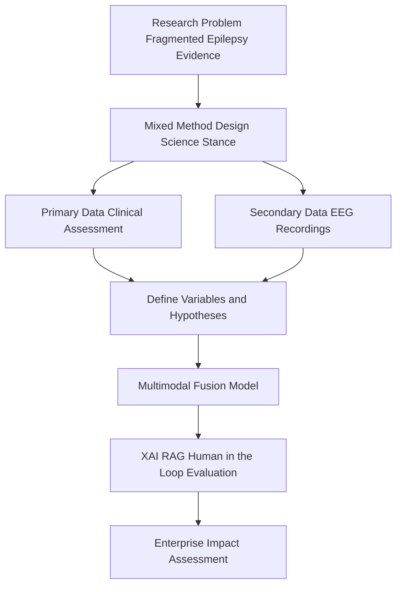
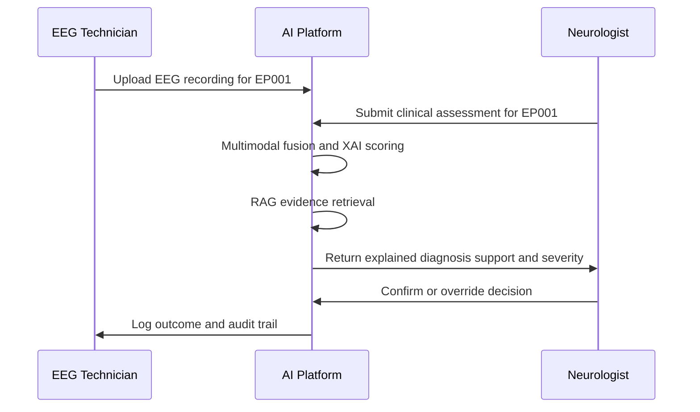
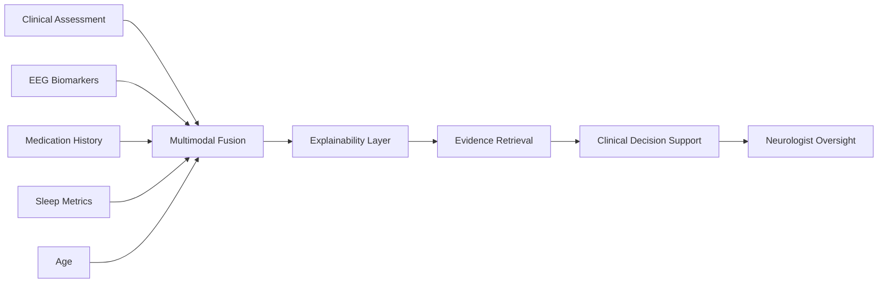
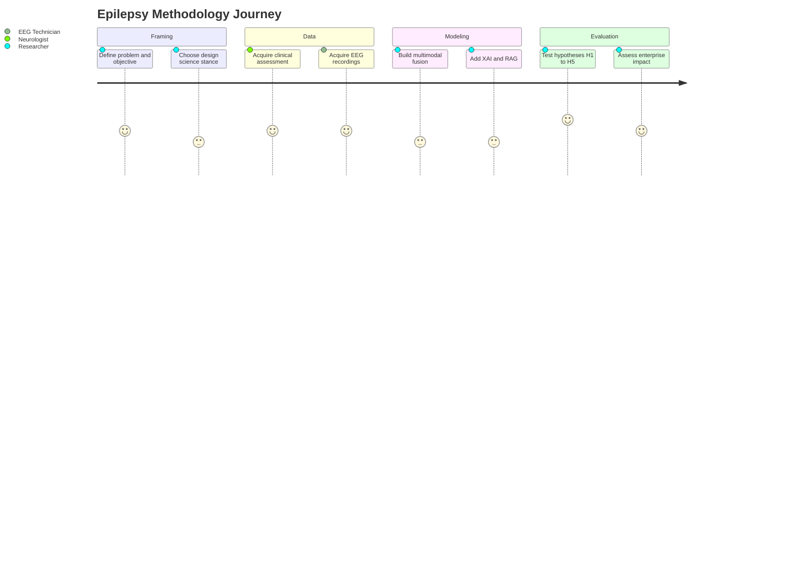

# PART II — Research Methodology

> **Why (this doc):** This document establishes the scientific backbone of the *Enterprise AI Platform for Explainable Multimodal Epilepsy Intelligence*, defining how the research is designed, what data and variables are used, and which hypotheses are tested so that every downstream claim about diagnostic support for epilepsy is traceable and defensible.
> **How:** It specifies a mixed-method, design-science research design, catalogues the primary (clinical) and secondary (EEG) data sources, formalizes independent and dependent variables, and frames five complementary hypotheses (H1–H5) that jointly evaluate clinical value, technical performance, and operational impact.

**Problem.** Epilepsy diagnosis and severity assessment rely on fragmented evidence — clinical history captured by Neurologists and electrophysiological signals captured by EEG Technicians — that is rarely fused, explained, or governed within a single enterprise workflow.

**Research Objective.** Design and empirically evaluate an explainable, multimodal AI platform that integrates structured clinical assessment with EEG biomarkers for a reference epilepsy cohort (test patient EP001), and measure whether multimodality, explainability, and human oversight improve diagnostic support, trust, and operational efficiency without displacing clinical judgment.

## Chapter 4 — Research Design

> **Why:** To justify the methodological choices that make the epilepsy platform's findings valid, reproducible, and generalizable. **How:** By combining Design Science Research with quantitative and qualitative evidence across clinical and EEG modalities.

### Methodological Stance

> **Why:** To position the study within an accepted paradigm so reviewers can locate its epistemology and rigor. **How:** By declaring a mixed-method, design-science approach spanning quantitative, qualitative, and enterprise-architecture lenses.

A **mixed-method, design-science** research design:

- Mixed method
- Secondary research
- Quantitative
- Qualitative
- Design Science Research (DSR)
- Enterprise Architecture

### Data

> **Why:** To make explicit which epilepsy evidence streams feed the platform and where each originates. **How:** By separating primary clinical assessment (Neurologist-generated) from secondary EEG signals (EEG Technician-acquired).

*Caption - This table anchors the study's data provenance, distinguishing the primary clinical stream from the secondary electrophysiological stream that together constitute the multimodal input for epilepsy intelligence.*

| Type | Source |
|---|---|
| **Primary** | Clinical assessment |
| **Secondary** | EEG |

### Sample

> **Why:** To define the human and signal units of analysis that the epilepsy cohort comprises. **How:** By enumerating patients, controls, EEG recordings, and the clinical roles that generate and interpret them.

- Patients
- Controls
- EEG recordings
- Neurologists
- EEG technicians

### Research Variables

> **Why:** To formalize the causal structure being tested — what is manipulated or observed versus what is predicted in epilepsy assessment. **How:** By mapping clinical, EEG, medication, sleep, and age inputs to diagnosis-support, risk, severity, and decision outputs.

*Caption - This table operationalizes the study's variable model, listing the independent factors (clinical, EEG, medication, sleep, age) against the dependent outcomes (diagnosis support, risk, severity, clinical decision) that the platform predicts for epilepsy.*

| Independent | Dependent |
|---|---|
| Clinical | Diagnosis support |
| EEG | Risk |
| Medication | Severity |
| Sleep | Clinical decision |
| Age | — |

### Hypotheses (Experimental Design)

> **Why:** To evaluate the epilepsy platform along complementary dimensions rather than a single reductive test. **How:** By staging five hypotheses (H1–H5) that isolate clinical value, EEG value, multimodal fusion, trustworthy AI, and enterprise impact.

The dissertation evaluates the platform through complementary hypotheses rather than a
single one — mirroring the core multimodal comparison.

*Caption - This table presents the layered hypothesis architecture, showing how each successive model (H1 through H5) adds a modality, an explainability layer, or an operational dimension to build a cumulative evidence base for epilepsy intelligence.*

| Hypothesis | Model | Expected Contribution |
|---|---|---|
| **H1** | Primary assessment only | Establish predictive value of structured clinical assessment |
| **H2** | EEG only | Quantify predictive value of electrophysiological biomarkers |
| **H3** | Primary + EEG (multimodal fusion) | Demonstrate multimodal integration significantly improves performance |
| **H4** | Multimodal + XAI + RAG + Human-in-the-loop | Evaluate whether explainability, evidence retrieval, and oversight improve trust and workflow without replacing clinical judgment |
| **H5** | Enterprise platform | Reduce onboarding time, report turnaround, workload while maintaining governance and safety |

This design is stronger than presenting a single model because it evaluates **clinical
value, technical performance, and operational impact** together.

## Data Acquisition and Role Workflow

> **Why:** To show how epilepsy evidence flows from acquisition to a governed, explained decision. **How:** By tracing the sequence across the EEG Technician, Neurologist, and the platform for reference patient EP001.

### Multimodal Evidence Network

> **Why:** To depict how heterogeneous epilepsy inputs converge into a single decision-support output. **How:** By modeling the modality-to-outcome relationships as a directed network.

### Research Journey

> **Why:** To convey the experienced progression of the study from problem to validated platform. **How:** By charting each methodological phase as a journey with relative effort and confidence.

## Professor Readiness (Defense Q&A)

> **Why:** To pre-empt likely examiner scrutiny of the methodology and demonstrate command of design choices. **How:** By pairing anticipated questions with concise, evidence-grounded answers.

### Why a mixed-method design science approach rather than a purely quantitative trial?

Epilepsy decision support is both a technical artifact and a socio-clinical intervention. Design Science Research lets the study build and rigorously evaluate the platform as an artifact, while quantitative measures capture predictive performance and qualitative input from Neurologists and EEG Technicians captures trust and workflow fit — dimensions a purely quantitative trial would miss.

### Why five hypotheses instead of one multimodal hypothesis?

The staged H1–H5 structure isolates the marginal contribution of each component. H1 and H2 establish single-modality baselines, H3 tests whether fusion adds value beyond them, H4 tests trustworthy-AI layers (XAI, RAG, human-in-the-loop), and H5 tests enterprise impact. This decomposition attributes any observed gains to a specific cause rather than to the system as an opaque whole.

### How do you prevent the AI from replacing clinical judgment?

H4 is explicitly designed around human-in-the-loop oversight: the platform returns explained, evidence-linked recommendations that the Neurologist confirms or overrides, with every action logged for audit. The platform is positioned as decision *support*, and the evaluation measures trust and workflow rather than autonomous accuracy alone.

### How is generalization addressed given a reference patient like EP001?

EP001 is a traceability anchor for demonstrating the end-to-end pipeline, not the evidential basis for generalization. Generalization derives from the broader patient-and-control sample, multiple EEG recordings, and the modality-agnostic variable model, allowing the design to extend to additional epilepsy cohorts without structural change.

## References

> **Why:** To ground the methodology in authoritative clinical and AI scholarship. **How:** By citing seminal epilepsy classification, medical-AI, and research-ethics sources in APA 7th edition format.

American Psychological Association. (2020). *Publication manual of the American Psychological Association* (7th ed.). American Psychological Association. https://doi.org/10.1037/0000165-000

Fisher, R. S., Cross, J. H., French, J. A., Higurashi, N., Hirsch, E., Jansen, F. E., Lagae, L., Moshé, S. L., Peltola, J., Roulet Perez, E., Scheffer, I. E., & Zuberi, S. M. (2017). Operational classification of seizure types by the International League Against Epilepsy: Position paper of the ILAE Commission for Classification and Terminology. *Epilepsia, 58*(4), 522–530. https://doi.org/10.1111/epi.13670

Hevner, A. R., March, S. T., Park, J., & Ram, S. (2004). Design science in information systems research. *MIS Quarterly, 28*(1), 75–105. https://doi.org/10.2307/25148625

Roy, S., Kiral-Kornek, I., & Harrer, S. (2019). ChronoNet: A deep recurrent neural network for abnormal EEG identification. In *Artificial Intelligence in Medicine* (pp. 47–56). Springer. https://doi.org/10.1007/978-3-030-21642-9_8

Topol, E. J. (2019). High-performance medicine: The convergence of human and artificial intelligence. *Nature Medicine, 25*(1), 44–56. https://doi.org/10.1038/s41591-018-0300-7
